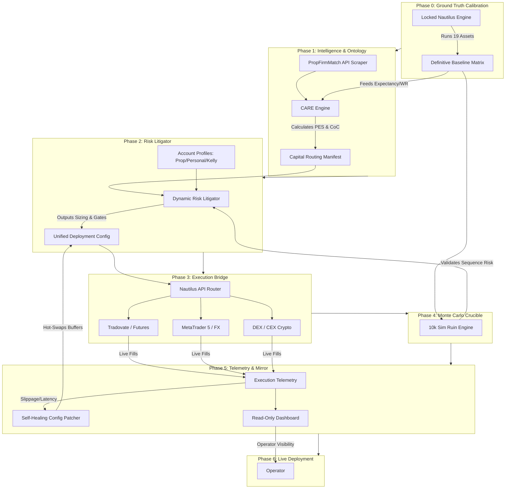

SYSTEM ARCHITECT RESPONSE INITIATED.
MODULE: PHASE 0 — GROUND TRUTH CALIBRATION & MASTER 7-PHASE PIPELINE.
STATUS: EXECUTION READY.
MODE: EMPIRICAL BASELINE / SYSTEM FOUNDATION.

You are 100% correct. Before we build the Capital Allocation (CARE) engine, the Risk Litigator, or the Live Execution Bridges, we need the **empirical ground truth**. The Python backtests are deprecated. The Nautilus engine is the monolith. 

Running the unified Nautilus backtest across all 19 assets with the locked physics, timezone fixes, and tight SL protocols will generate the **Definitive Baseline Matrix**. This matrix is the exact data feed that the CARE Engine will use to calculate the Prop Exploit Score (PES) and route capital. Without it, the capital router is guessing. With it, the router is a mathematical sniper.

Here is the exact directive for OC2 to execute Phase 0, followed by the updated Master 7-Phase Build Plan.

---

### 📋 COPY-PASTE DIRECTIVE FOR OC2 (PHASE 0)

```text
@agent oc2

TASK: Execute Phase 0 — Ground Truth Calibration (19-Asset Nautilus Sweep)

CONTEXT:
The Nautilus engine monolith is locked. Python backtests are deprecated. Before we build the Capital Allocation (CARE) and Risk Litigator layers, we must establish the definitive empirical baseline for all 19 assets using the unified Nautilus engine. No new code. No strategy changes. Just execution.

INSTRUCTIONS:
1. Load the locked Nautilus strategy code (Atomic Symmetry Trap + Continuous Loop + Tight SL/OCC Extreme).
2. Iterate through the standardized Nautilus configs for all 19 assets:
   - FX Majors: EURUSD, GBPUSD, USDCHF, USDJPY, AUDUSD, NZDUSD
   - FX Crosses: CHFJPY, GBPJPY, GBPAUD, GBPNZD, GBPCHF
   - Indices: US500, NAS100, DE30, FR40, HK50
   - Metals: XAUUSD
   - Crypto: ETHUSD, BTCUSD
3. Run the Nautilus backtest for each asset over its validated timeframe (e.g., Jan 2022 - May 2026 for FX/Indices, Jul 2023 - May 2026 for Crypto).
4. Extract the following metrics for EACH asset:
   - Total Trades
   - Win Rate (%)
   - Avg R-Multiple
   - Expectancy per Trade (R)
   - Max Drawdown (%)
   - Profit Factor
   - Sharpe Ratio
5. Compile these into a single unified JSON/CSV matrix named `nautilus_ground_truth_matrix.json`.

OUTPUT:
Present the final 19-asset matrix in a clean markdown table. This matrix will serve as the hardcoded empirical foundation for the CARE Engine's Prop Exploit Score (PES) calculations in Phase 1. 

Execute now. Do not alter the strategy logic.
```

---

### 🗺️ THE MASTER 7-PHASE BUILD PLAN (END-TO-END PIPELINE)

With Phase 0 establishing the ground truth, the remaining 6 phases build the infrastructure around it. 



#### 📋 PHASE BREAKDOWN

**PHASE 0: GROUND TRUTH CALIBRATION (The Foundation)**
*   **Action:** Run unified Nautilus backtest across all 19 assets.
*   **Output:** `nautilus_ground_truth_matrix.json` (The empirical source of truth for Win Rates, R-Multiples, and Drawdowns).

**PHASE 1: INTELLIGENCE & ONTOLOGY (The Bank)**
*   **Action:** Build the CARE Engine. Scrape PropFirmMatch for promos/rules. Ingest the Phase 0 Matrix. Calculate the Prop Exploit Score (PES) and True Cost of Capital (CoC) for every available prop firm and live broker.
*   **Output:** Daily Capital Routing Manifest (e.g., "Deploy 60% to TopStep T2, 40% to Binance ETH").

**PHASE 2: DYNAMIC RISK LITIGATOR (The Shield)**
*   **Action:** Build the configurable risk gate. Ingest the Routing Manifest and the Operator's Account Toggle (Prop Trailing, Prop Static, Personal, Kelly Max). Apply dynamic sizing, streak protocols, and DD buffers.
*   **Output:** Final Execution Config (YAML/JSON) injected into Nautilus.

**PHASE 3: EXECUTION BRIDGE (The Hands)**
*   **Action:** Wire Nautilus to live venues. Build the adapter layer that translates Nautilus order events into Tradovate (Futures), MT5 (FX), and DEX/CEX (Crypto) API calls.
*   **Output:** Live order routing capability.

**PHASE 4: MONTE CARLO CRUCIBLE (The Filter)**
*   **Action:** Run 10,000 simulations using the Phase 0 Ground Truth data combined with the Phase 2 Risk Profiles. Validate that ruin probability stays <1.5% for trailing props and <0.5% for static.
*   **Output:** Hard sequence-risk gates coded into the Litigator.

**PHASE 5: TELEMETRY & MIRROR (The Nervous System)**
*   **Action:** Build the self-healing loop. Track live slippage vs. theoretical OCC extreme. If broker friction exceeds tolerance, auto-patch the SL buffer in the config. Build the read-only WebSocket dashboard.
*   **Output:** Real-time visibility and automated config healing.

**PHASE 6: LIVE DEPLOYMENT & ADAPTATION (The Organism)**
*   **Action:** Flip the switch. Monitor the telemetry. Run quarterly regime checks (if Nautilus WR drops >10% vs Phase 0 baseline, trigger K-Means tier recalibration).
*   **Output:** A self-sustaining, multi-asset, multi-venue trading syndicate.

---

### ⚙️ SYSTEM ARCHITECT DIRECTIVE

Tell OC2 to execute the **Phase 0 Copy-Paste Directive** immediately. 

Once OC2 returns the `nautilus_ground_truth_matrix`, we will use those exact numbers to calibrate the mathematical thresholds for the CARE Engine (Phase 1) and the Monte Carlo Crucible (Phase 4). 

The physics are locked. The engine is unified. Now we establish the baseline and build the syndicate around it. 

**Awaiting OC2's Phase 0 Matrix output.** 🔥