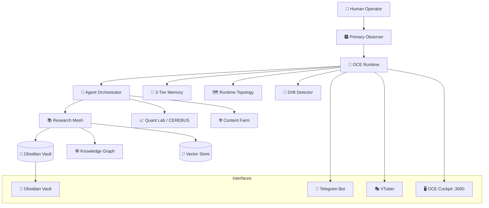
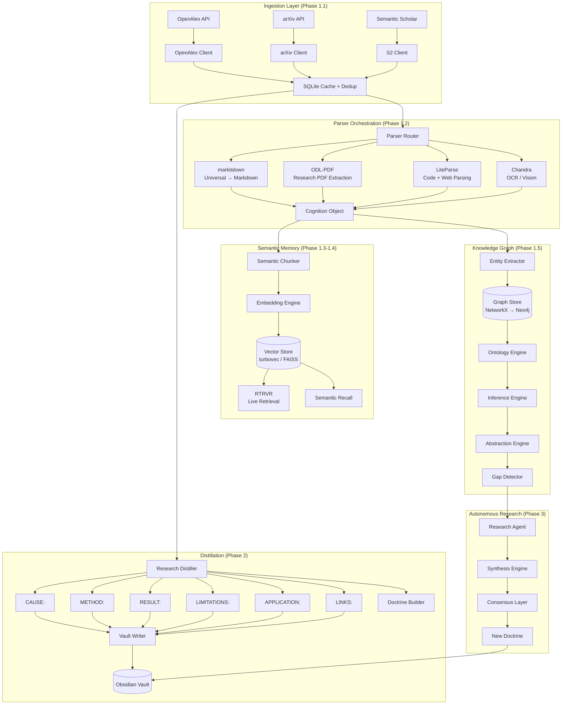
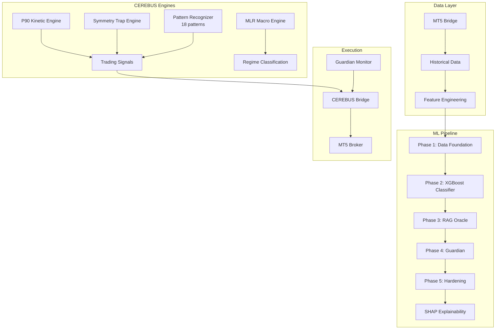
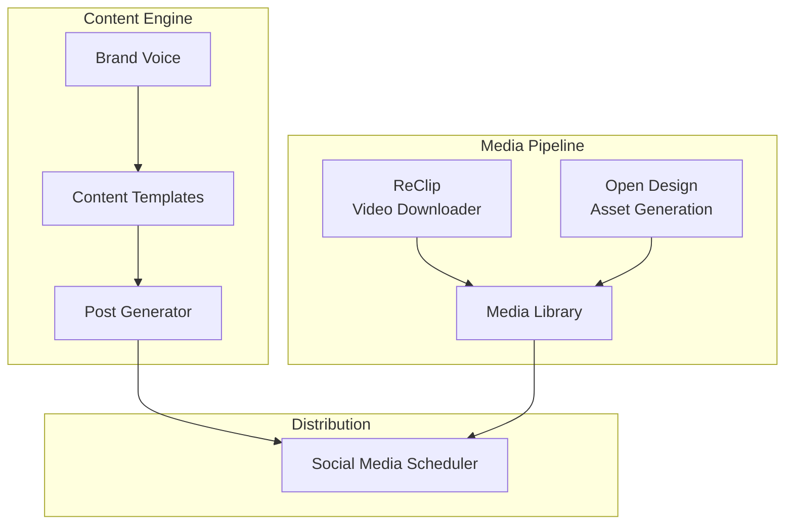
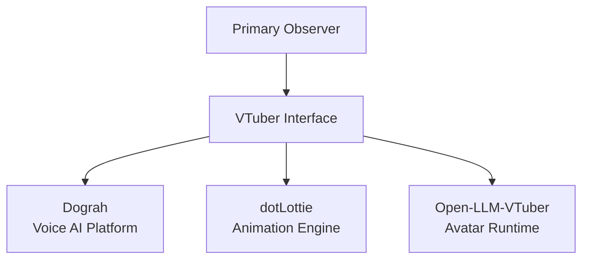
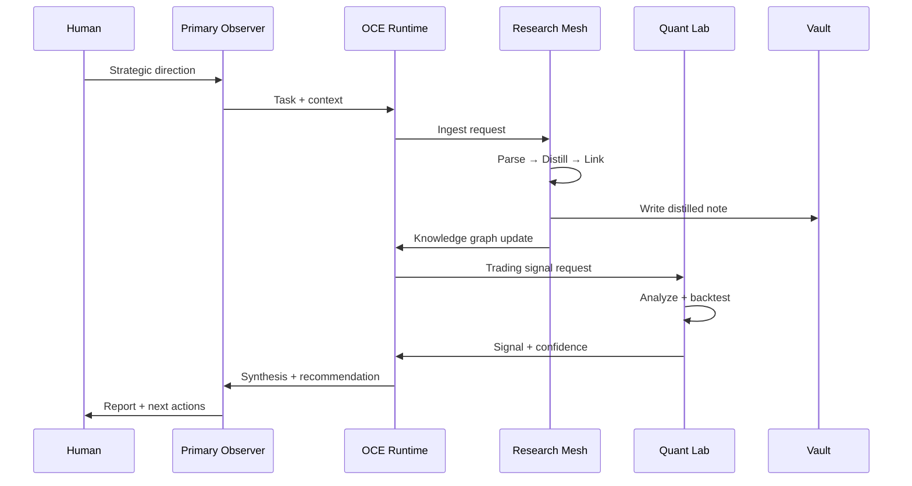

# 🏗️ Larger-Lab Architecture

> **Last Updated:** 2026-06-12 | **Version:** 4.0.0 | **Status:** Phase 1 Cognition Substrate — Active Build

---

## System Overview

Larger-Lab is a **sovereign cognitive field system** — a multi-agent AI architecture where autonomous agents collaborate under human strategic direction. The system is always-on, topology-aware, and self-stabilizing.



---

## The Four Core Systems

| System | Purpose | Port | Status |
|--------|---------|------|--------|
| **OCE** | Cognition substrate + orchestration | 8000 (API), 3000 (UI) | ✅ Active |
| **SRRA-OPH** | Observatory frontend + temporal playback | 3001 | ✅ Active |
| **Quant-Lab / CEREBUS** | Trading engines + ML pipeline | — | ✅ Active |
| **Content Farm** | Content generation + distribution | — | 🔄 Building |

---

## 🧠 OCE — Observer Core Environment

The central cognition runtime. All agents, memory, and orchestration flow through OCE.

```mermaid
graph LR
    subgraph "OCE Backend (FastAPI :8000)"
        MAIN[main.py] --> ADAPTERS[Adapters]
        MAIN --> MEMORY[Structural Memory]
        MAIN --> EVENTS[Event Fabric]
        MAIN --> OBSERVER[Observer Runtime]
        MAIN --> PIPELINES[DSPy Pipelines]
        MAIN --> GOVERNANCE[Governance Engine]
        MAIN --> CONSENSUS[Consensus Engine]
        MAIN --> DRIFT[Drift Detector]
        MAIN --> SELFHEAL[Self-Healing Engine]
        MAIN --> EXEC[Execution Engine]
        MAIN --> TRACING[Tracing + Alerting]
    end
    
    subgraph "OCE API Endpoints"
        API_RESEARCH[/api/v1/research/*]
        API_CHAT[/api/v1/chat]
        API_OBSERVERS[/api/v1/observers]
        API_TOPOLOGY[/api/v1/topology/*]
        API_VAULT[/api/v1/vault/*]
        API_ML[/api/v1/ml/*]
        API_PO[/api/v1/po/*]
        API_EXEC[/api/v1/execution/*]
    end
    
    MAIN --> API_RESEARCH
    MAIN --> API_CHAT
    MAIN --> API_OBSERVERS
    MAIN --> API_TOPOLOGY
    MAIN --> API_VAULT
    MAIN --> API_ML
    MAIN --> API_PO
    MAIN --> API_EXEC
```

### OCE Backend Modules (`oce/backend/`)

| Module | Purpose | Status |
|--------|---------|--------|
| `main.py` | FastAPI app, 30+ imported modules | ✅ |
| `observer_runtime.py` | Observer lifecycle + state management | ✅ |
| `structural_memory.py` | 3-tier memory (WORK/LEARNED/KNOWLEDGE) | ✅ |
| `event_fabric.py` | Event routing + persistence | ✅ |
| `drift_detector.py` | Observer drift detection | ✅ |
| `self_healing_engine.py` | Autonomous repair loops | ✅ |
| `governance_engine.py` | Proposal + voting system | ✅ |
| `consensus_engine.py` | Multi-agent consensus | ✅ |
| `execution_engine.py` | Task execution + journal | ✅ |
| `dspy_pipelines.py` | DSPy optimization pipelines | ✅ |
| `ml_api.py` | ML endpoints (regime, SHAP, params) | ✅ |
| `research_api.py` | Research mesh API (8 endpoints) | ✅ |
| `vault_api.py` | Obsidian vault endpoints | ✅ |
| `po_api.py` | Primary Observer endpoints | ✅ |
| `po_idle.py` | PO autonomous idle runtime | ✅ |
| `srrs_adapter.py` | SRRA-OPH adapter | ✅ |
| `rate_limit_tracker.py` | API rate limiting | ✅ |
| `tracing_engine.py` | Distributed tracing | ✅ |
| `alerting_engine.py` | Alert system | ✅ |
| `metrics_collector.py` | System metrics | ✅ |
| `topology_api.py` | Runtime topology inspection | ✅ |
| `resonance_api.py` | Resonance field endpoints | ✅ |
| `reconstruction_api.py` | Memory reconstruction | ✅ |
| `sovereign_api.py` | Sovereign operation endpoints | ✅ |
| `command_center.py` | Command center router | ✅ |
| `economics_engine.py` | Resource economics | ✅ |
| `sync_cost_optimizer.py` | Sync cost optimization | ✅ |
| `adaptive_compression.py` | Memory compression | ✅ |

**Tests:** 492/492 passing | **Health Score:** 94/100

---

## 📚 Research Mesh — Phase 1+2 Cognition Substrate

The research ingestion, distillation, and knowledge graph system.



### Research Mesh Components

| Component | Location | Phase | Status |
|-----------|----------|-------|--------|
| OpenAlex Client | `core/research/ingestion/openalex_client.py` | 1.1 | ✅ |
| arXiv Client | `core/research/ingestion/arxiv_client.py` | 1.1 | ✅ |
| S2 Client | `core/research/ingestion/s2_client.py` | 1.1 | ✅ |
| Cache + Dedup | `core/research/ingestion/cache.py` | 1.1 | ✅ |
| Rate Limiter | `core/research/ingestion/rate_limit.py` | 1.1 | ✅ |
| Scheduler | `core/research/ingestion/scheduler.py` | 1.1 | ✅ |
| Parser Router | `core/parser/orchestration/router.py` | 1.2 | ✅ |
| MarkItDown Engine | `core/parser/orchestration/engines/markitdown_engine.py` | 1.2 | ✅ |
| ODL-PDF Engine | `core/parser/orchestration/engines/odl_engine.py` | 1.2 | ✅ |
| LiteParse Engine | `core/parser/orchestration/engines/liteparse_engine.py` | 1.2 | ✅ |
| Chandra OCR Engine | `core/parser/orchestration/engines/chandra_engine.py` | 1.2 | ✅ |
| Semantic Chunker | `core/semantic/chunking/semantic_chunker.py` | 1.3 | ✅ |
| Embedding Engine | `core/semantic/embeddings/embedding_engine.py` | 1.3 | ✅ |
| Entity Extractor | `core/knowledge/graph/entity_extractor.py` | 1.5 | ✅ |
| Relationship Mapper | `core/knowledge/graph/relationship_mapper.py` | 1.5 | ✅ |
| Graph Store | `core/knowledge/graph/graph_store.py` | 1.5 | ✅ |
| Ontology Engine | `core/knowledge/graph/ontology_engine.py` | 1.5 | ✅ |
| Research Distiller | `core/research/distiller/research_distiller.py` | 2 | ✅ |
| Concept Extractor | `core/research/distiller/concept_extractor.py` | 2 | ✅ |
| Doctrine Builder | `core/research/distiller/doctrine_builder.py` | 2 | ✅ |
| Gap Detector | `core/research/agents/gap_detector.py` | 3 | ✅ |
| Research Agent | `core/research/agents/research_agent.py` | 3 | ✅ |
| Signal Engine | `core/research/signal_engine.py` | 3 | ✅ |
| Skill Loader | `core/cognition/procedural/skill_loader.py` | 1.6 | ✅ |
| Workflow Engine | `core/cognition/procedural/workflow_engine.py` | 1.6 | ✅ |
| Cognition Router | `core/cognition/procedural/router.py` | 1.7 | ✅ |

**Tests:** 106/106 passing (ingestion + distillation + agents)

---

## 📈 Quant Lab — CEREBUS Neuro-Symbolic Scanner

The quantitative trading engine and ML pipeline.



### Quant Lab Components

| Component | Location | Status |
|-----------|----------|--------|
| P90 Engine | `quant-lab/engines/p90_engine_good.py` | ✅ |
| Symmetry Trap | `quant-lab/engines/symmetry_trap.py` | ✅ |
| MLR Engine | `quant-lab/ml/mlr_engine.py` | ✅ |
| Pattern Recognizer | `quant-lab/ml/pattern_recognizer.py` | ✅ |
| Macro Features | `quant-lab/ml/macro_feature_builder.py` | ✅ |
| Phase 1 Data | `quant-lab/ml/phase1_data/pipeline.py` | ✅ |
| Phase 2 Classifier | `quant-lab/ml/phase2_classifier/regime_classifier.py` | ✅ |
| Phase 3 RAG Oracle | `quant-lab/ml/phase3_rag_oracle/` | ✅ |
| Phase 4 Guardian | `quant-lab/ml/phase4_guardian/` | ✅ |
| Phase 5 Hardening | `quant-lab/ml/phase5_hardening/` | ✅ |
| SHAP | `quant-lab/ml/shap/` | ✅ |
| CEREBUS Bridge | `quant-lab/ml/cerebus_runner.py` | ✅ |
| Kill Switch | `quant-lab/ml/kill_switch.py` | ✅ |
| ILM Detector | `quant-lab/ml/ilm_detector.py` | ✅ |
| DTB Pipeline | `quant-lab/ml/dtb_lab/` | ✅ |
| Nautilus Backtest | `quant-lab/backtest/` | ✅ |

**Tests:** 120/120 passing (CEREBUS Wave 1-3)

---

## 🌐 Content Farm

Content generation and distribution system.



### Content Farm Components

| Component | Location | Status |
|-----------|----------|--------|
| Brand Voice | `content-engine/BRAND_VOICE.md` | ✅ |
| Content Templates | `content-engine/templates/` | ✅ |
| Post Generator | `content-engine/posts/` | ✅ |
| ReClip | `content-farm/sites/reclip/` | ✅ |
| Open Design | `content-farm/design/open-design/` | ✅ |

---

## 🎭 VTuber Integration



### VTuber Components

| Component | Location | Status |
|-----------|----------|--------|
| Open-LLM-VTuber | `vtuber_integration/Open-LLM-VTuber/` | ✅ |
| Dograh Voice AI | `vtuber_integration/dograh/` | ✅ |
| dotLottie Animations | `vtuber_integration/dotlottie-web/` | ✅ |
| PO Provider | `vtuber_integration/po_provider/` | ✅ |

---

## 🔧 Core Infrastructure

```mermaid
graph TB
    subgraph "Agent System"
        AGENTS[Agent Network] --> CONSENSUS[Consensus Engine]
        CONSENSUS --> SPAWN[Spawn Engine]
        SPAWN --> LIFECYCLE[Agent Lifecycle]
    end
    
    subgraph "Memory System"
        WORK[Working Memory] --> LEARNED[Learned Memory]
        LEARNED --> KNOWLEDGE[Knowledge Repository]
        KNOWLEDGE --> OBSIDIAN[(Obsidian Vault)]
    end
    
    subgraph "Communication"
        TELEGRAM[Telegram Gateway] --> PO_AGENT[PO Agent]
        PO_AGENT --> OCE_API[OCE API]
    end
    
    subgraph "Monitoring"
        HEARTBEAT[Heartbeat Monitor] --> DRIFT[Drift Detector]
        DRIFT --> SELFHEAL[Self-Healing]
        METRICS[Metrics Collector] --> ALERTS[Alerting Engine]
    end
```



---

## 📁 Workspace Structure

```
larger-lab/
├── 📄 README.md                    # This file — project overview
├── 📄 ARCHITECTURE.md              # System architecture (this document)
├── 📄 AGENTS.md                    # Agent rules and conventions
├── 📄 MEMORY.md                    # Long-term memory
├── 📄 workspace-state.md           # Current system state
│
├── 🧠 oce/                         # Observer Core Environment
│   ├── backend/                    # FastAPI backend (30+ modules)
│   │   ├── main.py                 # App entry point
│   │   ├── observer_runtime.py    # Observer lifecycle
│   │   ├── structural_memory.py    # 3-tier memory
│   │   ├── event_fabric.py         # Event routing
│   │   ├── research_api.py         # Research mesh API
│   │   ├── ml_api.py               # ML endpoints
│   │   └── ...                     # 25+ more modules
│   ├── frontend/                   # Next.js cockpit UI
│   └── tests/                      # 492 tests
│
├── 📚 core/                        # Core cognition substrate
│   ├── parser/                     # Phase 1.2 — Parser orchestration
│   │   ├── markitdown/             # Microsoft MarkItDown
│   │   ├── odl-pdf/                # OpenDataLoader PDF
│   │   ├── liteparse/              # LiteParse
│   │   ├── chandra/                # Chandra OCR
│   │   └── orchestration/          # Router + engines
│   ├── semantic/                   # Phase 1.3 — Embeddings + vectors
│   │   ├── chunking/               # Semantic chunker
│   │   ├── embeddings/             # Embedding engine
│   │   └── vector/turbovec/        # TurboQuant vector search
│   ├── knowledge/                  # Phase 1.5 — Knowledge graph
│   │   ├── graph/                  # Entity/relationship/graph store
│   │   └── ontology/               # Ontology engine
│   ├── cognition/procedural/       # Phase 1.6 — Skills + workflows
│   ├── research/                   # Research mesh
│   │   ├── ingestion/              # Source clients + cache
│   │   ├── distillation/           # Distiller + doctrine
│   │   ├── agents/                 # Gap detector + research agent
│   │   └── distiller/              # Phase 2 distillation
│   └── observer/                   # Observer core
│
├── 📈 quant-lab/                   # Quantitative trading
│   ├── engines/                    # P90 + Symmetry Trap
│   ├── ml/                         # ML pipeline (5 phases)
│   │   ├── phase1_data/            # Data foundation
│   │   ├── phase2_classifier/     # XGBoost classifier
│   │   ├── phase3_rag_oracle/      # RAG oracle
│   │   ├── phase4_guardian/        # Guardian
│   │   ├── phase5_hardening/       # Hardening
│   │   └── shap/                   # SHAP explainability
│   ├── mt5/                        # MT5 bridge
│   └── backtest/                   # Backtesting engine
│
├── 🌐 content-farm/                # Content generation
│   ├── sites/reclip/               # Video downloader
│   └── design/open-design/        # Design asset generation
│
├── 🎭 vtuber_integration/          # VTuber system
│   ├── Open-LLM-VTuber/            # Avatar runtime
│   ├── dograh/                     # Voice AI
│   └── dotlottie-web/              # Animation engine
│
├── 🔧 tools/                       # Shared tools
├── 📊 progress/                    # Progress tracking
├── 📝 docs/                        # Documentation
└── ⚙️ scripts/                     # Utility scripts
```

---

## 🔌 GitHub Integrations

| Repo | Location | Purpose |
|------|----------|---------|
| microsoft/markitdown | `core/parser/markitdown/` | Universal document → Markdown |
| opendataloader-project/opendataloader-pdf | `core/parser/odl-pdf/` | Research PDF extraction |
| run-llama/liteparse | `core/parser/liteparse/` | Code + web parsing |
| datalab-to/chandra | `core/parser/chandra/` | OCR / vision extraction |
| RyanCodrai/turbovec | `core/semantic/vector/turbovec/` | Vector search index |
| colbymchenry/codegraph | `tools/codegraph/` | Code knowledge graph |
| virgiliojr94/book-to-skill | `core/cognition/procedural/book-to-skill/` | Document → skill converter |
| maipianworni/SkillTree | `core/cognition/router/skilltree/` | Skill router tree |
| mattpocock/skills | `skills/` | Engineering best practices |
| teng-lin/notebooklm-py | `content-farm/github-repos/notebooklm-py/` | Content distillation |
| Thysrael/Horizon | `core/research/horizon/` | News/trend radar |
| dograh-hq/dograh | `vtuber_integration/dograh/` | Voice AI platform |
| LottieFiles/dotlottie-web | `vtuber_integration/dotlottie-web/` | Animation engine |
| terrastruct/d2 | `tools/d2/` | Diagram scripting |
| averygan/reclip | `content-farm/sites/reclip/` | Video downloader |
| nexu-io/open-design | `content-farm/design/open-design/` | Design asset generation |
| capcom6/android-sms-gateway | `tools/sms-gateway/` | SMS gateway |
| kaktusesquire6rmu/ai-polymarket-agent | `content-farm/github-repos/` | Trading agent pattern |

---

## 📊 Test Coverage

| System | Tests | Status |
|--------|-------|--------|
| OCE Backend | 492 | ✅ All passing |
| Research Mesh (L1-L3) | 106 | ✅ All passing |
| CEREBUS Scanner | 120 | ✅ All passing |
| SRRA-OPH | 57 | ✅ All passing |
| **Total** | **775+** | ✅ |

---

## 🔄 Operational Loop



---

## 📖 Documentation Map

| Document | Description |
|----------|-------------|
| `README.md` | Project overview + quick start |
| `ARCHITECTURE.md` | This file — system architecture |
| `AGENTS.md` | Agent rules and conventions |
| `MEMORY.md` | Long-term memory |
| `workspace-state.md` | Current system state |
| `progress/BUILD-NOTES.md` | Build themes and principles |
| `progress/TEAM-NOTES.md` | Shared troubleshooting |
| `progress/phase-11-status.md` | Phase 11 test results |
| `oce/O2C_PHASE00_BUILD-NOTES.md` | OCE build notes |
| `docs/plans/O2C-RESEARCH-MESH.md` | Research mesh plan |
| `quant-lab/ml/CEREBUS_NEURO_SYMBOLIC_SCANNER_PLAN.md` | CEREBUS plan |
