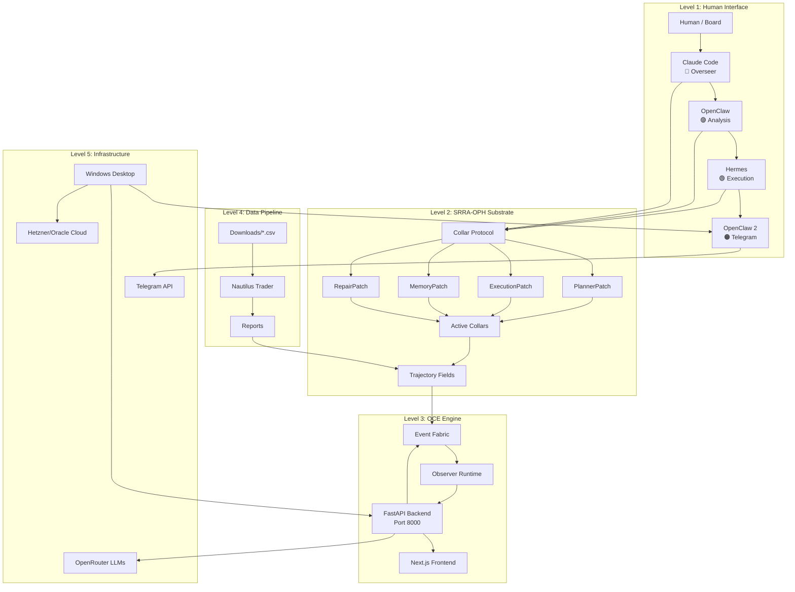
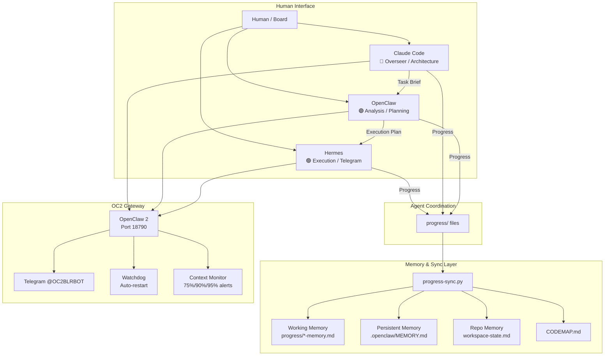
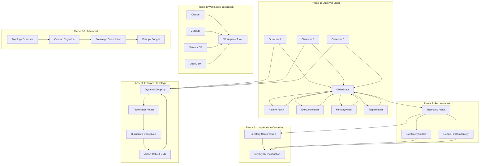
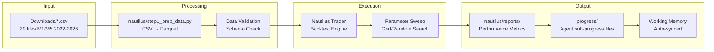
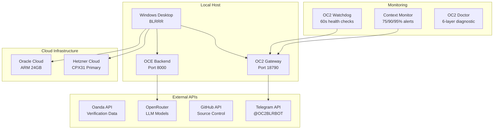
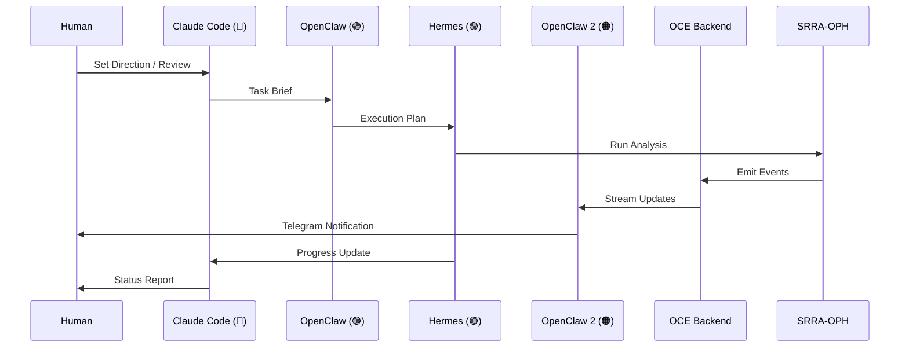
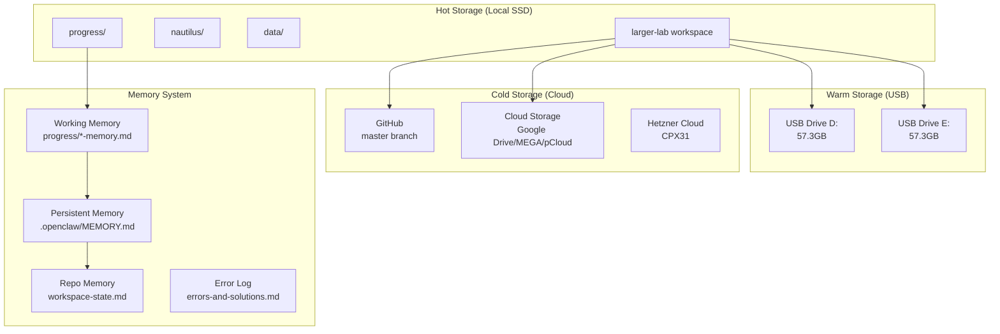
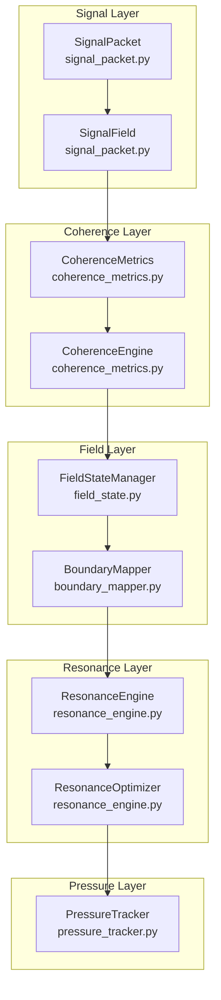
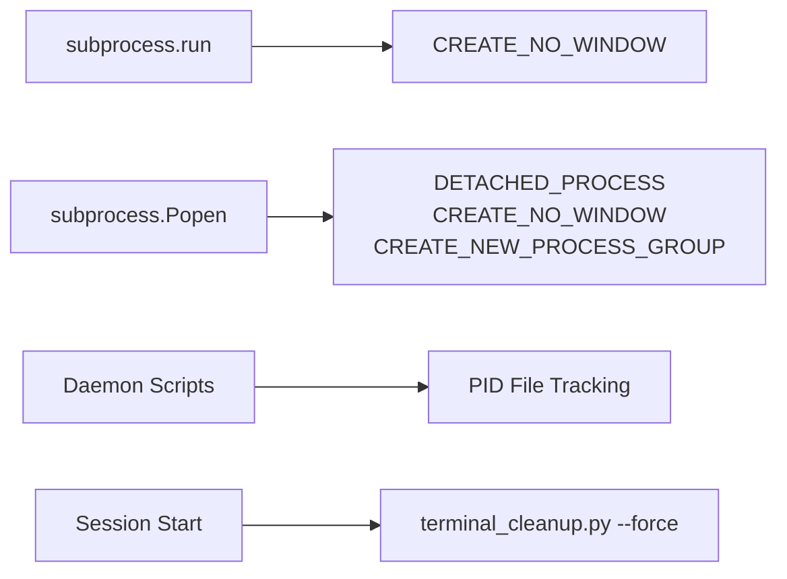

# 🗺️ CODEMAP — Unified System Architecture

> **Purpose:** Complete workspace orientation with all Mermaid diagrams in one place.
> **Updated:** 2026-05-17
> **For:** Quick reference, architecture alignment, pipeline verification.

---

## 🏛️ Unified System Overview



---

## 📊 Architecture Levels

### Level 1: Human Interface + Agent Network



### Level 2: SRRA-OPH Substrate (Phases 1-9)



### Level 3: OCE — Operator Continuity Engine

```mermaid
graph TB
    subgraph "User Layer"
        U[User] --> UI[OCE Shell UI<br/>Next.js Frontend]
    end

    subgraph "Continuity Core"
        UI --> API[FastAPI Backend<br/>Port 8000]
        API --> CHAT[/chat endpoint]
        API --> OBS[/observers endpoints]
        API --> EVT[/events endpoints]
        API --> ATTR[/attractor endpoint]
        API --> MEM[/memory endpoint]
        API --> WS[WebSocket /ws/events]
    end

    subgraph "Event Fabric"
        EF[Event Fabric Engine] --> ING[Ingest]
        EF --> ROUTE[Route]
        EF --> PERSIST[Persist]
        EF --> STREAM[Stream]
        ING --> VALIDATE[Validate + Classify]
        ROUTE --> TOPO[Topology-Aware Routing]
        PERSIST --> TRAJ[Trajectory Memory]
        STREAM --> WS
    end

    subgraph "Observer Runtime"
        OR[Observer Runtime] --> LIFECYCLE[Create/Activate/Suspend/Destroy]
        OR --> HEALTH[Entropy/Drift/Budget]
        OR --> STATE[State Persistence]
    end

    subgraph "SRRA-OPH Substrate"
        SRR[srrs_opc/] --> PATCHES[Observer Patches]
        SRR --> COLLAR[CollarLayer]
        SRR --> TOPO2[CollarTopologyEngine]
        SRR --> DRIFT[DriftDetector]
        SRR --> ENTROPY[EntropyBudgetManager]
    end

    API --> EF
    EF --> OR
    OR --> SRR
    SRR --> EF
```

### Level 4: Data + Trading Pipeline



### Level 5: Infrastructure + External Services



---

## 🤖 Agent Workflow



```mermaid
stateDiagram-v2
    [*] --> TaskReceived
    TaskReceived --> Planning: OpenClaw
    Planning --> Implementation: Hermes / OC2
    Implementation --> Verification: Tests + Backtest
    Verification --> Review: CC Review
    Review --> Approved: Quality Gate
    Review --> Rejected: Fix Required
    Rejected --> Implementation
    Approved --> Memory: Sync + Persist
    Memory --> [*]

    state Planning {
        [*] --> ParseBrief
        ParseBrief --> CreatePlan
        CreatePlan --> EstimateEffort
        EstimateEffort --> AssignTasks
    end

    state Implementation {
        [*] --> ExecuteCode
        ExecuteCode --> RunTests
        RunTests --> CollectResults
        CollectResults --> UpdateProgress
    }

    state Verification {
        [*] --> ValidateOutput
        ValidateOutput --> CrossCheck
        CrossCheck --> GenerateReport
    }

    state Memory {
        [*] --> SyncProgress
        SyncProgress --> Summarize
        Summarize --> Archive
    }
```

---

## 💾 Storage Architecture



---

## 🔧 Key Pipelines

### OCE Event Pipeline
```
SRRA-OPH → Event Fabric → Observer Runtime → WebSocket → Frontend
                ↓                ↓
           Persist to      State Updates
           Trajectory      → Telegram
```

### Agent Coordination Pipeline
```
Human → CC → OC → HR/OC2 → Results → Progress Files → Sync → Memory
```

### Memory Sync Pipeline
```
progress files → progress-sync.py → working memory + persistent memory + repo memory
team-chat.md → chat_sync.py → working memory + repo memory
errors → errors-and-solutions.md → repo memory (every 7 entries)
```

---

## 📁 Quick Reference

| Directory | Purpose |
|-----------|---------|
| `srrs_opc/` | SRRA-OPH core (33 Python files, 77 tests) |
| `nautilus/` | NautilusTrader backtesting |
| `oce/` | Operator Continuity Engine |
| `oce/backend/resonance/` | V3 Phase 1 — Resonant Signal Substrate (139 tests) |
| `progress/` | Agent sub-progress files |
| `system-arch/` | All Mermaid diagrams |
| `all-mermaids/` | Diagram archive by phase |
| `tools/` | Automation & utilities |
| `memory-bank/` | Error DB, solutions, patterns |

---

## 🔄 V3 Phase 1 — Resonant Signal Substrate (RSS)



### V3 Phase 1 Modules

| Module | File | Tests | Purpose |
|--------|------|-------|---------|
| SignalPacket | `oce/backend/resonance/signal_packet.py` | 34 | Signal ontology + resonance scoring |
| CoherenceMetrics | `oce/backend/resonance/coherence_metrics.py` | 21 | 6 coherence metrics tracking |
| FieldStateManager | `oce/backend/resonance/field_state.py` | 16 | Field state management |
| BoundaryMapper | `oce/backend/resonance/boundary_mapper.py` | 20 | Boundary detection + pressure mapping |
| ResonanceEngine | `oce/backend/resonance/resonance_engine.py` | 20 | Resonance alignment + scoring |
| PressureTracker | `oce/backend/resonance/pressure_tracker.py` | 10 | Entropy pressure monitoring |
| RL Integration | `oce/backend/resonance/rlp_integration.py` | 18 | RL ↔ CC bridge |

---

## ⚠️ ERR-0007: Windows Subprocess Execution Rules



**Prevention Rules:**
- ALL `subprocess.run()` on Windows MUST use `creationflags=subprocess.CREATE_NO_WINDOW`
- ALL `subprocess.Popen()` for background processes MUST use `DETACHED_PROCESS | CREATE_NO_WINDOW | CREATE_NEW_PROCESS_GROUP`
- Always implement PID file tracking for daemon scripts
- Run `tools/terminal_cleanup.py --force` at session start