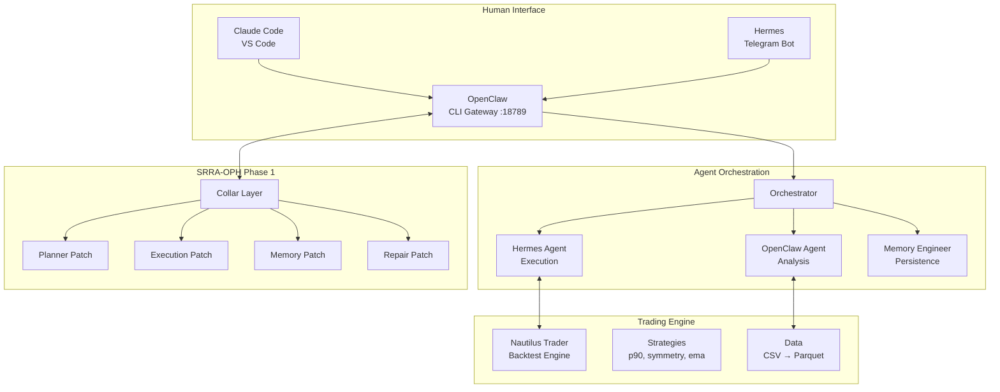
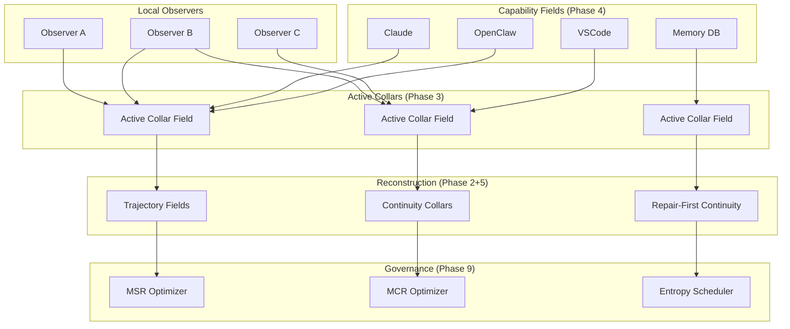
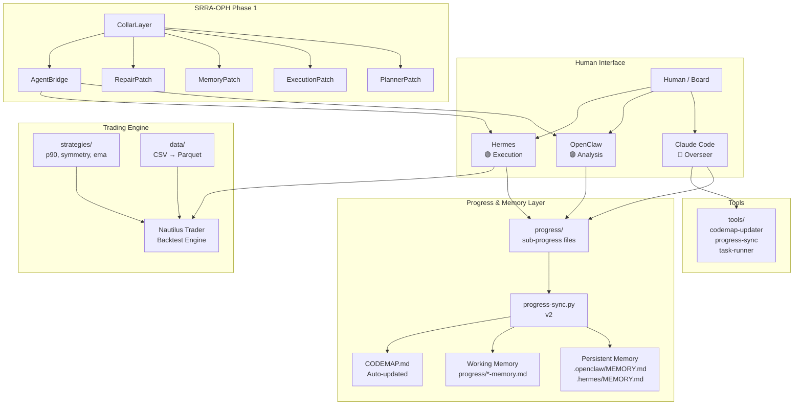
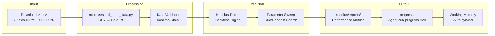
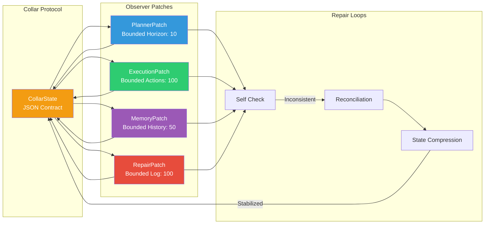
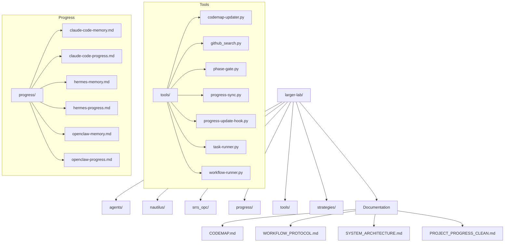

# CODEMAP — Larger-Lab Workspace Guide

> **Last Updated:** 2026-05-16 | **Phase:** 4 (Workspace Integration)
> **Purpose:** Quick orientation for agents joining the workspace. For full architecture, see `SYSTEM_ARCHITECTURE.md`.

---

## Quick Start

```bash
# 1. Clone & enter
git clone https://github.com/dabiggestpoppa/larger-lab.git
cd larger-lab

# 2. Python environment (uv recommended)
uv venv .venv
.venv\Scripts\activate  # Windows

# 3. Install deps
uv pip install -r requirements.txt

# 4. Run all SRRA-OPH tests
python -m srrs_opc.tests.test_phase2_e2e
python -m srrs_opc.tests.test_phase3_e2e
python -m srrs_opc.tests.test_phase4_e2e
```

---

## Workspace Map

```
larger-lab/
  srrs_opc/           ← SRRA-OPH core (25 Python files + tests + docs)
  nautilus/           ← NautilusTrader backtesting (strategies, data, reports)
  agent-lab/agents/   ← Hermes + OpenClaw agent configs
  skills/             ← Workspace skills (srra-oph-build, twitter-bookmarks, etc.)
  .agents/skills/     ← Agent-specific skills (40+ trading, quant, ML, Pine)
  .github/skills/     ← GitHub skills (docx, xlsx, pptx, pdf, etc.)
  progress/           ← Agent sub-progress files (CC/OC/HR/AS/PM)
  all-mermaids/       ← All Mermaid diagrams (phase1-5, phase6-9)
  docs/               ← Documentation, images, phase progress files
  tools/              ← Automation scripts, binaries, workspace files
  shared-conversations/ ← Team chat (team-chat.md)
```

> 📊 **All Mermaid diagrams** have been extracted to `all-mermaids/` for easy reference.

---

## System Architecture Overview



---

## Key Directories

| Directory | Purpose | Key Files |
|-----------|---------|-----------|
| `srrs_opc/` | SRRA-OPH Phase 1 implementation | `base_patch.py`, `planner_patch.py`, `execution_patch.py`, `memory_patch.py`, `repair_patch.py`, `collar_layer.py` |
| `nautilus/` | Trading strategies & backtests | `strategies/`, `data/`, `reports/` |
| `.hermes/` | Hermes agent configuration | `MEMORY.md`, `SOUL.md`, `skills/` |
| `.openclaw/` | OpenClaw configuration | `openclaw.json`, `openclaw_prompt.md` |
| `usb-cloud/` | Cloud storage mesh | `usb-mesh.ps1`, `cloud-server-setup.sh` |

---

## SRRA-OPH Architecture (Phases 1-5, Book 2 Updated)

### Phase 1: Foundational Observer Mesh ✅
- 4 observer patches (Planner, Execution, Memory, Repair)
- CollarLayer for structured overlap synchronization
- AgentBridge for OpenClaw/Hermes integration
- All patches tested stable (3 cycles, 0 repairs)

### Phase 2: Reconstruction + Recoverability ✅
- **Recovery Anchors** — SQLite-based sparse persistence
- **Drift Detector** — Staleness + weight drift detection
- **Consistency Validator** — Direct/temporal contradiction detection
- **Reconstruction Synthesizer** — Continuity from sparse anchors
- **Contradiction Resolver** — Weight-wins auto-resolution
- **Constraint Propagator** — Event-driven constraint propagation
- 7/7 integration tests passing

### Phase 3: Emergent Topology (Book 2 Updated) 🔄
**Core shift:** Overlap collars are now the continuity engine, not observer nodes.

- **Active Collar Fields** — Edges are active computational reconciliation regions
- **Local Consensus Engines** — Consensus produces stable overlap closure (separate from sync)
- **Overlap Geometry Routing** — Routes through high-reconstruction-efficiency regions
- **Repair-First Continuity** — Repair CREATES continuity (not just supports it)
- **Constraint Resonance Clustering** — Clusters form from overlap compatibility
- **Minimal Stable Realization (MSR)** — min topology for recoverable coherence
- **Entropy-Aware Overlap Scaling** — Sublinear overlap density growth
- 4/4 original tests passing + new overlap-first tests needed

### Phase 4: Workspace Integration (Book 2 Updated) 📋
**Core shift:** Tools become capability fields, not isolated endpoints.

- **Capability Fields** — Distributed execution potentials with entropy/reconstruction profiles
- **Overlap-Aware Tooling** — Execution requires overlap reconciliation
- **Reconstruction-Safe Execution** — Unrecoverable execution is invalid execution
- **Repair-Mediated Orchestration** — Continuous contradiction mediation
- **Entropy-Aware Scheduling** — Optimizes coherence per resource cost
- **Minimal Execution Realization (MER)** — Min execution topology for recoverable outcomes

### Phase 5: Long-Horizon Continuity (Book 2 Updated) 📋
**Core shift:** Identity is reconstructable trajectory, not persistent state.

- **Trajectory Reconstruction Fields** — Continuity from sparse overlap evidence
- **Continuity Collars** — Long-horizon continuity at overlap boundaries
- **Drift-Tolerant Identity** — Probabilistic, directional, constraint-bound
- **Repair-Generated Persistence** — Active repair-driven persistence
- **Temporal Attractor Stabilization** — Soft constraints on reconstruction paths
- **Minimal Continuity Realization (MCR)** — Min continuity structure for recoverability

### Full SRRA-OPH Topology (Phases 1-9, Book 2)



### Usage Example

```python
from srrs_opc import PlannerPatch, ExecutionPatch, MemoryPatch, RepairPatch, CollarLayer

# Create collar layer
collar = CollarLayer()

# Register patches
collar.register_patch(PlannerPatch())
collar.register_patch(ExecutionPatch())
collar.register_patch(MemoryPatch())
collar.register_patch(RepairPatch())

# Run synchronization cycle
results = collar.run_cycle()
```

---

## Agent Integration Points

### OpenClaw Gateway
- **URL:** `ws://127.0.0.1:18789`
- **Config:** `~/.openclaw/openclaw.json`
- **Skills:** `.hermes/skills/` + `nautilus/`

### Hermes Telegram Bot
- **Interface:** Telegram messages
- **Skills:** `.hermes/skills/`
- **Memory:** `.hermes/MEMORY.md`

### Nautilus Trader
- **Strategies:** `nautilus/strategies/`
- **Data:** `nautilus/data/` (parquet format)
- **Reports:** `nautilus/reports/`

---

## Key Reference Files

| File | Purpose |
|------|---------|
| `PROJECT_PROGRESS.md` | Project state & history |
| `SYSTEM_ARCHITECTURE.md` | System constitution |
| `WORKFLOW_PROTOCOL.md` | Task lifecycle |
| `ERROR_CLASSIFICATION.md` | Error handling |
| `TASK_BRIEF_TEMPLATE.json` | Task definition |
| `srrs_opc/README.md` | SRRA-OPH documentation |

---

## Common Tasks

### Run SRRA-OPH Test
```bash
cd srrs_opc
python test_phase1.py
```

### Run Nautilus Backtest
```bash
cd nautilus
python -m nautilus.backtest_runner --strategy p90_cerebus_v5
```

### Sync to USB/Cloud
```bash
.\backup.bat -FullBackup
```

---

## Contact & Coordination

- **Primary Agent:** Claude Code (this session)
- **Analysis Agent:** OpenClaw (CLI gateway)
- **Execution Agent:** Hermes (Telegram bot)
- **Memory Engineer:** Memory Patch (SRRA-OPH)

### System Overview



### Agent Workflow

```mermaid
flowchart TD
    H[Human gives direction] --> CC[Claude Code<br/>Overseer]

    CC --> |Task Brief| OC[OpenClaw<br/>Analysis & Planning]
    OC --> |Execution Plan| HR[Hermes<br/>Execution]

    HR --> |Backtest| NT[Nautilus Trader]
    NT --> |Results| HR

    HR --> |Progress Update| PP[progress/hermes-progress.md]
    OC --> |Progress Update| PP2[progress/openclaw-progress.md]
    CC --> |Progress Update| PP3[progress/claude-code-progress.md]

    PP --> SYNC[progress-sync.py]
    PP2 --> SYNC
    PP3 --> SYNC

    SYNC --> |Every 3 updates| PPC[PROJECT_PROGRESS_CLEAN.md]
    SYNC --> |Working Memory| WM[progress/*-memory.md]
    SYNC --> |Append Summary| PM[.openclaw/MEMORY.md<br/>.hermes/MEMORY.md]
    SYNC --> |Global State| RM[/memories/repo/workspace-state.md]

    HR --> |Complete| REVIEW{Overseer Review}
    REVIEW --> |Approve| NEXT[Next Phase]
    REVIEW --> |Fix| HR
    NEXT --> |New Task| OC
```

### Data Pipeline



### SRRA-OPH Architecture



### File Structure


