# 🗺️ CODEMAP — Unified System Architecture

> **Purpose:** Complete workspace orientation with all Mermaid diagrams in one place.
> **Updated:** 2026-05-17
> **For:** Quick reference, architecture alignment, pipeline verification.

---

## 🏛️ Unified System Overview

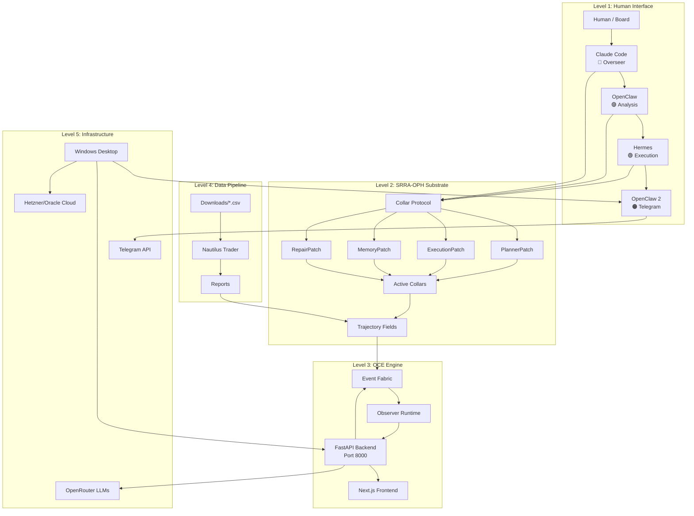

---

## 📊 Architecture Levels

### Level 1: Human Interface + Agent Network

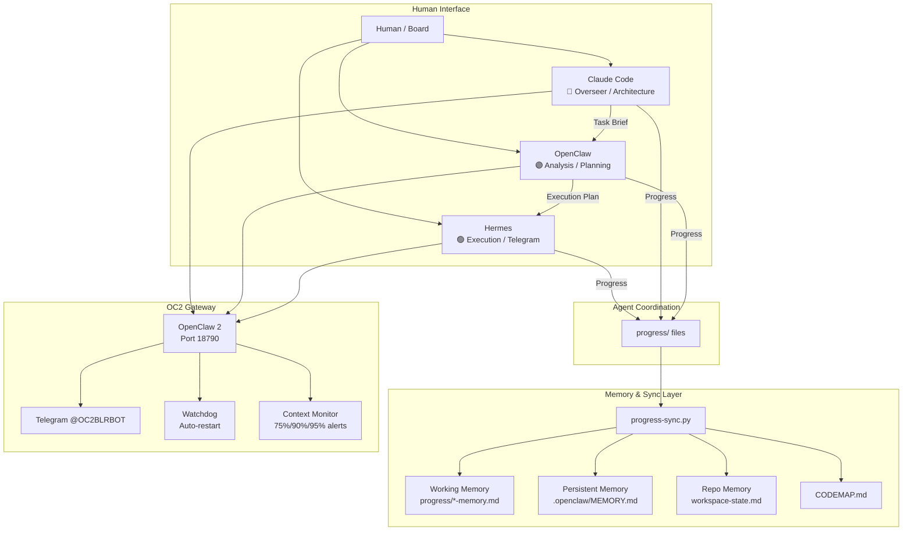

### Level 2: SRRA-OPH Substrate (Phases 1-9)

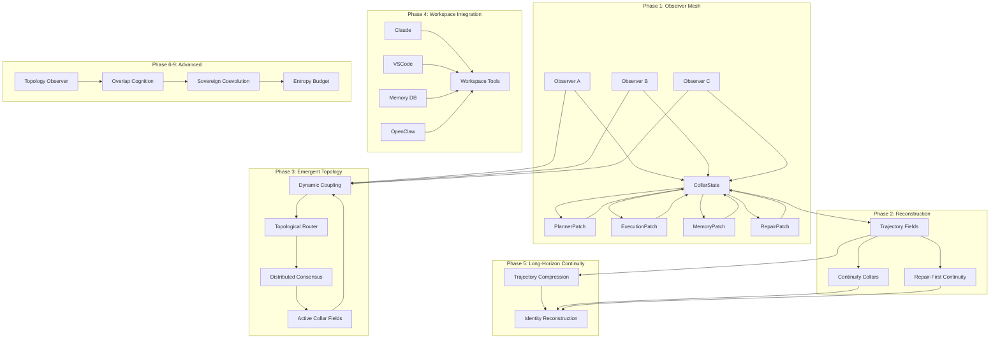

### Level 3: OCE — Operator Continuity Engine

```mermaid
graph TB
    subgraph "User Layer"
        U[User] --> UI[OCE Shell UI<br/>Next.js Frontend]
    end

    subgraph "Continuity Core"
        UI --> API[FastAPI Backend<br/>Port 8000]
        API --> CHAT[/chat endpoint]
        API --> OBS[/observers endpoints]
        API --> EVT[/events endpoints]
        API --> ATTR[/attractor endpoint]
        API --> MEM[/memory endpoint]
        API --> WS[WebSocket /ws/events]
    end

    subgraph "Event Fabric"
        EF[Event Fabric Engine] --> ING[Ingest]
        EF --> ROUTE[Route]
        EF --> PERSIST[Persist]
        EF --> STREAM[Stream]
        ING --> VALIDATE[Validate + Classify]
        ROUTE --> TOPO[Topology-Aware Routing]
        PERSIST --> TRAJ[Trajectory Memory]
        STREAM --> WS
    end

    subgraph "Observer Runtime"
        OR[Observer Runtime] --> LIFECYCLE[Create/Activate/Suspend/Destroy]
        OR --> HEALTH[Entropy/Drift/Budget]
        OR --> STATE[State Persistence]
    end

    subgraph "SRRA-OPH Substrate"
        SRR[srrs_opc/] --> PATCHES[Observer Patches]
        SRR --> COLLAR[CollarLayer]
        SRR --> TOPO2[CollarTopologyEngine]
        SRR --> DRIFT[DriftDetector]
        SRR --> ENTROPY[EntropyBudgetManager]
    end

    API --> EF
    EF --> OR
    OR --> SRR
    SRR --> EF
```

### Level 4: Data + Trading Pipeline

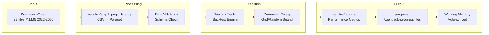

### Level 5: Infrastructure + External Services

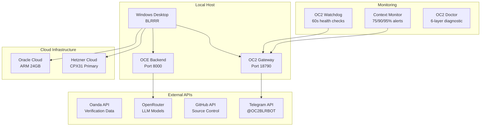

---

## 🤖 Agent Workflow

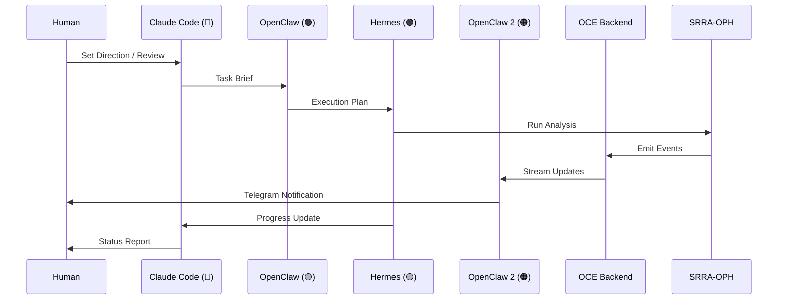

```mermaid
stateDiagram-v2
    [*] --> TaskReceived
    TaskReceived --> Planning: OpenClaw
    Planning --> Implementation: Hermes / OC2
    Implementation --> Verification: Tests + Backtest
    Verification --> Review: CC Review
    Review --> Approved: Quality Gate
    Review --> Rejected: Fix Required
    Rejected --> Implementation
    Approved --> Memory: Sync + Persist
    Memory --> [*]

    state Planning {
        [*] --> ParseBrief
        ParseBrief --> CreatePlan
        CreatePlan --> EstimateEffort
        EstimateEffort --> AssignTasks
    end

    state Implementation {
        [*] --> ExecuteCode
        ExecuteCode --> RunTests
        RunTests --> CollectResults
        CollectResults --> UpdateProgress
    }

    state Verification {
        [*] --> ValidateOutput
        ValidateOutput --> CrossCheck
        CrossCheck --> GenerateReport
    }

    state Memory {
        [*] --> SyncProgress
        SyncProgress --> Summarize
        Summarize --> Archive
    }
```

---

## 💾 Storage Architecture

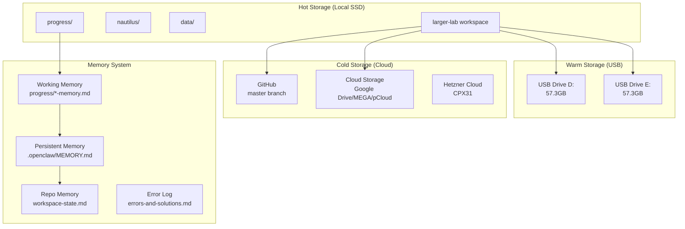

---

## 🔧 Key Pipelines

### OCE Event Pipeline
```
SRRA-OPH → Event Fabric → Observer Runtime → WebSocket → Frontend
                ↓                ↓
           Persist to      State Updates
           Trajectory      → Telegram
```

### Agent Coordination Pipeline
```
Human → CC → OC → HR/OC2 → Results → Progress Files → Sync → Memory
```

### Memory Sync Pipeline
```
progress files → progress-sync.py → working memory + persistent memory + repo memory
team-chat.md → chat_sync.py → working memory + repo memory
errors → errors-and-solutions.md → repo memory (every 7 entries)
```

---

## 📁 Quick Reference

| Directory | Purpose |
|-----------|---------|
| `srrs_opc/` | SRRA-OPH core (33 Python files, 57 tests) |
| `nautilus/` | NautilusTrader backtesting |
| `oce/` | Operator Continuity Engine |
| `oce/backend/resonance/` | V3 Phase 1 — Resonant Signal Substrate (139 tests) |
| `oce/backend/reconstruction/` | V3 Phase 2 — Reconstructive Continuity Manifold (52 tests) |
| `oce/backend/topology/` | V3 Phase 3 — Resonant Topology & BSP Emergence |
| `oce/backend/sovereign/` | V3 Phase 4 — Sovereign Instrumentation & Embodiment |
| `oce/backend/temporal/` | V3 Phase 5 — Long-Horizon Continuity & Temporal Compression |
| `oce/backend/introspection/` | V3 Phase 6 — Recursive Topology Introspection |
| `oce/backend/multiscale/` | V3 Phase 7 — Multi-Scale Cognitive Fields (70 tests) |
| `oce/backend/coevolution/` | V3 Phase 8 — Operator Coevolution (76 tests) |
| `oce/backend/field_core/` | V3 Phase 9 — Sovereign Field Emergence (169 tests) |
| `oce/backend/phase10/` | V3 Phase 10 — Recursive Field Computation (23 tests) |
| `oce/backend/recursive_compute/` | Recursive compute graph utilities |
| `oce/backend/production/` | Production deployment tools |
| `oce/backend/cognition/` | Cognitive processing engines |
| `oce/backend/tests/` | System-level tests (11 capability tests) |
| `progress/` | Agent sub-progress files |
| `system-arch/` | Architecture documentation + Mermaid diagrams |
| `all-mermaids/` | Diagram archive by phase |
| `tools/` | Automation & utilities |
| `memory-bank/` | Error DB, solutions, patterns |
| `quant-lab/` | Quantitative research + strategy conversions |
| `research/` | Research notes + resource index |
| `skills/` | Workspace-level skills (30+) |
| `.agents/skills/` | Agent-specific skills (40+) |
| `.github/skills/` | GitHub skills |

---

## 🔄 V3 Phase 1 — Resonant Signal Substrate (RSS)

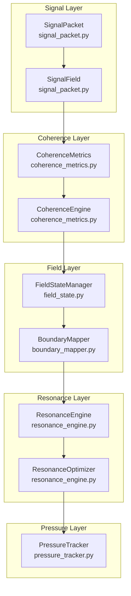

### V3 Phase 1 Modules

| Module | File | Tests | Purpose |
|--------|------|-------|---------|
| SignalPacket | `oce/backend/resonance/signal_packet.py` | 34 | Signal ontology + resonance scoring |
| CoherenceMetrics | `oce/backend/resonance/coherence_metrics.py` | 21 | 6 coherence metrics tracking |
| FieldStateManager | `oce/backend/resonance/field_state.py` | 16 | Field state management |
| BoundaryMapper | `oce/backend/resonance/boundary_mapper.py` | 20 | Boundary detection + pressure mapping |
| ResonanceEngine | `oce/backend/resonance/resonance_engine.py` | 20 | Resonance alignment + scoring |
| PressureTracker | `oce/backend/resonance/pressure_tracker.py` | 10 | Entropy pressure monitoring |
| RL Integration | `oce/backend/resonance/rlp_integration.py` | 18 | RL ↔ CC bridge |

---

## ⚠️ ERR-0007: Windows Subprocess Execution Rules

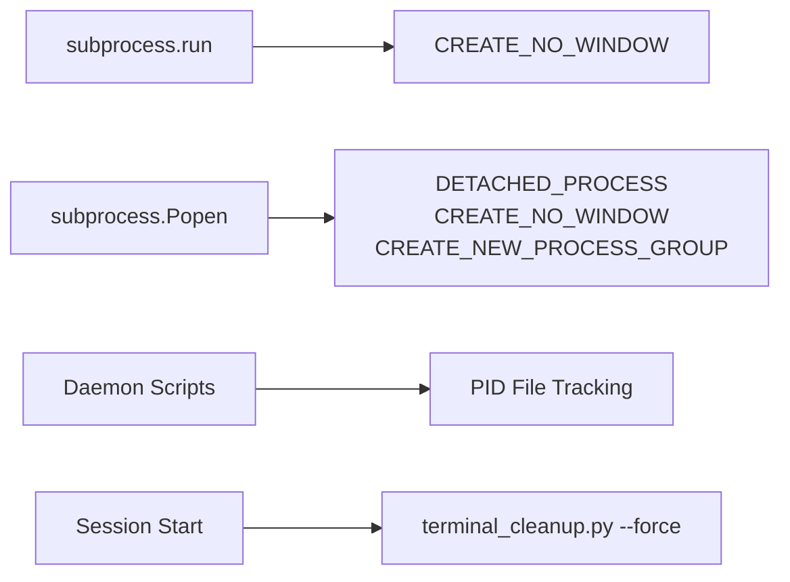

**Prevention Rules:**
- ALL `subprocess.run()` on Windows MUST use `creationflags=subprocess.CREATE_NO_WINDOW`
- ALL `subprocess.Popen()` for background processes MUST use `DETACHED_PROCESS | CREATE_NO_WINDOW | CREATE_NEW_PROCESS_GROUP`
- Always implement PID file tracking for daemon scripts
- Run `tools/terminal_cleanup.py --force` at session start

---

## 🔄 V3 Phase 7 — Multi-Scale Cognitive Fields (MSCF)

```mermaid
graph TB
    subgraph "Local Scale"
        LF[LocalObserverField<br/>local_fields.py]
        LFR[LocalFieldRegistry]
    end

    subgraph "Regional Scale"
        RC[RegionalCluster<br/>regional_clusters.py]
        CR[ClusterRegistry]
    end

    subgraph "Global Scale"
        GA[GlobalAttractor<br/>global_attractor.py]
        GAL[GlobalAttractorLayer]
    end

    subgraph "Sync Layer"
        SM[SyncManager<br/>hierarchical_sync.py]
        SF[SyncFrequency]
        SR[SyncRecord]
    end

    subgraph "Repair Layer"
        NR[NestedRepairSystem<br/>nested_repair.py]
        RR[RepairRequest]
        RE[RepairEscalation]
    end

    subgraph "Routing Layer"
        SAR[ScaleAdaptiveRouter<br/>scale_routing.py]
        SL[ScaleLevel]
        RM[RoutedMessage]
    end

    subgraph "Containment Layer"
        ECS[EntropyContainmentSystem<br/>entropy_containment.py]
        CB[ContainmentBoundary]
    end

    LF --> LFR
    RC --> CR
    GA --> GAL
    SM --> SF
    SM --> SR
    NR --> RR
    NR --> RE
    SAR --> SL
    SAR --> RM
    ECS --> CB

    LF --> SM
    RC --> SM

---

## 🔄 V3 Phase 8 — Operator Coevolution

```mermaid
graph TB
    subgraph "Operator Modeling"
        OM[OperatorModel<br/>operator_model.py]
        CM[ConstraintModel<br/>constraint_model.py]
    end

    subgraph "Adaptation"
        BA[BidirectionalAdaptation<br/>bidirectional_adaptation.py]
        CR[CoherenceReinforcement<br/>coherence_reinforcement.py]
    end

    subgraph "Monitoring"
        CL[CognitiveLoad<br/>cognitive_load.py]
        AT[AlignmentTracking<br/>alignment_tracking.py]
    end

    subgraph "Protection"
        AM[AntiManipulation<br/>anti_manipulation.py]
    end

    OM --> BA
    CM --> BA
    BA --> CR
    CR --> AT
    AT --> CL
    AM --> OM
```

### V3 Phase 8 Modules

| Module | File | Tests | Purpose |
|--------|------|-------|---------|
| OperatorModel | `oce/backend/coevolution/operator_model.py` | — | Models human operator preferences |
| ConstraintModel | `oce/backend/coevolution/constraint_model.py` | — | Models system constraints |
| CoherenceReinforcement | `oce/backend/coevolution/coherence_reinforcement.py` | — | Reinforces coherent behavior |
| BidirectionalAdaptation | `oce/backend/coevolution/bidirectional_adaptation.py` | — | System ↔ Human adaptation |
| CognitiveLoad | `oce/backend/coevolution/cognitive_load.py` | — | Monitors operator cognitive load |
| AlignmentTracking | `oce/backend/coevolution/alignment_tracking.py` | — | Tracks system-operator alignment |
| AntiManipulation | `oce/backend/coevolution/anti_manipulation.py` | — | Prevents operator manipulation |

---

## 🔄 V3 Phase 9 — Sovereign Field Emergence

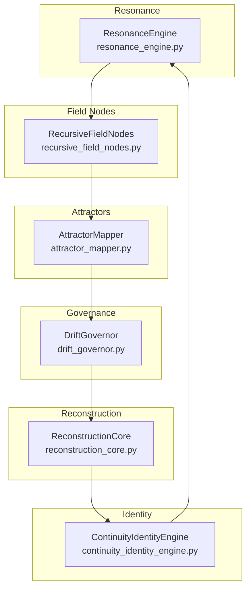

### V3 Phase 9 Modules

| Module | File | Tests | Purpose |
|--------|------|-------|---------|
| ResonanceEngine | `oce/backend/field_core/resonance_engine.py` | — | Field-level resonance |
| RecursiveFieldNodes | `oce/backend/field_core/recursive_field_nodes.py` | — | Recursive field computation |
| AttractorMapper | `oce/backend/field_core/attractor_mapper.py` | — | Attractor mapping + convergence |
| DriftGovernor | `oce/backend/field_core/drift_governor.py` | — | Drift governance + correction |
| ReconstructionCore | `oce/backend/field_core/reconstruction_core.py` | — | Core reconstruction engine |
| ContinuityIdentityEngine | `oce/backend/field_core/continuity_identity_engine.py` | — | Continuity identity management |

---

## 🔄 V3 Phase 10 — Recursive Field Computation

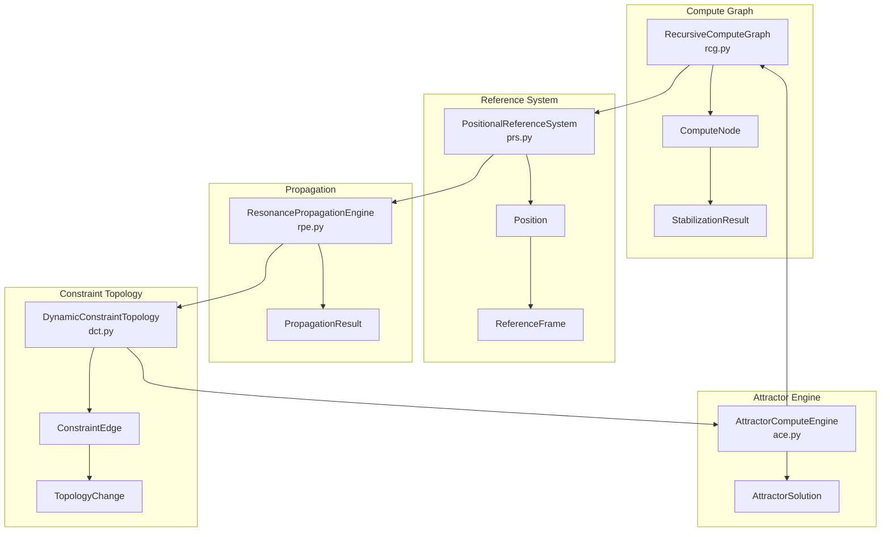

### V3 Phase 10 Modules

| Module | File | Tests | Purpose |
|--------|------|-------|---------|
| RecursiveComputeGraph | `oce/backend/phase10/rcg.py` | 6 | Recursive compute graph + stabilization |
| PositionalReferenceSystem | `oce/backend/phase10/prs.py` | 5 | Positional reference system |
| ResonancePropagationEngine | `oce/backend/phase10/rpe.py` | 4 | Resonance propagation engine |
| DynamicConstraintTopology | `oce/backend/phase10/dct.py` | 4 | Dynamic constraint topology |
| AttractorComputeEngine | `oce/backend/phase10/ace.py` | 4 | Attractor compute engine |

### V3 Phase 10 Test Results: 23/23 passed
- TestRecursiveComputeGraph: 6 tests ✅
- TestPositionalReferenceSystem: 5 tests ✅
- TestResonancePropagationEngine: 4 tests ✅
- TestDynamicConstraintTopology: 4 tests ✅
- TestAttractorComputeEngine: 4 tests ✅

---

## 🔄 V3 — All 10 Phases Complete

```mermaid
graph LR
    P1[Phase 1<br/>RSS<br/>7 modules]
    P2[Phase 2<br/>RCM<br/>6 modules]
    P3[Phase 3<br/>RT&BSP<br/>7 modules]
    P4[Phase 4<br/>SIE<br/>8 modules]
    P5[Phase 5<br/>LHCTC<br/>8 modules]
    P6[Phase 6<br/>RTI<br/>4 modules]
    P7[Phase 7<br/>MSCF<br/>7 modules]
    P8[Phase 8<br/>OC<br/>8 modules]
    P9[Phase 9<br/>SFE<br/>6 modules]
    P10[Phase 10<br/>RFC<br/>5 modules]
    P11[Phase 11<br/>OV<br/>11 components]

    P1 --> P2 --> P3 --> P4 --> P5 --> P6 --> P7 --> P8 --> P9 --> P10 --> P11

    style P1 fill:#3498db,color:#fff
    style P2 fill:#2ecc71,color:#fff
    style P3 fill:#9b59b6,color:#fff
    style P4 fill:#e74c3c,color:#fff
    style P5 fill:#f39c12,color:#fff
    style P6 fill:#1abc9c,color:#fff
    style P7 fill:#34495e,color:#fff
    style P8 fill:#e67e22,color:#fff
    style P9 fill:#2c3e50,color:#fff
    style P10 fill:#8e44ad,color:#fff
```

**Total: 67 V3 modules across 10 phases + 11 Phase 11 components, 1403 tests passing**
    GA --> SM
    SM --> NR
    NR --> SAR
    SAR --> ECS
```

### V3 Phase 7 Modules

| Module | File | Tests | Purpose |
|--------|------|-------|---------|
| LocalObserverField | `oce/backend/multiscale/local_fields.py` | 6 | Independent local cognition with bounded sync |
| RegionalCluster | `oce/backend/multiscale/regional_clusters.py` | 4 | Self-organizing clusters by interaction density |
| GlobalAttractor | `oce/backend/multiscale/global_attractor.py` | 4 | Low-frequency strategic stabilization |
| SyncManager | `oce/backend/multiscale/hierarchical_sync.py` | 2 | Scale-appropriate sync frequency |
| NestedRepairSystem | `oce/backend/multiscale/nested_repair.py` | 2 | Multi-scale repair escalation |
| ScaleAdaptiveRouter | `oce/backend/multiscale/scale_routing.py` | 3 | Scale-adaptive information routing |
| EntropyContainmentSystem | `oce/backend/multiscale/entropy_containment.py` | 3 | Localize instability, prevent cascade |

---

## 🔄 V3 Phase 8 — Operator Coevolution ✅ COMPLETE

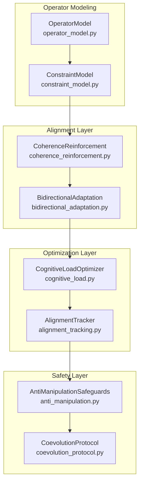

### V3 Phase 8 Modules (Complete)

| Module | File | Purpose | Tests |
|--------|------|---------|-------|
| OperatorModel | `oce/backend/coevolution/operator_model.py` | Operator Pattern Extraction | 9 |
| ConstraintModel | `oce/backend/coevolution/constraint_model.py` | Strategic Constraint Modeling | 8 |
| CoherenceReinforcement | `oce/backend/coevolution/coherence_reinforcement.py` | Coherence Reinforcement | 7 |
| BidirectionalAdaptation | `oce/backend/coevolution/bidirectional_adaptation.py` | Bidirectional Adaptation | 6 |
| CognitiveLoadOptimizer | `oce/backend/coevolution/cognitive_load.py` | Cognitive Load Optimization | 6 |
| AlignmentTracker | `oce/backend/coevolution/alignment_tracking.py` | Long-Horizon Alignment Tracking | 10 |
| AntiManipulationSafeguards | `oce/backend/coevolution/anti_manipulation.py` | Anti-Manipulation Safeguards | 10 |
| CoevolutionProtocol | `oce/backend/coevolution_protocol.py` | Multi-Agent Coevolution Protocol | 14 |
| **Total** | | | **76 tests** |

---

## ✅ V3 Phase 9 — Sovereign Field Emergence Complete

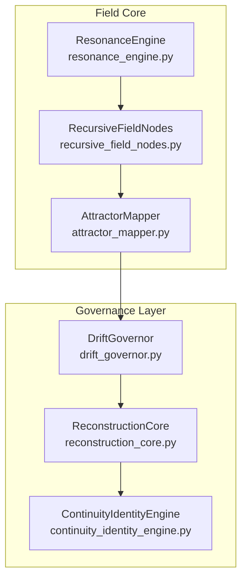

### V3 Phase 9 Modules (Complete)

| Module | File | Purpose | Tests |
|--------|------|---------|-------|
| ResonanceEngine | `oce/backend/field_core/resonance_engine.py` | Measures coherence across system | 24 |
| RecursiveFieldNodes | `oce/backend/field_core/recursive_field_nodes.py` | Field participants with local awareness | 18 |
| AttractorMapper | `oce/backend/field_core/attractor_mapper.py` | Detects stable recurring configurations | 14 |
| DriftGovernor | `oce/backend/field_core/drift_governor.py` | Measures divergence, triggers reconstruction | 15 |
| ReconstructionCore | `oce/backend/field_core/reconstruction_core.py` | Topology-constrained inference | 12 |
| ContinuityIdentityEngine | `oce/backend/field_core/continuity_identity_engine.py` | Maintains operational continuity | 11 |
| **Total** | | | **169 tests** |

---

## 🧪 V3 Phase 11 — Operational Validation

```mermaid
graph TB
    subgraph "Long-Horizon Testing"
        OST[ObserverStressTest<br/>observer_stress.py]
        RTM[RuntimeMonitor<br/>runtime_monitor.py]
        CCS[ContinuityChecksum<br/>continuity_checksum.py]
    end

    subgraph "Stability Infrastructure"
        SR[StabilityRunner<br/>stability_runner.py]
        MI[MemoryIntegrity<br/>memory_integrity.py]
        CP[ContinuityProbe<br/>continuity_probe.py]
    end

    subgraph "Drift & Recovery"
        DT[DriftTracker<br/>drift_tracker.py]
        RV[RestartValidator<br/>restart_validator.py]
        EM[EntropyMonitor<br/>entropy_monitor.py]
    end

    subgraph "Chaos Engine"
        CE[ChaosEngine<br/>chaos_engine.py]
        ME[MetricsExporter<br/>metrics_exporter.py]
    end

    OST --> RTM --> CCS
    SR --> MI --> CP
    DT --> RV --> EM
    CE --> ME
```

### V3 Phase 11 Test Infrastructure

| Component | File | Purpose | Tests |
|-----------|------|---------|-------|
| ObserverStressTest | `tools/testing/long_horizon/observer_stress.py` | 24-72hr observer survival test | 1 |
| RuntimeMonitor | `tools/testing/long_horizon/runtime_monitor.py` | Runtime metrics collection | 1 |
| ContinuityChecksum | `tools/testing/long_horizon/continuity_checksum.py` | Continuity state validation | 1 |
| StabilityRunner | `tools/testing/long_horizon/stability_runner.py` | Main test orchestrator | 1 |
| MemoryIntegrity | `tools/testing/long_horizon/memory_integrity.py` | Memory poisoning/drift detection | 1 |
| ContinuityProbe | `tools/testing/long_horizon/continuity_probe.py` | Periodic state probing | 1 |
| DriftTracker | `tools/testing/long_horizon/drift_tracker.py` | Drift score tracking | 1 |
| RestartValidator | `tools/testing/long_horizon/restart_validator.py` | Post-restart validation | 1 |
| EntropyMonitor | `tools/testing/long_horizon/entropy_monitor.py` | System entropy monitoring | 1 |
| MetricsExporter | `tools/testing/long_horizon/metrics_exporter.py` | Metrics export to JSON | 1 |
| ChaosEngine | `tools/testing/chaos/chaos_engine.py` | Failure injection testing | 8 |
| **Total** | | | **16 tests** |

---

## 🧪 V3 Phase 11 — Operational Validation (Current Status)

### Test Progress

| Test | Status | Details |
|------|--------|---------|
| Chaos Engine Autopilot | ✅ COMPLETE | 4/4 scenarios passed |
| Continuous Amplified Chaos | 🔄 RUNNING | Cycle 1/12+ completed, amplification 1.0050 |

### Chaos Engine Test Results

| Scenario | Recovery Time | Status |
|----------|---------------|--------|
| observer_death | 25.0s | ✅ PASS |
| event_flood | 115.2s | ✅ PASS |
| memory_poison | 55.1s | ✅ PASS |
| full_chaos | 105.1s | ✅ PASS |

### Continuous Test Configuration

- **Duration:** 12 hours continuous
- **Amplification:** 0.5% per PASS cycle
- **Cooldown:** 5 minutes between cycles
- **Tracking:** `tools/testing/chaos/stability/chaos_continuous_results.json`
- **Trace Log:** `tools/testing/chaos/stability/chaos_continuous_trace.log`

### Test Files

| File | Purpose |
|------|---------|
| `chaos_engine.py` | Chaos injection engine (8 failure types) |
| `chaos_runner.py` | Autopilot script for chaos scenarios |
| `chaos_continuous_test.py` | Continuous amplified chaos test |
| `chaos_test_plan.md` | Chaos scenario documentation |