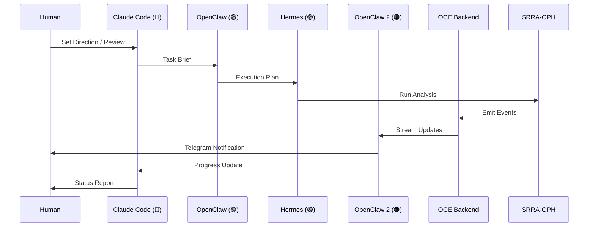
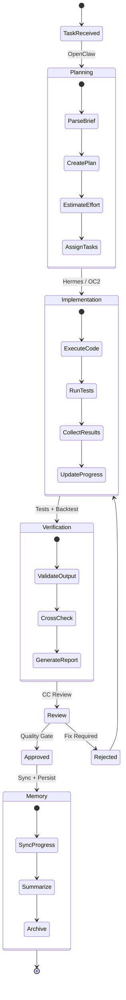
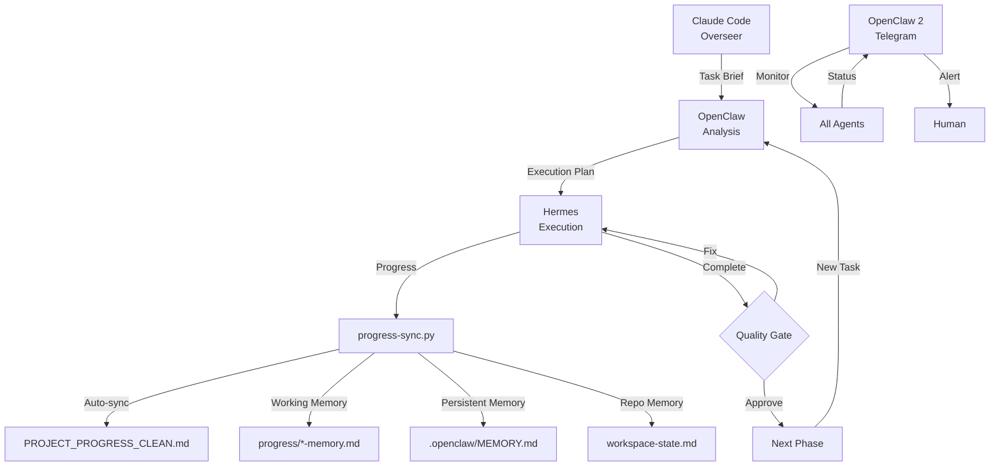

# 02 Agent Workflow

> Category: doctrine | Imported: 2026-06-02 01:13 UTC

Tags: #doctrine

# Agent Workflow + Communication

> **Purpose:** Agent interaction patterns, workflow state machine, and communication flows.
> **Updated:** 2026-05-18 | Phase 10 Complete | OC2 Gateway Active

## Agent Communication Flow



## Workflow State Machine



## Agent Handoff Protocol



## OCE Event Flow

```mermaid
flowchart LR
    SRRA[SRRA-OPH<br/>Substrate] -->|emit events| EF[Event Fabric]
    EF -->|route| OR[Observer Runtime]
    OR -->|process| OBS[Observers]
    OBS -->|output events| EF
    EF -->|stream| WS[WebSocket]
    WS -->|real-time| UI[OCE Frontend]
    EF -->|persist| TRAJ[Trajectory Memory]
    EF -->|query| API[/events endpoint]
```

<!-- ARCH-COMMIT [2026-05-17 11:50 UTC] OC2: projects/social/discord-agent-hq/discord_bot.py -- Replaced Hermes/OC1 dual-agent bot with single OC2/OWL operator. Removed Hermes boa, OC1 gateway, and all standalone telegram bot scripts. blrr city is now the sole Discord bot running as OC2. -->

LINKS:
[[Codemap]]
[[01 System Overview]]
[[03 Srra Topology]]
[[04 Data And Storage]]
[[Agents]]
[[Api Reference]]
[[Cg 1 Mermaid Specs]]
[[Cg 1 Revised]]
[[Cg 2 Mermaid Specs]]
[[Cg 2 World Model Activation]]
[[Cg 3 Openclaw Anchor]]
[[Cg 3 Relational Topology]]
[[Cg 4 Execution Intelligence]]
[[Cg 4 Mermaid Specs]]
[[Cg 5 Continuity Intelligence]]
[[Cg 6 Meta Cognition]]
[[Cg 7 Multi Scale Orchestration]]
[[Cg 8 Operator Coevolution]]
[[Cg 9 Autonomous Strategic Field]]
[[Chaos Scenarios]]
[[Chat Response Bug Diagram]]
[[Claude]]
[[Cleanup Report]]
[[Code Quality]]
[[Contributing]]
[[Debugging]]
[[Domain Micro Doctrines]]
[[Harness Engineering]]
[[Heartbeat]]
[[Identity]]
[[Master Plan 2026 05 18]]
[[Master Plan Observer Core]]
[[Master Prompt]]
[[Module Guide]]
[[Observer Core Workspace State]]
[[Oce Unified Frontend Plan]]
[[O 6 Implementation Plan]]
[[O 7 Persistent Field Doc]]
[[Phase10]]
[[Phase Breakdown]]
[[Principles]]
[[Project Progress Clean]]
[[Quality Review]]
[[Quality Review Feedback]]
[[Readme]]
[[Soul]]
[[Sub Agent Rules]]
[[Team Tasks]]
[[Telegram Bot Setup]]
[[Testing]]
[[Test Manual]]
[[Tools]]
[[Topological Cognition Architecture]]
[[User]]
[[Workspace State]]
[[Agent Topology]]
[[Hermes Agent Activation Note]]
[[Hermes Agent Test]]
[[Hermes Agent Test Note]]
[[Progress]]
[[Action]]
[[Citation Workflow]]
[[Interaction]]
[[Patterns]]
[[Server]]
[[Workflow]]
[[Workflow Format]]
[[Asset Configs]]
[[Convergence Indicator]]
[[Dmr Standalone Backtest]]
[[P90 Backtest]]
[[P90 Count Ews]]
[[P90 Dmr Backtest]]
[[P90 Dmr Combo Backtest]]
[[P90 Dmr Overlay Backtest]]
[[P90 Engine]]
[[P90 Engine Dmr]]
[[P90 Gap Check]]
[[P90 Trace Trades]]
[[P90 Usdchf Backtest]]
[[Run Majors Backtest]]
[[Run St Multi Asset]]
[[Run Top5 Backtest Mc]]
[[St Batch2 Runner]]
[[St Batch Runner]]
[[Symmetry Trap]]
[[Symmetry Trap Backtest]]
[[Symmetry Trap Monte Carlo]]
[[Memory]]
[[Atomic Sym Trap]]
[[Blind Chain Debug]]
[[Blind Chain Diag]]
[[Blind Chain Engine]]
[[Blind Chain Exact]]
[[Blind Chain V2 Debug]]
[[Blind Chain V2 Sl Calibrated]]
[[Blind Chain V3]]
[[Cerebus Resolution Engine]]
[[Constraint Anchor Engine]]
[[Debug Days]]
[[Debug One Day]]
[[Debug St]]
[[Debug Trace]]
[[Diag Option B]]
[[Diag V5]]
[[Dmr Strategy]]
[[Dual Engine]]
[[Naut Asset Config]]
[[P90 Cfd Expansion Engine]]
[[P90 Cfd Expansion Engine V2]]
[[P90 Cfd Expansion Engine V3]]
[[P90 Cfd Expansion Engine V4]]
[[P90 Cfd Expansion Engine V5]]
[[P90 Strategy]]
[[Shared]]
[[Stall Harvest Cfd Engine]]
[[Symmetry Trap Engine]]
[[Symmetry Trap Exact]]
[[Symmetry Trap Option B]]
[[Symmetry Trap Strategy]]
[[Symmetry Trap V4]]
[[Symmetry Trap V5]]
[[Symmetry Trap V6 Exact]]
[[Symmetry Trap V7B Sl Calibrated]]
[[Symmetry Trap V7 Sl Calibrated]]
[[Two Plays Engine]]
[[Agent Lifecycle]]
[[Agent Spawner]]
[[Multi Agent Coordinator]]
[[Workflow Distiller]]
[[Workflow Memory]]
