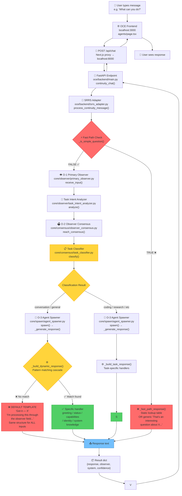
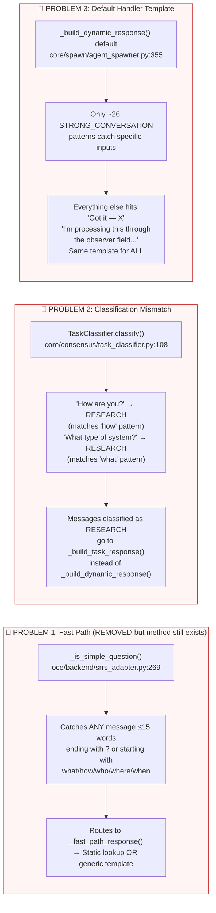
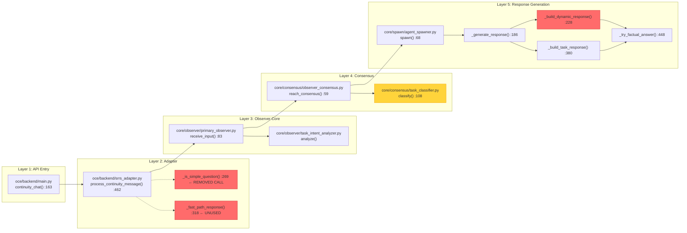

# Chat Response Bug Diagram

> Category: doctrine | Imported: 2026-06-02 01:13 UTC

Tags: #doctrine

# Primary Observer Chat Response Bug — System Flow Diagram

## Complete Message Flow (User → Response)



## The Three Problem Points



## Code File Map



## What Happens to "?" (single character)

```mermaid
flowchart TD
    Q["User types '?'"] -->|"POST /api/chat"| ADAPTER

    ADAPTER["srrs_adapter.py<br/>process_continuity_message()"] -->|"Step 1"| O1["primary_observer.receive_input()<br/>→ TaskIntentAnalyzer.analyze()"]
    O1 -->|"domain: general, confidence: 0.3"| CONSENSUS

    CONSENSUS["observer_consensus.reach_consensus()<br/>→ TaskClassifier.classify()"] -->|"Step 2: STRONG_CONVERSATION pre-check<br/>No match (not in 26 patterns)"| SCORE

    SCORE["Pattern scoring<br/>'?' matches nothing<br/>word_count=1, is_short=True<br/>has_task_keywords=False"] -->|"No scores OR short+no keywords"| CONV

    CONV["Check conversation patterns<br/>'?' doesn't match any CONVERSATION pattern<br/>→ Falls through to GENERAL"] -->|"task_type: GENERAL<br/>confidence: 0.3"| SPAWN

    SPAWN["agent_spawner.spawn()"] -->|"Step 3: consensus_result.task_type='general'"| GEN

    GEN["_generate_response()<br/>task_type == 'conversation' or 'general'"] -->|"YES"| DYN

    DYN["_build_dynamic_response()"] -->|"Check: greeting? NO<br/>Check: status? NO<br/>Check: capabilities? NO<br/>Check: identity? NO<br/>Check: system knowledge? NO<br/>Check: thanks? NO<br/>Check: goodbye? NO<br/>Check: system components? NO<br/>Check: history? NO"| DEFAULT

    DEFAULT["🔥 DEFAULT HANDLER 🔥<br/>'Got it — \"?\"'<br/>'I'm processing this through<br/>the observer field...'<br/>'Current routing: planner'<br/>'Want me to take action?'"] --> RESPONSE

    RESPONSE["📤 Same response for:<br/>'?' / 'OK LETS SEE...'<br/>'hello' / 'random text'<br/>Anything not in 26 patterns"]

    style DEFAULT fill:#ff6b6b,stroke:#c92a2a
    style RESPONSE fill:#ff6b6b,stroke:#c92a2a
    style DYN fill:#ffd43b,stroke:#f59f00
```

## Root Cause Summary

| # | Problem | File | Line | Impact |
|---|---------|------|------|--------|
| 1 | Fast path removed but `_is_simple_question()` and `_fast_path_response()` still exist as dead code | `srrs_adapter.py` | 269, 318 | Low (not called, but confusing) |
| 2 | `TaskClassifier` matches "how/what/who" as RESEARCH before checking CONVERSATION | `task_classifier.py` | 108 | Medium — wrong routing |
| 3 | `_build_dynamic_response()` default handler is a template that fires for ALL non-pattern-matched messages | `agent_spawner.py` | 355 | **HIGH** — this is the main bug |
| 4 | Only ~26 STRONG_CONVERSATION patterns cover specific phrases | `task_classifier.py` | 115-135 | Medium — can't cover all inputs |
| 5 | `_try_factual_answer()` only covers ~40 facts | `agent_spawner.py` | 448 | Low — factual lookup is limited |

## The Fix Must Address

The fundamental issue is that `_build_dynamic_response()` uses **pattern matching** to handle messages. This approach will always fail for edge cases because:

1. There are infinite ways to phrase a message
2. Adding more patterns creates maintenance burden
3. The default handler catches everything that doesn't match

**The default handler must be replaced with actual content analysis** — it needs to understand WHAT the user is saying and respond accordingly, not just echo their input back with a template wrapper.

LINKS:
[[Codemap]]
[[V3 Architecture]]
[[01 System Overview]]
[[02 Agent Workflow]]
[[03 Srra Topology]]
[[04 Data And Storage]]
[[Agents]]
[[Api Reference]]
[[Cg 1 Mermaid Specs]]
[[Cg 1 Revised]]
[[Cg 2 Mermaid Specs]]
[[Cg 2 World Model Activation]]
[[Cg 3 Openclaw Anchor]]
[[Cg 3 Relational Topology]]
[[Cg 4 Execution Intelligence]]
[[Cg 4 Mermaid Specs]]
[[Cg 5 Continuity Intelligence]]
[[Cg 6 Meta Cognition]]
[[Cg 7 Multi Scale Orchestration]]
[[Cg 8 Operator Coevolution]]
[[Cg 9 Autonomous Strategic Field]]
[[Chaos Scenarios]]
[[Cleanup Report]]
[[Code Quality]]
[[Contributing]]
[[Debugging]]
[[Domain Micro Doctrines]]
[[Harness Engineering]]
[[Heartbeat]]
[[Identity]]
[[Master Plan 2026 05 18]]
[[Master Plan Observer Core]]
[[Master Prompt]]
[[Module Guide]]
[[Observer Core Workspace State]]
[[Oce Unified Frontend Plan]]
[[O 6 Implementation Plan]]
[[O 7 Persistent Field Doc]]
[[Phase10]]
[[Phase Breakdown]]
[[Principles]]
[[Project Progress Clean]]
[[Quality Review]]
[[Quality Review Feedback]]
[[Readme]]
[[Soul]]
[[Sub Agent Rules]]
[[Team Tasks]]
[[Telegram Bot Setup]]
[[Testing]]
[[Test Manual]]
[[Tools]]
[[Topological Cognition Architecture]]
[[User]]
[[Workspace State]]
[[Action]]
[[Bug Report]]
[[Cal]]
[[Color Systems]]
[[Inputs]]
[[Patterns]]
[[Server]]
[[System]]
[[Venn Diagram]]
[[Asset Configs]]
[[Convergence Indicator]]
[[Dmr Standalone Backtest]]
[[P90 Backtest]]
[[P90 Count Ews]]
[[P90 Dmr Backtest]]
[[P90 Dmr Combo Backtest]]
[[P90 Dmr Overlay Backtest]]
[[P90 Engine]]
[[P90 Engine Dmr]]
[[P90 Gap Check]]
[[P90 Trace Trades]]
[[P90 Usdchf Backtest]]
[[Run Majors Backtest]]
[[Run St Multi Asset]]
[[Run Top5 Backtest Mc]]
[[St Batch2 Runner]]
[[St Batch Runner]]
[[Symmetry Trap]]
[[Symmetry Trap Backtest]]
[[Symmetry Trap Monte Carlo]]
[[Memory]]
[[Atomic Sym Trap]]
[[Blind Chain Debug]]
[[Blind Chain Diag]]
[[Blind Chain Engine]]
[[Blind Chain Exact]]
[[Blind Chain V2 Debug]]
[[Blind Chain V2 Sl Calibrated]]
[[Blind Chain V3]]
[[Cerebus Resolution Engine]]
[[Constraint Anchor Engine]]
[[Debug Days]]
[[Debug One Day]]
[[Debug St]]
[[Debug Trace]]
[[Diag Option B]]
[[Diag V5]]
[[Dmr Strategy]]
[[Dual Engine]]
[[Naut Asset Config]]
[[P90 Cfd Expansion Engine]]
[[P90 Cfd Expansion Engine V2]]
[[P90 Cfd Expansion Engine V3]]
[[P90 Cfd Expansion Engine V4]]
[[P90 Cfd Expansion Engine V5]]
[[P90 Strategy]]
[[Shared]]
[[Stall Harvest Cfd Engine]]
[[Symmetry Trap Engine]]
[[Symmetry Trap Exact]]
[[Symmetry Trap Option B]]
[[Symmetry Trap Strategy]]
[[Symmetry Trap V4]]
[[Symmetry Trap V5]]
[[Symmetry Trap V6 Exact]]
[[Symmetry Trap V7B Sl Calibrated]]
[[Symmetry Trap V7 Sl Calibrated]]
[[Two Plays Engine]]
[[Team Chat]]
[[Team Chat Archive 2026 05]]
[[Team Chat Archive 2026 05 22]]
[[Agent Spawner]]
[[Observer Consensus]]
[[Task Classifier]]
[[Chat Log]]
[[Primary Observer]]
[[Task Intent Analyzer]]
