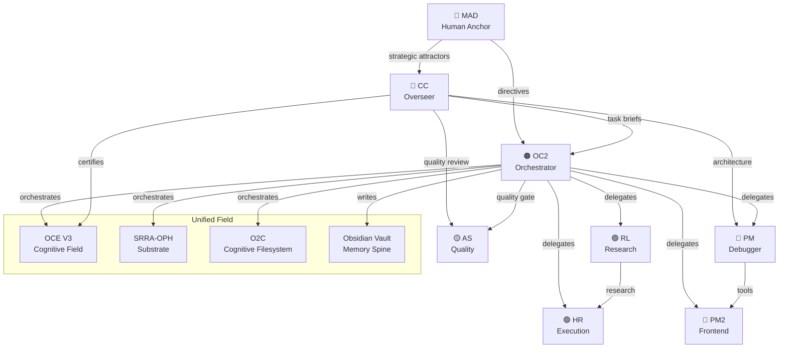

# Agent Topology

> Category: memory | Imported: 2026-06-02 01:13 UTC

Tags: #memory

# Agent Topology — Relationship Map

TYPE: graph
SUMMARY: Visual map of how agents relate to each other and to system components.
CAUSE: Understanding agent relationships is critical for orchestration.
FUNCTION: Reference for delegation, communication paths, and responsibility boundaries.

## Agent Relationship Diagram

## Communication Paths

| From | To | Channel | Purpose |
|------|----|---------|---------|
| MAD | CC | Direct | Strategic direction |
| MAD | OC2 | Direct | Operational directives |
| CC | OC2 | Task briefs | Architecture decisions |
| OC2 | All agents | runSubagent | Task delegation |
| All agents | All | team-chat.md | Status updates |
| All agents | All | Obsidian vault | Knowledge sharing |

## Delegation Rules
1. OC2 delegates to Manager → Worker pipeline
2. One Worker = One Deliverable
3. Max 5 concurrent sub-agents
4. Manager NEVER executes
5. All workers write checkpoint progress

RELATIONSHIPS: [[Team Roster]] [[OC2 Identity]] [[System Architecture]]

STATUS: active
SOURCE: AGENTS.md, IDENTITY.md

LINKS:
[[Vault]]
[[Topology Learning]]
[[Multi Agent Coordinator]]
[[Agent Spawner]]
[[Agent Lifecycle]]
[[Memory]]
[[System]]
[[Server]]
[[Patterns]]
[[Modules]]
[[Cal]]
[[Welcome]]
[[Vault Distillation 20260531 0245]]
[[Tradovate Api Discovery 20260531]]
[[Track A Ninjascript Build 20260531]]
[[Track A Build Status]]
[[Track A Build Complete 20260531]]
[[Test Pattern]]
[[Test Note]]
[[Team Phase01 Status]]
[[Task Flow]]
[[Srra Oph]]
[[Session Testagent 20260531 0245 Full]]
[[Session Testagent 20260531 0245]]
[[Session 20260531 2200]]
[[Self Heal Report]]
[[Sage Audit Environment Utilization]]
[[Sage Audit 20260531 Environment Utilization V2]]
[[Sage Audit 20260531 Environment Utilization]]
[[Quantlab Bible]]
[[Python Vs Nautilus Tradecount Investigation 20260601]]
[[Progress]]
[[Pm2 Test Note]]
[[Option A Confirmed 20260531]]
[[Operational State 20260531]]
[[Ontology Core Summary]]
[[Oc2 Vault Access Guide]]
[[Oc2 Identity]]
[[Oc2 Gateway Failures]]
[[Obsidian Vault Connection Info]]
[[Observer Core O1 O7]]
[[O2C Pipeline]]
[[Module Guide Summary]]
[[Master Plan Assessment 20260531]]
[[Live Deployment Status]]
[[Keyerror Data Validation 20260531 0245]]
[[Journal 20260602T005953Z Task Update]]
[[Journal 20260602T005953Z Task Create]]
[[Journal 20260602T005953Z Spawn Research]]
[[Journal 20260602T005953Z Orchestrated Spawn]]
[[Journal 20260602T005953Z Command Task]]
[[Journal 20260602T005953Z Command Status]]
[[Journal 20260602T005953Z Command Spawn]]
[[Journal 20260602T005953Z Command Report]]
[[Journal 20260602T004841Z Report Oc2 20260602004841]]
[[Journal 20260602T004841Z Report]]
[[Journal 20260602T004841Z Conversation]]
[[Journal 20260602T004840Z Sync]]
[[Journal 20260602T004840Z Graph Summary]]
[[Journal 20260602T004840Z Command Sync]]
[[Journal 20260602T004840Z Command Status]]
[[Journal 20260602T004840Z Command Help]]
[[Journal 20260602T004840Z Command Graph]]
[[Hermes Obsidian Test   Vault Working]]
[[Hermes Agent Test]]
[[Hermes Agent Activation Note]]
[[Foundational Principles]]
[[Failure Index Oc2]]
[[Executor Crash 20260531]]
[[Errors And Solutions]]
[[Doctor Prescription]]
[[Dashboard Build Complete]]
[[Daily Runtime 20260531]]
[[Cerebus Nt8 Deployment Campaign 20260531]]
[[Cc Phase 01 Build Certification Report]]
[[Build Progress 20260531]]
[[Build Patterns]]
[[Backtest Phase Status]]
[[Backtest Campaign V3 Results]]
[[Backtest Campaign Status 20260531]]
[[Api Test Note]]
[[Api Reference Summary]]
[[Api Execution Architecture 20260531]]
[[Active Strategies Performance]]
[[2026 06 01]]
[[2026 05 31]]
[[2026 05 30 Nautilus Fix]]
[[2026 05 30 Evening]]
[[2026 05 30]]
[[2026 05 21]]
[[2026 05 20]]
[[2026 05 18]]
[[2026 05 17]]
[[Tools]]
[[Sub Agent Rules]]
[[Quality Review]]
[[Operator Rules]]
[[Module Guide]]
[[Identity]]
[[Cg 3 Relational Topology]]
[[Api Reference]]
[[Agents]]
[[03 Srra Topology]]
[[02 Agent Workflow]]
[[V3 Cognitive Field]]
[[Architecture]]
[[OC2 (OWL) — Unified Field Operator]]
[[Team Roster — Agent Network]]
[[System Architecture — Complete Guide]]
[[Operator Rules — Bounded Sovereign Operational Continuity]]
[[Hermes Agent Test Note]]
[[KeyError — data_validation — 20260531_0245]]
[[Task Flow — How Work Moves Through the System]]
[[Session Distillation — TestAgent]]
[[Build Patterns — Successful Operational Patterns]]
[[O2C Pipeline — Cognitive Filesystem & Obsidian Mesh]]
[[Observer Core — O-1 through O-7]]
[[SRRA-OPH — Observer Patch Substrate]]
[[API Reference — OCE Backend Endpoints]]
[[Module Guide — 78 Modules Reference]]
