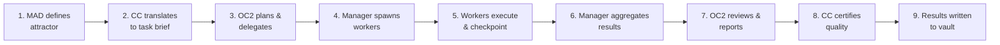

# Task Flow

> Category: memory | Imported: 2026-06-02 01:13 UTC

Tags: #memory

# Task Flow — How Work Moves Through the System

TYPE: graph
SUMMARY: Step-by-step flow of how a task goes from human intent to completed execution.
CAUSE: Every agent needs to understand how work flows through the system.
FUNCTION: Reference for task lifecycle and handoff points.

## Task Lifecycle

## Detailed Flow

### Step 1: Attractor Definition
- MAD defines strategic attractor (goal, not instructions)
- Attractor is persistent across sessions

### Step 2: Task Brief
- CC translates attractor into specific task brief
- Brief includes: objective, success criteria, constraints

### Step 3: Planning & Delegation
- OC2 analyzes task, identifies deliverables
- For each deliverable: spawn one worker agent
- Max 5 concurrent workers

### Step 4: Worker Spawn
- Each worker receives: task description, context, success criteria
- Worker writes checkpoint to progress file

### Step 5: Execution
- Workers execute independently
- Each step logged to execution journal
- Errors indexed to vault via Error Intelligence

### Step 6: Aggregation
- Manager collects all worker outputs
- Checks completeness against success criteria

### Step 7: Review
- OC2 reviews aggregated results
- Reports status to MAD via team-chat.md

### Step 8: Certification
- CC reviews quality, runs tests
- Writes certification report to vault

### Step 9: Knowledge Persistence
- All findings written to Obsidian vault
- Patterns extracted and crystallized
- Errors indexed for future avoidance

RELATIONSHIPS: [[Agent Topology]] [[O2C Pipeline]] [[Foundational Principles]]

STATUS: active
SOURCE: AGENTS.md, team-chat.md

LINKS:
[[Error Intelligence]]
[[Vault]]
[[Task Intent Analyzer]]
[[Task Executor]]
[[Task Classifier]]
[[Journal]]
[[Memory]]
[[System]]
[[Server]]
[[Patterns]]
[[Modules]]
[[Description]]
[[Circular Flow]]
[[Welcome]]
[[Vault Distillation 20260531 0245]]
[[Tradovate Api Discovery 20260531]]
[[Track A Ninjascript Build 20260531]]
[[Track A Build Status]]
[[Track A Build Complete 20260531]]
[[Test Pattern]]
[[Test Note]]
[[Team Roster]]
[[Team Phase01 Status]]
[[Srra Oph]]
[[Session Testagent 20260531 0245 Full]]
[[Session Testagent 20260531 0245]]
[[Session 20260531 2200]]
[[Self Heal Report]]
[[Sage Audit Environment Utilization]]
[[Sage Audit 20260531 Environment Utilization V2]]
[[Sage Audit 20260531 Environment Utilization]]
[[Quantlab Bible]]
[[Python Vs Nautilus Tradecount Investigation 20260601]]
[[Progress]]
[[Pm2 Test Note]]
[[Option A Confirmed 20260531]]
[[Operational State 20260531]]
[[Ontology Core Summary]]
[[Oc2 Vault Access Guide]]
[[Oc2 Identity]]
[[Oc2 Gateway Failures]]
[[Obsidian Vault Connection Info]]
[[Observer Core O1 O7]]
[[Module Guide Summary]]
[[Master Plan Assessment 20260531]]
[[Live Deployment Status]]
[[Keyerror Data Validation 20260531 0245]]
[[Journal 20260602T005953Z Task Update]]
[[Journal 20260602T005953Z Task Create]]
[[Journal 20260602T005953Z Spawn Research]]
[[Journal 20260602T005953Z Orchestrated Spawn]]
[[Journal 20260602T005953Z Command Task]]
[[Journal 20260602T005953Z Command Status]]
[[Journal 20260602T005953Z Command Spawn]]
[[Journal 20260602T005953Z Command Report]]
[[Journal 20260602T004841Z Report Oc2 20260602004841]]
[[Journal 20260602T004841Z Report]]
[[Journal 20260602T004841Z Conversation]]
[[Journal 20260602T004840Z Sync]]
[[Journal 20260602T004840Z Graph Summary]]
[[Journal 20260602T004840Z Command Sync]]
[[Journal 20260602T004840Z Command Status]]
[[Journal 20260602T004840Z Command Help]]
[[Journal 20260602T004840Z Command Graph]]
[[Hermes Obsidian Test   Vault Working]]
[[Hermes Agent Test Note]]
[[Hermes Agent Test]]
[[Hermes Agent Activation Note]]
[[Failure Index Oc2]]
[[Executor Crash 20260531]]
[[Errors And Solutions]]
[[Doctor Prescription]]
[[Dashboard Build Complete]]
[[Daily Runtime 20260531]]
[[Cerebus Nt8 Deployment Campaign 20260531]]
[[Cc Phase 01 Build Certification Report]]
[[Build Progress 20260531]]
[[Build Patterns]]
[[Backtest Phase Status]]
[[Backtest Campaign V3 Results]]
[[Backtest Campaign Status 20260531]]
[[Api Test Note]]
[[Api Reference Summary]]
[[Api Execution Architecture 20260531]]
[[Active Strategies Performance]]
[[2026 06 01]]
[[2026 05 31]]
[[2026 05 30 Nautilus Fix]]
[[2026 05 30 Evening]]
[[2026 05 30]]
[[2026 05 21]]
[[2026 05 20]]
[[2026 05 18]]
[[2026 05 17]]
[[Principles]]
[[Operator Rules]]
[[Module Guide]]
[[Api Reference]]
[[Agents]]
[[V3 Cognitive Field]]
[[System Architecture]]
[[Architecture]]
[[OC2 (OWL) — Unified Field Operator]]
[[Team Roster — Agent Network]]
[[System Architecture — Complete Guide]]
[[V3 Cognitive Field System]]
[[Operator Rules — Bounded Sovereign Operational Continuity]]
[[KeyError — data_validation — 20260531_0245]]
[[Agent Topology — Relationship Map]]
[[Session Distillation — TestAgent]]
[[Build Patterns — Successful Operational Patterns]]
[[O2C Pipeline — Cognitive Filesystem & Obsidian Mesh]]
[[Observer Core — O-1 through O-7]]
[[SRRA-OPH — Observer Patch Substrate]]
[[API Reference — OCE Backend Endpoints]]
[[Module Guide — 78 Modules Reference]]
