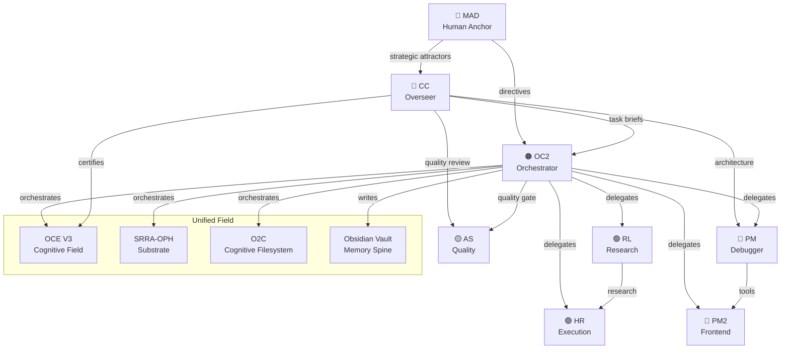

# Agent Topology — Relationship Map

TYPE: graph
SUMMARY: Visual map of how agents relate to each other and to system components.
CAUSE: Understanding agent relationships is critical for orchestration.
FUNCTION: Reference for delegation, communication paths, and responsibility boundaries.

## Agent Relationship Diagram

## Communication Paths

| From | To | Channel | Purpose |
|------|----|---------|---------|
| MAD | CC | Direct | Strategic direction |
| MAD | OC2 | Direct | Operational directives |
| CC | OC2 | Task briefs | Architecture decisions |
| OC2 | All agents | runSubagent | Task delegation |
| All agents | All | team-chat.md | Status updates |
| All agents | All | Obsidian vault | Knowledge sharing |

## Delegation Rules
1. OC2 delegates to Manager → Worker pipeline
2. One Worker = One Deliverable
3. Max 5 concurrent sub-agents
4. Manager NEVER executes
5. All workers write checkpoint progress

RELATIONSHIPS: [[Team Roster]] [[OC2 Identity]] [[System Architecture]]

STATUS: active
SOURCE: AGENTS.md, IDENTITY.md
