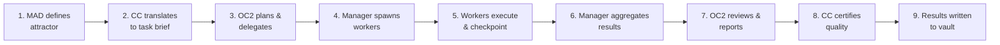

# Task Flow — How Work Moves Through the System

TYPE: graph
SUMMARY: Step-by-step flow of how a task goes from human intent to completed execution.
CAUSE: Every agent needs to understand how work flows through the system.
FUNCTION: Reference for task lifecycle and handoff points.

## Task Lifecycle

## Detailed Flow

### Step 1: Attractor Definition
- MAD defines strategic attractor (goal, not instructions)
- Attractor is persistent across sessions

### Step 2: Task Brief
- CC translates attractor into specific task brief
- Brief includes: objective, success criteria, constraints

### Step 3: Planning & Delegation
- OC2 analyzes task, identifies deliverables
- For each deliverable: spawn one worker agent
- Max 5 concurrent workers

### Step 4: Worker Spawn
- Each worker receives: task description, context, success criteria
- Worker writes checkpoint to progress file

### Step 5: Execution
- Workers execute independently
- Each step logged to execution journal
- Errors indexed to vault via Error Intelligence

### Step 6: Aggregation
- Manager collects all worker outputs
- Checks completeness against success criteria

### Step 7: Review
- OC2 reviews aggregated results
- Reports status to MAD via team-chat.md

### Step 8: Certification
- CC reviews quality, runs tests
- Writes certification report to vault

### Step 9: Knowledge Persistence
- All findings written to Obsidian vault
- Patterns extracted and crystallized
- Errors indexed for future avoidance

RELATIONSHIPS: [[Agent Topology]] [[O2C Pipeline]] [[Foundational Principles]]

STATUS: active
SOURCE: AGENTS.md, team-chat.md
