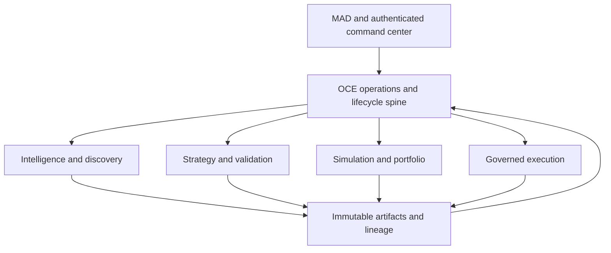
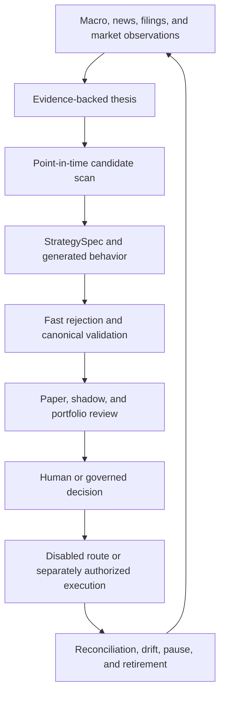
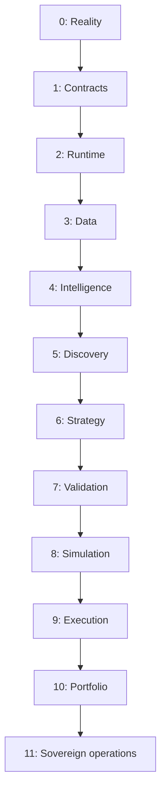
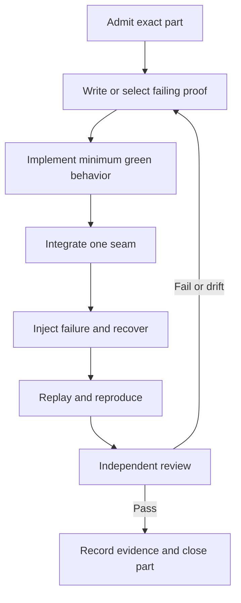
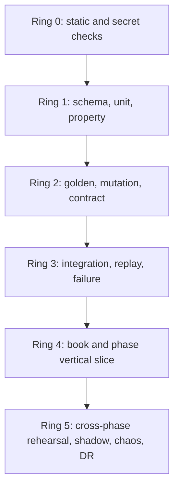
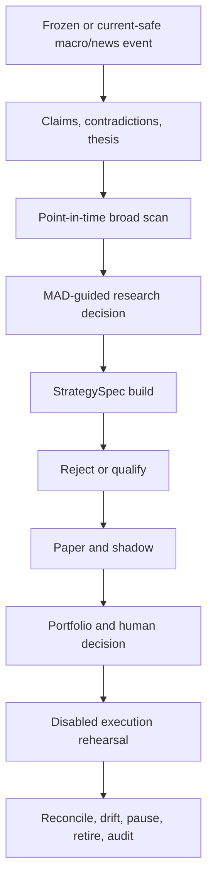

# GLX FORGE — Final Build Guide and Implementation Anchor

> **Document class:** Canonical implementation companion  
> **Program:** Agent-Powered Multi-Asset Research, Strategy, Portfolio, and Execution System  
> **Workspace:** LARGER-LAB  
> **Status:** Phase 0–11 planning complete; implementation and certification evidence pending  
> **Blueprint:** [GLX FORGE Master Blueprint](GLX_FORGE_MASTER_BLUEPRINT.md)  
> **Final phase:** [Phase 11 — Sovereign Operations Forge](phases/phase-11-sovereign-operations/README.md)  
> **Strategic authority:** MAD defines objectives, capital authority, prohibited actions, and autonomy bounds  

---

## 1. Purpose

The blueprint says what GLX FORGE is. The phase books say what each part must contain. This guide says how to turn those plans into a working system without architectural drift, false completion, hidden authority, or agent confusion.

It is the final construction chapter for:

- the end-state product and operator experience;
- the exact outcome expected after every phase;
- the way each book becomes three to five bounded implementation parts;
- the test loop used during every iteration;
- the evidence required before a book or phase can close;
- the assumptions builders are forbidden to make;
- the change and invalidation rules that send work back to the correct phase;
- the startup, handoff, and review packets future agents must use.

This guide does not claim that the planned components or tests already exist. It converts the complete planning package into one execution discipline.

---

## 2. Final Build Anchor

> **B0 — A FORGE capability exists only when its contract, implementation, failure behavior, replay evidence, and authority boundary all agree.**

Every builder must also preserve three short laws:

1. **Planning defines the obligation.**
2. **Current evidence proves the implementation.**
3. **A Lock certifies only its exact tested scope.**

If documentation, code, runtime behavior, tests, and a Lock disagree, the capability is not complete. The most optimistic claim loses.

### 2.1 B0 consequences

- A route that returns 200 is not a capability until authorization, state effects, failure behavior, and replay pass.
- A test name in a book is not a passing executable test.
- A profitable notebook is not a qualified strategy.
- A deployed container is not a healthy service.
- A heartbeat is not proof that dependencies, evidence, reconciliation, or kill paths work.
- A UI state is not canonical state.
- A role name is not a capability grant.
- A Phase Lock is not live authorization.
- A broker or provider library is not a certified adapter.
- A backup file is not recovery evidence.
- A successful aggregate cannot hide a failed tenant, account, asset, provider, strategy, or environment cell.

---

## 3. Instruction and Truth Precedence

Future builders resolve conflicts in this order:

1. [OPERATOR_RULES.md](../OPERATOR_RULES.md)
2. [CLAUDE.md](../CLAUDE.md)
3. [GLX FORGE Master Blueprint](GLX_FORGE_MASTER_BLUEPRINT.md)
4. This Final Build Guide
5. The active phase README
6. The active phase book
7. Approved architecture decision records
8. Canonical schemas, registries, and state machines
9. Module-level documentation
10. Progress files, agent memory, chat, and dashboards

Progress, memory, chat, and model output may locate evidence. They may not override canonical architecture or operational truth.

### 3.1 Three truth planes

| Plane | Question | Canonical evidence | Cannot prove |
|---|---|---|---|
| Design truth | What must be built? | Blueprint, this guide, phase books, approved ADRs | That code exists or works |
| Build truth | What has been implemented and verified? | Source, schemas, migrations, tests, build artifacts, exact commands | That a live environment remains healthy |
| Operational truth | What is happening now? | Immutable events, current artifacts, reconciliation, incidents, leases, Locks | Authority outside its exact current scope |

No plane may impersonate another.

### 3.2 Status vocabulary

Only these states are valid for build tracking:

| State | Meaning |
|---|---|
| planned | Obligation exists in the blueprint/books; no implementation claim |
| admitted | Inputs, anchors, scope, owner, and rollback are verified |
| in_progress | Exact implementation part is active |
| implemented_unverified | Code exists but required evidence is incomplete |
| blocked | A named dependency, contradiction, failure, or authority gap prevents progress |
| verified | Declared tests pass in the recorded environment |
| locked | Independent phase gate certifies exact scope |
| invalidated | A material upstream change makes prior evidence unusable |
| superseded | A newer approved artifact replaces meaning while preserving history |

Do not use a generic done state.

---

## 4. What the Finished System Looks Like

At FORGE completion, MAD can open one authenticated command center and:

- see current macro releases, news, filings, market events, source timing, contradictions, and evidence health;
- ask the scanner for instruments related to a theme, event, field, sector, pattern, or explicit research question;
- receive a ranked, point-in-time, explainable candidate set rather than a ticker list with no lineage;
- send selected candidates through guided research rules defined by MAD;
- inspect a falsifiable thesis, supporting and contradicting evidence, expiry, and invalidation;
- turn an approved hypothesis into one versioned StrategySpec;
- generate or verify scanner, fast-test, Nautilus, paper, and execution-compatible behavior from that same semantic source;
- run rejection-first tests, canonical backtests, robustness campaigns, paper operation, and nonrouting shadow observation;
- see portfolio overlap, conflicts, capacity, concentration, stress, and capital requests before any execution decision;
- approve, deny, defer, pause, reduce, rollback, or retire exact actions;
- inspect execution and reconciliation for certified asset/venue/account cells;
- trace any final action or nonaction back to its original evidence, data cutoff, code, model, policy, approvals, capital, permit, and outcome;
- keep the entire stack production-ready but disabled until separate current authority is granted.

The application feels like an agent-powered hedge-fund operating desk, but its authority behaves like a tightly controlled system of record.

### 4.1 Final product surfaces

| Surface | Operator sees | Canonical owner |
|---|---|---|
| Intelligence desk | Sources, claims, events, contradictions, causal maps, thesis expiry | Intelligence Forge |
| Market scanner | Universe, filters, features, rankings, candidate explanations | Discovery Forge |
| Research workspace | MAD-guided questions, evidence packets, thesis and challenge | Intelligence + Discovery |
| Strategy factory | StrategySpec, semantic diff, generated targets, fixtures | Strategy Forge |
| Validation lab | Splits, poisoned controls, fast rejection, Nautilus, robustness, decision | Validation Forge |
| Simulation desk | Paper/shadow state, expected versus observed, incidents, reliability | Simulation Forge |
| Execution desk | Intent, permit, adapter, venue lifecycle, fills, reconciliation | Execution Forge |
| Portfolio desk | Ownership, exposure, conflicts, allocation, stress, limits | Portfolio Forge |
| Governance center | Identities, capabilities, approvals, autonomy leases, decisions | Sovereign Operations |
| Operations center | Jobs, SLOs, drift, costs, incidents, kills, backup, recovery | OCE + Sovereign Operations |
| Lineage explorer | Source-to-action and action-to-source reconstruction | OCE evidence plane |

### 4.2 Final architecture



OCE is the sole system-wide orchestration and lifecycle spine. It does not become data truth, strategy truth, portfolio authority, or broker semantics.

### 4.3 Final workflow



There is no idea-to-trade shortcut. Every arrow is a typed contract and every gate can produce nonaction.

### 4.4 Final authority state

The normal FORGE completion state is:

```yaml
completion_disposition: forge_complete_production_ready_not_authorized
production_capital_grant_ref: null
standing_capital_allocation: none
active_production_autonomy_lease_ref: null
reusable_execution_permit_ref: null
production_routing_state: disabled
live_authorization: false
```

Any later live activation is a separate current human-authorized operation over verified Locks, exact Phase 10 capital artifacts, and a Phase 9 one-use permit.

---

## 5. The Build Is a Sequence of Earned Capabilities



Phases execute in dependency order. A later UI, agent, adapter, or optimizer may be prototyped against fixtures, but it cannot become canonical before the phase that owns its truth has locked.

### 5.1 Program phase matrix

The test counts below are planned requirements already defined in the books. They are not claims of current executable passes.

| Phase | Capability earned | End artifact | Planned test obligations | Anchor |
|---:|---|---|---:|---|
| [0](phases/phase-00-reality-lock/README.md) | Verified knowledge of what actually exists and runs | RealityLockManifest | 31 | F0: no unclassified legacy dependency |
| [1](phases/phase-01-forge-constitution/README.md) | One language for artifacts, events, lifecycle, gates, and authority | Forge Constitution Lock | 52 | F1: no schema and lineage means no operational object |
| [2](phases/phase-02-runtime-foundry/README.md) | Reproducible local-first control and disposable worker runtime | Runtime Lock | 68 | F2: control persists; heavy compute is disposable |
| [3](phases/phase-03-data-forge/README.md) | Point-in-time, versioned, quality-gated market evidence | DataLockManifest | 103 | F3: no passing DatasetManifest means no valid backtest |
| [4](phases/phase-04-intelligence-forge/README.md) | Evidence becomes falsifiable, expiring market theses | Intelligence Lock | 115 | F4: persuasive prose is not a signal |
| [5](phases/phase-05-discovery-forge/README.md) | Broad deterministic scan becomes ranked candidates | Discovery Lock | 119 | F5: code scans broad; agents investigate narrow |
| [6](phases/phase-06-strategy-forge/README.md) | One StrategySpec produces consistent behavior | Strategy Lock | 151 | F6: no silent hand-copy divergence |
| [7](phases/phase-07-validation-forge/README.md) | Biased, weak, unstable, or lucky ideas are rejected | Validation Lock | 166 | F7: robustness and reproducibility qualify |
| [8](phases/phase-08-simulation-forge/README.md) | Qualified strategies prove operational behavior with zero capital | SimulationLockManifest | 221 | F8: simulation qualifies the running system |
| [9](phases/phase-09-execution-forge/README.md) | Venue-neutral intent reaches certified adapters and reconciles | ExecutionLockManifest | 380 | F9: strategies request, adapters execute, governance authorizes |
| [10](phases/phase-10-portfolio-forge/README.md) | Strategies share capital under aggregate constraints | PortfolioLockManifest | 459 | F10: eligibility is not unlimited capital |
| [11](phases/phase-11-sovereign-operations/README.md) | The complete application operates continuously within leased authority | SovereignOperationsLockManifest and GLXForgeCompletionManifest | 513 | F11: autonomy requires control, evidence, and reconstruction |
| **Total** | Complete planning obligation | Phase 0–11 Locks | **2,378** | B0 remains binding |

---

## 6. What to Expect After Every Phase

### 6.1 After Phase 0 — Reality Lock

**You can now:** point to the canonical repository paths, actual engines, real FX script boundary, current OCE capabilities, exact baseline commands, contradictions, quarantines, and secret risks.

**You must be able to demo:** a clean recorded baseline, one repeated known-data backtest with identical results, and a registry where every relevant component has exactly one operational classification.

**Must still be impossible:** treating a filename, old README, progress claim, experimental runner, MT5 MCP, or library import as a canonical production path.

**Do not assume:** the current planning documents prove the workspace implementation.

### 6.2 After Phase 1 — Forge Constitution

**You can now:** create, validate, hash, version, supersede, and trace canonical artifacts and events; reject illegal lifecycle and permission transitions.

**You must be able to demo:** two independent agents receiving the same fixture and producing the same required artifact structure and gate result.

**Must still be impossible:** creating unversioned data, strategy, validation, deployment, order, capital, or authority objects.

**Do not assume:** a Python model, JSON payload, ORM class, or UI form is canonical unless registered and lifecycle-bound.

### 6.3 After Phase 2 — Runtime Foundry

**You can now:** boot the minimum control plane, persist jobs, send bounded work to an outbound local worker, survive duplicate delivery and interruption, restore state, and enforce budgets.

**You must be able to demo:** one typed job submitted through OCE, executed on a local/disposable worker, interrupted, resumed or replayed, and reconstructed from immutable evidence.

**Must still be impossible:** exposing the operator machine through an inbound public worker port or enabling paper/live trading.

**Do not assume:** Docker, Podman, Railway, a health endpoint, or a running process proves readiness, persistence, recovery, or security.

### 6.4 After Phase 3 — Data Forge

**You can now:** request data as-of a historical cutoff and rebuild the same logical dataset from a passing manifest, including stable identities, delistings, corporate actions, macro vintages, and source timing.

**You must be able to demo:** one equity vertical slice containing current and delisted instruments plus one revised macro series and late-arriving news fixture, with contaminated queries failing closed.

**Must still be impossible:** backtesting on current constituents, silently revised macro values, quarantined partitions, ambiguous timestamps, or untracked provider responses.

**Do not assume:** OpenBB, any free API, adjusted prices, or a ticker column is historical truth by itself.

### 6.5 After Phase 4 — Intelligence Forge

**You can now:** convert point-in-time macro/news/filing evidence into claims, event clusters, contradictions, causal mappings, and falsifiable expiring theses.

**You must be able to demo:** one event packet producing a thesis with supporting and contradicting evidence, affected groups, causal edges, uncertainty, horizon, expiry, and falsification.

**Must still be impossible:** a source payload instructing an agent, a model hallucinating a ticker into the universe, or persuasive prose creating a trade.

**Do not assume:** model confidence is probability, source repetition is independent confirmation, or a correct event fact proves market direction.

### 6.6 After Phase 5 — Discovery Forge

**You can now:** scan an approved point-in-time universe mechanically and return ranked candidates tied to thesis, event, universe, feature, filter, and ranking evidence.

**You must be able to demo:** identical requests over a fixed manifest producing identical eligible members, feature values, candidates, scores, explanations, and exclusions.

**Must still be impossible:** defining entries, targets, stops, size, portfolio weight, broker action, or order.

**Do not assume:** a candidate, high rank, known pattern, or correlated stock is a strategy or current trade.

### 6.7 After Phase 6 — Strategy Forge

**You can now:** express one unambiguous StrategySpec and generate or verify scanner, fast-test, Nautilus, paper-compatible, and execution-compatible behavior from its semantic representation.

**You must be able to demo:** golden market tapes where all targets agree on states, signals, entries, invalidations, exits, and intent semantics; mutation tests must catch material rule changes.

**Must still be impossible:** patching one target implementation to make a test pass while leaving the StrategySpec unchanged.

**Do not assume:** equivalent-looking code, matching indicator plots, or one successful import proves semantic parity.

### 6.8 After Phase 7 — Validation Forge

**You can now:** reject leakage, survivorship bias, unrealistic execution, unstable parameters, weak benchmarks, multiple-testing luck, and nonreproducible profitability claims.

**You must be able to demo:** poison strategies failing, sealed holdout discipline, fast-to-canonical reconciliation, cost stress, walk-forward evaluation, parameter surfaces, independent review, and clean rerun.

**Must still be impossible:** deploying paper/live, routing orders, allocating capital, consuming the holdout repeatedly, or silently editing a failed strategy.

**Do not assume:** high win rate, attractive PnL, one asset, one regime, one seed, or one parameter optimum is an edge.

### 6.9 After Phase 8 — Simulation Forge

**You can now:** run validated strategies against current markets in internal paper, sandbox paper, and nonrouting shadow modes with durable state, health gates, incidents, and reconciliation.

**You must be able to demo:** disconnect/reconnect, restart with open simulated exposure, duplicate suppression, partial/rejected/cancelled paths, expected-versus-observed fills, kill drills, and a sustained observation window.

**Must still be impossible:** accessing live capital, a live account, canonical Phase 9 OrderIntent, or any real route.

**Do not assume:** paper fills, shadow PnL, stable heartbeat, or zero submitted orders proves real execution readiness or flat exposure.

### 6.10 After Phase 9 — Execution Forge

**You can now:** admit exact venue/asset/account cells, turn immutable intent plus one-use authority into adapter actions, normalize lifecycle evidence, and reconcile venue state.

**You must be able to demo:** contract fixtures and sandbox lifecycles for every selected adapter, retry idempotency, delayed acknowledgment, partial fill, cancellation, restart, emergency action, and reconciliation.

**Must still be impossible:** an agent sending arbitrary broker payloads, a strategy selecting an account, a permit being reused, or unofficial APIs carrying production capital.

**Do not assume:** an installed broker SDK, a Robinhood wrapper, Nautilus support, or an options framework means the exact adapter/account/asset behavior is certified.

### 6.11 After Phase 10 — Portfolio Forge

**You can now:** reconcile portfolio ownership, expose hidden overlap, resolve signal conflicts, allocate under deterministic hard limits, reserve capital atomically, stress aggregate exposure, and throttle or suspend safely.

**You must be able to demo:** at least two strategies with correlated and conflicting exposures under liquidity, volatility, gap, correlation, margin, venue-outage, and drawdown scenarios.

**Must still be impossible:** a qualified strategy owning a permanent weight, an allocator manufacturing capital authority, or portfolio controls bypassing Phase 9 execution governance.

**Do not assume:** individually good strategies diversify, equal weights are neutral, correlation is stable, or eligibility is permission to spend.

### 6.12 After Phase 11 — Sovereign Operations

**You can now:** operate the complete application continuously in fixture, rehearsal, shadow, chaos, soak, and isolated recovery profiles while maintaining identity, approvals, lineage, drift, costs, incidents, kills, backup, and recovery.

**You must be able to demo:** the full macro/news-to-retirement path, approval, denial, defer, no-action, outage, drift, kill, restore, and audit branches from original evidence to final reconciliation.

**Must still be impossible:** a model, agent, UI, schedule, configuration flag, deployment, Lock, or prior success manufacturing identity, capital, permission, route, or unrestricted autonomy.

**Do not assume:** FORGE completion authorizes live trading. The final disposition is production-ready-disabled.

---

## 7. Start With One Certified Reference Cell

Do not begin by turning on every asset, provider, model, strategy family, broker, tenant, and environment. Build one narrow reference cell through all required contracts, then expand by tested cells.

### 7.1 Recommended first reference cell

| Dimension | First cell |
|---|---|
| Operator/tenant | One authenticated local operator |
| Environment | Deterministic fixture, then local integration, then shadow |
| Asset | U.S. equities |
| Universe | Bounded liquid subset plus delisted and corporate-action fixtures |
| Evidence | One macro or news event with supporting and contradicting sources |
| Discovery | One deterministic macro-linked or CEREBUS scan |
| Strategy | One simple, fully specified family |
| Validation | Fast rejection plus canonical Nautilus path |
| Simulation | Internal paper and nonrouting live-market shadow |
| Execution | Contract fixture or documented sandbox only |
| Portfolio | Two-strategy fixture before any allocator claim |
| Capital | Zero production capital |
| Hosting | Local canonical profile; remote shadow only after its gates pass |

This cell is not the product ceiling. It is the first proof that the architecture works vertically.

### 7.2 Expansion rule

A new provider, asset, account, broker, venue, strategy family, model, tenant, environment, or autonomy class creates a new certification cell. It inherits no unsupported capability from a nearby cell.

```text
ReferenceCellPassed
AND NewCellInputsClassified
AND EarliestAffectedPhaseReentered
AND RequiredDownstreamTestsRerun
AND NewCellLockVerified
→ NewCellEligible
```

### 7.3 Scale order

1. Make one fixture deterministic.
2. Make one vertical slice reproducible.
3. Inject expected failures.
4. Prove restart and replay.
5. Measure cost and latency.
6. Add a second cell.
7. Compare cells and expose differences.
8. Scale only after failure behavior stays bounded.

Whole-market coverage is a Phase 5 scale outcome, not a reason to skip Phase 3 point-in-time truth or Phase 2 resource limits.

---

## 8. Turn Every Book Into Three to Five Implementation Parts

The phase books remain the design source. Before coding a book, create a bounded implementation breakdown under:

```text
QUANT-LAB-INFRA-UPGRADE/implementation/
└── phase-XX/
    └── book-N/
        ├── part-01-admission-contracts.md
        ├── part-02-deterministic-core.md
        ├── part-03-integration-seam.md
        ├── part-04-failure-recovery.md
        └── part-05-evidence-lock.md
```

Use three parts when the book is small. Use four or five when state, external boundaries, recovery, or authority are material. Do not create more parts merely to appear organized.

### 8.1 Universal part pattern

| Part | Builds | Minimum proof |
|---:|---|---|
| 1. Admission and contracts | Inputs, schema, identity, lifecycle, policy, invalid cases | Valid and invalid fixtures; illegal state fails |
| 2. Deterministic core | Pure domain behavior with no external dependency | Unit, property, boundary, mutation tests |
| 3. Integration seam | Database, queue, provider, engine, model, UI, or adapter boundary | Contract test plus representative vertical slice |
| 4. Failure and recovery | Retry, duplicate, timeout, restart, stale state, rollback, reconciliation | Failure injection, replay, and bounded degradation |
| 5. Evidence and Lock | Reports, commands, hashes, limitations, review, handoff | Clean-environment rerun and independent gate |

### 8.2 Every part document must name

- active phase, book, and part;
- applicable A, F, and B0 anchors;
- exact upstream Lock and artifact references;
- exact scope and explicit non-goals;
- files allowed to change;
- files that must not change;
- contracts or schemas added or modified;
- events emitted and consumed;
- test IDs implemented by the part;
- exact commands for red, targeted green, integration, and gate runs;
- fixtures, clocks, seeds, provider/model versions, and environments;
- failure cases and expected degraded states;
- resource, privacy, secret, capital, and authority boundaries;
- migration and backward-compatibility behavior;
- rollback point;
- output artifact and next handoff;
- owner, independent reviewer, blockers, and unknowns.

### 8.3 Part size rule

A part is too large when:

- more than one canonical responsibility changes;
- multiple unrelated external seams change;
- the rollback cannot be stated in one sentence;
- its tests cannot run in a bounded local iteration;
- two builders would need to edit the same core files concurrently;
- the expected output cannot be represented by one primary artifact.

A part is too small when it produces no independently testable behavior or evidence.

---

## 9. Build Part Admission Contract

No agent starts implementation from a conversational instruction alone. The lead creates a typed work packet.

```yaml
build_part_id: immutable-id
phase: integer-0-through-11
book: positive-integer
part: positive-integer
title: exact-title
status: admitted
goal: one measurable outcome
anchors:
  master: [A0, A1, A10, A11]
  phase: [F0]
  build: [B0]
upstream_lock_refs: []
input_artifact_refs: []
source_commit_sha: git-sha
allowed_paths: []
forbidden_paths: []
contracts_owned: []
events_consumed: []
events_emitted: []
test_obligations: []
fixtures_and_seeds: []
environments: [deterministic_fixture]
authority_and_capital_effect: none
resource_budget:
  wall_time_seconds: positive-integer
  cpu_limit: exact-bound
  memory_limit: exact-bound
  external_cost_usd: maximum-dollar-amount
failure_cases: []
rollback_ref: git-or-artifact-ref
primary_output_artifact: artifact-type
reviewer_role: independent-role
blockers: []
unknowns: []
```

### 9.1 Admission decision

```text
CanStartPart =
    ActivePhaseAndBookExact
    AND RequiredUpstreamLocksCurrent
    AND InputsHashVerified
    AND AnchorsRestated
    AND ScopeAndNonGoalsExact
    AND AllowedPathsExact
    AND TestsMapped
    AND FailureCasesDeclared
    AND ResourceBudgetBounded
    AND AuthorityImpactReviewed
    AND RollbackExists
    AND ReviewerAssigned
```

Unknown inputs, missing authority, unresolved critical contradictions, or an absent rollback produce blocked—not an improvised implementation.

---

## 10. Canonical Iteration Loop

Every implementation part follows the same loop.



### 10.1 Step 1 — Admit

- Verify the active phase, book, and part.
- Read the blueprint, this guide, phase README, active book, upstream Lock, and immediate code seam.
- Record the pre-change baseline and exact commands.
- Resolve dirty-worktree overlap before editing.
- Confirm that the work does not silently widen provider, asset, capital, authority, network, or tenant scope.

### 10.2 Step 2 — Establish red

Use one or more:

- a new test that fails for the missing behavior;
- an existing required test that currently fails;
- a poisoned fixture that is incorrectly accepted;
- a replay that diverges;
- an explicit observable gap when code does not yet exist.

Red must prove the intended gap, not an unrelated setup error.

### 10.3 Step 3 — Minimum green

- Implement the smallest canonical behavior that satisfies the contract.
- Keep deterministic logic outside model prompts.
- Do not refactor adjacent code unless the part owns it.
- Do not add speculative generality for future assets, providers, or tenants.
- Preserve invalid, unknown, stale, blocked, and conditional states.

### 10.4 Step 4 — Integrate one seam

Connect only the next owned boundary:

- schema to state machine;
- state machine to event;
- job to worker;
- provider to raw object;
- data manifest to scanner;
- StrategySpec to compiler target;
- target to engine;
- intent to adapter;
- execution to portfolio;
- artifact/event truth to command-center projection.

Mock-only success is not integration evidence.

### 10.5 Step 5 — Inject failure

At minimum test:

- invalid input;
- duplicate request or delivery;
- timeout or unavailable dependency;
- stale or superseded state;
- interrupted process or restart;
- permission/capability denial;
- resource exhaustion or cost bound;
- partial completion where applicable.

The expected result must be an explicit state, not a silent retry or disappearance.

### 10.6 Step 6 — Replay and reproduce

- Rerun with the same inputs, time, seed, code, schema, and config.
- Compare artifact identity and material outputs.
- Restart from persisted state where the component is stateful.
- Rebuild projections from canonical evidence.
- Verify that retry produces one material effect.

### 10.7 Step 7 — Review

The reviewer checks:

- correct phase ownership;
- contract and anchor alignment;
- no authority or scope widening;
- test intent and negative controls;
- failure and rollback behavior;
- evidence completeness;
- known limitations and deferred work;
- downstream invalidation impact.

The builder cannot be the sole gate approver.

### 10.8 Step 8 — Record

Close the part with:

- exact commit or source hash;
- commands and environment;
- passing, failing, blocked, and not-run tests;
- produced artifact hashes;
- migrations and rollback;
- performance and cost observations;
- unresolved limitations;
- reviewer decision;
- next part handoff.

---

## 11. Testing Ladder

Tests run in widening rings. Do not run only the cheapest ring, and do not run the entire program after every line change.



### 11.1 Ring 0 — Static safety

Protects:

- syntax, formatting, type, lint, import, and build validity;
- forbidden imports and direct boundary bypasses;
- secret and credential leakage;
- dependency pinning and vulnerable artifacts;
- generated file drift;
- schema and documentation link integrity.

Run on every relevant change.

### 11.2 Ring 1 — Deterministic behavior

Protects:

- schema validation;
- pure domain rules;
- state transitions;
- identity and time semantics;
- numerical and capital invariants;
- boundary and property cases.

Run continuously while implementing.

### 11.3 Ring 2 — Semantic agreement

Protects:

- golden fixtures;
- StrategySpec parity;
- event and service contracts;
- provider and adapter translation;
- test sensitivity through mutation;
- model output schema and adversarial fixtures.

Run before connecting the next seam.

### 11.4 Ring 3 — Stateful reality

Protects:

- database and migration behavior;
- queue delivery and idempotency;
- process restart and recovery;
- external service failures;
- engine accounting;
- adapter lifecycle and reconciliation;
- backup restore and projection rebuild.

Run before a part can close.

### 11.5 Ring 4 — Book and phase proof

Protects:

- the book's complete vertical slice;
- upstream contract compatibility;
- phase-wide invariants;
- handoff artifacts;
- clean-environment reproducibility;
- independent gate results.

Run at book and phase checkpoints.

### 11.6 Ring 5 — Program operation

Protects:

- full macro/news-to-retirement behavior;
- approval, denial, defer, and no-action paths;
- current-market shadow operation;
- portfolio and execution interaction;
- chaos, soak, security, backup, and disaster recovery;
- root-to-tip audit reconstruction.

Run for release candidates, material cross-phase changes, and Phase 11 certification.

---

## 12. Test Cadence

| Moment | Required scope | Record |
|---|---|---|
| Before editing | Relevant existing baseline | Command, environment, pass/fail/blocked |
| During one change | Targeted Ring 0–2 tests | Fast local feedback |
| Before part review | All part tests plus Ring 3 failure/replay | BuildPartEvidence |
| Before book close | Full book suite plus affected upstream contracts | BookGateRecord |
| Before phase close | All executable phase obligations and critical prior invariants | PhaseGateEvidence |
| Before merge/release | Impact-selected downstream suites and clean build | ReleaseCandidateRecord |
| Before final certification | Ring 5 full rehearsal, shadow, chaos, soak, security, restore | SovereignOperationsCertificationReport |

### 12.1 Test result states

Every planned test obligation must resolve to exactly one:

- passing;
- failing;
- blocked with blocker reference;
- not implemented;
- not run with reason;
- not applicable to the exact cell with approved rationale.

Skipped, deselected, xfailed, mocked, quarantined, flaky, or unavailable tests must remain visible. They cannot be counted as passing.

### 12.2 Reproducibility record

```yaml
test_run_id: immutable-id
test_obligation_refs: []
source_commit_sha: git-sha
build_and_dependency_hashes: {}
schema_and_migration_versions: {}
dataset_and_universe_refs: []
engine_provider_model_adapter_versions: {}
environment_profile: exact-profile
configuration_hash: content-hash
clock_policy: frozen-or-recorded
random_seeds: []
commands: []
started_at: timestamp
finished_at: timestamp
results:
  passing: []
  failing: []
  blocked: []
  not_implemented: []
  not_run: []
  not_applicable: []
artifact_refs: []
resource_and_cost_observations: {}
reviewer_ref: artifact-ref
```

Do not record secret values, private broker payloads, or provider credentials.

---

## 13. Canonical Fixture Library

Every phase should add four fixture types:

| Fixture | Purpose |
|---|---|
| Golden | Known valid behavior and expected artifact/event trace |
| Poison | Intentional leakage, invalid authority, bad timestamp, unsupported claim, or unsafe behavior that must fail |
| Boundary | Session edge, DST, expiry, zero/negative/null, size limit, partial state, or threshold equality |
| Failure | Timeout, duplicate, restart, stale state, provider/model/venue outage, restore, or reconciliation mismatch |

### 13.1 Program golden journeys

Maintain at least these end-to-end fixture journeys:

1. Valid macro event produces a thesis but no qualified candidates.
2. Valid event produces candidates but research rejects the thesis.
3. Candidate produces a StrategySpec that fast rejection eliminates.
4. Strategy passes fast tests but canonical validation rejects it.
5. Strategy qualifies but paper reliability rejects it.
6. Strategy reaches deployment proposal and the human denies it.
7. Human defers until evidence arrives; expiry happens first.
8. Two eligible strategies conflict and one receives no capital.
9. Approved zero-capital execution fixture partially fills and reconciles.
10. Stale data pauses new risk while preserving open-exposure duty.
11. Model outage falls back or pauses without changing authority.
12. Provider outage preserves last-known evidence as stale, not current.
13. Duplicate event, job, intent, and venue acknowledgment each create one material effect.
14. Global kill latches while open exposure remains explicitly owned.
15. Isolated restore rebuilds state and remains routing-disabled.
16. Final auditor reconstructs nonaction and action from source to reconciliation.

### 13.2 Reference artifacts

Fixture inputs and outputs must be:

- small enough for routine local use;
- immutable or content-addressed;
- legally retainable;
- free of production secrets and private account data;
- time-frozen;
- explicit about timezone, calendar, adjustments, and availability;
- versioned when corrected;
- linked to the test intent they protect.

---

## 14. Failure Campaigns

Success-path tests prove only that one path worked once. Every stateful or external boundary needs a failure campaign.

### 14.1 Failure dimensions

| Dimension | Required examples |
|---|---|
| Input | malformed, missing, duplicate, conflicting, stale, future-dated |
| Identity/authority | unknown principal, expired session, revoked capability, wrong tenant |
| Time | clock drift, DST, holiday, late publication, expiry during queue |
| State | restart, partial commit, stale projection, incompatible migration |
| Queue/job | duplicate delivery, lost worker, poison message, dead letter |
| Model/provider | timeout, malformed output, rate limit, fallback unavailable |
| Data | gap, split mismatch, revision leakage, quarantine, provider disagreement |
| Trading engine | ambiguous bar, partial fill, fee difference, accounting mismatch |
| Adapter/venue | delayed ack, reject, cancel race, disconnect, manual external action |
| Portfolio | valuation uncertainty, capacity drop, correlation shock, reservation race |
| Operations | SLO breach, disk pressure, backup failure, restore failure |
| Security | secret exposure, dependency vulnerability, cross-tenant attempt |

### 14.2 Failure result rule

Every injected failure must produce:

- one deterministic classification;
- one owned incident or explicit nonincident result;
- a bounded state transition;
- preserved lineage;
- an operator-visible condition;
- no authority expansion;
- a declared retry, pause, quarantine, rollback, kill, or manual-review path.

---

## 15. Book and Phase Gates

### 15.1 A book may close only when

- every planned implementation part is verified or explicitly blocked;
- every owned test obligation has a visible state;
- representative happy, poison, boundary, and failure fixtures pass;
- external seams have contract evidence;
- restart/replay behavior passes where stateful;
- generated artifacts and documentation agree;
- security, cost, and authority impacts are recorded;
- limitations and deferred work are explicit;
- the next book accepts the handoff;
- an independent reviewer approves the exact scope.

### 15.2 A phase may lock only when

- every book gate passes;
- the phase README completion definition is mechanically evaluated;
- all critical phase tests pass in the selected cells;
- affected upstream contracts remain current;
- one phase-level vertical slice reproduces from a clean environment;
- diagrams and architecture records match the implementation;
- backup/rollback exists and is tested where required;
- no unresolved critical security, data, reconciliation, or authority finding remains;
- the phase Lock independently verifies;
- the next phase accepts a nonauthorizing handoff.

### 15.3 Lock content

```yaml
phase_gate_evidence_id: immutable-id
phase: integer-0-through-11
source_commit_sha: git-sha
upstream_lock_refs: []
book_gate_refs: []
implemented_test_obligations: []
test_run_refs: []
vertical_slice_refs: []
failure_replay_and_restore_refs: []
security_and_secret_scan_refs: []
resource_and_cost_refs: []
architecture_and_adr_refs: []
known_limitations: []
blocked_conditional_and_untested_cells: []
rollback_ref: artifact-ref
independent_review_ref: artifact-ref
mad_decision_ref: null
disposition: locked_exact_scope|blocked|quarantined|invalidated
```

The phase-specific Lock schema remains authoritative. This generic envelope describes the evidence every Lock must be able to reference.

---

## 16. Assumption Control

Every material assumption is an artifact. Unwritten assumptions are not defaults.

```yaml
assumption_id: immutable-id
statement: one falsifiable statement
scope:
  phases: []
  strategies: []
  assets: []
  providers: []
  models: []
  adapters: []
  tenants: []
  environments: []
classification: verified|conditional|unknown|rejected
evidence_refs: []
counterevidence_refs: []
owner_role: exact-role
created_at: timestamp
review_at: timestamp
expires_at: timestamp
failure_impact: informational|blocks_new_work|pauses_scope|invalidates_lock
dependent_artifact_refs: []
validation_test_refs: []
supersedes_ref: null
```

### 16.1 Assumption rules

- Unknown is a real state, not permission to pick the convenient answer.
- Unknown time, identity, authority, capital, data, or reconciliation fails closed.
- Conditional assumptions name the exact condition and expiry.
- Verified assumptions cite reproducible evidence.
- Rejected assumptions remain visible so they are not reintroduced.
- Material assumptions expire or receive scheduled review.
- Evidence change invalidates dependent artifacts through the impact graph.
- A model may propose an assumption. It cannot verify its own claim.

### 16.2 Evidence hierarchy

Prefer, in order:

1. directly reproduced workspace/runtime evidence;
2. canonical source or documented provider/venue behavior;
3. controlled fixture or experiment;
4. independently reviewed measurement;
5. explicit conditional policy;
6. model or human hypothesis marked unverified.

Confidence language does not promote weak evidence.

---

## 17. Common Assumptions Builders Must Not Take

### 17.1 Planning and repository assumptions

- Do not assume a planned file path exists.
- Do not assume a build-ready book means implemented code.
- Do not assume a test ID in Markdown is an executable test or a current pass.
- Do not assume an old progress count is current.
- Do not assume the default branch, newest filename, largest module, or most documented runner is canonical.
- Do not assume duplicated modules are equivalent.
- Do not assume imported code is reachable in the real workflow.
- Do not assume dead, experimental, obsolete, quarantined, or backup code is safe to reuse.
- Do not assume a clean git diff means secrets were never committed.
- Do not assume a local success reproduces from a clean environment.

### 17.2 Runtime and hosting assumptions

- Do not assume process alive means service ready.
- Do not assume service ready means dependencies, evidence, and reconciliation are healthy.
- Do not assume localhost means authenticated or secure.
- Do not assume Docker or Podman alone makes a build reproducible.
- Do not assume a broad dependency range is equivalent to a lockfile.
- Do not assume Railway or another cheap host supplies durable workers, storage, backups, or private networking by default.
- Do not assume a disconnected remote control plane can safely create new risk.
- Do not assume an in-memory, JSON, or SQLite fixture store supports concurrent production authority.
- Do not assume retry is safe without idempotency and reconciliation.
- Do not assume restart may clear a kill, incident, revocation, expiry, or open-exposure duty.

### 17.3 Data assumptions

- Do not assume a free source is complete, accurate, point-in-time, licensed for the use, or stable.
- Do not assume OpenBB is the historical store or final truth.
- Do not assume current constituents existed historically.
- Do not assume a ticker uniquely identifies an instrument through time.
- Do not assume adjusted prices match the declared strategy semantics.
- Do not assume a timestamp means publication, availability, ingestion, and event time are identical.
- Do not assume revised macro data was knowable at the original release.
- Do not assume missing data means zero or no event.
- Do not assume provider agreement proves correctness or provider disagreement can be averaged away.
- Do not assume extended hours, session calendars, timezones, and DST are interchangeable.

### 17.4 Intelligence and model assumptions

- Do not assume a model knows current facts, provider state, portfolio state, or workspace truth.
- Do not assume source repetition is independent confirmation.
- Do not assume a source is an instruction to the agent.
- Do not assume model confidence is calibrated probability.
- Do not assume a correct event fact implies a tradable direction or horizon.
- Do not assume a theme-to-company association proves material exposure.
- Do not assume a generated ticker exists or is eligible.
- Do not assume a fallback model preserves output quality, privacy, cost, or task scope.
- Do not assume free OpenRouter models have zero rate limits, zero outage risk, or deterministic output.
- Do not let a model handle routing, permission checks, retries, limits, clocks, arithmetic, or order lifecycle when deterministic code can.

### 17.5 Scanner and strategy assumptions

- Do not assume a candidate is a strategy.
- Do not assume ranking is stable under universe, missingness, or feature changes.
- Do not assume correlation is causation or a related stock is a current play.
- Do not assume a pattern name defines exact entry, exit, invalidation, sizing, or session behavior.
- Do not assume visually similar indicators have identical semantics.
- Do not assume generated implementations agree without golden traces.
- Do not assume hand-copied code remains aligned with StrategySpec.
- Do not assume parameter defaults are harmless.
- Do not assume ambiguous bar sequencing can be resolved optimistically.
- Do not assume a strategy can repair itself after validation fails.

### 17.6 Backtest and validation assumptions

- Do not assume PnL or win rate is qualification.
- Do not assume a fast/vectorized runner can promote a strategy.
- Do not assume one backtest engine represents venue reality.
- Do not assume the holdout can be reused after learning from it.
- Do not assume one seed, one asset, one period, one regime, or one parameter neighborhood is robust.
- Do not assume transaction cost, slippage, latency, borrow, assignment, margin, or liquidity is negligible.
- Do not assume a high sample count means independent observations.
- Do not assume a benchmark was fair unless declared before the result.
- Do not assume multiple experiments are one hypothesis.
- Do not assume a failed strategy can be rescued by undocumented post-hoc filters.

### 17.7 Simulation, execution, and portfolio assumptions

- Do not assume paper or shadow fills equal real fills.
- Do not assume zero submitted orders means flat, reconciled, or safe.
- Do not assume an adapter exists because a package exposes an API.
- Do not assume broker support implies the exact account, asset, order type, or options lifecycle is supported.
- Do not assume Nautilus-native crypto support certifies every venue configuration.
- Do not assume the MT5 MCP is the production FX path; the classified existing script boundary governs.
- Do not assume a permit, client order ID, approval, reservation, or capital envelope is reusable.
- Do not assume venue acknowledgment means fill or finality.
- Do not assume internal position state equals broker state.
- Do not assume individually profitable strategies diversify.
- Do not assume equal weights are neutral, capacity is constant, correlation is stable, or cash is unencumbered.
- Do not assume an eligible strategy owns capital.

### 17.8 Identity, authority, UI, and operations assumptions

- Do not assume sender, actor, admin, agent, room, display-name, or model fields authenticate anyone.
- Do not assume a role is a capability.
- Do not assume a UI button, API route, schedule, webhook, heartbeat, config flag, or deployment creates authority.
- Do not assume an approval may survive changed evidence, action, scope, cost, actor, or expiry.
- Do not assume agent consensus replaces human authority or independent validation.
- Do not assume a prior Lock, profitable result, or successful action renews autonomy.
- Do not assume self-healing may increase authority, spend, risk, retries, or blast radius.
- Do not assume favorable performance clears drift, incidents, or kill state.
- Do not assume a kill means blind flatten under unknown conditions.
- Do not assume backup existence proves restore, replay, reconciliation, or safe resume.
- Do not assume FORGE completion grants production capital or live routing.

---

## 18. Agent Building Protocol

### 18.1 Startup answer set

Before editing, the active agent writes concise answers to:

1. What exact phase, book, and implementation part is active?
2. What one measurable outcome is requested?
3. Which A, F, and B0 anchors apply?
4. Which upstream Locks and artifacts are required?
5. What current repository/runtime evidence was verified?
6. Which code path and schema are authoritative?
7. Which files may change and which may not?
8. Which test obligations turn red and then green?
9. Which failure and replay cases must pass?
10. What authority, capital, provider, model, asset, tenant, or network scope could change?
11. What is the rollback point?
12. Who independently reviews the result?

If any answer is materially unknown, the agent records a blocker before coding.

### 18.2 Reading boundary

Read:

- operator and coding rules;
- master blueprint and this guide;
- active phase README and book;
- upstream Lock/handoff;
- target file, immediate caller, shared contracts, and existing tests;
- active architecture decision records.

Do not load the entire repository into model context. Search deterministically for the seam, then read the relevant files completely.

### 18.3 Agent work package

```yaml
agent_work_package_id: immutable-id
agent_role: builder|qa|reviewer|devops|research
phase_book_part_ref: artifact-ref
goal: exact measurable result
inputs: []
allowed_tools: []
allowed_paths: []
forbidden_actions: []
required_outputs: []
test_commands: []
evidence_format: exact-schema
resource_and_time_budget: {}
authority_ceiling: exact-level-and-scope
timeout_or_review_at: timestamp
handoff_recipient_role: exact-role
```

### 18.4 Handoff packet

An agent handoff contains facts, not vibes:

```yaml
agent_handoff_id: immutable-id
work_package_ref: artifact-ref
source_commit_sha: git-sha
changed_paths: []
contracts_and_migrations_changed: []
artifacts_created: []
events_added_or_changed: []
tests:
  passing: []
  failing: []
  blocked: []
  not_run: []
commands_and_environment_refs: []
known_limitations: []
new_assumptions: []
invalidation_impact: []
rollback_ref: artifact-ref
recommended_next_action: one-action
review_required_from: exact-role
```

### 18.5 Agent authority rules

- The lead selects the active part and accepts handoffs.
- A builder implements within allowed paths.
- QA owns adversarial, poison, failure, and regression evidence.
- A reviewer checks architecture, authority, and evidence independently.
- DevOps owns reproducible runtime, deployment, secrets, backup, and restore evidence.
- Research agents may propose sources, mappings, hypotheses, and tests; they do not approve trading or capital.
- No agent is the sole proposer, builder, validator, and approver for the same material action.
- Agent rooms and chat coordinate work; typed backend contracts authorize work.
- Temporary agents receive exact scope, success criteria, time/resource limits, and output schema.
- The workspace manifest's concurrency limit is a ceiling, not a target.

---

## 19. Code and Repository Discipline

### 19.1 Change discipline

- Make surgical changes inside the active part.
- Preserve unrelated user work and dirty files.
- Never silently rewrite history, reset the worktree, delete broad paths, or clean user processes.
- Use registered schemas and shared utilities before creating new ones.
- Do not create a second orchestration spine.
- Do not create phase-specific copies of canonical cross-phase contracts.
- Do not let frontend types become the source of backend truth.
- Do not hide uncertainty with defaults.
- Do not log secrets, tokens, private account payloads, or unredacted provider content.
- Do not merge generated and hand-written trading semantics without a declared ownership rule.

### 19.2 Canonical implementation locations

Use the master target shape:

- OCE for control, lifecycle, jobs, projections, and operational events;
- forge/contracts for canonical schemas and state machines;
- forge/data for provider orchestration and manifests;
- forge/intelligence for claims, events, mappings, and theses;
- forge/discovery for universes, features, scanners, and rankings;
- forge/strategies for StrategySpec, semantic IR, and target generation;
- forge/validation for rejection and canonical qualification;
- forge/deployment for paper, shadow, promotion, pause, and rollback;
- forge/execution for OrderIntent and venue adapters;
- forge/portfolio for aggregate state, constraints, and allocation;
- forge/observability for lineage, drift, incidents, costs, and audits;
- tests/forge for cross-domain fixtures, contracts, replay, and end-to-end proof.

This map is a target. Phase 0 classification and approved ADRs govern actual moves.

### 19.3 Dependency rule

```text
UI → OCE application contracts
OCE → registered phase services
Phase services → canonical contracts and artifacts
External providers/models/venues → isolated adapters
Adapters → normalized evidence
Evidence → append-only lineage
```

No dependency may reverse authority. For example, a provider payload cannot command OCE, a UI cannot approve itself, and a broker acknowledgment cannot create portfolio ownership without reconciliation.

---

## 20. Change Impact and Return-to-Phase Rules

Every material change reenters at the earliest phase that owns the changed truth. All affected downstream Locks become conditional or invalid until impact-selected tests pass.

| Change | Earliest return | Typical downstream impact |
|---|---:|---|
| Legacy component, canonical path, repository classification | 0 | All phases using that component |
| Artifact schema, event, lifecycle, permission, phase gate | 1 | Every producer/consumer and Lock |
| Runtime, queue, database, worker, config, secret, container | 2 | Data jobs through operations |
| Provider, temporal rule, identity, adjustment, universe, storage | 3 | Intelligence through operations |
| Prompt/template, model, event taxonomy, claim, causal mapping, thesis policy | 4 | Discovery through operations |
| Universe, feature, scanner, ranker, schedule, pattern hypothesis | 5 | Strategy through operations |
| StrategySpec, DSL, IR, compiler, CEREBUS rule, target generation | 6 | Validation through operations |
| Split, holdout, engine, fill/cost model, metric, robustness policy | 7 | Simulation through operations |
| Paper/shadow runtime, reliability, drift tolerance, simulation promotion | 8 | Execution through operations |
| OrderIntent, permit, adapter, venue, account, asset lifecycle | 9 | Portfolio and operations |
| Mandate, valuation, exposure, conflict, constraint, allocator, capital | 10 | Sovereign operations |
| Identity, role, capability, autonomy, UI action, incident, kill, deployment, DR | 11 | Selected operational cells |

### 20.1 Invalidation algorithm

```text
ChangedArtifact
→ FindOwningPhase
→ MarkDirectDependentsConditional
→ TraverseDownstreamLineage
→ SelectRequiredContractAndRegressionTests
→ RebuildAffectedArtifacts
→ IndependentReview
→ RelockExactCells
```

No builder may fix downstream symptoms while leaving the changed upstream truth unversioned.

---

## 21. Environment, Deployment, and Cost Strategy

### 21.1 Environment ladder

| Environment | Purpose | External mutation | Capital |
|---|---|---|---|
| deterministic_fixture | Pure contracts and frozen traces | None | None |
| local_integration | Real local services, databases, queues, workers | Local only | None |
| isolated_sandbox | Provider/venue sandboxes and disposable infrastructure | Bounded sandbox | None |
| end_to_end_rehearsal | Full phase chain over frozen/current-safe inputs | No production route | None |
| operations_shadow | Current observations and counterfactual actions | Nonrouting | None |
| disaster_recovery_isolated | Restore, replay, reconcile, kill proof | Isolated | None |
| production_ready_disabled | Production-shaped system with routes/capital absent | Disabled | None |
| production_authorized | Separate post-FORGE exact activation | Exact approved mutation | Exact bounded grant |

### 21.2 Local-first profile

Build and certify local_single_operator first:

- local transactional metadata store;
- local artifact/object store;
- local queue or single-node equivalent with declared limits;
- local OCE API and UI;
- bounded worker processes/containers;
- explicit backups and isolated restore;
- execution gateways disabled or separately gated.

Only then certify remote_shadow_control_plane or hybrid_private_execution.

### 21.3 Cheap hosting rule

A low-cost host may run:

- authenticated UI/API;
- scheduler;
- lightweight queue coordination;
- projections and alerts;
- low-rate research/model tasks;
- shadow-only monitoring.

Keep local or disposable:

- whole-market feature computation;
- large data preparation;
- wide parameter searches;
- Nautilus backtest campaigns;
- stress/Monte Carlo workloads;
- private execution gateways where appropriate.

Do not expose broker/exchange adapters directly to a public control plane.

### 21.4 Model strategy

Free or inexpensive OpenRouter models are acceptable for slow, bounded judgment work when:

- prompts and output schemas are versioned;
- inputs are scoped and injection-treated;
- deterministic tools provide facts and calculations;
- retry/fallback/cost behavior is code-controlled;
- quality is evaluated on fixtures;
- time-critical risk, kill, reconciliation, and execution do not depend on model latency.

Track operational entropy, model/API dollars, and trading capital in separate ledgers.

---

## 22. Debugging and Recovery Discipline

### 22.1 Diagnostic order

1. Read the exact error from the last action.
2. Reproduce with the smallest owned fixture.
3. Verify config schema and override precedence.
4. Verify process, port, readiness, dependency, and representative operation separately.
5. Compare expected and actual events/artifacts.
6. Check time, identity, environment, tenant, and version.
7. Change one causal variable.
8. Rerun targeted proof.
9. Add a regression fixture.
10. Record cause, correction, and invalidation impact.

Health dashboards summarize. Logs, traces, events, and artifacts diagnose.

### 22.2 Wrong twice rule

If two attempts fail:

- stop repeating the same hypothesis;
- record the error and attempts;
- return to evidence and contract boundaries;
- reduce scope;
- ask for or assign independent review;
- update a reusable diagnostic check only after the cause is proven.

### 22.3 Recovery law

Recovery never:

- revives expired or revoked authority;
- clears a latched kill automatically;
- marks uncertain exposure flat;
- discards unresolved reconciliation differences;
- skips migrations or compatibility checks;
- resumes new risk before current state is reconciled;
- widens retries, spend, autonomy, or capital.

Repair before expansion.

---

## 23. Progress Metrics That Matter

Track verified capability, not document volume or agent activity.

| Metric | Meaning |
|---|---|
| Planned obligations | Tests/contracts defined in books |
| Executable obligations | Planned obligations implemented as runnable checks |
| Passing exact-cell obligations | Current green checks for declared cells |
| Blocked obligations | Named blockers with owners and impact |
| Replay rate | Material operations reproduced from recorded evidence |
| Idempotency rate | Duplicate/retry cases producing one effect |
| Reconciliation accuracy | Internal versus external state convergence |
| Restore proof age | Time since last successful isolated restore |
| Drift/incident containment time | Detection to bounded state |
| Assumption expiry debt | Expired material assumptions not reverified |
| Lock freshness | Current versus invalidated certified cells |
| Cost per useful artifact | Compute/model spend per accepted output |

### 23.1 Metrics that must not stand alone

- lines of code;
- number of agents;
- number of endpoints;
- number of files;
- model tokens;
- test count without test states;
- coverage percentage without mutation/intent;
- PnL or win rate without validation context;
- service uptime without representative operation and reconciliation.

---

## 24. Global Build-Guide Acceptance Assertions

These are umbrella assertions. They index global behavior already owned by phase tests; they do not claim additional executable tests exist today.

### GBG-001 — Planning Is Not Implementation

No planned artifact, route, module, test ID, status label, or diagram is reported as implemented without current build evidence.

### GBG-002 — Exact Active Scope

Every change names one phase, book, part, allowed path set, output artifact, rollback, and reviewer.

### GBG-003 — Anchor Restatement

The active work packet restates applicable A, F, and B0 anchors.

### GBG-004 — Upstream Lock Admission

Invalid, missing, expired, superseded, or scope-mismatched upstream Locks block work.

### GBG-005 — Red Before Green

Each implementation part establishes an observable missing or failing proof before claiming the fix.

### GBG-006 — Deterministic Core

Calculations, routing, clocks, permissions, retries, state, limits, and order lifecycle are deterministic.

### GBG-007 — Golden and Poison Fixtures

Every material contract has both accepted and rejected reference cases.

### GBG-008 — Boundary Coverage

Time, null, equality, expiry, partial, and limit boundaries are explicitly tested.

### GBG-009 — Mutation Sensitivity

Material semantic changes cause the tests intended to protect them to fail.

### GBG-010 — One Material Effect

Duplicate requests, events, jobs, intents, permits, and acknowledgments cannot create duplicate effects.

### GBG-011 — Restart and Replay

Stateful operations survive restart and reconstruct without mutable memory or dashboard dependence.

### GBG-012 — Failure Narrows Authority

Dependency, model, provider, data, venue, or control failure cannot widen action scope.

### GBG-013 — Clean Environment

Book and phase evidence reproduces from the declared clean environment and pinned dependencies.

### GBG-014 — Visible Test Truth

Failing, blocked, skipped, unavailable, mocked, flaky, and not-run obligations remain visible.

### GBG-015 — Independent Review

The builder is not the only validator or phase-gate approver.

### GBG-016 — Assumption Registry

Every material conditional or unknown has an owner, evidence state, expiry, impact, and dependent artifacts.

### GBG-017 — Impact-Driven Invalidation

A semantic change returns to the earliest owning phase and invalidates affected downstream evidence.

### GBG-018 — Point-in-Time Data

Historical tests cannot use future constituents, revisions, identities, timestamps, or evidence.

### GBG-019 — StrategySpec Parity

Scanner, fast, Nautilus, paper, and execution-compatible semantics agree on golden traces.

### GBG-020 — Canonical Qualification

Fast/vectorized success cannot qualify a strategy for paper or live operation.

### GBG-021 — Simulation Has Zero Capital

Phase 8 cannot access a live account, live capital, or production order route.

### GBG-022 — Exact Execution Authority

Broker-facing action requires immutable intent, exact account/capability binding, deterministic pass, and one-use permit.

### GBG-023 — Portfolio Capital Conservation

Capital envelopes, reservations, limits, and allocations cannot create or double-spend authority.

### GBG-024 — UI Is a Projection

No dashboard, optimistic state, button, chat message, or caller-supplied actor field becomes canonical truth or authority.

### GBG-025 — Models Cannot Authorize

Models cannot authenticate, approve, allocate capital, issue permits, reset kills, route, or renew autonomy.

### GBG-026 — Kill and Exposure Duty

Kill state latches independently while open, residual, and uncertain exposure remains owned and visible.

### GBG-027 — Restore Remains Disabled

Backup/restore cannot revive authority or routing before reconciliation and explicit recovery approval.

### GBG-028 — Full Nonaction Proof

Denial, defer, expiry, rejection, pause, quarantine, and no-candidate/no-trade paths reconstruct as completely as actions.

### GBG-029 — Root-to-Tip Audit

Every final action or nonaction reconstructs to original evidence, time, data, code, model/tool, policy, Locks, authority, and outcome.

### GBG-030 — Completion Is Nonauthorizing

GLXForgeCompletionManifest remains production-ready-disabled with no capital grant, standing allocation, active production autonomy lease, reusable permit, or enabled route.

---

## 25. Final Full-System Rehearsal

The final rehearsal is not a polished demo over a preselected winner. It is a controlled campaign with action and nonaction branches.

### 25.1 Required scenario



### 25.2 Required branches

- event rejected as duplicate or temporally ineligible;
- thesis rejected for unsupported causal mapping;
- scan returns no candidates;
- candidate rejected by guided research;
- strategy spec rejected as ambiguous;
- fast rejection;
- canonical validation rejection;
- paper/shadow operational rejection;
- portfolio conflict and zero allocation;
- human denial;
- human defer followed by expiry;
- exact approval in disabled/sandbox scope;
- partial execution fixture and reconciliation;
- provider outage;
- model outage;
- stale data and drift pause;
- strategy-level kill;
- global kill with open-exposure duty;
- backup, isolated restore, replay, and routing-disabled recovery;
- final root-to-tip audit.

### 25.3 Operator demo

MAD must be able to:

1. open the command center and verify authenticated identity and environment;
2. inspect current evidence freshness and blocked scope;
3. trace a catalyst into candidate stocks;
4. inspect why candidates were included and excluded;
5. open the research packet and contradiction graph;
6. inspect the StrategySpec and semantic diff;
7. compare fast and canonical validation evidence;
8. inspect paper/shadow reliability and drift;
9. inspect portfolio conflicts, limits, and zero/eligible allocations;
10. approve or deny an exact request without changing its content;
11. activate scoped/global containment independently of model flow;
12. drill from final outcome back to the original source;
13. restore the system in isolation and confirm it remains disabled.

---

## 26. Definition of Build Completion

FORGE construction is complete only when:

1. Phases 0–11 each have verified, current Locks for exact selected cells.
2. The 2,378 planned test obligations are mapped to executable, blocked, not-implemented, not-run, or approved not-applicable states; no obligation disappears.
3. Every selected production-shaped cell passes its required executable obligations.
4. One complete reference cell reproduces from clean setup through final audit.
5. Poison, boundary, failure, restart, replay, shadow, chaos, soak, security, backup, and restore campaigns pass.
6. Every cross-phase handoff is typed, nonauthorizing, and independently accepted.
7. Every final action and nonaction reconstructs.
8. All material assumptions are verified, conditional, rejected, or blocking.
9. Embedded credential findings are resolved and clean scans pass.
10. OCE remains the sole operations/lifecycle spine.
11. Data, StrategySpec, Nautilus, OrderIntent, portfolio, and phase-service ownership remain distinct.
12. MAD can control, inspect, deny, pause, kill, recover, and audit the system.
13. The final Locks contain no production capital, standing allocation, active production autonomy lease, reusable permit, or enabled routing.

### 26.1 What completion does not mean

Completion does not guarantee:

- profitability;
- future strategy performance;
- support for every market, broker, order type, or options lifecycle;
- unrestricted autonomy;
- zero outages or incidents;
- permanent validity of data, models, assumptions, or Locks;
- permission to trade live capital.

It means the selected system scope is implemented, tested against failure, reconstructable, bounded, and ready for a separate current operating decision.

---

## 27. Final Builder Checklist

Before starting:

- [ ] Active phase, book, and part are exact.
- [ ] Blueprint, this guide, phase README, book, and upstream Lock were read.
- [ ] A, F, and B0 anchors were restated.
- [ ] Baseline and dirty-worktree state were recorded.
- [ ] Allowed paths, non-goals, tests, failures, resources, authority, rollback, and reviewer are named.

Before closing a part:

- [ ] Red proof represented the intended gap.
- [ ] Minimum canonical implementation is green.
- [ ] Golden, poison, boundary, and failure cases pass.
- [ ] Integration seam is real, not mock-only.
- [ ] Retry, restart, replay, and reconciliation pass where applicable.
- [ ] Test truth includes failing, blocked, skipped, and not-run states.
- [ ] Assumptions and invalidation impact are recorded.
- [ ] Evidence, commands, hashes, costs, limitations, rollback, and handoff are complete.
- [ ] Independent review passed.

Before locking a phase:

- [ ] Every book gate passed.
- [ ] Phase completion definition was mechanically evaluated.
- [ ] All selected-cell critical tests pass.
- [ ] Clean-environment vertical slice reproduces.
- [ ] Security and secret gates pass.
- [ ] Backup/restore and rollback pass where required.
- [ ] Diagrams and docs match implementation.
- [ ] Phase Lock verifies exact scope.
- [ ] Next phase accepted a nonauthorizing handoff.

---

## 28. Final Handoff

The next implementation action is not “build the whole hedge fund.”

It is:

1. open [Phase 0 — Reality Lock](phases/phase-00-reality-lock/README.md);
2. open [Book 1 — Workspace Inventory](phases/phase-00-reality-lock/book-1-inventory.md);
3. decompose that book into three to five implementation parts using Section 8;
4. admit Part 1 using the contract in Section 9;
5. run the iteration loop in Section 10;
6. close only with current evidence.

Every later agent repeats the same pattern.

> **B0 — A FORGE capability exists only when its contract, implementation, failure behavior, replay evidence, and authority boundary all agree.**

That is the final construction anchor. It keeps the blueprint, the books, the code, the tests, the agents, and the operating system pointed at the same reality.
