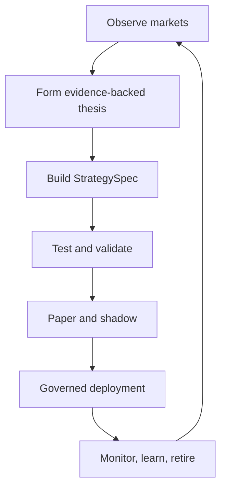
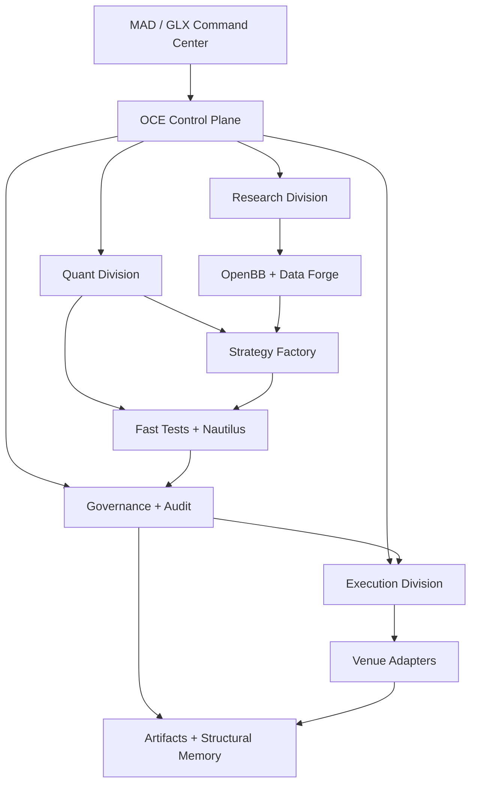
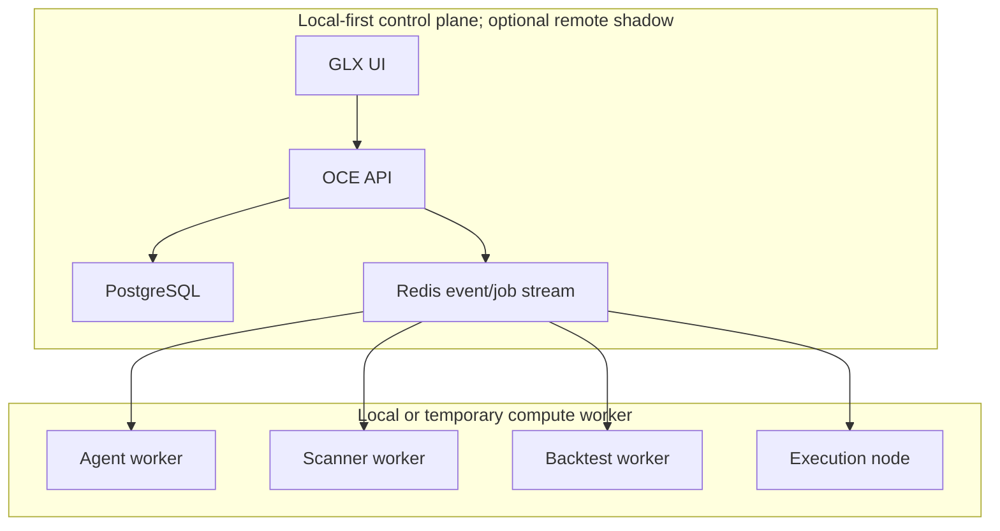
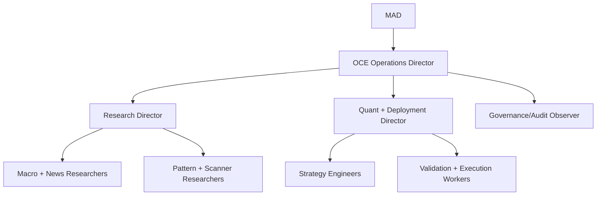
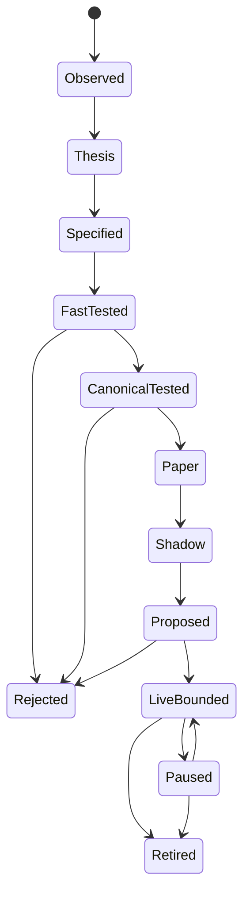
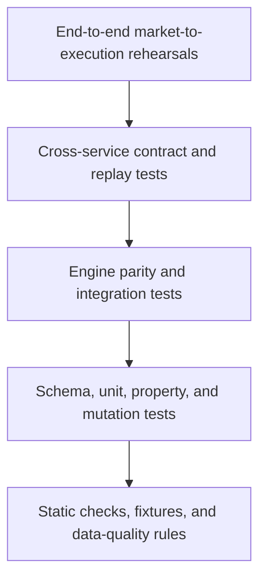

# GLX FORGE — Master Blueprint

> **Document class:** Canonical build anchor  
> **Program:** Agent-Powered Multi-Asset Research, Strategy, and Execution System  
> **Workspace:** LARGER-LAB  
> **Status:** Blueprint v1.1 — Phase 0–11 decomposition complete; implementation pending  
> **Strategic anchor:** MAD defines objectives and capital authority; OCE coordinates bounded execution  
> **Implementation companion:** [GLX FORGE Final Build Guide](GLX_FORGE_BUILD_GUIDE.md)  

---

## 1. Mission

GLX FORGE turns LARGER-LAB into a governed, reproducible, agent-powered market operating system capable of:

1. Observing macroeconomic releases, news, market structure, and recurring patterns.
2. Mapping events and patterns to relevant instruments across equities, options, crypto, and FX.
3. Generating explicit, machine-readable strategy hypotheses.
4. Building strategies from canonical specifications.
5. Backtesting them through a controlled validation ladder.
6. Promoting qualified strategies into paper, shadow, and—only after separate current authorization—bounded live operation.
7. Monitoring execution, drift, resource cost, and strategy decay.
8. Preserving enough evidence to reconstruct every decision.

The product end state is an application where agents perform the complete research-to-deployment workflow while the human operator controls strategic objectives, capital permissions, and autonomy boundaries.

---

## 2. End State

At completion, GLX FORGE will provide:

- A whole-market equity scanner.
- Macro and news intelligence linked to industries and instruments.
- A pattern-discovery and hypothesis pipeline.
- A strategy factory that emits code, tests, documentation, and deployment manifests from one specification.
- Reproducible fast tests and canonical NautilusTrader validation.
- Paper and shadow execution across supported asset classes.
- Production-ready, disabled-by-default execution through approved adapters, with bounded live use only after separate current authorization.
- Portfolio-level conflict resolution and capital allocation.
- A command-center application for research, evidence, approvals, deployments, and monitoring.
- An agent runtime that can operate slowly and cheaply through OpenRouter models without relying on low-latency model responses.



---

## 3. Canonical System Boundaries

These boundaries are architectural law unless MAD explicitly approves a change.

| Layer | Canonical responsibility | Explicit non-responsibility |
|---|---|---|
| SRRA-OPH | Continuity, topology, reconstruction, entropy governance | Market logic and broker behavior |
| OCE | Sole orchestration spine, events, observers, governance, audit | Price-source truth and strategy calculations |
| OpenBB | Normalized research and provider-access gateway | Canonical historical store or final backtest authority |
| Data Forge | Point-in-time market, macro, news, and reference catalog | Strategy judgment |
| StrategySpec | Single source of truth for strategy intent | Execution-specific broker code |
| Fast test engine | Cheap hypothesis rejection and parameter exploration | Deployment qualification |
| NautilusTrader | Canonical event-driven validation and supported live execution | Macro/news reasoning |
| FX execution script | Production FX order adapter | Research or general orchestration |
| Broker adapters | Translate `OrderIntent` into venue actions | Decide whether a strategy deserves capital |
| OCE Governance | Promotion, permissions, approvals, rollback | Invent strategy evidence |
| GLX application | Operator visibility and control | Hidden decision-making |

---

## 4. Building Anchors

Every agent must read and restate the relevant anchors before changing FORGE.

### Anchor A0 — Human Strategic Authority

MAD defines objectives, capital permissions, prohibited actions, and autonomy level. Agents may optimize within those boundaries but may not expand them.

### Anchor A1 — One Orchestration Spine

OCE is the only system-wide orchestrator. New research and trading agents register as OCE observers/workers. Do not introduce a parallel supervisor framework.

### Anchor A2 — Evidence Before Narrative

News summaries and model opinions cannot create deployable signals by themselves. Every thesis must link to sources, timestamps, mapped instruments, and a deterministic validation path.

### Anchor A3 — Point-in-Time Data

Every backtest must identify the exact dataset version, timestamps, adjustment policy, universe definition, and publication-time policy. Current constituents or revised macro values may not leak into historical tests.

### Anchor A4 — StrategySpec Is Truth

Scanner logic, backtest logic, paper logic, and live logic must be generated from or verified against the same versioned `StrategySpec`.

### Anchor A5 — Fast Tests Reject; Canonical Tests Qualify

Pandas, vectorized, and simplified simulations may eliminate weak ideas. They cannot promote a strategy to paper or live status. Qualification requires the canonical event-driven validation path.

### Anchor A6 — Nautilus Is the Canonical Trading Model

Where Nautilus supports the asset class and venue, its instrument, order, portfolio, and event models define canonical behavior. External executors connect through adapters rather than redefining the domain.

### Anchor A7 — OrderIntent Is the Execution Boundary

Agents and strategies emit validated `OrderIntent` objects. Only approved execution adapters may translate them into broker orders.

### Anchor A8 — Promotion Is State-Based

No strategy jumps directly from idea to live. It advances through explicit states with evidence, tests, permissions, and rollback metadata.

### Anchor A9 — Separate Research From Approval

The agent that proposes or implements a strategy may not be its only validator or deployment approver.

### Anchor A10 — Observable and Reconstructable

Every meaningful action emits an event and references immutable artifacts. If the system cannot reconstruct why a trade happened, the trade path is invalid.

### Anchor A11 — Repair Before Expansion

Failed tests, unexplained result differences, broken reconciliation, or data-quality uncertainty block the next phase. New features do not override structural instability.

### Anchor A12 — Cheap Models Use Tools, Not Memory

Models perform judgment, extraction, synthesis, and hypothesis formation. Deterministic code performs calculations, routing, retries, state transitions, limits, and order handling.

### Anchor A13 — Local-First Heavy Compute

Certify the local_single_operator control plane first. Railway or another inexpensive service may later host an authenticated remote shadow control plane after persistence, backup, recovery, and network gates pass. Whole-market scans, data preparation, and large backtests run on bounded workers locally or on temporary compute.

### Anchor A14 — No Unofficial Production Broker Dependency

Production execution must use documented, permissioned broker or venue APIs. Experimental unofficial APIs remain isolated from capital-bearing paths.

### Anchor A15 — Live Autonomy Is Earned

Autonomy expands only after measured paper and shadow performance, operational reliability, reconciliation accuracy, and explicit governance approval.

---

## 5. System Architecture



### Runtime topology



### Agent authority topology



No agent below the OCE Operations Director may create another permanent division. Temporary sub-agents remain bounded by `OPERATOR_RULES.md`.

---

## 6. Canonical Workflow



### Core event chain

```text
market.event.detected
→ research.thesis.created
→ universe.candidates.generated
→ strategy.spec.created
→ fast_test.completed
→ canonical_backtest.completed
→ validation.completed
→ paper_deployment.started
→ shadow_evaluation.completed
→ deployment.proposed
→ deployment.approved
→ order.intent.created
→ execution.completed
→ strategy.drift.detected
→ strategy.paused|retired|revalidated
```

---

## 7. Canonical Artifacts

| Artifact | Purpose | Minimum identity |
|---|---|---|
| `SourceRecord` | Evidence from news, filings, macro releases, or research | source, publication timestamp, retrieval timestamp, content hash |
| `MarketEvent` | Normalized catalyst or detected structural event | event type, direction, horizon, evidence links |
| `ResearchThesis` | Testable market claim | falsifiable claim, causal map, candidate universe |
| `DatasetManifest` | Reconstruct exact data used | provider, symbols, periods, adjustments, hash |
| `UniverseSnapshot` | Point-in-time tradable universe | effective timestamp, inclusion rules, members |
| `StrategySpec` | Canonical strategy behavior | inputs, states, entries, exits, risk, version |
| `CodeArtifact` | Generated or maintained implementation | spec ID, commit SHA, tests, build hash |
| `BacktestRun` | One reproducible simulation | dataset ID, code ID, config, engine, metrics |
| `ValidationReport` | Independent qualification result | tests, failures, confidence, recommendation |
| `DeploymentManifest` | Exact approved live package | strategy, capital envelope, venue, rollback |
| `OrderIntent` | Venue-neutral trading instruction | strategy ID, instrument, side, size, limits |
| `ExecutionReport` | Broker outcome and reconciliation | intent ID, venue order IDs, fills, fees |
| `DriftReport` | Live-versus-expected behavior | window, deviations, severity, action |
| `DecisionRecord` | Human or governance decision | proposal, approver, authority, timestamp |

Artifacts are append-only. Corrections create superseding versions; they do not overwrite historical evidence.

---

## 8. Phase Map

| Phase | Name | Central question | Exit artifact |
|---:|---|---|---|
| 0 | Reality Lock | What is actually working today? | Verified system inventory |
| 1 | Forge Constitution | What contracts prevent architectural drift? | Schemas, events, anchors, phase gates |
| 2 | Runtime Foundry | Where and how does the system run cheaply? | Reproducible container runtime |
| 3 | Data Forge | Can every result be rebuilt from point-in-time data? | Versioned market data catalog |
| 4 | Intelligence Forge | Can agents turn information into testable theses? | Evidence-backed thesis pipeline |
| 5 | Discovery Forge | Can the system find relevant instruments and patterns? | Ranked candidate/scanner pipeline |
| 6 | Strategy Forge | Can one specification generate consistent implementations? | Strategy factory |
| 7 | Validation Forge | Can weak, biased, and unstable strategies be rejected reliably? | Canonical qualification ladder |
| 8 | Simulation Forge | Can strategies survive paper and shadow operation? | Operationally validated deployments |
| 9 | Execution Forge | Can all asset classes execute through one governed contract? | Reconciled venue adapters |
| 10 | Portfolio Forge | Can multiple strategies share capital coherently? | Portfolio and capital governance |
| 11 | Sovereign Operations | Can the system operate continuously within earned authority? | Productized bounded-autonomy platform |

---

## 9. Phase Specifications

## Phase 0 — Reality Lock

### Idea

Create a verified map of the current workspace before adding new systems. Resolve contradictions between documentation, filenames, branches, test claims, and actual behavior.

### Deliverables

- Canonical `main`/`master` branch decision.
- Repository component inventory.
- Classification of every backtest runner:
  - genuine Nautilus event-driven;
  - standalone/pandas;
  - experimental;
  - obsolete;
  - production candidate.
- Current test baseline with exact commands and results.
- Existing FX execution-script interface map.
- OCE module and API capability map.
- Dependency and duplicate-source inventory.
- Secret-location audit without recording secret values.
- Phase 0 architecture diagram and gap register.

### Required tests

- Clean-environment installation test.
- Existing OCE and SRRA test suites.
- Import smoke tests for canonical trading modules.
- One known-data backtest reproduced twice with identical results.
- Documentation-versus-code alignment check.
- No tracked credential material.

### Exit gate

The team can identify one canonical path for data, research, backtesting, orchestration, and execution. Unknown or conflicting paths are explicitly quarantined.

### Anchor established

**F0:** No new trading integration may depend on an unclassified legacy component.

---

## Phase 1 — Forge Constitution

### Idea

Install the domain language that every future agent and service must share.

### Deliverables

- Versioned schemas for every canonical artifact.
- OCE event names and payload contracts.
- Strategy lifecycle state machine.
- Autonomy-level and permission model.
- Agent role cards with inputs, outputs, and forbidden actions.
- Architecture decision record template.
- Phase-gate definition and rollback contract.
- `FORGE_CONTEXT.md` short anchor file for agent startup.
- Documentation precedence rules.

### Required tests

- Schema validation for valid and invalid fixtures.
- Event serialization/deserialization.
- State-machine illegal-transition rejection.
- Permission tests for every autonomy level.
- Artifact lineage reconstruction test.
- Two agents independently interpret the same fixture with identical required outputs.

### Exit gate

Agents cannot create an unversioned strategy, dataset, backtest, deployment, or order intent.

### Anchor established

**F1:** If an object has no canonical schema and lineage, it does not exist operationally.

---

## Phase 2 — Runtime Foundry

### Idea

Create a low-cost, reproducible runtime with a local-first control plane, an optional separately certified remote shadow profile, and bounded compute workers.

### Deliverables

- Docker Compose specification usable through Docker or Podman.
- Container images for:
  - OCE API;
  - GLX UI;
  - scheduler;
  - agent worker;
  - scanner worker;
  - backtest worker;
  - execution node;
  - OpenBB gateway.
- PostgreSQL persistence.
- Redis event/job stream.
- Outbound-only local worker connection.
- Worker capability registry and heartbeat.
- Resource budgets, job timeouts, retries, and dead-letter handling.
- Environment-specific configuration and secret injection.
- Backup and recovery procedure.

### Required tests

- Fresh-machine boot test.
- Service health plus actual readiness test.
- Worker disconnect/reconnect test.
- Idempotent job replay.
- Duplicate-job suppression.
- Queue recovery after restart.
- Resource-limit enforcement.
- Database backup and restore.
- Secret-absence test for images, logs, and repository.

### Exit gate

A job submitted through the control plane can execute locally, survive interruption, and return a reconstructable result without exposing the local machine.

### Anchor established

**F2:** Control is always-on; heavy compute is disposable.

---

## Phase 3 — Data Forge

### Idea

Build the point-in-time data substrate required for honest scanning, research, and backtesting.

### Deliverables

- OpenBB gateway configured as a provider abstraction.
- Provider registry with entitlement and rate-limit metadata.
- Parquet market-data lake.
- DuckDB research and backtest catalog.
- PostgreSQL operational metadata.
- Equity universe and delisting history.
- Corporate-action normalization.
- Raw and adjusted price policies.
- Macro release and vintage storage.
- News/source archive with publication and retrieval timestamps.
- Data-quality checks and quarantine.
- `DatasetManifest` and `UniverseSnapshot` generation.

### Required tests

- OHLCV schema and timestamp validation.
- Duplicate, gap, outlier, and timezone detection.
- Split/dividend reconciliation.
- Point-in-time constituent test.
- Delisted-symbol inclusion test.
- Macro-vintage leakage test.
- Provider cross-check on sampled instruments.
- Dataset hash reproducibility.
- Extended-hours separation test.

### Exit gate

The same manifest produces the same dataset, and known survivorship, revision, corporate-action, and timezone leakage tests fail when intentionally contaminated.

### Anchor established

**F3:** A backtest result is invalid without a passing `DatasetManifest`.

---

## Phase 4 — Intelligence Forge

### Idea

Turn unstructured market information into structured, falsifiable, time-bounded research objects.

### Deliverables

- Macro observer.
- News and filing observer.
- Event classifier and deduplicator.
- Causal theme/sector/industry mapper.
- Company exposure mapper.
- Research thesis template.
- Source reliability and contradiction handling.
- Catalyst horizon and expiration rules.
- Research Director workflow.
- Evidence citations stored as `SourceRecord` links.

### Required tests

- Known-event classification fixtures.
- Duplicate-story collapse.
- Publication-time ordering.
- Contradictory-source handling.
- Event-to-industry mapping precision sample.
- Thesis falsifiability validation.
- Expired-catalyst removal.
- Hallucinated-symbol and unsupported-claim rejection.

### Exit gate

Every agent-generated thesis has evidence, a causal map, affected groups, a time horizon, falsification criteria, and a candidate-generation request.

### Anchor established

**F4:** Research output must be testable; persuasive prose is not a signal.

---

## Phase 5 — Discovery Forge

### Idea

Search broad markets mechanically, then concentrate expensive agent reasoning on qualified candidates.

### Deliverables

- Point-in-time equity universe builder.
- Liquidity and tradability filters.
- Macro-linked instrument discovery.
- CEREBUS structural scanner.
- Relative-strength and volume-state features.
- Pattern-discovery sandbox.
- Candidate ranking contract.
- Scan schedules for nightly, premarket, intraday, and event-driven modes.
- Scanner result dashboard.
- Pattern hypothesis handoff to Strategy Forge.

### Required tests

- Deterministic scan results from a fixed manifest.
- No look-ahead in indicators or ranking.
- Universe filter edge cases.
- Scanner scale/load test.
- Known-pattern fixture detection.
- False-positive regression set.
- Ranking stability under missing optional features.
- Event-to-candidate traceability.

### Exit gate

The system can scan the approved universe and return a ranked, explainable candidate set tied to deterministic features and research evidence.

### Anchor established

**F5:** Agents investigate the narrowed field; code scans the broad field.

---

## Phase 6 — Strategy Forge

### Idea

Generate consistent scanner, backtest, paper, and live implementations from a single versioned strategy definition.

### Deliverables

- `StrategySpec` schema and validator.
- Strategy family registry.
- CEREBUS building-block library.
- Code templates for fast testing and Nautilus.
- Unit-test and fixture generation.
- Strategy documentation generation.
- Parameter-space declaration.
- Prohibited-construct and static-analysis checks.
- Code-review workflow.
- Build artifact and commit linkage.

### Required tests

- Spec-to-code golden fixtures.
- Scanner/backtest signal parity.
- Fast/Nautilus rule-parity fixtures.
- Entry, invalidation, target, and session-boundary tests.
- DST and market-calendar tests.
- Invalid-spec rejection.
- Generated-code import and static-analysis tests.
- Mutation tests proving rules are actually covered.

### Exit gate

One `StrategySpec` produces implementations that agree on all golden-market fixtures.

### Anchor established

**F6:** No hand-copied trading rule may silently diverge across environments.

---

## Phase 7 — Validation Forge

### Idea

Create a qualification ladder that rejects leakage, overfitting, unrealistic fills, unstable parameters, and narrow historical luck.

### Deliverables

- Fast rejection runner.
- Canonical Nautilus backtest runner.
- Train/validation/holdout splitter.
- Walk-forward evaluator.
- Cost, spread, slippage, and latency models.
- Monte Carlo and resampling tests.
- Parameter-sensitivity surface.
- Regime and asset cross-validation.
- Benchmark and null-model comparison.
- Independent Quant Validator.
- Machine-readable `ValidationReport`.

### Required tests

- Intentional look-ahead strategy must fail.
- Intentional survivorship-contaminated dataset must fail.
- Fee/slippage sensitivity.
- Parameter cliff detection.
- Holdout isolation.
- Walk-forward reproducibility.
- Multiple-testing accounting.
- Engine parity on deterministic fixtures.
- Same-seed reproducibility and different-seed stability.
- Failed-strategy quarantine and retry rules.

### Exit gate

Only strategies passing declared statistical, structural, execution, and reproducibility thresholds can enter paper operation.

### Anchor established

**F7:** Profitability is a claim; robustness and reproducibility are qualification.

---

## Phase 8 — Simulation Forge

### Idea

Test the complete operational system against live market conditions without capital exposure.

### Deliverables

- Paper deployment manager.
- Shadow mode producing order intents without routing orders.
- Market-data and broker-session monitoring.
- Paper fill and canonical expected-fill comparison.
- Position and cash reconciliation.
- Strategy heartbeat.
- Incident and kill-switch workflow.
- Paper-to-shadow promotion report.
- Operational reliability score.
- Live deployment proposal generator.

### Required tests

- Disconnect and reconnect.
- Duplicate-order prevention.
- Partial-fill handling.
- Rejected/cancelled order handling.
- Restart with open positions.
- Market-close and holiday behavior.
- Stale-data rejection.
- Broker-versus-internal reconciliation.
- Kill switch and recovery.
- Paper/shadow drift thresholds.

### Exit gate

A strategy completes its required observation window with reconciled positions, stable operation, explainable variance, and no unresolved critical incident.

### Anchor established

**F8:** Backtest qualification proves the idea; simulation qualification proves the system.

---

## Phase 9 — Execution Forge

### Idea

Unify multi-asset execution through venue-neutral intent while preserving asset-specific behavior.

### Deliverables

- Canonical `OrderIntent` and `ExecutionReport`.
- Crypto Nautilus adapters.
- Existing FX script adapter.
- Equity broker adapter.
- Options paper/live adapter using documented APIs.
- Venue capability registry.
- Pre-trade permission and limit checks.
- Idempotent client-order identifiers.
- Cross-venue reconciliation.
- Asset-class-specific emergency controls.

### Required tests

- Contract tests for every adapter.
- Sandbox/paper end-to-end order lifecycle.
- Idempotency under retry.
- Partial fills and multi-leg options.
- Price, size, and permission rejection.
- Session and time-in-force handling.
- Network partition and delayed acknowledgment.
- Reconciliation after process restart.
- Adapter cannot bypass OCE approval.

### Exit gate

The same approved strategy can emit venue-neutral intent while each adapter produces correct, reconciled, and permissioned venue behavior.

### Anchor established

**F9:** Strategies request trades; adapters execute; governance authorizes.

---

## Phase 10 — Portfolio Forge

### Idea

Coordinate strategies as one capital system rather than a collection of isolated profitable backtests.

### Deliverables

- Portfolio exposure model.
- Strategy correlation and overlap analysis.
- Signal conflict resolver.
- Capital-envelope allocator.
- Asset, sector, factor, and venue concentration limits.
- Portfolio-level drawdown and loss controls.
- Strategy throttling and suspension.
- Capacity and liquidity checks.
- Portfolio simulation and stress scenarios.
- Allocation decision records.

### Required tests

- Conflicting-signal resolution.
- Correlated-strategy concentration.
- Sector and asset-class limit enforcement.
- Gap and volatility shock scenarios.
- Venue outage.
- Liquidity/capacity reduction.
- Portfolio-versus-broker reconciliation.
- Capital-envelope invariants.
- Strategy suspension without orphaned positions.

### Exit gate

No strategy can consume capital without portfolio context, and aggregate exposure remains within explicit invariants during stress fixtures.

### Anchor established

**F10:** A qualified strategy earns eligibility, not unlimited capital.

---

## Phase 11 — Sovereign Operations

### Idea

Productize the entire loop as a continuously operating, bounded-autonomy application.

### Deliverables

- GLX command center.
- Research, scanner, strategy, validation, deployment, and portfolio views.
- Human approval queue.
- Autonomy-level controls.
- Strategy lineage explorer.
- Incident center and global kill switch.
- Live drift and decay monitoring.
- Automated pause, rollback, and retirement.
- Cost and model-utility accounting.
- Multi-tenant and permissions design if the app is distributed.
- Deployment, backup, recovery, and update procedures.

### Required tests

- Full idea-to-retirement rehearsal.
- Role and permission isolation.
- Human approval and denial paths.
- Global and strategy-level kill switches.
- Disaster recovery.
- Audit reconstruction from final trade to original evidence.
- Model outage and provider outage degradation.
- Cost-budget enforcement.
- Long-running soak test.
- Security review and dependency scan.

### Exit gate

The system can operate continuously in certified fixture, rehearsal, shadow, and production-ready-disabled scope, degrade safely, reconstruct decisions, respect autonomy bounds, and expose its full state to the operator. Live authorization is separate and is not required for Phase 11 completion.

### Anchor established

**F11:** Autonomy is valid only while control, evidence, and reconstruction remain intact.

---

## 10. Test Pyramid



### Test classes required throughout FORGE

| Test class | What it protects |
|---|---|
| Schema | Shared language between agents and services |
| Unit | Deterministic domain behavior |
| Property/invariant | Capital, state, and data rules across broad inputs |
| Golden fixture | Strategy parity across scanner, fast test, Nautilus, and live |
| Contract | Provider, broker, queue, and service boundaries |
| Replay | Idempotency and reconstructability |
| Mutation | Tests actually detect changed strategy intent |
| Data quality | Leakage, gaps, revisions, adjustments, timestamps |
| Integration | Real component compatibility |
| Failure injection | Disconnects, duplicates, stale data, rejected orders |
| Shadow comparison | Expected versus observed live behavior |
| End-to-end | Complete governed workflow |

---

## 11. Phase Gate Protocol

Every phase closes with:

1. Deliverables completed and linked.
2. Required tests passing with exact commands recorded.
3. Architecture diagrams updated.
4. Decision records added for material choices.
5. Known limitations and deferred work listed.
6. Security and secret checks completed.
7. Resource/cost impact measured.
8. Independent reviewer sign-off.
9. MAD approval where authority or capital scope changes.
10. Rollback point created.

No agent may mark a phase complete using documentation claims alone.

---

## 12. Autonomy Ladder

The completed Phase 11 contract supersedes the early numeric 0–8 draft with one action-scoped, leased model:

| Level | Name | Permitted behavior |
|---:|---|---|
| L0 | Observe | Read current authorized state and produce structured observations |
| L1 | Propose | Draft typed research, scanner, strategy, incident, or operating proposals |
| L2 | Reversible operate | Perform preapproved reversible internal work such as refresh, rerun, projection rebuild, or bounded retry |
| L3 | Governed workflow | Advance exact nontrading workflow states under policy and current upstream Locks |
| L4 | Bounded production | Coordinate exact production actions only through external capital, capability, approval, and one-use execution gates |

Every level is restricted by action class, capability, tenant, environment, resource budget, upstream Lock scope, time window, and incident/drift state. It is granted through an expiring, revocable AutonomyLease—not inherited from an agent persona. There is no unrestricted level.

---

## 13. Proposed Workspace Shape

This is a target map, not authorization to move existing files before Phase 0 classification.

```text
larger-lab/
├── oce/                         # Sole control/orchestration plane
├── srrs_opc/                    # Continuity and topology substrate
├── forge/
│   ├── contracts/               # Canonical schemas and state machines
│   ├── events/                  # Trading/research event definitions
│   ├── agents/                  # Role cards and agent implementations
│   ├── data/                    # Catalog and provider orchestration
│   ├── intelligence/            # Macro, news, filings, causal mapping
│   ├── discovery/               # Universe, scanners, pattern hypotheses
│   ├── strategies/              # StrategySpec and family components
│   ├── validation/              # Fast and canonical qualification
│   ├── deployment/              # Paper, shadow, promotion, rollback
│   ├── execution/               # OrderIntent and venue adapters
│   ├── portfolio/               # Allocation and aggregate controls
│   └── observability/           # Drift, incidents, cost, audit
├── projects/trading/            # Legacy/current components pending classification
├── data/                        # Local catalog manifests; large bytes external
├── artifacts/                   # Generated metadata and reports
├── QUANT-LAB-INFRA-UPGRADE/     # Canonical blueprint, phase books, and build anchors
└── tests/forge/                 # Cross-domain contracts and end-to-end tests
```

---

## 14. Documentation Hierarchy

Future agents resolve conflicting instructions in this order:

1. `OPERATOR_RULES.md`
2. `CLAUDE.md`
3. `QUANT-LAB-INFRA-UPGRADE/GLX_FORGE_MASTER_BLUEPRINT.md`
4. `QUANT-LAB-INFRA-UPGRADE/GLX_FORGE_BUILD_GUIDE.md`
5. Current phase README in `QUANT-LAB-INFRA-UPGRADE/phases/`
6. Current phase book
7. Approved architecture decision records
8. Module-level documentation
9. Progress files and chat summaries

Progress files describe activity; they do not override canonical architecture.

---

## 15. Agent Startup Check

Before FORGE work, an agent must answer:

1. Which phase and subphase is active?
2. Which building anchors apply?
3. What canonical artifact is the input?
4. What canonical artifact must be produced?
5. What code path is authoritative?
6. Which tests define completion?
7. What is the rollback point?
8. Does the task change authority, capital, providers, or execution?
9. Which event records the result?
10. Who validates the output?

If any answer is unknown, the agent stops and resolves the ambiguity before coding.

---

## 16. Explicit Non-Goals

Until separately approved, FORGE will not:

- Allow an LLM to send arbitrary broker payloads.
- Promote a strategy from a quick simulation directly to live trading.
- Treat revised economic data as historically available.
- Use today’s stock universe as the sole historical universe.
- Depend on an unofficial broker API for production capital.
- Let a strategy approve its own deployment.
- Add Kubernetes before simpler container orchestration becomes insufficient.
- Duplicate OCE with a second permanent orchestration framework.
- Store large historical datasets directly in Git.
- Hide failed tests, missing data, conflicting evidence, or reconciliation differences.

---

## 17. Phase Decomposition Standard

Phases 0–11 have now been decomposed into four or five build books. Every book contains:

- Purpose.
- Inputs and prerequisites.
- Exact modules and files.
- Deliverables.
- Artifact schemas.
- Event contracts.
- Mermaid component and sequence diagrams.
- Test fixtures and commands.
- Failure modes.
- Exit criteria.
- Handoff to the next book.

Recommended naming:

```text
QUANT-LAB-INFRA-UPGRADE/phases/
├── phase-00-reality-lock/
│   ├── book-1-inventory.md
│   ├── book-2-baseline.md
│   ├── book-3-classification.md
│   └── book-4-lock.md
└── phase-01-forge-constitution/
    ├── book-1-domain-language.md
    ├── book-2-event-contracts.md
    ├── book-3-governance.md
    └── book-4-gate-validation.md
```

---

## 18. Definition of Program Completion

GLX FORGE is complete when:

1. A new market event can be detected and converted into an evidence-backed thesis.
2. The thesis can produce a point-in-time candidate universe.
3. A strategy can be specified without implementation ambiguity.
4. The same specification yields scanner, backtest, paper, and live-consistent behavior.
5. Validation rejects intentionally biased or unstable strategies.
6. Qualified strategies can complete paper and shadow operation.
7. Approved strategies can execute through the correct asset adapter.
8. Portfolio governance can constrain aggregate capital and conflicting exposures.
9. Every trade can be traced back to data, evidence, strategy, validation, approval, and execution.
10. The system can pause, recover, reconcile, and retire strategies without losing continuity.
11. The operator can see and control the entire workflow from the GLX application.
12. Agents can extend the system by following phase books and anchors without inventing parallel architecture.

---

## 19. Blueprint Decision Summary

| Decision | Locked direction |
|---|---|
| Orchestration | Extend OCE |
| Agent topology | Operations Director plus Research and Quant/Deployment Directors |
| Data access | OpenBB gateway with provider adapters |
| Historical truth | Versioned Parquet/DuckDB catalog |
| Strategy truth | `StrategySpec` |
| Fast research | Pandas/vectorized tests permitted as rejection filters |
| Canonical validation | Genuine NautilusTrader event-driven path |
| FX | Existing execution script behind `OrderIntent` adapter |
| Crypto | Nautilus-native venue adapters |
| Equities/options | Documented broker APIs; paper first |
| Runtime | Certified local-first control plane; optional cheap remote shadow; local/disposable heavy workers |
| Containers | Docker Compose standard, Docker or Podman runtime |
| Deployment | State-based promotion with independent validation |
| Autonomy | Per-scope, bounded, observable, earned |
| Audit | Immutable artifact lineage and OCE events |

---

**Next implementation action:** Follow [GLX FORGE Final Build Guide](GLX_FORGE_BUILD_GUIDE.md), decompose Phase 0 Book 1 into three to five bounded implementation parts, and close each part with current executable evidence before advancing.
