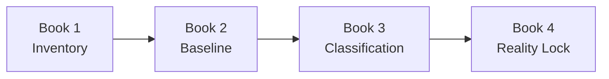

# GLX FORGE Phase 0 — Reality Lock

> **Phase:** 0 of 11  
> **Purpose:** Establish a verified, reproducible description of LARGER-LAB before FORGE integration begins  
> **Status:** In progress — Book 1 Part 1 is `implemented_unverified`; Phase Lock absent  
> **Parent:** [`GLX_FORGE_MASTER_BLUEPRINT.md`](../../GLX_FORGE_MASTER_BLUEPRINT.md)  
> **Phase anchor:** **F0 — No new trading integration may depend on an unclassified legacy component.**

---

## 1. Phase Objective

Phase 0 does not redesign, delete, migrate, or optimize the workspace. It determines what is actually present, what actually runs, what each path is allowed to mean, and which claims are supported by reproducible evidence.

The phase ends with one approved system map that future agents can load without inferring architecture from filenames, stale progress notes, or historical experiments.



---

## 2. Why This Phase Exists

Preliminary inspection has already identified facts that require formal resolution:

- GitHub defaults to `main`, while the root README identifies `master`.
- Test totals differ across the root README, `AGENTS.md`, progress files, team chat, and commit messages.
- `projects/trading/nautilus/` contains genuine Nautilus imports, standalone/pandas simulations, quick tests, generated autopilots, and multiple runners.
- `projects/trading/nautilus_trader/` contains a complete NautilusTrader source tree whose long-term role is not yet classified.
- `projects/trading/mt5-mcp/` contains reusable logic but is not the operator's production FX execution path.
- The production FX script must be located and documented without assuming it is the MT5 MCP service.
- Current documentation names files and states that no longer match the repository.

These are not treated as defects until Phase 0 verifies them. They are investigation targets.

---

## 3. Book Sequence

| Book | Name | Primary output | Gate |
|---:|---|---|---|
| 1 | [Workspace Inventory](book-1-inventory.md) | `WorkspaceInventory` | Every relevant component has identity, owner, purpose, and evidence |
| 2 | [Reproducible Baseline](book-2-baseline.md) | `BaselineReport` | Supported tests and one known backtest reproduce from recorded commands |
| 3 | [Component Classification](book-3-classification.md) | `ComponentClassificationRegistry` | Every research/trading path has exactly one operational class |
| 4 | [Reality Lock](book-4-lock.md) | `RealityLockManifest` | Canonical paths, quarantines, decisions, and Phase 1 inputs are approved |

Books execute in order. A later book may open a correction against an earlier artifact, but it may not silently replace it.

---

## 4. Required Phase Roles

| Role | Responsibility | Cannot do |
|---|---|---|
| OCE Operations Director | Own phase trajectory and unresolved-decision queue | Self-approve authority changes |
| Inventory Operator | Collect repository and runtime evidence | Classify based only on names |
| Baseline Operator | Discover and execute supported verification commands | Rewrite failing components |
| Trading Systems Reviewer | Distinguish engine, simulator, strategy, adapter, and data roles | Promote a quick simulation |
| Security Reviewer | Check tracked secrets and unsafe configuration patterns | Record or publish secret values |
| Independent Validator | Verify coverage, reproduction, and exit criteria | Author all artifacts being reviewed |
| MAD | Resolve strategic ambiguity and approve the final lock | Required only for material authority choices |

Existing agent tags may fill these roles, but the role responsibilities remain stable even if the assigned agent changes.

---

## 5. Shared Phase Artifacts

Phase 0 creates metadata and documentation only.

```text
artifacts/forge/phase-00/
├── workspace-inventory.json
├── repository-fingerprint.json
├── dependency-inventory.json
├── secret-exposure-report.json
├── test-discovery.json
├── baseline-report.json
├── baseline-logs/
├── backtest-reproduction.json
├── component-classification.json
├── contradiction-register.json
├── decision-register.json
├── quarantine-register.json
├── reality-lock-manifest.json
└── phase-00-validation-report.json
```

Generated logs and environment-specific evidence remain outside Git when they contain machine paths, credentials, account identifiers, or bulky outputs. Sanitized manifests and reports may be committed.

---

## 6. Phase-Wide Constraints

1. Do not delete, rename, move, or refactor legacy components.
2. Do not install every optional dependency merely because it is listed.
3. Do not run live execution or broker-writing commands.
4. Do not print secret values into logs or reports.
5. Do not classify a component from its filename alone.
6. Do not count skipped, deselected, or uncollected tests as passing.
7. Do not use a health endpoint as proof that a service performs its core function.
8. Do not declare Nautilus parity without proving the real engine path.
9. Do not treat historical progress notes as current runtime evidence.
10. Do not close an unknown by averaging conflicting documentation.

---

## 7. Phase Event Chain

```text
forge.phase.started
→ forge.inventory.completed
→ forge.baseline.completed
→ forge.classification.completed
→ forge.reality_lock.proposed
→ forge.reality_lock.validated
→ forge.reality_lock.approved
→ forge.phase.completed
```

Any failed gate emits:

```text
forge.phase.blocked
```

with the phase, book, test, evidence path, owner, severity, and next decision required.

---

## 8. Phase Test Matrix

| Test ID | Requirement | Book |
|---|---|---:|
| P0-COV-001 | Every relevant top-level component is inventoried | 1 |
| P0-SEC-001 | Tracked secret patterns are reported without values | 1 |
| P0-REP-001 | Repository fingerprint is reproducible | 1 |
| P0-ENV-001 | Environment and dependency state are recorded | 2 |
| P0-TST-001 | Test claims distinguish passed, failed, skipped, and uncollected | 2 |
| P0-BT-001 | One known-data backtest reproduces twice | 2 |
| P0-CLS-001 | Every trading path has exactly one primary class | 3 |
| P0-CLS-002 | Every quick/simplified simulation is blocked from qualification | 3 |
| P0-DEP-001 | Canonical candidates have resolved dependencies | 3 |
| P0-LCK-001 | Canonical map contains no unresolved critical contradiction | 4 |
| P0-LCK-002 | Quarantined paths cannot enter Phase 1 dependencies | 4 |
| P0-REC-001 | Final lock reconstructs every decision from evidence | 4 |

---

## 9. Phase Completion Definition

Phase 0 is complete only when:

- All four books have passed their exit gates.
- The actual branch strategy is recorded.
- Current test results are reproducible and separated from historical claims.
- Every trading and backtest path has exactly one classification.
- The real FX execution adapter is identified or formally recorded as missing.
- The canonical Nautilus path is identified.
- Simplified tests are explicitly prevented from serving as deployment proof.
- Tracked secret risks are resolved or block progression.
- All unresolved critical contradictions are resolved.
- The `RealityLockManifest` is independently validated.
- MAD approves any choice that changes strategic authority or production execution.

---

## 10. Handoff to Phase 1

Phase 1 — Forge Constitution receives:

- Approved component registry.
- Canonical-path map.
- Dependency and provider map.
- Phase 0 contradiction and decision registers.
- Test-command registry.
- Quarantine registry.
- Existing event, schema, and governance capabilities.
- Identified gaps requiring new canonical contracts.

Phase 1 may define new contracts. It may not reinterpret Phase 0 classifications without opening a new decision record.
