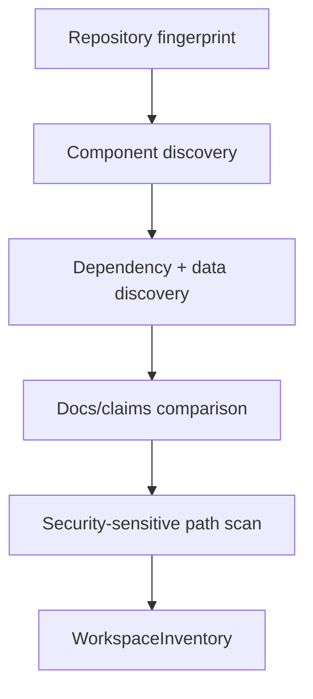

# Phase 0, Book 1 — Workspace Inventory

> **Purpose:** Produce an evidence-backed map of the repository, runtime surfaces, dependencies, data, documentation, and security-sensitive paths  
> **Input:** Current repository checkout plus workspace rules  
> **Output:** `WorkspaceInventory` and supporting manifests  
> **Next:** [Book 2 — Reproducible Baseline](book-2-baseline.md)

---

## 1. Success Statement

An independent agent can locate every Phase 0-relevant component, identify what evidence describes it, and distinguish verified facts from documentation claims without opening arbitrary files or guessing from names.

---

## 2. Applicable Anchors

- **A0:** Human Strategic Authority
- **A1:** One Orchestration Spine
- **A6:** Nautilus Is the Canonical Trading Model
- **A10:** Observable and Reconstructable
- **A11:** Repair Before Expansion
- **F0:** No new trading integration may depend on an unclassified legacy component

---

## 3. Inputs

- `AGENTS.md`
- `CLAUDE.md`
- `OPERATOR_RULES.md`
- Root README and architecture indexes
- `system-arch/`
- `oce/`
- `srrs_opc/`
- `projects/trading/`
- `agent-lab/`
- `skills/` and agent skill directories
- Root dependency and environment files
- Git branches, commit history, tracked-file metadata, and ignore rules
- Data and result metadata without bulk-copying large files

Historical notes are evidence of intent, not evidence of current runtime behavior.

---

## 4. Inventory Flow



---

## 5. Work Packages

### 5.1 Repository fingerprint

Record:

- Remote URL.
- Current HEAD SHA.
- Default branch reported by the remote.
- Local branches and tracking relationships.
- Tags and submodules.
- Dirty/untracked state.
- Tracked-file count and aggregate size.
- Large tracked files.
- Git LFS use.
- Relevant ignore patterns.
- Current date, OS, architecture, Python, Git, Docker, and Podman availability.

Never record tokens embedded in remote URLs. Sanitize the URL before storage.

### 5.2 Top-level component map

For each relevant directory, record:

- Stable component ID.
- Path.
- Declared purpose.
- Observed purpose.
- Primary language.
- Entrypoints.
- Test locations.
- Configuration files.
- External services.
- Data read/write paths.
- Known agent owner.
- Documentation references.
- Current evidence level.

Minimum required coverage:

```text
oce/
srrs_opc/
projects/trading/backtests/
projects/trading/mt5-mcp/
projects/trading/nautilus/
projects/trading/nautilus_trader/
projects/trading/strategies/
agent-lab/
skills/
tools/
system-arch/
memory/
progress/
shared-conversations/
```

### 5.3 Trading file census

Inventory every trading entrypoint and classify only its observable form:

- imports NautilusTrader;
- uses pandas/standalone simulation;
- interfaces with MT5;
- interfaces with Oanda;
- defines a strategy;
- loads/prepares data;
- generates reports;
- performs optimization;
- acts as an agent/autopilot;
- appears to execute live or paper orders.

This book records facts. Operational classification happens in Book 3.

### 5.4 Dependency inventory

Record:

- Root Python requirements and project metadata.
- OCE backend requirements.
- Frontend package metadata.
- Trading subproject requirements.
- Vendored source dependencies.
- Duplicated or conflicting package constraints.
- Optional dependencies required only for brokers, data providers, or UI.
- Native requirements such as Rust, MT5, TWS/IB Gateway, Docker, or Node.

Do not merge dependency files during Phase 0.

### 5.5 Data and artifact inventory

Record metadata for:

- CSV, Parquet, JSON, SQLite, and report files.
- Symbol, timeframe, date range, row count, timezone status, and size where safely detectable.
- Generated versus source data.
- Raw versus adjusted price status when documented.
- Whether the file is tracked by Git.
- Whether reproduction instructions exist.

Do not calculate missing market facts by assumption. Mark them `unknown`.

### 5.6 Documentation-claim inventory

Extract material claims from:

- Root README.
- `AGENTS.md`.
- Current architecture documents.
- Team chat and progress files.
- Recent commit messages.

Claims include:

- active phase;
- test totals;
- canonical branch;
- canonical backtest engine;
- active execution engine;
- production agent;
- current runtime status.

Store each claim with its source and timestamp. Do not resolve contradictions yet.

### 5.7 Security-sensitive path scan

Identify without printing values:

- tracked filenames that imply keys, tokens, credentials, or environment state;
- high-entropy or known-secret patterns in tracked text;
- credentials in Git remotes;
- secrets referenced in docs;
- account or broker identifiers in reports;
- environment files included in images or archives.

Output only:

- finding ID;
- path;
- pattern category;
- tracked/untracked status;
- severity;
- remediation owner.

The report must redact matched content.

---

## 6. Canonical Output Shape

```json
{
  "schema_version": "0.1.0",
  "repository": {
    "head_sha": "string",
    "default_branch": "string",
    "dirty": true
  },
  "components": [
    {
      "component_id": "TRADING-NAUTILUS-LAB",
      "path": "projects/trading/nautilus",
      "declared_purpose": "string",
      "observed_capabilities": ["string"],
      "entrypoints": ["string"],
      "tests": ["string"],
      "evidence": ["path#line-or-command"],
      "evidence_level": "verified|claimed|unknown"
    }
  ],
  "contradictions": ["CONTRADICTION-ID"],
  "generated_at": "RFC3339 timestamp"
}
```

Phase 1 will formalize the production schema. Phase 0 uses a documented draft with strict validation.

---

## 7. Deliverables

- `workspace-inventory.json`
- `repository-fingerprint.json`
- `dependency-inventory.json`
- `data-inventory.json`
- `documentation-claims.json`
- `secret-exposure-report.json`
- `contradiction-register.json`
- Human-readable `inventory-summary.md`
- Mermaid component map

---

## 8. Required Tests

### P0-COV-001 — Coverage

Every required path is either:

- represented by an inventory component; or
- explicitly recorded as absent.

### P0-COV-002 — Entrypoint traceability

Every discovered executable trading or OCE entrypoint belongs to one component.

### P0-REP-001 — Fingerprint reproducibility

Running the fingerprint collector twice without repository changes produces the same stable fields.

### P0-SEC-001 — Redaction

Secret-pattern test fixtures are detected, but the resulting report contains no fixture secret values.

### P0-SEC-002 — Remote sanitization

A fixture remote containing embedded credentials is stored with credentials removed.

### P0-DOC-001 — Claim provenance

Every recorded claim has a source path and evidence timestamp or commit.

### P0-DAT-001 — Metadata-only safety

Data inventory does not rewrite, normalize, or silently load excessive source data.

---

## 9. Failure Modes

| Failure | Response |
|---|---|
| Component purpose cannot be proven | Mark `unknown`; create a Book 3 review item |
| Secret material is detected | Redact, record severity, stop if actively exposed |
| Large file blocks scanning | Record metadata and use bounded sampling |
| Generated and source artifacts are mixed | Record both; do not move them |
| Docs contradict code | Create contradiction IDs; do not average |
| Repository changes during inventory | Restart fingerprint and record both SHAs |

---

## 10. Exit Gate

Book 1 completes when:

- Required coverage tests pass.
- No secret value appears in saved reports.
- Every material documentation claim has provenance.
- Every relevant component has a stable ID.
- All unknowns and contradictions are explicitly registered.
- An independent validator can reproduce the repository fingerprint.

---

## 11. Handoff

Book 2 receives:

- Stable component IDs.
- Test and entrypoint locations.
- Dependency/environment requirements.
- Data candidates suitable for deterministic reproduction.
- Contradictions involving test totals and runtime status.
- Security blockers that limit what may be executed.
