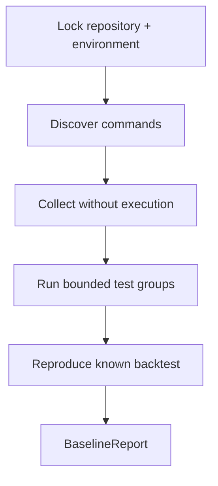

# Phase 0, Book 2 — Reproducible Baseline

> **Purpose:** Determine what installs, imports, tests, starts, and reproduces at the locked repository SHA  
> **Input:** Approved Book 1 inventory  
> **Output:** `BaselineReport` and verified command registry  
> **Previous:** [Book 1 — Workspace Inventory](book-1-inventory.md)  
> **Next:** [Book 3 — Component Classification](book-3-classification.md)

---

## 1. Success Statement

The workspace has a truthful baseline separating:

- historical claims;
- discovered tests;
- collected tests;
- passed tests;
- failed tests;
- skipped tests;
- unsupported tests;
- environment-specific tests;
- genuine service readiness;
- reproducible backtest behavior.

---

## 2. Applicable Anchors

- **A3:** Point-in-Time Data
- **A5:** Fast Tests Reject; Canonical Tests Qualify
- **A6:** Nautilus Is the Canonical Trading Model
- **A10:** Observable and Reconstructable
- **A11:** Repair Before Expansion
- **A12:** Cheap Models Use Tools, Not Memory
- **F0:** No new trading integration may depend on an unclassified legacy component

---

## 3. Baseline Principle

Phase 0 records failures; it does not automatically repair them.

A failing test may reveal:

- a genuine regression;
- an unavailable platform dependency;
- stale documentation;
- an obsolete component;
- a missing secret;
- an integration requiring Windows or a broker terminal;
- a test that was never part of the supported baseline.

Book 3 uses this evidence to classify the component.

---

## 4. Baseline Flow



---

## 5. Work Packages

### 5.1 Environment fingerprint

Record:

- repository SHA and dirty state;
- OS and architecture;
- Python executable and version;
- `uv`, pip, Node, npm, Rust, Docker, and Podman versions when installed;
- GPU availability only if relevant;
- timezone and locale;
- available disk and memory;
- environment-variable names required by components, never values;
- platform-only dependencies such as MT5, IB Gateway, or Windows paths.

### 5.2 Test-command discovery

Discover commands from:

- `pyproject.toml`;
- `pytest.ini`;
- package scripts;
- CI workflow files;
- README files;
- existing batch/PowerShell runners;
- Makefiles;
- recent verified progress notes.

Each command receives:

- command ID;
- owning component;
- source;
- environment requirements;
- destructive/live risk;
- expected duration;
- safe-to-run status.

Commands that can place orders, mutate external systems, or use live accounts are never run in Phase 0.

### 5.3 Collection before execution

Where supported:

1. collect test IDs without running;
2. store collection errors separately;
3. group tests by component and dependency;
4. mark skipped and deselected tests explicitly;
5. identify tests that require network, credentials, Windows, broker terminals, or containers.

### 5.4 Bounded test execution

Run groups independently:

1. SRRA-OPH.
2. OCE backend.
3. Root/core utilities.
4. Trading lab unit tests.
5. Genuine Nautilus tests owned by LARGER-LAB.
6. Vendored NautilusTrader upstream tests only if separately justified.
7. Frontend checks.
8. Import smoke tests.

Do not report a combined total without the per-group breakdown.

### 5.5 Service readiness

For every service claimed active:

- process starts;
- port listens;
- readiness endpoint succeeds;
- required model/provider initializes;
- one representative operation succeeds;
- logs contain no hidden fatal error;
- service stops cleanly.

A health response alone is insufficient.

### 5.6 Known-data backtest reproduction

Select one bounded fixture that:

- is already present or generated deterministically;
- requires no live broker access;
- has stable timestamps;
- uses a documented strategy;
- finishes within the Phase 0 resource budget.

Run it twice in isolated output directories.

Compare:

- trade count;
- entry and exit timestamps;
- fills;
- gross and net PnL;
- drawdown;
- result schema;
- output hashes after removing declared nondeterministic metadata.

If no genuine Nautilus fixture can meet these conditions, record the failure as a critical Phase 0 gap. A standalone simulation may still be reproduced, but it cannot satisfy the canonical-engine requirement.

### 5.7 Claim reconciliation

Create a table:

| Claim source | Claimed result | Repository SHA | Reproduced result | Status |
|---|---:|---|---:|---|
| Root README | value | unknown/known | value | current/stale/unverifiable |
| `AGENTS.md` | value | unknown/known | value | current/stale/unverifiable |
| Team/progress log | value | unknown/known | value | current/stale/unverifiable |
| Commit message | value | known | value | current/stale/unverifiable |

Do not rewrite source documents in Book 2.

---

## 6. Baseline Result Model

```json
{
  "schema_version": "0.1.0",
  "repository_sha": "string",
  "environment_id": "ENV-ID",
  "test_groups": [
    {
      "group_id": "OCE-BACKEND",
      "collected": 0,
      "passed": 0,
      "failed": 0,
      "skipped": 0,
      "uncollected": 0,
      "duration_seconds": 0,
      "command_id": "CMD-ID",
      "log_path": "string"
    }
  ],
  "backtest_reproduction": {
    "engine_class": "nautilus|standalone|unknown",
    "run_1_id": "string",
    "run_2_id": "string",
    "stable_fields_equal": true
  },
  "blockers": ["BLOCKER-ID"]
}
```

---

## 7. Deliverables

- `environment-fingerprint.json`
- `test-discovery.json`
- `verified-command-registry.json`
- Sanitized per-group logs
- `service-readiness-report.json`
- `backtest-reproduction.json`
- `test-claim-reconciliation.md`
- `baseline-report.json`
- `baseline-summary.md`

---

## 8. Required Tests

### P0-ENV-001 — Environment completeness

All tools required by a declared supported command are recorded as present, absent, or not applicable.

### P0-TST-001 — Honest counts

For each group:

```text
collected = passed + failed + skipped + xfailed + xpassed
```

Collection failures and deselected tests are reported separately.

### P0-TST-002 — Command provenance

Every executed command links to the file or approved decision that defined it.

### P0-TST-003 — Isolation

A failing test group does not prevent results from other safe groups from being recorded.

### P0-SVC-001 — Functional readiness

Each service classified as ready completes one representative operation and produces clean shutdown evidence.

### P0-BT-001 — Backtest reproducibility

Two runs produce identical declared stable fields.

### P0-BT-002 — Engine identity

The report proves whether the backtest used genuine NautilusTrader or a simplified simulator.

### P0-BT-003 — No live side effects

No baseline command creates a live broker order or changes an external account.

---

## 9. Failure Modes

| Failure | Response |
|---|---|
| Root install fails | Record exact failing dependency; test isolated components where safe |
| Test collection crashes | Store collection error; do not count uncollected tests |
| Missing provider key | Mark environment-gated; do not insert a real key into reports |
| Windows-only component on Linux | Record platform requirement; do not misclassify as broken |
| Backtest differs between runs | Block canonical promotion and capture the smallest differing artifact |
| Service health passes but operation fails | Mark not ready and prioritize logs |
| Vendored upstream suite is extremely large | Separate upstream health from LARGER-LAB-owned tests |

---

## 10. Exit Gate

Book 2 completes when:

- Test discovery is traceable.
- Every executed command is safe and recorded.
- Results distinguish all statuses honestly.
- Current results are separated from historical claims.
- One bounded backtest has a two-run reproduction report.
- The report proves which engine executed the test.
- Every failed or unavailable group has an owner and classification input.

---

## 11. Handoff

Book 3 receives:

- Verified entrypoints.
- Passing/failing/import status.
- Runtime/platform requirements.
- Genuine-engine evidence.
- Reproduction evidence.
- Stale and unverifiable claims.
- Components unable to meet baseline expectations.
