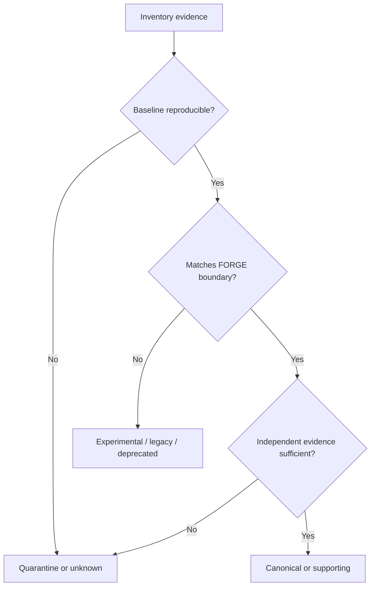

# Phase 0, Book 3 — Component Classification

> **Purpose:** Assign every relevant component one operational class, authority boundary, lifecycle status, and permitted downstream use  
> **Input:** Book 1 inventory plus Book 2 baseline  
> **Output:** `ComponentClassificationRegistry`  
> **Previous:** [Book 2 — Reproducible Baseline](book-2-baseline.md)  
> **Next:** [Book 4 — Reality Lock](book-4-lock.md)

---

## 1. Success Statement

No future agent must infer whether a file is:

- canonical;
- supporting;
- experimental;
- legacy reusable;
- vendored;
- quarantined;
- obsolete;
- or unknown.

Each component has one primary operational class and explicit permission boundaries.

---

## 2. Applicable Anchors

- **A1:** One Orchestration Spine
- **A4:** StrategySpec Is Truth
- **A5:** Fast Tests Reject; Canonical Tests Qualify
- **A6:** Nautilus Is the Canonical Trading Model
- **A7:** OrderIntent Is the Execution Boundary
- **A9:** Separate Research From Approval
- **A11:** Repair Before Expansion
- **A14:** No Unofficial Production Broker Dependency
- **F0:** No new trading integration may depend on an unclassified legacy component

---

## 3. Classification Model

### Primary operational class

| Class | Meaning | Phase 1 dependency allowed? |
|---|---|---:|
| `canonical` | Approved current source of operational truth | Yes |
| `supporting` | Required utility beneath a canonical path | Yes, through owner |
| `experimental` | Research/prototype without production authority | No direct dependency |
| `legacy_reusable` | Not canonical, but logic may be extracted after review | No direct dependency |
| `vendored` | Third-party source copy governed as an external dependency | Only by explicit dependency decision |
| `quarantined` | Unsafe, contradictory, non-reproducible, or unknown | No |
| `deprecated` | Superseded and retained for history/migration | No |
| `unknown` | Evidence is insufficient | No |

### Capability type

A component may declare multiple capabilities:

```text
orchestration
agent_runtime
data_ingestion
data_prep
strategy_definition
fast_simulation
canonical_backtest
optimization
paper_execution
live_execution
broker_adapter
reporting
frontend
memory
governance
observability
```

Primary class answers authority. Capabilities answer function.

---

## 4. Decision Flow



Passing tests alone does not make a component canonical. It must also match the approved FORGE boundary.

---

## 5. Work Packages

### 5.1 OCE and SRRA classification

Verify and classify:

- SRRA-OPH as continuity/topology substrate.
- OCE as sole orchestration/control plane.
- Event fabric.
- Observer runtime.
- Governance engine.
- Execution engine.
- Structural memory.
- Metrics, tracing, drift, self-healing, and economics systems.

Record which pieces are canonical now and which remain partially implemented, documented only, or environment-gated.

### 5.2 Trading research path classification

For every entrypoint under `projects/trading/nautilus/`, determine:

- whether it imports real NautilusTrader engine objects;
- whether it executes a pandas or standalone approximation;
- whether the name overstates its engine;
- whether it uses real or generated data;
- whether it has tests;
- whether the result is reproducible;
- whether it is a runner, strategy, loader, optimizer, report generator, or autopilot.

Required rule:

> A file containing “nautilus” in its path or name is not canonical Nautilus evidence.

### 5.3 Vendored NautilusTrader decision

Determine why `projects/trading/nautilus_trader/` exists:

- intentional fork;
- editable local dependency;
- reference copy;
- accidental vendor;
- upstream experimentation.

Record:

- upstream origin and commit/tag if recoverable;
- local modifications;
- dependency relationship;
- update strategy;
- license obligations;
- whether FORGE should use a packaged dependency, submodule, maintained fork, or current vendor.

Phase 0 makes the decision record; it does not migrate the tree.

### 5.4 MT5 and FX boundary

Classify `projects/trading/mt5-mcp/` as:

- reusable strategy/backtest logic;
- experimental tool surface;
- legacy interface;
- non-production execution path.

Separately locate and document the operator's actual FX script:

- path/repository;
- inputs;
- outputs;
- supported orders;
- safety controls;
- account/environment selection;
- status and reconciliation behavior;
- credential requirements;
- current testability.

If it is outside the repository or unavailable, create a critical external-dependency record. Do not substitute MT5 MCP.

### 5.5 Data and result classification

Classify:

- raw source data;
- normalized source data;
- generated fixtures;
- derived features;
- backtest results;
- manually curated research;
- obsolete outputs;
- unverified artifacts.

Results never serve as source data.

### 5.6 Agent/autopilot classification

For each agent or autopilot that can create code, run tests, or request execution, record:

- current authority;
- actual tool access;
- output artifacts;
- timeout/retry behavior;
- logging;
- model/provider requirements;
- whether it can change production state.

Historical “active” status is insufficient. Runtime evidence is required.

### 5.7 Dependency and ownership graph

Create a directed graph showing:

- canonical components;
- supporting dependencies;
- experimental/legacy inputs;
- forbidden dependencies;
- external systems;
- current owner and validator.

No canonical component may depend on a quarantined component.

---

## 6. Classification Record

```json
{
  "component_id": "TRADING-RUN-BACKTEST",
  "path": "projects/trading/nautilus/run_backtest.py",
  "primary_class": "canonical|supporting|experimental|legacy_reusable|vendored|quarantined|deprecated|unknown",
  "capabilities": ["canonical_backtest"],
  "authority": {
    "research": true,
    "qualification": false,
    "paper": false,
    "live": false
  },
  "evidence": [
    "INVENTORY-EVIDENCE-ID",
    "BASELINE-RUN-ID"
  ],
  "owner": "ROLE-ID",
  "validator": "ROLE-ID",
  "decision_id": "ADR-ID",
  "review_trigger": "condition"
}
```

---

## 7. Deliverables

- `component-classification.json`
- `trading-entrypoint-matrix.md`
- `nautilus-dependency-decision.md`
- `fx-execution-boundary.md`
- `agent-authority-matrix.md`
- `data-artifact-classification.md`
- `dependency-ownership-graph.md`
- `quarantine-register.json`
- Updated contradiction register
- Decision records for every material classification

---

## 8. Required Tests

### P0-CLS-001 — Single primary class

Every relevant component has exactly one primary operational class.

### P0-CLS-002 — Quick-test boundary

Every `fast_simulation` component has:

```json
{
  "qualification": false,
  "paper": false,
  "live": false
}
```

unless it also has a separately proven canonical engine capability.

### P0-CLS-003 — No name-based classification

Every classification cites code/runtime evidence beyond the path or filename.

### P0-CLS-004 — Canonical evidence

Every canonical component has:

- a reproducible baseline;
- an owner;
- an independent validator;
- a documented interface;
- no unresolved critical security issue.

### P0-DEP-001 — Dependency integrity

Canonical components do not depend on quarantined or unknown components.

### P0-FX-001 — FX path truth

The registry distinguishes the actual FX execution script from MT5 MCP. If the actual script is unavailable, the phase records a blocking external dependency.

### P0-NAU-001 — Engine proof

Every component claiming `canonical_backtest` proves genuine Nautilus engine execution.

### P0-AUT-001 — Authority ceiling

No experimental agent/autopilot has paper or live authority.

---

## 9. Preliminary Review Targets

These are investigation targets, not pre-decided classifications:

| Target | Question |
|---|---|
| `projects/trading/nautilus/run_backtest.py` | Is this the current genuine Nautilus baseline? |
| `projects/trading/nautilus/run_standalone_backtest.py` | Which research use remains valid? |
| `projects/trading/nautilus/run_all_backtests.py` | Does its simplified pandas path need an explicit fast-test label? |
| `projects/trading/nautilus/autonomous_strategy_builder.py` | Does implementation match its stated Nautilus behavior? |
| `projects/trading/nautilus/hermes_autopilot*.py` | Which generation, if any, is still supported? |
| `projects/trading/nautilus_trader/` | Fork, vendor, reference, or dependency? |
| `projects/trading/mt5-mcp/` | Which logic is reusable without adopting its execution surface? |
| External FX script | Where is the production boundary and how is it tested? |

---

## 10. Failure Modes

| Failure | Response |
|---|---|
| Two components both claim canonical authority | Open explicit ADR; choose neither until resolved |
| Component passes tests but violates FORGE boundary | Classify supporting/experimental, not canonical |
| Component depends on an unknown path | Quarantine dependency chain |
| FX script cannot be inspected | Record external blocker; do not substitute |
| Vendored source origin is unclear | Classify unknown or quarantined pending provenance |
| Agent authority cannot be proven | Set authority to observe-only |
| Result names imply stronger validation than code provides | Preserve file; classify by behavior |

---

## 11. Exit Gate

Book 3 completes when:

- All relevant components have one primary class.
- Canonical dependencies contain no unknown/quarantined paths.
- Genuine Nautilus paths are proven.
- Fast simulations are blocked from deployment qualification.
- MT5 MCP and actual FX execution are clearly separated.
- Agent authority is explicit and defaults safely when unknown.
- Every material decision has evidence and a review trigger.

---

## 12. Handoff

Book 4 receives:

- Approved classification registry.
- Candidate canonical paths.
- Quarantine and deprecation candidates.
- Dependency/ownership graph.
- Required architecture decisions.
- Remaining critical contradictions.
- Phase 1-safe inputs.
