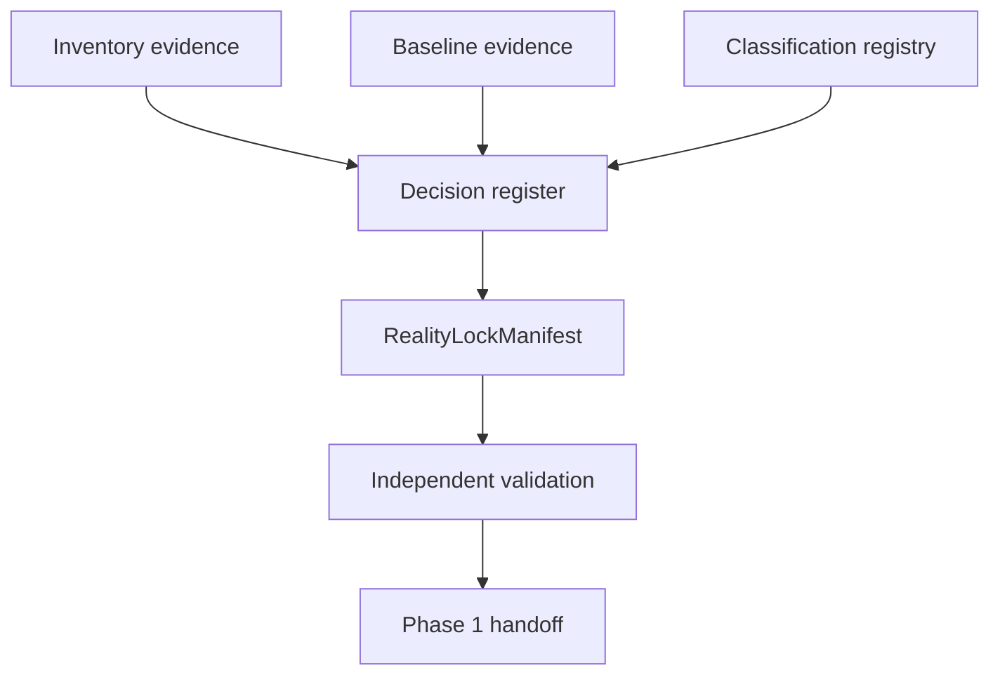

# Phase 0, Book 4 — Reality Lock

> **Purpose:** Convert verified inventory, baseline, and classification evidence into the canonical Phase 0 system map  
> **Input:** Approved outputs from Books 1–3  
> **Output:** `RealityLockManifest` and Phase 1 handoff  
> **Previous:** [Book 3 — Component Classification](book-3-classification.md)  
> **Next:** Phase 1 — Forge Constitution

---

## 1. Success Statement

Future agents can identify the current system of record, valid dependencies, prohibited paths, verified commands, unresolved noncritical gaps, and exact Phase 1 starting point by loading one short context anchor and following its evidence links.

---

## 2. Applicable Anchors

All master blueprint anchors apply. The closing emphasis is:

- **A0:** Human Strategic Authority
- **A1:** One Orchestration Spine
- **A5:** Fast Tests Reject; Canonical Tests Qualify
- **A6:** Nautilus Is the Canonical Trading Model
- **A10:** Observable and Reconstructable
- **A11:** Repair Before Expansion
- **A15:** Live Autonomy Is Earned
- **F0:** No new trading integration may depend on an unclassified legacy component

---

## 3. Lock Flow



---

## 4. Work Packages

### 4.1 Resolve critical contradictions

Every critical contradiction must end in one of:

- verified current fact;
- approved architectural decision;
- external blocker that prevents phase completion.

Expected decisions include:

- canonical branch;
- canonical OCE status and test command;
- canonical SRRA status and test command;
- canonical genuine Nautilus path;
- role of standalone/pandas simulations;
- role of vendored NautilusTrader source;
- status of MT5 MCP;
- location/status of actual FX execution script;
- current agent authority;
- current secret-management boundary.

Noncritical unknowns may remain only with owner, deadline/review trigger, and explicit prohibition from Phase 1 dependencies.

### 4.2 Create architecture decision records

Each material decision records:

- context;
- considered options;
- selected option;
- evidence;
- consequences;
- prohibited interpretations;
- rollback/review trigger;
- approver.

No ADR may claim that a migration has occurred when Phase 0 only selected a direction.

### 4.3 Create the canonical path map

The path map identifies:

| Function | Canonical path | Supporting paths | Forbidden/quarantined paths |
|---|---|---|---|
| Orchestration | resolved in Phase 0 | list | list |
| Continuity | resolved in Phase 0 | list | list |
| Fast strategy rejection | resolved in Phase 0 | list | list |
| Canonical backtest | resolved in Phase 0 | list | list |
| FX execution | resolved or external blocker | list | list |
| Crypto execution | current capability or gap | list | list |
| Equity/options execution | current capability or Phase 9 gap | list | list |
| Frontend | current path | list | list |
| Memory/audit | current path | list | list |

### 4.4 Establish logical quarantine

Phase 0 quarantine is a registry and policy, not necessarily a file move.

For each quarantined component:

- reason;
- prohibited uses;
- dependency impact;
- allowed inspection/recovery work;
- owner;
- release conditions;
- deletion/migration decision deferred to a later approved phase.

### 4.5 Create `FORGE_CONTEXT.md`

The short context anchor must remain compact enough for every agent to load.

It contains:

- current FORGE phase and book;
- master anchors;
- canonical component map;
- test commands;
- quarantined paths;
- active blockers;
- required output artifact;
- validation owner;
- links to evidence.

It contains no long progress history.

### 4.6 Lock the verified command registry

Approved commands are labeled:

- `safe_read`;
- `safe_test`;
- `safe_local_write`;
- `external_read`;
- `paper_write`;
- `live_write`;
- `prohibited_phase_0`.

Only `safe_read` and `safe_test` commands become default Phase 1 discovery tools.

### 4.7 Build the Phase 1 handoff

Phase 1 receives:

- stable component IDs;
- canonical event/governance capabilities already present;
- missing schemas and contract gaps;
- verified test harnesses;
- safe command registry;
- decisions that Phase 1 must preserve;
- quarantined paths it may not import.

---

## 5. Reality Lock Manifest

```json
{
  "schema_version": "0.1.0",
  "lock_id": "FORGE-P0-LOCK-YYYYMMDD-NNN",
  "repository_sha": "string",
  "canonical_branch": "string",
  "inventory_id": "string",
  "baseline_id": "string",
  "classification_registry_id": "string",
  "canonical_paths": {
    "orchestration": "COMPONENT-ID",
    "canonical_backtest": "COMPONENT-ID",
    "fast_test": ["COMPONENT-ID"],
    "fx_execution": "COMPONENT-ID|EXTERNAL-BLOCKER-ID"
  },
  "quarantined_components": ["COMPONENT-ID"],
  "verified_commands": ["COMMAND-ID"],
  "open_noncritical_items": ["ITEM-ID"],
  "critical_blockers": [],
  "decision_records": ["ADR-ID"],
  "validator": "ROLE-ID",
  "approved_by": "ROLE-ID",
  "created_at": "RFC3339 timestamp"
}
```

---

## 6. Deliverables

- `reality-lock-manifest.json`
- `canonical-path-map.md`
- `decision-register.json`
- Architecture decision records
- `quarantine-register.json`
- `verified-command-registry.json`
- `FORGE_CONTEXT.md`
- `phase-01-handoff.md`
- `phase-00-validation-report.json`
- Updated Phase 0 architecture diagram

---

## 7. Required Tests

### P0-LCK-001 — No unresolved critical contradiction

The contradiction register contains no critical item without:

- a resolution; or
- a blocker that prevents phase completion.

### P0-LCK-002 — Quarantine enforcement

Static dependency checks prove Phase 1 candidate modules do not import quarantined paths.

### P0-LCK-003 — Canonical uniqueness

Each canonical function has exactly one canonical component or an explicit blocker.

### P0-LCK-004 — Command safety

Every verified command has an execution class and side-effect declaration.

### P0-REC-001 — Decision reconstruction

Starting from the `RealityLockManifest`, the validator can trace:

```text
canonical decision
→ ADR
→ classification
→ baseline evidence
→ inventory evidence
→ repository SHA
```

### P0-CTX-001 — Context consistency

Every canonical path, blocker, command, and quarantine listed in `FORGE_CONTEXT.md` matches the manifest.

### P0-HND-001 — Phase 1 readiness

The Phase 1 handoff contains all prerequisites named by the master blueprint and no quarantined dependency.

### P0-SEC-003 — Secret boundary

No final committed artifact contains secret values, broker credentials, or unredacted account identifiers.

---

## 8. Independent Validation Procedure

The validator:

1. Uses the locked repository SHA.
2. Reads the manifest before supporting documents.
3. Samples at least one decision from each canonical function.
4. Re-runs the repository fingerprint.
5. Re-runs safe critical test commands.
6. Reproduces the selected backtest stable fields.
7. Verifies quarantine dependency rules.
8. Confirms no critical contradiction remains.
9. Confirms the Phase 1 handoff matches the lock.
10. Issues approve, reject, or approve-with-noncritical-findings.

The validator does not fix failures while validating.

---

## 9. Failure Modes

| Failure | Response |
|---|---|
| Canonical branch remains ambiguous | MAD/owner decision required |
| Genuine Nautilus path is not reproducible | Block canonical trading integration |
| Production FX script remains unknown | Record critical external blocker |
| Secret exposure remains active | Block phase completion |
| Two paths retain equal canonical claim | Open ADR; neither becomes canonical |
| Context file disagrees with manifest | Manifest controls; fix context and revalidate |
| Test baseline changes during lock | Update SHA, rerun affected evidence, issue new lock |

---

## 10. Exit Gate

Book 4 and Phase 0 complete when:

- The manifest passes all lock tests.
- Canonical functions are unique or explicitly blocked.
- Quarantine rules are enforceable.
- Decisions reconstruct to repository evidence.
- Current tests and backtest reproduction are recorded.
- Secret boundaries pass.
- Independent validation approves.
- MAD approves decisions involving strategic authority, production execution, or capital-bearing paths.

---

## 11. Phase 1 Handoff Contract

Phase 1 may:

- define canonical schemas;
- register FORGE events in OCE;
- formalize role cards;
- implement lifecycle state machines;
- encode permission boundaries;
- build artifact-lineage tests.

Phase 1 may not:

- refactor quarantined components;
- migrate vendored NautilusTrader without a separate approved task;
- adopt MT5 MCP as the production FX path;
- treat a quick simulation as canonical;
- change the Phase 0 component map without a superseding ADR;
- expand live authority.

---

## 12. Phase Completion Event

On approval, OCE emits:

```json
{
  "event_type": "forge.phase.completed",
  "phase": 0,
  "lock_id": "FORGE-P0-LOCK-ID",
  "repository_sha": "SHA",
  "validation_report_id": "REPORT-ID",
  "next_phase": 1
}
```

This event marks permission to begin Phase 1 planning and implementation. It does not authorize live trading or external deployment.
