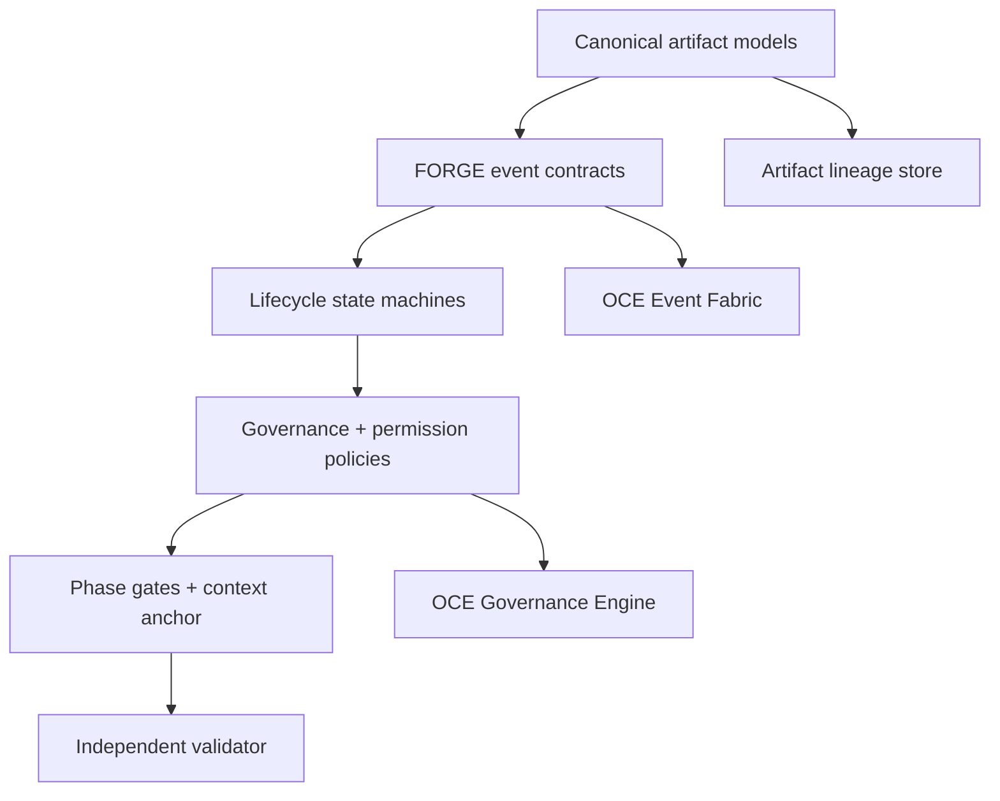

# GLX FORGE Phase 1 — Forge Constitution

> **Phase:** 1 of 11  
> **Purpose:** Install the versioned domain language, event contracts, authority model, and phase gates every FORGE component must obey  
> **Status:** Planned — execution requires an approved Phase 0 Reality Lock  
> **Parent:** [`GLX_FORGE_MASTER_BLUEPRINT.md`](../../GLX_FORGE_MASTER_BLUEPRINT.md)  
> **Prerequisite:** [`Phase 0 — Reality Lock`](../phase-00-reality-lock/README.md)  
> **Phase anchor:** **F1 — If an object has no canonical schema and lineage, it does not exist operationally.**

---

## 1. Phase Objective

Phase 1 creates the constitutional layer that prevents agents, services, backtests, and execution adapters from inventing incompatible meanings as LARGER-LAB expands.

It defines:

- what canonical FORGE objects are;
- how they are identified and versioned;
- how they reference parents and evidence;
- which lifecycle transitions are legal;
- which OCE events describe those transitions;
- which roles may create, validate, approve, deploy, pause, or retire them;
- what every phase must prove before advancing.

Phase 1 defines contracts and validation behavior. It does not build market data ingestion, run cloud infrastructure, deploy strategies, or grant live trading authority.


---

## 2. Existing Foundations to Extend

Phase 1 must reuse, verify, and extend these Phase 0-approved foundations:

| Existing foundation | FORGE extension |
|---|---|
| `oce/backend/event_fabric.py` | Versioned FORGE event payloads, correlation, causation, artifact references |
| `oce/backend/governance_engine.py` | FORGE proposal types, scoped permissions, separation of duties, unique approvals |
| `oce/backend/observer_runtime.py` | Registered FORGE agent roles and capability declarations |
| `oce/backend/execution_engine.py` | Permission hooks and task classification; no live expansion |
| `oce/backend/structural_memory.py` | Artifact and decision lineage references |
| `oce/backend/srrs_adapter.py` | Continuity and attractor context without importing trading truth into SRRA |
| `OPERATOR_RULES.md` | Immutable human authority and bounded autonomy constraints |

The precise paths are confirmed by the Phase 0 `RealityLockManifest`. If Phase 0 classifies any path differently, the lock controls.

---

## 3. Book Sequence

| Book | Name | Primary output | Gate |
|---:|---|---|---|
| 1 | [Canonical Domain Language](book-1-domain-language.md) | Artifact schemas and lineage rules | Canonical objects validate, hash, version, and reconstruct |
| 2 | [Event Contracts and Lifecycles](book-2-event-contracts.md) | OCE FORGE event registry and state machines | Events are typed, traceable, replayable, and reject illegal transitions |
| 3 | [Governance and Authority](book-3-governance-authority.md) | Role cards, permissions, autonomy, proposal policy | Deny-by-default authority and separation of duties are enforced |
| 4 | [Constitutional Gates](book-4-gate-validation.md) | ADR, phase gate, rollback, context anchor, validator | Two agents interpret the same work package identically |

Books execute in order. No later book may weaken an earlier contract without an approved, versioned architecture decision.

---

## 4. Phase Roles

| Role | Phase 1 responsibility | Prohibited action |
|---|---|---|
| OCE Operations Director | Own constitutional coherence and phase trajectory | Grant itself new authority |
| Domain Contract Engineer | Build artifact models and schema registry | Define trading logic |
| Event Contract Engineer | Extend OCE events and lifecycle adapters | Create a second event bus |
| Governance Engineer | Encode roles, permissions, approvals, and autonomy | Remove MAD override or sovereignty bounds |
| Structural Memory Reviewer | Verify lineage and reconstruction | Treat memory narrative as artifact truth |
| Independent Validator | Test contract interpretation and gate behavior | Author all contracts it validates |
| MAD | Approve authority boundaries and constitutional decisions | Not required for purely mechanical schema corrections |

---

## 5. Phase Architecture



---

## 6. Shared Phase Deliverables

Target paths are provisional until Phase 0 approves the canonical workspace map.

```text
forge/
├── contracts/
│   ├── base.py
│   ├── identifiers.py
│   ├── registry.py
│   ├── artifacts/
│   ├── states/
│   └── schemas/
├── events/
│   ├── registry.py
│   ├── payloads.py
│   ├── lifecycle.py
│   └── oce_adapter.py
├── governance/
│   ├── roles.py
│   ├── permissions.py
│   ├── autonomy.py
│   ├── proposals.py
│   └── oce_adapter.py
├── gates/
│   ├── phase_gate.py
│   ├── rollback.py
│   ├── adr.py
│   └── context_validator.py
└── tests/
    ├── fixtures/
    ├── contracts/
    ├── events/
    ├── governance/
    └── gates/

QUANT-LAB-INFRA-UPGRADE/
├── FORGE_CONTEXT.md
├── contracts/
├── decisions/
└── phases/
```

---

## 7. Constitutional Invariants

1. Every operational artifact has a globally unique ID.
2. Every artifact declares its schema name and semantic version.
3. Every mutable concept changes through a new version, not hidden overwrite.
4. Every derived artifact references its parents.
5. Every event has correlation, causation, actor, environment, and artifact references where applicable.
6. Every lifecycle transition is validated before its event is emitted.
7. Every authority decision is scoped by actor, action, resource, environment, and autonomy level.
8. Missing permission means deny.
9. Strategy author, independent validator, and live approver are distinct duties.
10. Phase 1 cannot grant paper or live execution authority.
11. OCE remains the sole orchestration, event, and governance spine.
12. Unknown schemas, events, roles, transitions, and permissions fail closed.
13. Human strategic authority and MAD override remain immutable.
14. Artifact hashes exclude declared nondeterministic transport metadata only.
15. Documentation cannot override executable contracts.

---

## 8. Phase Event Chain

```text
forge.phase.started
→ forge.contract.registry.created
→ forge.event.registry.created
→ forge.lifecycle.registry.created
→ forge.governance.policy.created
→ forge.context.anchor.created
→ forge.constitution.validated
→ forge.phase.completed
```

Failure emits:

```text
forge.constitution.violation
```

with the rule ID, actor, artifact/event/proposal reference, evidence, severity, and blocked transition.

---

## 9. Phase Test Matrix

| Test ID | Requirement | Book |
|---|---|---:|
| P1-ID-001 | IDs are unique, typed, and parseable | 1 |
| P1-SCH-001 | Every canonical artifact has a registered versioned schema | 1 |
| P1-SCH-002 | Unknown fields/versions follow explicit compatibility policy | 1 |
| P1-LIN-001 | Parent/evidence lineage reconstructs end to end | 1 |
| P1-HSH-001 | Canonical hash is deterministic | 1 |
| P1-EVT-001 | Every FORGE event has a registered payload contract | 2 |
| P1-EVT-002 | Events serialize and deserialize without semantic loss | 2 |
| P1-EVT-003 | Correlation and causation chains replay correctly | 2 |
| P1-STM-001 | Illegal lifecycle transitions fail closed | 2 |
| P1-OCE-001 | FORGE events use the existing OCE Event Fabric | 2 |
| P1-RBAC-001 | Missing permission denies access | 3 |
| P1-RBAC-002 | Permissions remain scoped to environment and resource | 3 |
| P1-SEP-001 | Proposer cannot serve as sole validator/approver | 3 |
| P1-AUT-001 | Phase 1 grants no paper/live authority | 3 |
| P1-MAD-001 | MAD override and immutable bounds remain intact | 3 |
| P1-GAT-001 | Gate rejects missing deliverables or failed tests | 4 |
| P1-RBK-001 | Rollback contract restores the previous approved state | 4 |
| P1-ADR-001 | Material decisions require complete ADRs | 4 |
| P1-CTX-001 | `FORGE_CONTEXT.md` matches executable registries | 4 |
| P1-INT-001 | Two agents produce the same required output interpretation | 4 |

---

## 10. Phase Completion Definition

Phase 1 is complete only when:

- All four books pass their exit gates.
- Every canonical artifact named in the master blueprint has a registered schema.
- Artifact IDs, versions, hashes, parent references, and evidence references validate.
- Every current FORGE lifecycle transition is explicit.
- Every FORGE event is registered and routed through OCE.
- Unknown event types cannot trigger operational transitions.
- Roles, permissions, environments, and autonomy levels fail closed.
- Separation of duties is executable, not merely documented.
- MAD override and sovereignty boundaries remain intact.
- Phase gates and rollback contracts are machine-readable.
- `FORGE_CONTEXT.md` is generated or verified against registries.
- Two independent agents interpret the same fixture consistently.
- The independent validator approves the Phase 2 handoff.

---

## 11. Handoff to Phase 2

Phase 2 — Runtime Foundry receives:

- Stable schema registry.
- Typed artifact envelope and references.
- Registered event contracts.
- Lifecycle transition registry.
- Role and permission models.
- Autonomy ceilings.
- Phase-gate and rollback contracts.
- Verified `FORGE_CONTEXT.md`.
- Required runtime services and their declared capabilities.

Phase 2 may deploy these contracts. It may not redefine them inside container or infrastructure code.
