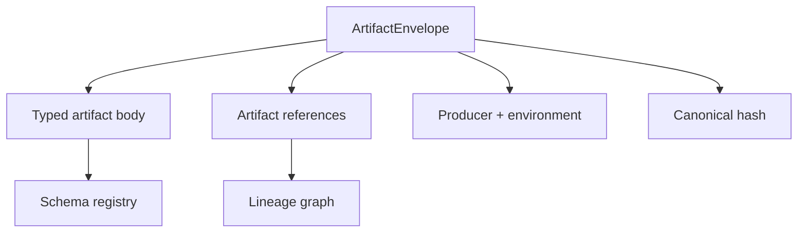

# Phase 1, Book 1 — Canonical Domain Language

> **Purpose:** Define the versioned artifact models, identifiers, lineage, hashing, compatibility, and registry every FORGE service shares  
> **Input:** Approved Phase 0 Reality Lock and canonical component IDs  
> **Output:** Canonical contract package and generated schemas  
> **Next:** [Book 2 — Event Contracts and Lifecycles](book-2-event-contracts.md)

---

## 1. Success Statement

Every operational object named by GLX FORGE can be validated without interpreting prose, and every derived object can be traced to its inputs, producer, code version, and evidence.

---

## 2. Applicable Anchors

- **A2:** Evidence Before Narrative
- **A3:** Point-in-Time Data
- **A4:** StrategySpec Is Truth
- **A7:** OrderIntent Is the Execution Boundary
- **A10:** Observable and Reconstructable
- **A12:** Cheap Models Use Tools, Not Memory
- **F1:** If an object has no canonical schema and lineage, it does not exist operationally

---

## 3. Contract Architecture



---

## 4. Work Packages

### 4.1 Identifier standard

Define typed IDs for:

```text
source_record
market_event
research_thesis
dataset_manifest
universe_snapshot
strategy_spec
code_artifact
backtest_run
validation_report
deployment_manifest
order_intent
execution_report
drift_report
decision_record
phase_gate
rollback_point
agent
component
environment
account
venue
```

An ID contains or references:

- type prefix;
- sortable unique value;
- no embedded secret, strategy rule, account number, or personal identifier.

IDs must remain stable across serialization and transport.

### 4.2 Artifact envelope

Every canonical artifact shares:

```json
{
  "artifact_id": "typed-id",
  "artifact_type": "strategy_spec",
  "schema_version": "1.0.0",
  "created_at": "RFC3339 UTC",
  "producer": {
    "actor_id": "agent-or-service-id",
    "component_id": "component-id",
    "code_version": "git-sha-or-build-id",
    "model_id": "optional-model-id"
  },
  "environment": "research|test|paper|shadow|live",
  "parents": [],
  "evidence": [],
  "content_hash": "algorithm:value",
  "supersedes": null,
  "labels": {}
}
```

Required rules:

- timestamps use UTC;
- production environment is explicit;
- parents use typed references;
- evidence is distinct from causal parentage;
- supersession never deletes history;
- model identity is recorded when a model made a judgment;
- content hash covers canonical semantic content.

### 4.3 Artifact reference model

An `ArtifactRef` contains:

- artifact ID;
- artifact type;
- expected content hash;
- optional relationship;
- optional required/optional flag.

Minimum relationships:

```text
derived_from
validates
implements
uses_dataset
uses_universe
supports
contradicts
supersedes
deploys
caused
reconciles
measures_drift_of
```

### 4.4 Canonical artifact bodies

Define minimum viable schemas for all artifacts in the master blueprint.

#### `SourceRecord`

- source identity and URL/reference;
- publisher;
- publication timestamp;
- retrieval timestamp;
- source type;
- content hash;
- licensing/retention note;
- extraction status.

#### `MarketEvent`

- event class;
- observed timestamp;
- effective timestamp;
- direction and affected domain;
- confidence method;
- source references;
- expiration/horizon;
- contradiction state.

#### `ResearchThesis`

- falsifiable claim;
- causal map;
- candidate universe request;
- expected horizon;
- supporting and contradicting evidence;
- falsification rule;
- status.

#### `DatasetManifest`

- provider/source;
- instruments;
- interval and date range;
- timezone;
- raw/adjusted policy;
- corporate-action policy;
- universe reference;
- macro vintage policy;
- file/partition hashes;
- data-quality report references.

#### `UniverseSnapshot`

- effective timestamp;
- inclusion/exclusion rules;
- members and identifiers;
- point-in-time source;
- delisting policy;
- content hash.

#### `StrategySpec`

- strategy family and version;
- supported asset/instrument classes;
- required inputs;
- sessions/calendars;
- states and conditions;
- entry, invalidation, exit, and target definitions;
- sizing request;
- prohibited conditions;
- parameter schema and allowed ranges;
- execution assumptions;
- monitoring invariants.

`StrategySpec` describes intent. It does not embed broker credentials or venue payloads.

#### `CodeArtifact`

- StrategySpec reference;
- implementation target;
- source commit/build hash;
- generated/manual status;
- generator/model identity;
- static-check results;
- unit/golden-test references.

#### `BacktestRun`

- StrategySpec and CodeArtifact references;
- DatasetManifest and UniverseSnapshot references;
- engine identity and version;
- run configuration;
- seed;
- cost/fill assumptions;
- metrics;
- trades/equity artifact references;
- status and failure reason.

#### `ValidationReport`

- validated object;
- validator identity;
- test suite and thresholds;
- findings;
- pass/fail/conditional status;
- independence declaration;
- unresolved limitations.

#### `DeploymentManifest`

- approved StrategySpec/CodeArtifact/ValidationReport;
- environment;
- venue/account scope references;
- capital envelope;
- parameter lock;
- monitoring policy;
- start/end conditions;
- rollback point;
- approval decision.

#### `OrderIntent`

- deployment and strategy references;
- instrument;
- action;
- requested quantity/notional;
- order constraints;
- time in force;
- reason/signal reference;
- idempotency key;
- permission decision reference.

#### `ExecutionReport`

- OrderIntent reference;
- venue and order identifiers;
- acknowledgments;
- fills;
- fees;
- terminal status;
- reconciliation status;
- raw response reference with redaction policy.

#### `DriftReport`

- deployment reference;
- observation window;
- expected versus observed measures;
- threshold policy;
- severity;
- required action;
- evidence.

#### `DecisionRecord`

- proposal/action;
- decision;
- actor and authority;
- evidence;
- approvals;
- effective scope;
- timestamp;
- override/supersession references.

### 4.5 Schema registry

The registry maps:

```text
artifact_type + semantic_version
→ validation model
→ JSON Schema
→ compatibility policy
→ migration function, when allowed
→ owner
```

Unknown artifact types fail closed.

Unknown major versions fail closed.

Future minor/patch versions follow an explicit compatibility policy and may never be silently truncated.

### 4.6 Canonical serialization and hashing

Define:

- UTF-8 JSON canonical form;
- stable key ordering;
- timezone normalization;
- decimal representation;
- enum representation;
- omitted versus explicit null behavior;
- excluded transport metadata;
- hash algorithm and prefix;
- maximum artifact size before external payload references are required.

Binary, tabular, chart, or large report payloads are stored separately and referenced by content hash.

### 4.7 Lineage validation

The validator checks:

- referenced parent exists;
- expected type matches;
- expected hash matches;
- required parent relationships are present;
- no illegal self-parent;
- no causal cycle;
- environment relationships are valid;
- a live/paper artifact cannot depend on an unvalidated research-only code artifact.

### 4.8 Contract generation

Generate:

- JSON Schemas;
- example fixtures;
- invalid fixtures;
- field documentation;
- registry index;
- compatibility matrix.

Generated output must be reproducible from source models.

---

## 5. Target Files

```text
forge/contracts/
├── base.py
├── identifiers.py
├── references.py
├── hashing.py
├── compatibility.py
├── registry.py
├── artifacts/
│   ├── research.py
│   ├── data.py
│   ├── strategy.py
│   ├── validation.py
│   ├── deployment.py
│   ├── execution.py
│   └── governance.py
└── schemas/

tests/forge/contracts/
├── fixtures/valid/
├── fixtures/invalid/
├── test_identifiers.py
├── test_artifact_schemas.py
├── test_hashing.py
├── test_compatibility.py
└── test_lineage.py
```

Exact locations defer to the Phase 0 canonical path map.

---

## 6. Deliverables

- Canonical identifier module.
- `ArtifactEnvelope` and `ArtifactRef`.
- All master-blueprint artifact models.
- Versioned schema registry.
- Generated JSON Schemas.
- Canonical serialization and hashing specification.
- Compatibility policy.
- Lineage validator.
- Valid/invalid fixtures.
- Artifact contract documentation.

---

## 7. Required Tests

### P1-ID-001 — Typed uniqueness

Generate a large bounded sample across all ID types; no duplicates occur and every ID parses to its declared type.

### P1-ID-002 — Secret-free identity

Fixture account numbers, symbols, strategy names, and secrets do not appear inside generated IDs.

### P1-SCH-001 — Complete registry

Every artifact named in the master blueprint has at least one registered schema version.

### P1-SCH-002 — Valid/invalid fixtures

Valid fixtures pass. Missing required fields, invalid enums, malformed timestamps, and mismatched types fail with useful errors.

### P1-SCH-003 — Unknown version behavior

Unknown major versions fail. Minor/patch compatibility follows the declared matrix without silent field loss.

### P1-HSH-001 — Deterministic hash

Equivalent semantic content with different source key ordering produces the same hash.

### P1-HSH-002 — Material mutation

A material field change produces a different hash.

### P1-LIN-001 — Full reconstruction

A fixture chain reconstructs:

```text
ExecutionReport
→ OrderIntent
→ DeploymentManifest
→ ValidationReport
→ BacktestRun
→ CodeArtifact + StrategySpec
→ DatasetManifest + UniverseSnapshot
→ SourceRecord
```

### P1-LIN-002 — Broken reference rejection

Missing parent, wrong type, wrong hash, self-parent, and lineage cycle fail closed.

### P1-ENV-001 — Environment monotonicity

Operational artifacts cannot silently depend on artifacts from a less-qualified environment without the required validation/promotion reference.

### P1-GEN-001 — Generated schema reproducibility

Two clean generations produce byte-identical schema outputs.

---

## 8. Failure Modes

| Failure | Response |
|---|---|
| Artifact becomes too broad | Split its body while preserving the shared envelope |
| Model and JSON Schema disagree | Source model controls; block publication until regeneration matches |
| Hash differs across platforms | Fix canonicalization before advancing |
| Circular lineage appears | Reject artifact and report the causal loop |
| Agent adds an unregistered field | Reject or open a schema-version proposal |
| Large payload is embedded | Store externally and reference by hash |
| Schema contains execution-provider details | Move provider payload to an adapter-specific referenced artifact |

---

## 9. Exit Gate

Book 1 completes when:

- Every canonical artifact is registered.
- Valid and invalid fixtures behave as declared.
- Hashes are deterministic.
- Lineage reconstructs end to end.
- Unknown types and incompatible versions fail closed.
- Generated schemas and documentation reproduce.
- The independent validator approves the contract registry.

---

## 10. Handoff

Book 2 receives:

- Stable artifact types and versions.
- Artifact references and lineage rules.
- State-bearing fields requiring lifecycle transitions.
- Environment model.
- Actor/component identity types.
- Schema registry APIs needed by event payload validation.
