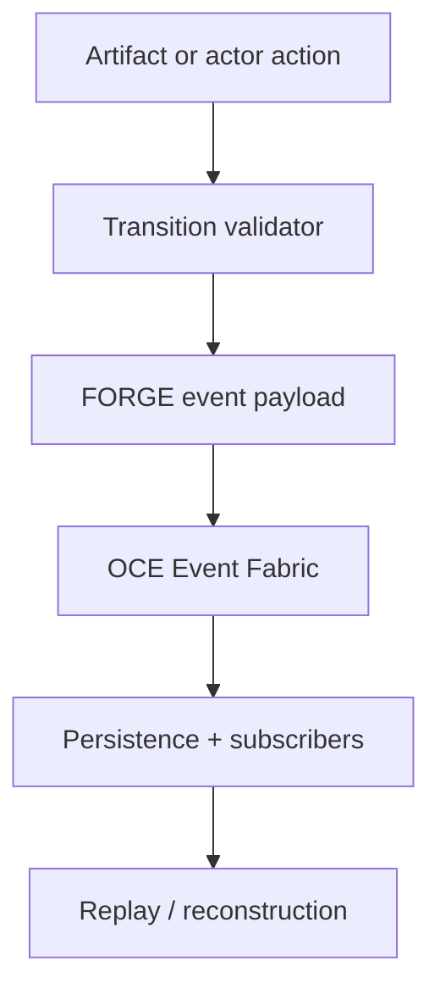
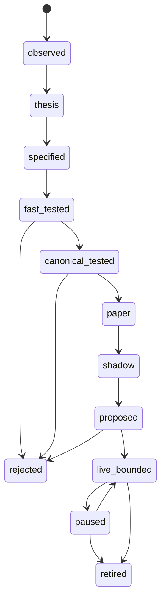

# Phase 1, Book 2 — Event Contracts and Lifecycles

> **Purpose:** Register typed FORGE events and legal lifecycle transitions on the existing OCE Event Fabric  
> **Input:** Book 1 artifact registry plus Phase 0-approved OCE event foundation  
> **Output:** FORGE event registry, payload validators, lifecycle machines, and OCE adapter  
> **Previous:** [Book 1 — Canonical Domain Language](book-1-domain-language.md)  
> **Next:** [Book 3 — Governance and Authority](book-3-governance-authority.md)

---

## 1. Success Statement

Every meaningful FORGE state change is represented by a registered, versioned OCE event whose payload validates, whose cause can be traced, and whose transition can be replayed without ambiguity.

---

## 2. Applicable Anchors

- **A1:** One Orchestration Spine
- **A4:** StrategySpec Is Truth
- **A8:** Promotion Is State-Based
- **A10:** Observable and Reconstructable
- **A11:** Repair Before Expansion
- **F1:** If an object has no canonical schema and lineage, it does not exist operationally

---

## 3. Event Architecture



The transition validates before the event is published. Publication does not retroactively legalize an invalid transition.

---

## 4. Work Packages

### 4.1 Backward-compatible OCE event envelope

The existing OCE `Event` remains the transport foundation. FORGE adds required operational metadata through a compatible extension or typed payload contract:

```json
{
  "event_type": "forge.strategy.spec.created",
  "event_version": "1.0.0",
  "event_id": "typed-event-id",
  "timestamp": "RFC3339 UTC",
  "source": "component-id",
  "actor_id": "actor-id",
  "environment": "research",
  "correlation_id": "workflow-id",
  "causation_id": "prior-event-id-or-null",
  "idempotency_key": "stable-key",
  "artifact_refs": [],
  "payload": {}
}
```

Phase 1 must not create another queue, persistence system, or event bus.

### 4.2 Event naming rules

Use:

```text
forge.<domain>.<entity>.<action>
```

Examples:

```text
forge.research.thesis.created
forge.discovery.candidates.generated
forge.strategy.spec.created
forge.validation.backtest.completed
forge.deployment.proposed
forge.execution.order_intent.created
forge.monitoring.drift.detected
```

Names are:

- lowercase;
- dot-delimited;
- past tense for completed facts;
- imperative names prohibited;
- semantic meaning stable within a major version.

### 4.3 Event registry

Each event registration declares:

- event name;
- semantic version;
- payload schema;
- allowed producer roles/components;
- required artifact references;
- priority;
- retention policy;
- legal source states;
- resulting state;
- idempotency policy;
- sensitive-field policy;
- owner.

Unknown FORGE events may be stored as diagnostics only if configured, but they cannot trigger lifecycle, deployment, permission, or execution actions.

### 4.4 Phase 1 event families

Register at minimum:

#### Phase events

```text
forge.phase.started
forge.phase.blocked
forge.phase.completed
forge.phase.rollback.started
forge.phase.rollback.completed
```

#### Contract events

```text
forge.contract.registered
forge.contract.superseded
forge.contract.validation_failed
```

#### Research events

```text
forge.market.event.detected
forge.research.thesis.created
forge.research.thesis.rejected
forge.research.thesis.expired
```

#### Discovery events

```text
forge.discovery.universe.snapshotted
forge.discovery.candidates.generated
forge.discovery.pattern.proposed
```

#### Strategy events

```text
forge.strategy.spec.created
forge.strategy.spec.validated
forge.strategy.code.built
forge.strategy.rejected
```

#### Validation events

```text
forge.validation.fast_test.completed
forge.validation.canonical_backtest.completed
forge.validation.report.completed
```

#### Deployment events

```text
forge.deployment.paper.started
forge.deployment.shadow.started
forge.deployment.proposed
forge.deployment.approved
forge.deployment.paused
forge.deployment.retired
```

#### Execution/monitoring events

```text
forge.execution.order_intent.created
forge.execution.completed
forge.execution.reconciliation_failed
forge.monitoring.drift.detected
forge.monitoring.kill_switch.activated
```

Later phases may activate producers for these event families. Phase 1 registers their language and authority requirements.

### 4.5 Strategy lifecycle machine

Canonical states:

```text
observed
thesis
specified
fast_tested
canonical_tested
paper
shadow
proposed
live_bounded
paused
rejected
retired
```



Phase 1 tests the full language but does not authorize transitions into paper, shadow, proposed, or live states unless later phase policies are present.

### 4.6 Supporting lifecycle machines

Define lifecycle registries for:

- research thesis;
- dataset manifest;
- StrategySpec;
- code artifact;
- validation report;
- deployment;
- order intent;
- phase gate;
- governance proposal.

Every transition declares:

- source state;
- target state;
- triggering event;
- required artifacts;
- required permission;
- guards;
- compensating/rollback transition;
- terminal-state behavior.

### 4.7 Correlation, causation, and idempotency

Rules:

- all events in one workflow share a correlation ID;
- causation points to the event that directly caused the new fact;
- retry uses the same idempotency key;
- duplicated events do not duplicate state transitions;
- replay in sequence produces the same final state;
- out-of-order events are rejected, deferred, or reconciled explicitly.

### 4.8 OCE adapter

Create an adapter that:

1. validates FORGE event name and version;
2. validates payload against Book 1 schema registry;
3. validates the requested lifecycle transition;
4. maps priority and retention into OCE;
5. calls the existing `EventFabric.ingest`;
6. returns the OCE event identity;
7. records validation failures without publishing an operational fact.

The adapter does not bypass current OCE routing, persistence, topology, or streaming.

### 4.9 Replay and reconstruction

Given a workflow correlation ID:

- load events in canonical order;
- verify every causation reference;
- verify artifact hashes;
- apply transitions;
- compare reconstructed state with stored current state;
- emit a reconstruction violation on mismatch.

---

## 5. Target Files

```text
forge/events/
├── envelope.py
├── registry.py
├── payloads.py
├── transitions.py
├── lifecycle.py
├── oce_adapter.py
└── replay.py

tests/forge/events/
├── fixtures/
├── test_registry.py
├── test_payloads.py
├── test_transitions.py
├── test_idempotency.py
├── test_replay.py
└── test_oce_adapter.py
```

Existing OCE files receive surgical integration only after their contracts and callers are read.

---

## 6. Deliverables

- FORGE event envelope extension.
- Versioned event registry.
- Typed payload schemas.
- Strategy and supporting lifecycle registries.
- Transition validator.
- OCE Event Fabric adapter.
- Idempotency rules.
- Replay and reconstruction utility.
- Event/transition documentation.
- Valid, invalid, duplicate, and out-of-order fixtures.

---

## 7. Required Tests

### P1-EVT-001 — Registry completeness

Every event named in the master blueprint and Phase 1 package is registered with payload, producer, priority, and retention policy.

### P1-EVT-002 — Round-trip fidelity

An event serializes and deserializes without losing semantic content or typed artifact references.

### P1-EVT-003 — Unknown operational event rejection

An unregistered FORGE event cannot trigger a lifecycle or authority-bearing subscriber.

### P1-EVT-004 — Producer restriction

An event from an unauthorized producer role is rejected before OCE ingestion.

### P1-OCE-001 — Single fabric

FORGE adapter tests prove events pass through the existing OCE Event Fabric and are visible to its persistence/subscriber path.

### P1-STM-001 — Legal transitions

Every declared transition succeeds with its required artifacts and guards.

### P1-STM-002 — Illegal transitions

Skipping qualification states, reviving terminal states, or entering live without policy fails closed.

### P1-IDM-001 — Duplicate idempotency

Replaying the same event/idempotency key does not apply a second transition.

### P1-ORD-001 — Out-of-order handling

Events arriving before their cause are deferred or rejected under declared policy; state is not corrupted.

### P1-RPL-001 — Deterministic replay

Replaying a complete fixture produces the same final state and lineage.

### P1-RPL-002 — Tamper detection

Changing a payload, parent hash, event order, or causation reference causes reconstruction failure.

---

## 8. Failure Modes

| Failure | Response |
|---|---|
| Event registry duplicates existing OCE semantics | Reuse or explicitly version the current event |
| Payload does not identify artifacts | Reject operational event |
| Transition and event disagree | Transition registry controls; block emission |
| Retry creates duplicate side effect | Fix idempotency before advancing |
| Unknown event reaches execution subscriber | Constitutional violation; stop path |
| Replay result differs from stored state | Block phase gate and open reconstruction incident |
| OCE change would break old events | Use backward-compatible adapter or explicit migration ADR |

---

## 9. Exit Gate

Book 2 completes when:

- Event and lifecycle registries are complete.
- Payloads validate against Book 1 contracts.
- FORGE uses the existing OCE fabric.
- Legal and illegal transition tests pass.
- Duplicate/out-of-order behavior is explicit.
- Replay reconstructs state deterministically.
- Tampered chains fail.
- Independent validation confirms no second orchestration path exists.

---

## 10. Handoff

Book 3 receives:

- Actor and role identity fields.
- Event producer restrictions.
- Transition permission requirements.
- Environment model.
- State changes requiring proposals/approval.
- Audit and replay hooks for governance decisions.
