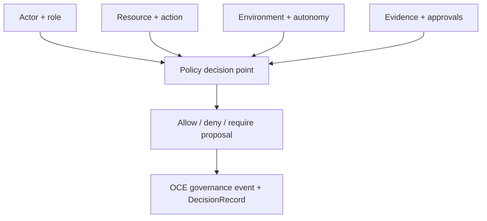

# Phase 1, Book 3 — Governance and Authority

> **Purpose:** Encode agent roles, scoped permissions, separation of duties, autonomy levels, proposals, and immutable human authority  
> **Input:** Book 1 contracts, Book 2 events/lifecycles, and Phase 0-approved OCE governance foundation  
> **Output:** Executable FORGE authority policy and OCE governance adapter  
> **Previous:** [Book 2 — Event Contracts and Lifecycles](book-2-event-contracts.md)  
> **Next:** [Book 4 — Constitutional Gates](book-4-gate-validation.md)

---

## 1. Success Statement

Every attempted FORGE action can be answered deterministically:

> Who is requesting what action, on which resource, in which environment, under which autonomy level, supported by which approvals?

If the answer is incomplete, permission is denied.

---

## 2. Applicable Anchors

- **A0:** Human Strategic Authority
- **A1:** One Orchestration Spine
- **A7:** OrderIntent Is the Execution Boundary
- **A8:** Promotion Is State-Based
- **A9:** Separate Research From Approval
- **A10:** Observable and Reconstructable
- **A14:** No Unofficial Production Broker Dependency
- **A15:** Live Autonomy Is Earned
- **F1:** If an object has no canonical schema and lineage, it does not exist operationally

---

## 3. Authority Architecture



---

## 4. Work Packages

### 4.1 Principal and role model

Principals:

```text
human
agent
service
worker
strategy
adapter
external_provider
```

Permanent FORGE roles:

| Role | Core responsibility |
|---|---|
| `mad` | Strategic objective, authority, capital boundary, override |
| `oce_operations_director` | Workflow coordination and blocker routing |
| `research_director` | Research quality and candidate pipeline |
| `quant_deployment_director` | Strategy build, validation, deployment proposal |
| `macro_observer` | Macro release/event observation |
| `news_mapper` | News, filings, causal exposure mapping |
| `market_scanner` | Deterministic broad-universe scanning |
| `pattern_researcher` | Pattern hypothesis generation |
| `strategy_engineer` | StrategySpec implementation |
| `data_steward` | Dataset and point-in-time integrity |
| `backtest_operator` | Bounded test execution |
| `quant_validator` | Independent qualification |
| `portfolio_agent` | Aggregate exposure and allocation |
| `deployment_agent` | Package approved deployment |
| `execution_agent` | Route approved OrderIntent |
| `audit_observer` | Reconstruction, violations, drift, and incidents |

Role cards define:

- mission;
- required inputs;
- allowed outputs;
- allowed tools;
- environments;
- maximum autonomy;
- forbidden actions;
- required reviewer;
- event producer permissions;
- resource/time budget;
- escalation path.

### 4.2 Action vocabulary

Register actions:

```text
observe
read
research.create
universe.request
scan.run
strategy.spec.create
strategy.code.build
test.fast.run
test.canonical.run
validation.issue
paper.propose
paper.deploy
shadow.deploy
live.propose
live.deploy
order_intent.create
order.route
position.reconcile
strategy.pause
strategy.retire
capital.allocate
policy.propose
policy.approve
phase.advance
rollback.execute
```

Unknown actions deny.

### 4.3 Resource and scope model

A permission decision is scoped by:

- actor ID;
- role;
- action;
- artifact/component/resource;
- environment;
- asset class;
- venue;
- account reference;
- strategy family/version;
- capital envelope;
- time window;
- autonomy level;
- required approvals.

Phase 1 fixtures use synthetic account and venue references only.

### 4.4 Environment model

Environments:

```text
research
test
paper
shadow
live
```

Rules:

- permission in one environment does not imply permission in another;
- higher-risk environments require explicit grants;
- Phase 1 may grant only `research` and `test`;
- paper/shadow/live policies are declared but disabled until their phases;
- environment cannot be inferred from credentials, hostnames, or account names.

### 4.5 Autonomy ladder

Encode master blueprint levels:

| Level | Name | Phase 1 ceiling |
|---:|---|---:|
| 0 | Observe | Enabled by role |
| 1 | Research | Enabled by role |
| 2 | Build | Enabled by role |
| 3 | Validate | Enabled in bounded test environment |
| 4 | Simulate | Defined, disabled |
| 5 | Propose | Defined for future deployment proposals, disabled |
| 6 | Live bounded | Defined, disabled |
| 7 | Adaptive bounded | Defined, disabled |
| 8 | Lifecycle autonomous | Defined, disabled |

Autonomy is granted per scope, not globally.

### 4.6 Separation of duties

Enforce:

- thesis proposer may not be sole thesis validator;
- StrategySpec/code author may not be sole canonical validator;
- canonical validator may recommend but not alone approve live deployment;
- deployment packager may not expand capital or venue scope;
- execution adapter may not originate its own OrderIntent;
- audit observer may pause under future emergency policy but may not silently resume;
- a model identity does not count as a distinct human/organizational approver when it is the same workflow principal.

### 4.7 Permission decision contract

Every decision produces:

```json
{
  "decision_id": "decision-record-id",
  "principal": "actor-id",
  "role": "role-id",
  "action": "action-id",
  "resource": "artifact-or-component-ref",
  "environment": "research",
  "autonomy_level": 2,
  "result": "allow|deny|proposal_required",
  "policy_version": "1.0.0",
  "reason_codes": [],
  "approval_refs": [],
  "expires_at": "optional UTC",
  "content_hash": "hash"
}
```

Decisions are immutable. New facts produce a new decision.

### 4.8 Extend OCE governance

Reuse the existing OCE `GovernanceEngine` proposal lifecycle and immutable sovereignty boundaries.

Add or map FORGE proposal types:

```text
forge_contract_change
forge_role_change
forge_permission_change
forge_phase_advance
forge_rollback
forge_strategy_promotion
forge_capital_envelope
forge_adapter_enablement
forge_emergency_pause
```

Required hardening before FORGE relies on proposals:

- unique approver enforcement;
- approver-role eligibility;
- structured JSON changes, not ambiguous string interpretation;
- proposal expiration;
- applied-action handler evidence;
- artifact/decision references;
- correlation with OCE events;
- scope-specific approval thresholds;
- idempotent application;
- MAD override trace.

Phase 1 does not activate live strategy, capital, or adapter proposals.

### 4.9 Constitutional boundaries

Immutable or MAD-only:

- disable MAD override;
- bypass permission checks;
- bypass phase gates;
- turn off audit logging;
- allow an LLM to send arbitrary broker payloads;
- permit unregistered schemas/events/actions;
- increase live autonomy;
- grant recursive unlimited agent spawning;
- remove sandbox requirements;
- expand capital authority.

These extend rather than replace existing OCE sovereignty boundaries.

### 4.10 Governance events

Register:

```text
forge.governance.permission.allowed
forge.governance.permission.denied
forge.governance.proposal.created
forge.governance.proposal.approved
forge.governance.proposal.rejected
forge.governance.proposal.applied
forge.governance.decision.overridden
forge.governance.constitution.violation
```

Every permission-bearing action references its DecisionRecord.

---

## 5. Target Files

```text
forge/governance/
├── principals.py
├── roles.py
├── role_cards/
├── actions.py
├── resources.py
├── environments.py
├── autonomy.py
├── permissions.py
├── separation.py
├── proposals.py
├── boundaries.py
└── oce_adapter.py

tests/forge/governance/
├── fixtures/
├── test_roles.py
├── test_permissions.py
├── test_autonomy.py
├── test_separation.py
├── test_proposals.py
├── test_boundaries.py
└── test_oce_governance_adapter.py
```

---

## 6. Deliverables

- Principal, role, action, resource, and environment registries.
- Machine-readable role cards.
- Autonomy-level policy.
- Deny-by-default permission engine.
- Separation-of-duties rules.
- DecisionRecord integration.
- FORGE proposal types and OCE governance adapter.
- Constitutional-boundary extension.
- Governance event contracts.
- Permission matrix and future-environment disabled policies.
- Valid/invalid authority fixtures.

---

## 7. Required Tests

### P1-RBAC-001 — Default deny

An unknown actor, role, action, resource, environment, or policy version is denied.

### P1-RBAC-002 — Scope isolation

Permission for one environment, asset class, venue, account, strategy, or time window does not authorize another.

### P1-RBAC-003 — Role-card limits

Every permanent role can perform its allowed actions and is denied its forbidden actions.

### P1-SEP-001 — Author/validator separation

The same workflow principal cannot satisfy both required independent duties.

### P1-SEP-002 — Proposal/approval separation

A proposer cannot become the only eligible approver for its own material change.

### P1-AUT-001 — Phase 1 ceiling

All paper, shadow, and live permissions deny regardless of requested autonomy level.

### P1-AUT-002 — Scoped autonomy

An autonomy grant does not escape its declared resource/environment scope.

### P1-MAD-001 — Override preservation

MAD can override an autonomous decision with a recorded reason and event.

### P1-MAD-002 — Immutable boundary

No agent or proposal can disable MAD override, audit, sandbox, permission checks, or phase gates.

### P1-GOV-001 — Unique approvals

Repeated approval by the same principal counts once.

### P1-GOV-002 — Eligible approvals

An ineligible role cannot satisfy an approval threshold.

### P1-GOV-003 — Idempotent application

Applying an approved proposal twice produces one material effect and a traceable replay result.

### P1-GOV-004 — Expiration

Expired proposals cannot be approved or applied.

### P1-DEC-001 — Decision completeness

Every allow, deny, or proposal-required result produces a complete, hash-valid DecisionRecord.

### P1-OCE-002 — Existing governance spine

FORGE proposal and override actions pass through the Phase 0-approved OCE Governance Engine.

---

## 8. Failure Modes

| Failure | Response |
|---|---|
| Role becomes a catch-all | Split responsibilities; preserve least privilege |
| Missing field defaults to allow | Constitutional violation; change to deny |
| Same agent appears under aliases | Resolve stable principal identity before approval |
| Proposal changes immutable boundary | Reject before proposal creation |
| OCE proposal application lacks effect evidence | Keep FORGE proposal type disabled |
| Environment inferred from runtime | Require explicit environment identity |
| Future live policy accidentally activates | Fail Phase 1 autonomy ceiling test |
| Override erases original decision | Preserve original and link superseding override |

---

## 9. Exit Gate

Book 3 completes when:

- All actors/actions/resources/environments are registered.
- Permissions deny by default and remain scoped.
- Separation of duties is executable.
- Phase 1 cannot authorize paper, shadow, or live behavior.
- FORGE uses OCE governance.
- Unique/eligible approvals and idempotent application pass.
- Immutable boundaries and MAD override pass.
- Every policy decision creates a valid DecisionRecord.
- Independent validation approves the authority model.

---

## 10. Handoff

Book 4 receives:

- Role cards.
- Permission and autonomy registries.
- Proposal and decision contracts.
- Separation rules.
- Constitutional boundaries.
- Events and artifacts required by phase gates.
- Approval requirements for phase advancement and rollback.
