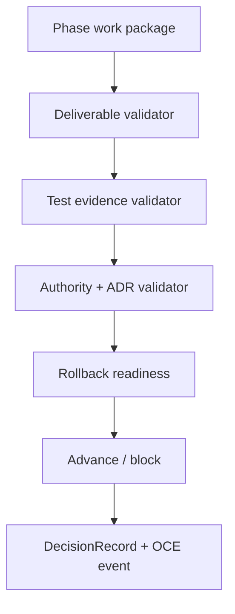

# Phase 1, Book 4 — Constitutional Gates

> **Purpose:** Make architectural decisions, phase advancement, rollback, documentation precedence, and agent context machine-verifiable  
> **Input:** Books 1–3 plus the approved Phase 0 Reality Lock  
> **Output:** FORGE constitution lock and Phase 2 handoff  
> **Previous:** [Book 3 — Governance and Authority](book-3-governance-authority.md)  
> **Next:** Phase 2 — Runtime Foundry

---

## 1. Success Statement

An agent can start a task, load one compact context anchor, determine the authoritative contracts and permissions, identify completion tests and rollback, and produce the same required output structure as another independent agent.

---

## 2. Applicable Anchors

All master blueprint anchors apply. Closing emphasis:

- **A0:** Human Strategic Authority
- **A1:** One Orchestration Spine
- **A4:** StrategySpec Is Truth
- **A8:** Promotion Is State-Based
- **A10:** Observable and Reconstructable
- **A11:** Repair Before Expansion
- **A15:** Live Autonomy Is Earned
- **F1:** If an object has no canonical schema and lineage, it does not exist operationally

---

## 3. Gate Architecture



---

## 4. Work Packages

### 4.1 Architecture Decision Record contract

Material decisions require an ADR with:

```text
ADR ID
title
status
date
deciders
context
decision
alternatives considered
evidence/artifact references
positive consequences
negative consequences
prohibited interpretations
compatibility/migration impact
security/authority impact
rollback or review trigger
supersedes/superseded-by
approval DecisionRecord
```

Material decisions include:

- new canonical component;
- schema major version;
- event semantic change;
- lifecycle transition change;
- role or authority change;
- provider/broker addition;
- live/paper capability;
- capital scope;
- storage or security boundary;
- replacement of an existing canonical path.

### 4.2 Phase gate contract

Each gate defines:

```json
{
  "gate_id": "typed-id",
  "phase": 1,
  "gate_version": "1.0.0",
  "repository_sha": "sha",
  "required_deliverables": [],
  "required_tests": [],
  "required_decisions": [],
  "required_reviewers": [],
  "authority_change": false,
  "rollback_point": "artifact-ref",
  "status": "open|blocked|passed|rolled_back",
  "evidence": [],
  "decision_ref": null
}
```

Gate evaluation is deterministic code.

Models may summarize failures, but may not change pass/fail rules.

### 4.3 Test evidence contract

Every required test record contains:

- test ID;
- command ID;
- repository SHA;
- environment fingerprint;
- start/end timestamps;
- collected/passed/failed/skipped counts;
- exit code;
- sanitized log reference;
- artifact hashes;
- runner identity;
- rerun/retry status.

Skipped or uncollected required tests do not count as passing.

### 4.4 Rollback contract

A rollback point identifies:

- last approved repository/build version;
- schema/event/policy versions;
- database migration state;
- active feature flags;
- artifacts created after the point;
- compensating actions;
- expected restored state;
- verification tests;
- authority required to execute.

Rollback must preserve historical evidence and DecisionRecords.

Phase 1 rollback covers contract/registry/policy changes only. It cannot claim to roll back infrastructure that Phase 2 has not built.

### 4.5 Documentation precedence

Executable precedence:

1. `OPERATOR_RULES.md`
2. `CLAUDE.md`
3. Approved `RealityLockManifest`
4. `GLX_FORGE_MASTER_BLUEPRINT.md`
5. Current phase package
6. Approved ADRs
7. Executable schema/event/permission/gate registries
8. Module documentation
9. Progress files and chat summaries

If documentation disagrees with an executable registry, the phase blocks until the conflict is resolved. Agents do not silently choose whichever is convenient.

### 4.6 `FORGE_CONTEXT.md`

Create a compact, generated-or-validated startup anchor containing:

- current phase and active book;
- repository SHA;
- current phase-gate ID;
- permanent anchors;
- canonical component IDs from Phase 0;
- active schema/event/policy versions;
- actor role and autonomy ceiling;
- allowed/prohibited environments;
- required inputs and output artifact;
- required tests;
- validator;
- blockers;
- rollback point;
- links to canonical evidence.

It must not contain:

- full progress history;
- secrets;
- model-generated unverified conclusions;
- obsolete canonical paths;
- live credentials or account numbers.

### 4.7 Agent startup contract

Before work, an agent emits or records:

```json
{
  "phase": 1,
  "book": 4,
  "actor_id": "actor-id",
  "role": "role-id",
  "autonomy_level": 2,
  "input_artifacts": [],
  "output_artifact_type": "phase_gate",
  "applicable_anchors": [],
  "allowed_actions": [],
  "required_tests": [],
  "validator_role": "role-id",
  "rollback_point": "artifact-ref",
  "unresolved_questions": []
}
```

Any unresolved critical question blocks implementation.

### 4.8 Cross-agent interpretation test

Provide two independent agents the same:

- `FORGE_CONTEXT.md`;
- work request;
- input artifacts;
- role card;
- permission policy.

Compare their structured planning output.

Required agreement:

- active phase/book;
- authoritative inputs;
- prohibited paths;
- output artifact type;
- required tests;
- required validator;
- authority ceiling;
- rollback point;
- conditions requiring human approval.

Natural-language wording may differ. Required operational interpretation may not.

### 4.9 Constitution validator

Validate:

- all Book 1 artifact schemas registered;
- all Book 2 events and transitions registered;
- all Book 3 roles/actions/policies registered;
- documentation references existing versions;
- no paper/shadow/live permission active;
- OCE remains the integration spine;
- Phase 0 quarantines are respected;
- context anchor matches registries;
- gate and rollback evidence complete.

### 4.10 Phase 2 handoff

Produce runtime requirements derived from contracts:

- services required;
- schema registry loading;
- event fabric adapter;
- governance adapter;
- artifact persistence needs;
- queue idempotency needs;
- worker identity and capability registration;
- environment isolation;
- secrets interface;
- health/readiness contract;
- backup/rollback expectations.

Phase 2 implements runtime. It may not duplicate or reinterpret the constitutional registries.

---

## 5. Target Files

```text
forge/gates/
├── models.py
├── evaluator.py
├── test_evidence.py
├── rollback.py
├── adr.py
├── context.py
└── constitution_validator.py

QUANT-LAB-INFRA-UPGRADE/
├── FORGE_CONTEXT.md
├── decisions/ADR-TEMPLATE.md
└── phases/phase-01-forge-constitution/

tests/forge/gates/
├── fixtures/
├── test_gate_evaluator.py
├── test_rollback.py
├── test_adr.py
├── test_context.py
├── test_interpretation.py
└── test_constitution_e2e.py
```

---

## 6. Deliverables

- ADR schema and template.
- Machine-readable phase-gate model.
- Deterministic gate evaluator.
- Test-evidence model.
- Rollback model and verifier.
- Documentation precedence validator.
- `FORGE_CONTEXT.md` generator/validator.
- Agent startup contract.
- Cross-agent interpretation harness.
- Constitution end-to-end validator.
- Phase 1 lock report.
- Phase 2 runtime handoff.

---

## 7. Required Tests

### P1-ADR-001 — ADR completeness

A material decision missing alternatives, consequences, evidence, prohibited interpretations, rollback/review trigger, or approval is rejected.

### P1-ADR-002 — Supersession

Superseding an ADR preserves the original and creates valid bidirectional references.

### P1-GAT-001 — Missing deliverable

Gate fails when any required deliverable is absent, wrong type, wrong version, or wrong hash.

### P1-GAT-002 — Failed/skipped test

Gate fails when a required test fails, is skipped, is uncollected, or lacks evidence.

### P1-GAT-003 — Reviewer/authority

Gate fails when the required independent reviewer or MAD approval is absent.

### P1-GAT-004 — Repository drift

Gate fails when evidence references a different repository SHA without an approved superseding run.

### P1-RBK-001 — Rollback rehearsal

A fixture constitutional change can return to the previous approved registry/policy state and pass verification.

### P1-RBK-002 — Evidence preservation

Rollback does not delete the rejected/superseded artifacts, decisions, or events.

### P1-CTX-001 — Context parity

`FORGE_CONTEXT.md` exactly matches canonical IDs, versions, permissions, gates, blockers, and quarantines.

### P1-CTX-002 — No secret/progress bloat

Context contains no secret fixtures, account IDs, or full progress logs and remains under its declared size budget.

### P1-INT-001 — Independent interpretation

Two agent outputs agree on every required operational field.

### P1-INT-002 — Ambiguity blocks

A fixture with conflicting authority or missing output type causes both agents to stop and report the ambiguity.

### P1-CON-001 — Constitution integration

One end-to-end fixture validates:

```text
artifact
→ event
→ lifecycle transition
→ permission decision
→ phase gate
→ DecisionRecord
→ replay/reconstruction
```

### P1-CON-002 — Phase 1 authority ceiling

The entire package contains no active paper, shadow, or live permission.

### P1-P0-001 — Reality Lock preservation

No Phase 1 canonical dependency references a Phase 0-quarantined component.

---

## 8. Independent Validation Procedure

The validator:

1. Loads the Phase 0 Reality Lock.
2. Loads `FORGE_CONTEXT.md`.
3. Verifies registry versions and hashes.
4. Runs Book 1 schema/lineage tests.
5. Runs Book 2 event/lifecycle/replay tests.
6. Runs Book 3 permission/governance tests.
7. Runs Book 4 gate/rollback/context tests.
8. Executes the cross-agent interpretation fixture.
9. Executes the constitution end-to-end fixture.
10. Confirms no paper/shadow/live authority is active.
11. Confirms Phase 2 handoff matches the locked contracts.
12. Issues approve, reject, or approve-with-noncritical-findings.

The validator does not silently fix a contract while validating it.

---

## 9. Failure Modes

| Failure | Response |
|---|---|
| Context disagrees with registry | Registry/evidence controls; regenerate context and revalidate |
| Test result lacks environment/SHA | Treat required test as not passed |
| Gate logic uses model judgment | Replace with deterministic evaluator |
| Rollback cannot restore policy | Block phase completion |
| Two agents disagree operationally | Identify ambiguous contract and return to owning book |
| Phase 2 handoff invents a new contract | Remove it or create approved Phase 1 ADR/version |
| Paper/live authority appears | Constitutional violation; deny and block |
| Phase 0 quarantine is imported | Remove dependency or reopen Phase 0 decision |

---

## 10. Exit Gate

Book 4 and Phase 1 complete when:

- All Book 1–4 required tests pass.
- The constitutional end-to-end fixture reconstructs.
- Gate and rollback behavior is deterministic.
- `FORGE_CONTEXT.md` matches registries.
- Two-agent interpretation agrees.
- OCE remains the only event/governance/orchestration spine.
- Phase 0 Reality Lock remains intact.
- Paper, shadow, and live authority remain disabled.
- Independent validation approves.
- MAD approves any constitutional decision affecting strategic authority.

---

## 11. Phase 2 Handoff Contract

Phase 2 may:

- containerize approved services;
- load schema, event, and policy registries;
- establish PostgreSQL/Redis/runtime persistence;
- register workers and capabilities;
- implement idempotent jobs and replay;
- establish environment and secret isolation;
- build readiness, backup, and recovery.

Phase 2 may not:

- redefine artifact schemas inside services;
- create a second event bus or governance engine;
- loosen permission or autonomy ceilings;
- enable paper/live trading;
- import quarantined components;
- replace deterministic gates with agent judgment.

---

## 12. Phase Completion Event

```json
{
  "event_type": "forge.phase.completed",
  "event_version": "1.0.0",
  "phase": 1,
  "constitution_lock_id": "artifact-id",
  "repository_sha": "sha",
  "validation_report_id": "artifact-id",
  "decision_record_id": "artifact-id",
  "next_phase": 2
}
```

This event authorizes Phase 2 planning and implementation only. It does not authorize paper, shadow, live, broker, or capital-bearing activity.
