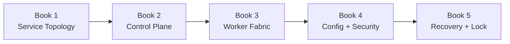
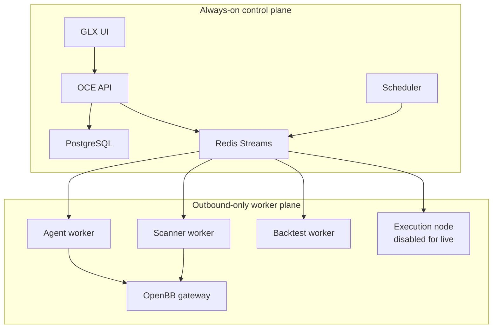

# GLX FORGE Phase 2 — Runtime Foundry

> **Phase:** 2 of 11  
> **Purpose:** Create a low-cost, reproducible runtime split between an always-on control plane and disposable bounded workers  
> **Status:** Planned — execution requires approved Phase 0 and Phase 1 locks  
> **Parent:** [`GLX_FORGE_MASTER_BLUEPRINT.md`](../../GLX_FORGE_MASTER_BLUEPRINT.md)  
> **Prerequisite:** [`Phase 1 — Forge Constitution`](../phase-01-forge-constitution/README.md)  
> **Phase anchor:** **F2 — Control is always-on; heavy compute is disposable.**

---

## 1. Phase Objective

Phase 2 turns the constitutional contracts from Phase 1 into a reproducible runtime that can operate cheaply:

- lightweight OCE control services remain available in the cloud;
- expensive scans, model jobs, and backtests run on the operator's computer or temporary workers;
- workers connect outbound and require no public inbound port;
- every job is typed, permissioned, idempotent, observable, and reconstructable;
- interruption, retry, restart, and recovery do not corrupt state;
- configuration and secrets stay outside images, Git, logs, and artifacts.

Phase 2 builds runtime substrate only. It does not ingest the full market-data lake, activate production scanners, enable paper/live trading, or redefine Phase 1 contracts.



---

## 2. Runtime Decision

The canonical deployment model is:

| Plane | Default location | Responsibility |
|---|---|---|
| Control plane | Railway or equivalent inexpensive cloud | OCE API, UI, scheduler, PostgreSQL, Redis coordination |
| Worker plane | Operator computer through Docker or Podman | Agents, scans, backtests, OpenBB gateway, bounded execution node |
| Burst worker plane | Temporary cloud compute when justified | Large finite jobs using the same worker image |
| Artifact/data plane | Phase-appropriate persistent storage | Metadata now; large market data begins in Phase 3 |

Railway is a deployment target, not an architectural dependency. The same versioned containers and contracts must run under Docker Compose-compatible tooling.

---

## 3. Existing Foundations to Extend

| Existing foundation | Phase 2 use |
|---|---|
| OCE FastAPI application | Control API, readiness, orchestration surface |
| OCE Event Fabric | Domain event publication and replay references |
| OCE Execution Engine | Local execution semantics to adapt into distributed jobs |
| OCE Governance Engine | Permission and proposal checks |
| OCE Observer Runtime | Worker/agent identity and health integration |
| OCE metrics, tracing, alerting | Runtime observability foundation |
| OCE/other SQLite stores | Legacy persistence retained or adapted until explicitly migrated |
| Next.js frontend | GLX control interface foundation |
| Phase 1 registries | Artifact, event, lifecycle, permission, gate, and rollback truth |

Phase 2 must not create competing event, governance, or artifact semantics.

---

## 4. Book Sequence

| Book | Name | Primary output | Gate |
|---:|---|---|---|
| 1 | [Service Topology and Containers](book-1-service-topology.md) | Versioned container/Compose architecture | Fresh build and boot with real readiness |
| 2 | [Control Plane](book-2-control-plane.md) | OCE API + PostgreSQL + Redis + scheduler | Jobs persist and queue state survives service restart |
| 3 | [Worker Fabric](book-3-worker-fabric.md) | Capability-aware outbound worker protocol | Remote job survives disconnect, retry, and duplicate delivery |
| 4 | [Configuration and Security](book-4-configuration-security.md) | Environment, identity, secret, network, and resource policy | Images/logs/repo contain no secret and workers remain bounded |
| 5 | [Recovery and Runtime Lock](book-5-recovery-runtime-lock.md) | Backup, restore, failure drills, deployment recipes, Phase 3 handoff | Full control-to-local-worker job reconstructs after interruption |

---

## 5. Target Runtime Topology



Only UI/API ingress is public. PostgreSQL and Redis are private. Local workers initiate outbound connections.

---

## 6. Runtime Invariants

1. OCE remains the sole control and event/governance spine.
2. PostgreSQL is the FORGE operational system of record.
3. Redis Streams transports jobs/events requiring distributed consumption; it is not the sole durable artifact store.
4. Every job references a Phase 1 artifact and permission decision.
5. Every worker has a stable identity, capability declaration, environment, and lease.
6. Delivery is at least once; effects are idempotent.
7. Unknown job types, schema versions, workers, and capabilities fail closed.
8. Workers connect outbound; no local inbound exposure is required.
9. Heavy workers may disappear without losing control-plane truth.
10. A health endpoint does not equal readiness.
11. Images are immutable and versioned by build provenance.
12. Secrets are injected at runtime and never built into images.
13. Paper, shadow, and live execution remain disabled.
14. Resource budgets and timeouts are enforced outside model judgment.
15. Every runtime transition emits reconstructable evidence.

---

## 7. Shared Deliverables

Target layout:

```text
deploy/
├── compose/
│   ├── compose.yml
│   ├── compose.dev.yml
│   ├── compose.control.yml
│   └── compose.worker.yml
├── docker/
│   ├── oce-api.Dockerfile
│   ├── glx-ui.Dockerfile
│   ├── scheduler.Dockerfile
│   ├── worker.Dockerfile
│   └── openbb-gateway.Dockerfile
├── config/
│   ├── environment.schema.json
│   ├── service-capabilities.yml
│   └── resource-budgets.yml
├── railway/
├── scripts/
│   ├── preflight.*
│   ├── backup.*
│   ├── restore.*
│   └── smoke-test.*
└── runbooks/

forge/runtime/
├── control/
├── jobs/
├── workers/
├── persistence/
├── security/
└── observability/

tests/forge/runtime/
├── contracts/
├── integration/
├── failure_injection/
└── e2e/
```

Exact paths defer to the Phase 0 Reality Lock.

---

## 8. Phase Test Matrix

| Test ID | Requirement | Book |
|---|---|---:|
| P2-IMG-001 | Every required image builds from a clean context | 1 |
| P2-CMP-001 | Compose config validates under supported runtimes | 1 |
| P2-BOOT-001 | Fresh-machine boot succeeds | 1 |
| P2-RDY-001 | Health and functional readiness are distinct | 1 |
| P2-PG-001 | PostgreSQL migration and persistence survive restart | 2 |
| P2-RDS-001 | Redis stream/consumer state survives restart | 2 |
| P2-API-001 | Job submission creates typed artifacts and events | 2 |
| P2-SCH-001 | Scheduler cannot duplicate a logical run | 2 |
| P2-WRK-001 | Capability matching selects only eligible workers | 3 |
| P2-IDM-001 | Duplicate delivery produces one effect | 3 |
| P2-DSC-001 | Disconnect/reconnect preserves job ownership safely | 3 |
| P2-DLQ-001 | Exhausted jobs enter a reconstructable dead-letter state | 3 |
| P2-SEC-001 | Images, logs, artifacts, and Git contain no secret fixtures | 4 |
| P2-NET-001 | Local worker requires outbound connectivity only | 4 |
| P2-RES-001 | CPU, memory, disk, concurrency, and time budgets enforce | 4 |
| P2-ENV-001 | Environment identity cannot be inferred or escalated | 4 |
| P2-BKP-001 | PostgreSQL backup restores verified state | 5 |
| P2-RCV-001 | Queue/control restart recovers unfinished jobs | 5 |
| P2-E2E-001 | Cloud-control-to-local-worker job completes and reconstructs | 5 |
| P2-AUT-001 | No paper, shadow, or live execution activates | 5 |

---

## 9. Phase Completion Definition

Phase 2 is complete only when:

- All five books pass their exit gates.
- Required images build reproducibly.
- Compose profiles run through Docker and are compatible with Podman where declared.
- OCE API/UI/control persistence starts on a clean machine.
- PostgreSQL migrations and backups restore.
- Redis jobs, consumer state, and dead letters recover.
- Workers register capabilities and maintain leases.
- A local worker completes a control-plane job through outbound connectivity only.
- Duplicate delivery produces one material effect.
- Worker interruption does not lose authoritative job state.
- Resource ceilings and timeouts enforce.
- Secret fixtures are absent from images, Git, logs, and artifacts.
- Readiness proves a representative operation.
- No paper, shadow, live, broker, or capital authority is enabled.
- Runtime lock and Phase 3 handoff are independently validated.

---

## 10. Handoff to Phase 3

Phase 3 — Data Forge receives:

- Versioned OpenBB gateway runtime.
- PostgreSQL operational metadata store.
- Redis job/event transport.
- Scanner/data worker capability model.
- Secret/provider credential injection interface.
- Persistent volume and artifact reference conventions.
- Scheduled and ad hoc job submission contracts.
- Resource budgets and retry/dead-letter behavior.
- Backup/restore and observability foundations.

Phase 3 may add point-in-time data catalogs and provider jobs. It may not redefine job, event, permission, environment, or runtime identity contracts.
