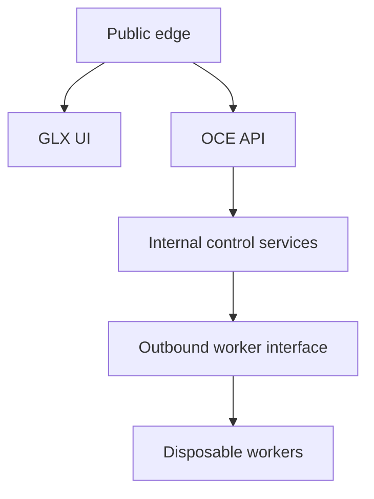

# Phase 2, Book 1 — Service Topology and Containers

> **Purpose:** Define service boundaries and produce reproducible container images and Compose profiles  
> **Input:** Approved Phase 1 constitution and Phase 0 component map  
> **Output:** Container topology, service contracts, images, and clean-boot proof  
> **Next:** [Book 2 — Control Plane](book-2-control-plane.md)

---

## 1. Success Statement

An operator can clone the locked repository, provide non-secret configuration, build the approved images, and start a development runtime whose services prove functional readiness without relying on host-specific paths.

---

## 2. Applicable Anchors

- **A1:** One Orchestration Spine
- **A10:** Observable and Reconstructable
- **A11:** Repair Before Expansion
- **A13:** Local-First Heavy Compute
- **F1:** Canonical schema and lineage
- **F2:** Control is always-on; heavy compute is disposable

---

## 3. Service Boundary Diagram



---

## 4. Work Packages

### 4.1 Service inventory and ownership

Define one service contract for:

| Service | Plane | Responsibility | Must not do |
|---|---|---|---|
| `oce-api` | Control | API, OCE orchestration adapters, readiness | Run heavy backtests |
| `glx-ui` | Control | Operator interface | Access databases directly |
| `scheduler` | Control | Create idempotent scheduled job requests | Execute job payloads |
| `postgres` | Control | FORGE operational truth | Serve as bulk market-data lake |
| `redis` | Control | Streams, leases, short-lived coordination | Become sole artifact truth |
| `agent-worker` | Worker | Model/tool research jobs | Invent deterministic routing |
| `scanner-worker` | Worker | Broad deterministic scans | Perform qualitative approval |
| `backtest-worker` | Worker | Bounded strategy tests | Promote or deploy |
| `openbb-gateway` | Worker/control profile | Normalized provider access | Become historical truth |
| `execution-node` | Worker | Future adapter host | Activate paper/live in Phase 2 |

Service ownership references Phase 1 component and role IDs.

### 4.2 Image strategy

Build minimal versioned images:

- pin runtime major/minor versions;
- use multi-stage builds where useful;
- run as non-root;
- copy only required source/dependencies;
- exclude Git history, data, reports, credentials, caches, and local memory;
- embed build SHA, contract versions, build timestamp, and source provenance as labels;
- provide deterministic entrypoint and signal handling;
- use read-only root filesystem when compatible;
- declare writable mount points;
- include no general-purpose shell in final images when unnecessary.

Do not copy the full vendored NautilusTrader tree into every service.

### 4.3 Compose model

Define profiles:

```text
dev
control
worker
research
test
```

No `paper` or `live` profile exists in Phase 2.

Compose declares:

- named networks;
- named volumes;
- health checks;
- dependency conditions based on readiness;
- resource budgets;
- restart policy;
- environment-file references without committed values;
- immutable image tags or digests for non-development use;
- separate control and worker profiles.

### 4.4 Network zones

Networks:

```text
edge_net       UI/API ingress
control_net    API, PostgreSQL, Redis, scheduler
worker_net     optional local worker service communication
```

Rules:

- database and Redis have no public host binding in production;
- UI never receives database credentials;
- local workers reach control endpoints outbound;
- OpenBB/provider calls use approved egress;
- execution node has no broker secrets or live network policy in Phase 2.

### 4.5 Persistent volumes

Declare:

- PostgreSQL data;
- Redis persistence when enabled;
- sanitized runtime logs;
- local worker scratch;
- contract/schema bundle mounted read-only;
- later Data Forge mount placeholder.

Worker scratch is disposable unless a job explicitly publishes an artifact.

### 4.6 Entrypoints and shutdown

Each service:

- validates configuration before starting;
- reports build/contract versions;
- handles termination signals;
- stops accepting new work;
- completes or releases active lease under policy;
- flushes required state;
- exits within declared grace period.

### 4.7 Health versus readiness

Health proves the process is alive.

Readiness proves:

- required configuration valid;
- schema/event/policy registries loaded;
- database migrations current;
- Redis reachable where required;
- representative internal operation succeeds;
- no critical constitutional violation active.

UI readiness includes successful API contract/version check.

### 4.8 Development ergonomics

Provide:

- one documented build command;
- one development-start command;
- one test-profile command;
- bounded logs;
- service-specific rebuild;
- no Windows-only path assumptions;
- Docker Compose standard usable from Docker and declared Podman-compatible flow.

---

## 5. Target Files

```text
deploy/docker/
├── oce-api.Dockerfile
├── glx-ui.Dockerfile
├── scheduler.Dockerfile
├── worker.Dockerfile
└── openbb-gateway.Dockerfile

deploy/compose/
├── compose.yml
├── compose.dev.yml
├── compose.control.yml
└── compose.worker.yml

deploy/config/
├── service-capabilities.yml
└── resource-budgets.yml

tests/forge/runtime/topology/
├── test_compose_config.py
├── test_image_metadata.py
├── test_clean_boot.py
├── test_readiness.py
└── test_shutdown.py
```

---

## 6. Deliverables

- Approved service responsibility matrix.
- Container/Compose architecture diagram.
- Minimal Dockerfiles.
- Compose base plus profiles.
- Network and volume policy.
- Build provenance labels.
- Health/readiness contracts.
- Graceful shutdown contract.
- Developer startup guide.
- Fresh-machine test harness.

---

## 7. Required Tests

### P2-IMG-001 — Clean image build

Every required image builds from a clean context without host caches or untracked source.

### P2-IMG-002 — Provenance

Every image exposes the expected repository SHA and Phase 1 registry versions.

### P2-IMG-003 — Non-root

Service processes run as declared non-root users and cannot write outside approved mounts.

### P2-CMP-001 — Compose validation

Every profile resolves without undefined variables, conflicting ports, missing health checks, or accidental live services.

### P2-CMP-002 — Provider neutrality

Core Compose starts without Railway-specific runtime behavior.

### P2-BOOT-001 — Fresh-machine boot

A clean test environment builds, migrates, starts, becomes ready, performs smoke operations, and shuts down.

### P2-RDY-001 — Health/readiness distinction

A process may report health while a required dependency is unavailable, but readiness must fail.

### P2-RDY-002 — Representative operation

Readiness performs a bounded registry/database/queue operation rather than returning a hardcoded success.

### P2-NET-001 — Private control dependencies

PostgreSQL and Redis are unreachable from the public edge network.

### P2-SDN-001 — Graceful shutdown

A worker or API process stops cleanly and preserves/releases state under declared policy.

### P2-AUT-001 — No trading profile

No Phase 2 image/profile can activate paper, shadow, or live trading.

---

## 8. Failure Modes

| Failure | Response |
|---|---|
| Image requires the full repository | Reduce build context and make dependencies explicit |
| Health hides broken dependency | Keep health green if alive; fail readiness with reason |
| Compose works only on one laptop | Remove host path/OS assumption |
| UI knows database credentials | Move access behind API |
| Worker scratch is treated as durable | Publish artifact before lease completion |
| Container requires root | Document exception or block image |
| Live credential/config appears | Constitutional violation; remove and rescan |

---

## 9. Exit Gate

Book 1 completes when:

- Service boundaries are approved.
- Images build cleanly with provenance.
- Compose profiles validate.
- Fresh boot and graceful shutdown pass.
- Health/readiness behavior is truthful.
- Networks and volumes enforce boundaries.
- No host-specific or live-trading dependency exists.
- Independent validator approves the topology.

---

## 10. Handoff

Book 2 receives:

- `oce-api`, UI, scheduler, PostgreSQL, and Redis service contracts.
- Compose control profile.
- Registry mount/version contract.
- Network/volume names.
- Readiness and migration hooks.
- Image provenance identity.
