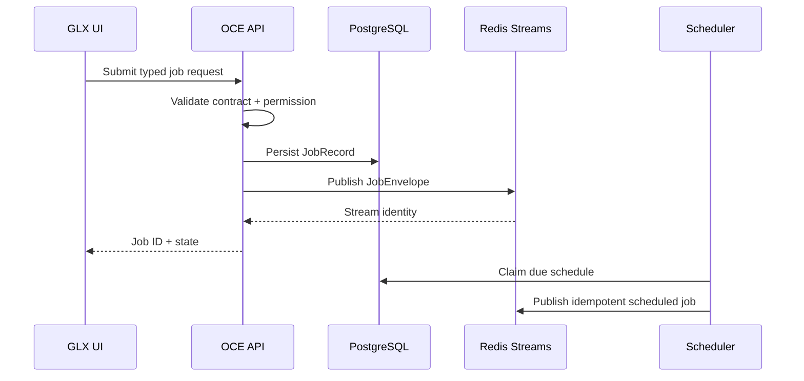
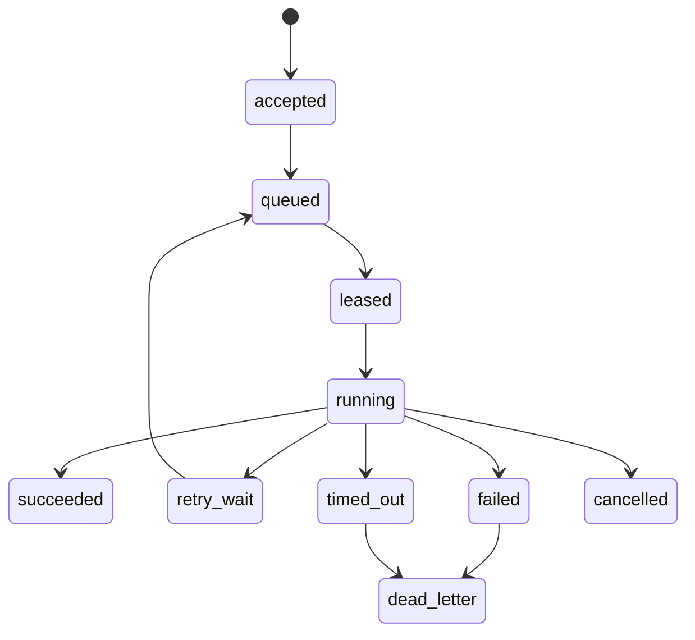

# Phase 2, Book 2 — Control Plane

> **Purpose:** Establish durable control state, distributed job transport, scheduling, and API/UI integration  
> **Input:** Book 1 service topology and Phase 1 contracts  
> **Output:** OCE control runtime backed by PostgreSQL and Redis Streams  
> **Previous:** [Book 1 — Service Topology and Containers](book-1-service-topology.md)  
> **Next:** [Book 3 — Worker Fabric](book-3-worker-fabric.md)

---

## 1. Success Statement

A typed job submitted to the OCE API is authorized, persisted, published once logically, visible in the UI, recoverable after service restart, and ready for an eligible worker without relying on in-process memory.

---

## 2. Applicable Anchors

- **A1:** One Orchestration Spine
- **A7:** OrderIntent Is the Execution Boundary
- **A10:** Observable and Reconstructable
- **A11:** Repair Before Expansion
- **A12:** Cheap Models Use Tools, Not Memory
- **F1:** Canonical schema and lineage
- **F2:** Control is always-on; heavy compute is disposable

---

## 3. Control Data Flow



---

## 4. Work Packages

### 4.1 PostgreSQL operational schema

Store:

```text
runtime_components
runtime_environments
workers
worker_capabilities
worker_leases
jobs
job_attempts
job_events
job_artifact_refs
schedules
dead_letters
permission_decision_refs
phase_gate_refs
runtime_incidents
```

Use Phase 1 typed IDs, versions, hashes, and artifact references.

Large logs, datasets, or results are referenced rather than embedded.

### 4.2 Migration discipline

Migrations:

- are ordered and versioned;
- include forward action and rollback/compensation policy;
- run under one migration owner;
- fail before readiness if incomplete;
- record applied version and checksum;
- do not silently migrate legacy SQLite data.

Phase 2 introduces FORGE PostgreSQL truth. Existing OCE SQLite stores remain behind approved adapters until a specific migration decision exists.

### 4.3 Job contracts

`JobRequest`:

```json
{
  "job_type": "registered-job-type",
  "job_version": "1.0.0",
  "environment": "research|test",
  "requested_by": "actor-id",
  "required_capabilities": [],
  "input_artifact_refs": [],
  "permission_decision_ref": "artifact-ref",
  "priority": 1,
  "timeout_seconds": 0,
  "max_attempts": 0,
  "resource_budget_ref": "config-id",
  "idempotency_key": "stable-key",
  "correlation_id": "workflow-id"
}
```

`JobRecord` adds:

- job ID;
- current state;
- timestamps;
- stream identity;
- current attempt;
- lease/worker;
- result/failure artifact references;
- cancellation state.

### 4.4 Job lifecycle



Every state change:

- validates against Phase 1 transition registry;
- commits authoritative state;
- emits a FORGE/OCE event;
- is idempotent.

### 4.5 Redis Streams transport

Define streams/consumer groups for:

```text
forge.jobs.agent
forge.jobs.scanner
forge.jobs.backtest
forge.jobs.gateway
forge.jobs.execution_disabled
forge.job.events
forge.dead_letters
```

Policies:

- stream message carries job identity and minimal dispatch metadata;
- PostgreSQL remains authoritative job state;
- message acknowledgment occurs only after durable state transition;
- pending entries are reclaimable after lease expiry;
- stream retention is bounded;
- dead-letter state references full durable evidence.

### 4.6 Transactional publication

Prevent database/stream split-brain through an outbox pattern or equivalent:

1. API transaction writes job and outbox event.
2. publisher sends outbox to Redis.
3. publisher records delivery identity.
4. retries use idempotency key.

Do not rely on “write database, then hope Redis succeeds.”

### 4.7 Scheduler

Schedules declare:

- schedule ID/version;
- registered job template;
- timezone;
- recurrence;
- next due time;
- catch-up policy;
- maximum lateness;
- overlap policy;
- enabled environment;
- permission decision;
- owner.

Scheduler uses database locking/claiming so multiple replicas do not create duplicate logical jobs.

Phase 2 schedules synthetic test jobs only.

### 4.8 OCE API integration

Endpoints:

```text
POST /forge/jobs
GET  /forge/jobs/{id}
GET  /forge/jobs
POST /forge/jobs/{id}/cancel
POST /forge/jobs/{id}/retry
GET  /forge/workers
GET  /forge/runtime/readiness
GET  /forge/runtime/versions
```

Every mutating endpoint:

- authenticates principal;
- validates Phase 1 contract;
- checks permission;
- records DecisionRecord reference;
- persists before publishing;
- emits OCE event.

### 4.9 UI control view

The GLX UI displays:

- job type/state;
- actor;
- environment;
- required capability;
- assigned worker;
- attempts;
- timestamps;
- artifact refs;
- failure/dead-letter reason;
- permission decision;
- correlation/replay link.

UI does not expose secrets or raw provider credentials.

### 4.10 Readiness

Control plane readiness requires:

- Phase 1 registries loaded;
- PostgreSQL reachable and migrations current;
- Redis reachable;
- outbox publisher active;
- a bounded write/read/delete or namespaced synthetic transaction succeeds;
- OCE event adapter operates;
- governance permission check operates.

---

## 5. Target Files

```text
forge/runtime/control/
├── models.py
├── repositories.py
├── migrations/
├── outbox.py
├── publisher.py
├── scheduler.py
├── api.py
└── readiness.py

forge/runtime/jobs/
├── contracts.py
├── lifecycle.py
├── streams.py
└── dead_letters.py

tests/forge/runtime/control/
├── test_migrations.py
├── test_job_api.py
├── test_outbox.py
├── test_redis_streams.py
├── test_scheduler.py
├── test_restart_recovery.py
└── test_control_readiness.py
```

---

## 6. Deliverables

- PostgreSQL schema and migrations.
- JobRequest/JobRecord/JobAttempt contracts.
- Job lifecycle integration.
- Redis stream/consumer-group definitions.
- Transactional outbox publisher.
- Idempotent scheduler.
- OCE API endpoints.
- GLX job/runtime view.
- Control readiness probe.
- Restart and stream-recovery fixtures.

---

## 7. Required Tests

### P2-PG-001 — Migration

Fresh database migrates to current version; repeated migration is safe; version/checksum are recorded.

### P2-PG-002 — Persistence restart

Job, attempt, artifact, schedule, and incident records survive API/database process restart.

### P2-RDS-001 — Stream restart

Queued and pending jobs remain recoverable after Redis restart under declared persistence policy.

### P2-RDS-002 — PostgreSQL authority

Conflicting or missing Redis messages cannot invent authoritative job state.

### P2-OUT-001 — Transactional publication

Failure between database commit and stream publish is recovered from the outbox without logical duplication.

### P2-API-001 — Authorized submission

A valid actor/request creates one JobRecord, one permission reference, and one logical queue publication.

### P2-API-002 — Invalid submission

Unknown job type/version/environment/capability or invalid artifact reference fails closed.

### P2-API-003 — Cancellation

Cancellation transitions legally and cannot erase completed history.

### P2-SCH-001 — Scheduler singleton effect

Multiple scheduler replicas create one logical job per due schedule window.

### P2-SCH-002 — Catch-up and overlap

Late, overlapping, and missed fixtures follow declared policies.

### P2-RDY-003 — Functional readiness

Readiness fails on stale migration, broken Redis, dead outbox publisher, failed permission adapter, or failed OCE event adapter.

### P2-OCE-001 — Single orchestration spine

Every job lifecycle fact emits through the Phase 1-approved OCE event adapter.

---

## 8. Failure Modes

| Failure | Response |
|---|---|
| Redis published but DB missing job | Reject message; record incident |
| DB committed but Redis unavailable | Outbox retries within budget |
| Scheduler replicas duplicate run | Idempotency/claim uniqueness blocks second effect |
| Legacy SQLite data needed | Add read adapter or explicit migration ADR |
| API accepts unregistered job | Constitutional violation; block endpoint |
| Readiness hardcodes success | Replace with representative transaction |
| UI becomes source of state | Correct to API/PostgreSQL-derived view |

---

## 9. Exit Gate

Book 2 completes when:

- Migrations and persistence pass.
- Outbox prevents split-brain.
- Redis recovery and pending-entry behavior pass.
- Scheduler produces one logical job.
- API permissions/events/artifacts are traceable.
- Control readiness is functional.
- UI accurately reflects authoritative state.
- No worker execution or live authority is embedded in the control API.

---

## 10. Handoff

Book 3 receives:

- Job contracts and lifecycle.
- PostgreSQL repositories.
- Redis stream/consumer-group names.
- Lease/attempt/dead-letter tables.
- Capability requirements.
- Outbox/idempotency behavior.
- Control API and worker-auth interface.
