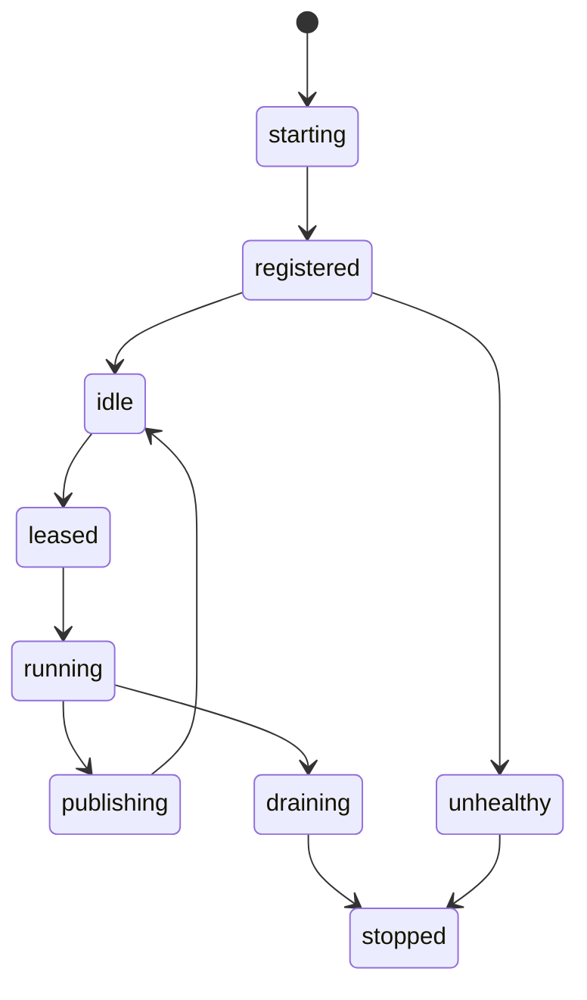
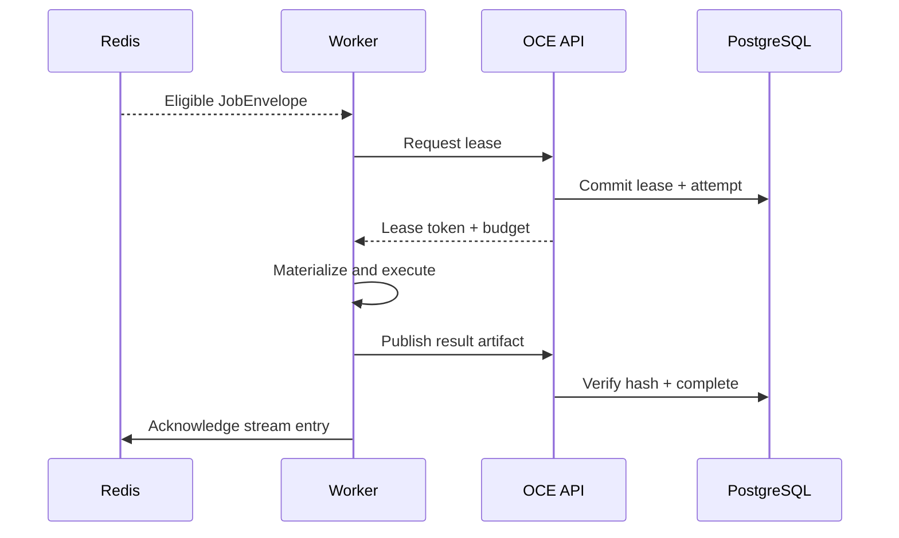

# Phase 2, Book 3 — Worker Fabric

> **Purpose:** Create an outbound-only, capability-aware, lease-based worker runtime for agents, scanners, backtests, gateways, and future execution adapters  
> **Input:** Book 2 control contracts and Phase 1 identities/permissions  
> **Output:** Disposable worker protocol, worker images, retry/dead-letter behavior, and reconnect proof  
> **Previous:** [Book 2 — Control Plane](book-2-control-plane.md)  
> **Next:** [Book 4 — Configuration and Security](book-4-configuration-security.md)

---

## 1. Success Statement

A local or temporary worker can authenticate outbound, register its real capabilities, lease an eligible job, execute within resource limits, publish immutable results, disconnect unexpectedly, and recover without duplicate material effects.

---

## 2. Applicable Anchors

- **A9:** Separate Research From Approval
- **A10:** Observable and Reconstructable
- **A12:** Cheap Models Use Tools, Not Memory
- **A13:** Local-First Heavy Compute
- **A15:** Live Autonomy Is Earned
- **F1:** Canonical schema and lineage
- **F2:** Control is always-on; heavy compute is disposable

---

## 3. Worker Lifecycle



---

## 4. Work Packages

### 4.1 Worker identity

Every worker declares:

- worker ID;
- principal/service identity;
- image digest and build SHA;
- environment;
- runtime/OS/architecture;
- contract versions;
- capabilities;
- resource capacity;
- current concurrency;
- lease/heartbeat timestamps;
- network zone;
- status.

Worker identity is not derived from hostname alone.

### 4.2 Capability registry

Initial capabilities:

```text
agent.research
agent.classify
agent.summarize
scanner.synthetic
backtest.fixture
gateway.openbb.health
artifact.publish
execution.disabled
```

Later phases add actual data, scanner, backtest, and adapter capabilities through approved registry versions.

Capability declarations include:

- version;
- accepted job types;
- required tools;
- supported asset/data classes;
- maximum input size;
- expected resource profile;
- environments;
- prohibited actions.

A worker cannot self-declare authority beyond its signed/approved registration policy.

### 4.3 Outbound connection

Worker initiates:

1. authenticated connection to control plane/Redis endpoint;
2. registration or lease renewal;
3. capability-specific consumer participation;
4. heartbeat;
5. result publication.

No router port-forward, public workstation listener, or inbound SSH is required.

### 4.4 Lease protocol

A job lease contains:

- job/attempt ID;
- worker ID;
- lease ID;
- lease start/expiry;
- heartbeat interval;
- allowed extensions;
- cancellation token/version;
- resource budget;
- expected output artifact type.

Rules:

- only one active lease per attempt;
- lease expiry makes work reclaimable;
- late result from expired lease is quarantined until reconciled;
- worker cannot extend beyond job timeout or authority scope;
- job state remains in PostgreSQL.

### 4.5 Execution sandbox

Each job receives:

- read-only contract/config mounts;
- job-specific scratch directory;
- explicit input artifact materialization;
- explicit output publication directory;
- bounded environment variables;
- CPU/memory/disk/process/time/network limits;
- no Docker socket;
- no host home-directory mount;
- no unrelated workspace write access;
- no broker credential in Phase 2.

### 4.6 Worker classes

#### Agent worker

- calls approved OpenRouter models;
- records model/provider/request metadata;
- uses tools for deterministic work;
- enforces token/time/cost budget;
- produces structured artifact only.

#### Scanner worker

- runs synthetic fixture scans in Phase 2;
- proves deterministic broad-job behavior;
- no real full-market integration until Phase 3/5.

#### Backtest worker

- runs bounded deterministic fixture backtests;
- proves heavy-job packaging and artifact publication;
- no strategy promotion.

#### OpenBB gateway

- proves package/server startup and provider-neutral health;
- credentials injected only when configured;
- returns normalized test fixture/health response;
- does not become data truth.

#### Execution node

- registers `execution.disabled`;
- rejects order-routing jobs;
- tests denial and isolation only.

### 4.7 Job execution protocol



Acknowledgment follows durable result/state acceptance.

### 4.8 Retry policy

Classify failure:

```text
transient
deterministic_input
permission
resource_exhaustion
timeout
worker_lost
provider_rate_limit
constitutional_violation
unknown
```

Retry rules are deterministic:

- retry only configured retryable classes;
- exponential/jitter policy bounded;
- same logical idempotency key;
- new attempt ID;
- preserve prior attempt evidence;
- no retry after cancellation or constitutional violation;
- exhausted attempt goes dead-letter.

### 4.9 Dead-letter handling

Dead-letter record includes:

- job and attempts;
- final failure class;
- input/output refs;
- sanitized log refs;
- worker/image identity;
- retry decisions;
- correlation chain;
- operator action required.

Dead-letter replay creates an approved new attempt; it does not erase the dead-letter record.

### 4.10 Draining and shutdown

Worker drain:

- stops leasing new work;
- reports status;
- completes or safely checkpoints eligible job;
- releases/reconciles lease;
- publishes final heartbeat;
- exits.

Hard loss is recovered by lease expiry.

---

## 5. Target Files

```text
forge/runtime/workers/
├── identity.py
├── capabilities.py
├── client.py
├── leases.py
├── heartbeat.py
├── sandbox.py
├── executor.py
├── results.py
├── retry.py
├── dead_letter.py
└── shutdown.py

forge/runtime/workers/types/
├── agent.py
├── scanner.py
├── backtest.py
├── openbb_gateway.py
└── execution_disabled.py

tests/forge/runtime/workers/
├── test_registration.py
├── test_capabilities.py
├── test_leases.py
├── test_disconnect.py
├── test_idempotency.py
├── test_retry.py
├── test_dead_letter.py
├── test_sandbox.py
└── test_shutdown.py
```

---

## 6. Deliverables

- Worker identity and registration contracts.
- Capability registry.
- Outbound worker client.
- Lease and heartbeat protocol.
- Job sandbox.
- Agent/scanner/backtest/gateway/disabled-execution worker types.
- Result publication and hash verification.
- Failure taxonomy.
- Retry and dead-letter handlers.
- Drain/shutdown flow.
- Local worker deployment guide.

---

## 7. Required Tests

### P2-WRK-001 — Capability match

Only a worker with the registered capability/version/environment can lease the job.

### P2-WRK-002 — False capability rejection

Self-declared unapproved capability does not expand worker eligibility.

### P2-LSE-001 — Exclusive lease

Two workers competing for one attempt yield one active lease.

### P2-LSE-002 — Lease expiry

Lost worker lease expires and job becomes safely reclaimable.

### P2-DSC-001 — Disconnect/reconnect

A worker disconnect during queued, leased, running, and publishing states follows declared recovery for each.

### P2-IDM-001 — Duplicate delivery

Duplicate stream delivery and repeated result publication create one material completion.

### P2-IDM-002 — Late stale result

Result from an expired/superseded lease cannot overwrite current authoritative state.

### P2-RTY-001 — Retry classification

Only retryable failure classes schedule another attempt.

### P2-RTY-002 — Attempt history

Retries preserve every prior attempt and use one logical job/idempotency identity.

### P2-DLQ-001 — Dead-letter completeness

Exhausted job produces a complete reconstructable dead-letter record.

### P2-RES-001 — Resource enforcement

CPU, memory, disk, process, concurrency, network, and wall-time fixtures terminate or throttle under policy.

### P2-SBX-001 — Filesystem isolation

Worker cannot read/write host home, unrelated workspace, credentials, or Docker socket.

### P2-NET-002 — Outbound-only

Worker completes the full fixture without a public inbound listener.

### P2-SDN-002 — Drain

Drain stops new leases and safely resolves active work.

### P2-EXE-001 — Execution disabled

Execution node rejects order-routing job types in every Phase 2 environment.

---

## 8. Failure Modes

| Failure | Response |
|---|---|
| Worker disappears | Lease expires; control plane reclaims under policy |
| Stale worker publishes result | Quarantine/reconcile; do not overwrite |
| Model call hangs | Enforce timeout and retry class |
| Worker asks for undeclared capability | Deny and record violation |
| Job writes outside scratch | Terminate and record sandbox violation |
| Retry repeats material side effect | Fix idempotency before enabling job type |
| Local worker needs inbound port | Redesign control connection |
| Execution node accepts order | Constitutional violation; block Phase 2 |

---

## 9. Exit Gate

Book 3 completes when:

- Worker identity/capability/lease tests pass.
- Outbound-only execution works.
- Disconnect/reconnect and stale-result handling pass.
- Duplicate delivery produces one effect.
- Retry/dead-letter history reconstructs.
- Sandbox/resource budgets enforce.
- All worker types produce valid artifacts.
- Execution remains disabled.
- Independent validator approves the worker fabric.

---

## 10. Handoff

Book 4 receives:

- Worker identities and service accounts.
- Required environment variables.
- Secret/provider requirements.
- Network destinations.
- Resource budget keys.
- Image/mount requirements.
- Log redaction surfaces.
- Permission and capability policies.
