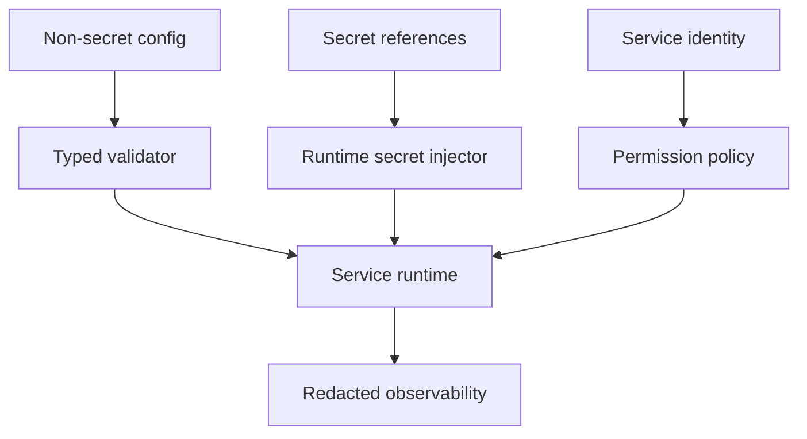

# Phase 2, Book 4 — Configuration and Security

> **Purpose:** Enforce typed configuration, environment isolation, runtime identity, secret injection, network policy, and resource boundaries  
> **Input:** Books 1–3 service and worker requirements plus Phase 1 authority contracts  
> **Output:** Secure runtime configuration system and verified secret/resource boundary  
> **Previous:** [Book 3 — Worker Fabric](book-3-worker-fabric.md)  
> **Next:** [Book 5 — Recovery and Runtime Lock](book-5-recovery-runtime-lock.md)

---

## 1. Success Statement

The same images run in development, cloud control, and local worker environments through validated external configuration, while no secret or environment ambiguity can leak into Git, images, logs, artifacts, or unauthorized services.

---

## 2. Applicable Anchors

- **A0:** Human Strategic Authority
- **A7:** OrderIntent Is the Execution Boundary
- **A10:** Observable and Reconstructable
- **A11:** Repair Before Expansion
- **A13:** Local-First Heavy Compute
- **A14:** No Unofficial Production Broker Dependency
- **F1:** Canonical schema and lineage
- **F2:** Control is always-on; heavy compute is disposable

---

## 3. Configuration Flow



---

## 4. Work Packages

### 4.1 Configuration schema

Define typed configuration for:

- runtime environment;
- service identity;
- contract versions;
- database/Redis endpoints;
- public/internal URLs;
- worker control endpoint;
- capability set;
- resource budgets;
- retry/timeouts;
- log level/format;
- telemetry;
- provider enablement;
- feature flags;
- storage paths;
- readiness behavior.

Unknown configuration fields fail unless explicitly allowed for forward compatibility.

### 4.2 Configuration precedence

Recommended precedence:

```text
compiled safe defaults
< versioned non-secret config
< environment-specific non-secret config
< runtime environment variables
< secret references resolved by platform
```

Command-line overrides are restricted and recorded. A local override cannot silently change environment or authority.

### 4.3 Environment identity

Every process receives an explicit signed/approved environment:

```text
development
test
research
```

Phase 2 rejects:

```text
paper
shadow
live
```

The environment is not inferred from URL, hostname, account, key name, or branch.

### 4.4 Secret model

Secret categories:

```text
database credential
redis credential
service identity credential
OpenRouter key
OpenBB provider key
future broker credential
encryption/signing key
```

Rules:

- only the service that requires a secret receives it;
- secret values never enter artifact bodies;
- logs redact value and sensitive headers;
- config dumps show names/status only;
- images contain no secrets;
- Git contains templates/references only;
- worker jobs receive short-lived or least-privilege credentials where possible;
- future broker credentials remain absent in Phase 2.

### 4.5 Service identity and authentication

Define service-to-service identity:

- OCE API;
- scheduler;
- each worker;
- UI;
- migration/backup job.

Authentication and authorization are distinct:

- authentication proves principal;
- Phase 1 permission engine authorizes action.

Worker tokens/credentials:

- are revocable;
- expire or rotate;
- bind to worker/environment/capabilities;
- cannot grant undeclared capability;
- are never worker-chosen authority.

### 4.6 Network policy

Allowlist by service:

| Service | Allowed destinations |
|---|---|
| UI | OCE API only |
| OCE API | PostgreSQL, Redis, approved internal services |
| Scheduler | PostgreSQL, Redis, OCE event/governance adapter |
| Agent worker | Control plane, OpenRouter, approved tools/providers |
| Scanner/backtest worker | Control plane, approved data gateway/storage |
| OpenBB gateway | Control plane, approved provider endpoints |
| Execution node | Control plane only in Phase 2; broker egress denied |

No worker receives unrestricted internal-network access by default.

### 4.7 Filesystem and mount policy

Classify mounts:

```text
contract_readonly
config_readonly
input_readonly
scratch_readwrite
artifact_publish_writeonly_or_scoped
database_managed
logs_scoped
```

Prohibit:

- host home;
- root filesystem;
- broad workspace root;
- Docker/Podman socket;
- SSH directories;
- browser profiles;
- unrelated data;
- production credential directories.

### 4.8 Resource budgets

Budget dimensions:

- CPU;
- memory;
- disk/scratch;
- process/thread count;
- concurrency;
- wall time;
- network requests/bytes;
- model tokens/cost;
- retry count;
- artifact output size.

Resource enforcement occurs at:

- container/runtime;
- worker executor;
- job policy;
- provider client.

### 4.9 Logging and redaction

Structured logs contain:

- timestamp;
- service/worker/job/trace IDs;
- severity;
- event/reason code;
- safe metadata.

Logs must not contain:

- secret values;
- authorization headers;
- full model prompts when sensitive;
- full broker/provider payloads;
- personal/account identifiers;
- raw environment dump;
- unbounded data rows.

### 4.10 Build and dependency security

Produce:

- pinned dependency lock where supported;
- image dependency inventory/SBOM;
- vulnerability scan;
- image provenance;
- base-image update policy;
- allowed-license report where needed;
- no install-at-start behavior for production images.

### 4.11 Security incidents

Events:

```text
forge.runtime.secret_exposure.detected
forge.runtime.identity_rejected
forge.runtime.network_policy.denied
forge.runtime.sandbox.violation
forge.runtime.resource_limit.exceeded
forge.runtime.image_policy.failed
```

Critical secret exposure blocks phase completion and triggers rotation outside the report.

---

## 5. Target Files

```text
forge/runtime/security/
├── config.py
├── environment.py
├── identity.py
├── secrets.py
├── redaction.py
├── network_policy.py
├── mounts.py
├── resources.py
└── incidents.py

deploy/config/
├── environment.schema.json
├── development.example.yml
├── test.example.yml
├── service-identities.yml
├── network-policy.yml
└── resource-budgets.yml

tests/forge/runtime/security/
├── fixtures/
├── test_config.py
├── test_environment.py
├── test_secrets.py
├── test_identity.py
├── test_network_policy.py
├── test_mounts.py
├── test_resources.py
└── test_redaction.py
```

---

## 6. Deliverables

- Typed configuration schema and validator.
- Configuration precedence rules.
- Explicit environment identity.
- Runtime secret-reference/injection interface.
- Service and worker identity policy.
- Network allowlist.
- Mount/filesystem policy.
- Resource-budget registry and enforcement hooks.
- Structured logging/redaction.
- Dependency/image security checks.
- Security incident events and runbook.
- Non-secret example configuration.

---

## 7. Required Tests

### P2-CFG-001 — Valid/invalid configuration

Valid configurations load; missing required fields, unknown critical fields, bad types, and invalid combinations fail before readiness.

### P2-CFG-002 — Precedence

Every override source follows documented precedence and records material runtime overrides.

### P2-ENV-001 — Explicit environment

Missing/unknown environment fails; hostname/key/branch cannot escalate it.

### P2-ENV-002 — Phase 2 ceiling

Paper, shadow, and live environment values are rejected by all Phase 2 services.

### P2-SEC-001 — Secret absence

Seeded secret fixtures do not appear in:

- Git-tracked output;
- image layers/history;
- logs;
- artifacts;
- API responses;
- UI state.

### P2-SEC-002 — Least privilege

Each service receives only its declared secret categories.

### P2-IDN-001 — Identity binding

Worker credential cannot change worker ID, environment, or approved capability scope.

### P2-IDN-002 — Revocation

Revoked/expired worker identity cannot lease or publish results.

### P2-NET-003 — Egress allowlist

Services can reach approved dependencies and are denied fixture unapproved destinations.

### P2-NET-004 — Broker denial

Execution node cannot reach broker endpoints in Phase 2.

### P2-MNT-001 — Mount isolation

Services cannot access host home, workspace root, engine socket, or unrelated credentials.

### P2-RES-002 — Multi-layer budget

Job exceeding CPU/memory/disk/time/token/request/output budgets is terminated or throttled with a typed event.

### P2-LOG-001 — Redaction

Seeded secrets and sensitive headers are redacted across exception, retry, HTTP, model, and worker logs.

### P2-IMG-004 — Dependency/image scan

Images produce provenance/SBOM and meet the approved critical-vulnerability policy.

---

## 8. Failure Modes

| Failure | Response |
|---|---|
| Service prints environment | Replace with allowlisted config summary |
| Secret appears in image layer | Rebuild from clean context and rotate secret |
| Worker credential grants authority | Separate identity from Phase 1 authorization |
| Runtime accepts “live” string | Fail closed before service readiness |
| Resource limit exists only in docs | Add runtime/worker enforcement |
| OpenBB/provider key reaches unrelated worker | Narrow secret injection |
| Docker socket mounted for convenience | Remove mount; use external orchestration |

---

## 9. Exit Gate

Book 4 completes when:

- Configuration and environment tests pass.
- Secret absence/redaction pass across every surface.
- Identities bind to approved scope.
- Network/mount/resource policies enforce.
- Images meet provenance/dependency policy.
- Execution broker egress is denied.
- Security incidents emit through OCE.
- Independent validator approves the runtime boundary.

---

## 10. Handoff

Book 5 receives:

- Validated configuration and environment schemas.
- Service identities and rotation/revocation behavior.
- Secret injection and redaction.
- Network/mount policies.
- Resource budgets.
- Image provenance/SBOM.
- Security incident events.
