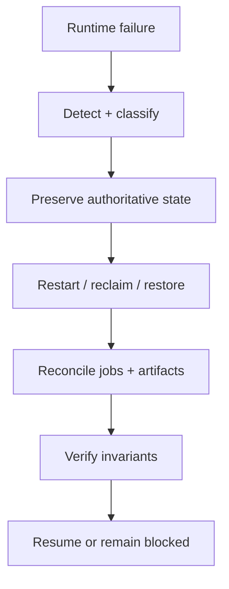

# Phase 2, Book 5 — Recovery and Runtime Lock

> **Purpose:** Prove backup, restore, restart, failure recovery, observability, cheap deployment, and the complete control-to-worker workflow  
> **Input:** Books 1–4 and approved Phase 1 gate/rollback contracts  
> **Output:** Runtime Lock Manifest and Phase 3 Data Forge handoff  
> **Previous:** [Book 4 — Configuration and Security](book-4-configuration-security.md)  
> **Next:** Phase 3 — Data Forge

---

## 1. Success Statement

The FORGE control plane can submit work to an outbound local worker, survive realistic interruptions, reconstruct the result, restore authoritative state from backup, and remain inside resource, security, and authority bounds.

---

## 2. Applicable Anchors

All master blueprint anchors apply. Closing emphasis:

- **A1:** One Orchestration Spine
- **A10:** Observable and Reconstructable
- **A11:** Repair Before Expansion
- **A13:** Local-First Heavy Compute
- **A15:** Live Autonomy Is Earned
- **F1:** Canonical schema and lineage
- **F2:** Control is always-on; heavy compute is disposable

---

## 3. Recovery Architecture



---

## 4. Work Packages

### 4.1 Observability contract

Collect:

- service health/readiness;
- build/contract/config versions;
- request rate/error/latency;
- PostgreSQL connection/migration health;
- Redis stream lag/pending/dead letters;
- outbox backlog;
- scheduler lag;
- worker count/capability/lease/heartbeat;
- job state/attempt/duration/resource usage;
- artifact publication failures;
- security/constitutional violations.

Metrics and logs reference trace, correlation, job, attempt, worker, and artifact IDs.

Avoid unbounded labels such as raw symbol lists, prompts, or exception bodies.

### 4.2 Failure matrix

Inject and document:

```text
OCE API restart
UI restart
PostgreSQL temporary outage
Redis temporary outage
scheduler duplicate replicas
outbox publisher outage
local worker disconnect
worker hard kill
worker restart
job timeout
resource exhaustion
result publish interruption
stale lease result
provider/model outage fixture
invalid/revoked identity
corrupt configuration
```

Each failure has:

- detection signal;
- authoritative state;
- automated response;
- retry/reclaim policy;
- operator action;
- recovery verification;
- data-loss expectation.

### 4.3 PostgreSQL backup

Define:

- backup scope;
- cadence;
- encryption;
- retention;
- integrity check;
- off-runtime copy;
- restore target;
- recovery point objective;
- recovery time objective;
- access policy.

Backup includes operational metadata and migration history, not external secret values.

### 4.4 Redis recovery

Redis is transport/coordination, not sole truth.

Define:

- persistence mode when used;
- restart behavior;
- stream recreation;
- consumer-group recreation;
- pending-entry recovery;
- outbox republish;
- PostgreSQL reconciliation;
- dead-letter preservation.

The system must rebuild required queue state from authoritative records where feasible.

### 4.5 Artifact recovery

For Phase 2 synthetic artifacts:

- verify content hash;
- publish atomically;
- retain successful outputs separately from scratch;
- recover interrupted publication;
- reject partial/corrupt output;
- reconstruct result references.

Phase 3 will extend this to data partitions.

### 4.6 Version upgrade and rollback

Test:

- rolling/restart upgrade of API and workers;
- mixed-version rejection/compatibility;
- database migration compatibility;
- worker drain;
- rollback to previous approved image/config/registry;
- post-rollback verification.

No auto-upgrade from mutable `latest` tag.

### 4.7 Cheap deployment recipes

Provide:

#### Cloud control recipe

- deploy OCE API, UI, scheduler;
- provision PostgreSQL/Redis privately;
- inject secrets/config;
- run migrations;
- verify readiness;
- expose UI/API only;
- set minimum resource/cost budgets;
- record deployment manifest.

Railway-specific files may implement this recipe without becoming canonical architecture.

#### Local worker recipe

- install Docker or Podman-compatible runtime;
- obtain approved worker identity;
- configure outbound control URL;
- start chosen worker profiles;
- verify registration/capabilities;
- stop/drain safely.

#### Burst worker recipe

- start immutable worker image;
- register restricted temporary identity;
- execute finite queue;
- publish artifacts;
- revoke identity;
- destroy worker.

### 4.8 End-to-end fixture

The required Phase 2 workflow:

1. UI/API submits a typed synthetic heavy job.
2. Permission decision allows research/test action.
3. PostgreSQL persists job and outbox.
4. Redis publishes eligible work.
5. Local outbound worker registers and leases.
6. Worker executes deterministic fixture.
7. During one run, worker is interrupted and job is reclaimed.
8. Result is published and hash verified.
9. Job completes once logically.
10. OCE events and DecisionRecords reconstruct.
11. UI displays final state.
12. Backup restores the completed record in a clean restore environment.

### 4.9 Soak and cost test

Run a bounded continuous fixture that measures:

- service stability;
- memory growth;
- queue lag;
- worker churn;
- log growth;
- database growth;
- retry/dead-letter rate;
- model/provider request budget;
- baseline cloud resources.

Phase 2 sets budget alerts; it does not promise a fixed vendor price.

### 4.10 Runtime Lock Manifest

```json
{
  "runtime_lock_id": "artifact-id",
  "repository_sha": "sha",
  "constitution_lock_id": "artifact-ref",
  "image_digests": {},
  "compose_version": "string",
  "migration_version": "string",
  "contract_versions": {},
  "config_hashes": {},
  "service_capabilities": {},
  "resource_budgets": {},
  "network_policy_hash": "hash",
  "backup_restore_report": "artifact-ref",
  "e2e_report": "artifact-ref",
  "security_report": "artifact-ref",
  "open_noncritical_items": [],
  "critical_blockers": [],
  "decision_record": "artifact-ref"
}
```

---

## 5. Deliverables

- Runtime observability dashboard/contracts.
- Failure-injection matrix and reports.
- PostgreSQL backup/restore scripts and runbook.
- Redis reconciliation/recovery runbook.
- Artifact publication recovery.
- Upgrade/rollback procedure.
- Cloud control deployment recipe.
- Local and burst worker recipes.
- End-to-end interruption/recovery fixture.
- Bounded soak/cost report.
- Runtime Lock Manifest.
- Independent validation report.
- Phase 3 Data Forge handoff.

---

## 6. Required Tests

### P2-OBS-001 — Trace continuity

One workflow traces API request through permission, database, outbox, Redis, worker, artifact, event, and UI state.

### P2-OBS-002 — Bounded telemetry

Metrics/log cardinality and retention remain within declared budgets.

### P2-BKP-001 — PostgreSQL restore

Backup restores into a clean environment with matching record counts, hashes, migrations, and critical job lineage.

### P2-BKP-002 — Secret exclusion

Backup and restore evidence contain no secret values.

### P2-RCV-001 — API/control restart

API/scheduler/outbox restarts do not lose or duplicate logical jobs.

### P2-RCV-002 — Redis rebuild

After Redis loss/restart, authoritative PostgreSQL/outbox state reconstructs required queue work.

### P2-RCV-003 — Worker interruption

Hard-killed worker job is reclaimed; stale result cannot overwrite the valid attempt.

### P2-ART-001 — Atomic result

Partial/corrupt artifact publication is rejected; complete artifact hash verifies.

### P2-UPG-001 — Version compatibility

Incompatible worker/control contract versions cannot lease; compatible declared versions operate.

### P2-RBK-001 — Runtime rollback

Previous approved image/config/registry restores and passes readiness plus critical workflow tests.

### P2-E2E-001 — Control-to-local completion

Full synthetic heavy job completes through outbound local worker and reconstructs end to end.

### P2-E2E-002 — Exactly one logical effect

Injected duplicate message, retry, reconnect, and result replay still yield one completed logical job.

### P2-SOK-001 — Bounded soak

Continuous fixture shows no unbounded memory, logs, queue lag, database, or retry growth beyond approved thresholds.

### P2-CST-001 — Resource/cost budget

Control plane and worker resource use are measured and remain within the declared Phase 2 budget or produce a blocker.

### P2-AUT-002 — Authority ceiling

No image, profile, configuration, job type, network rule, or identity enables paper, shadow, live, broker, or capital action.

### P2-P1-001 — Constitution preservation

Runtime loads and enforces Phase 1 contracts without redefining them.

---

## 7. Independent Validation Procedure

The validator:

1. Loads Phase 0/1 locks and Phase 2 context.
2. Builds images from clean context.
3. Starts control and worker profiles.
4. Verifies functional readiness.
5. Runs database/Redis/outbox tests.
6. Runs worker capability/lease/retry tests.
7. Runs configuration/secret/network/resource tests.
8. Executes backup/restore.
9. Executes interruption/recovery E2E.
10. Verifies one logical completion and full lineage.
11. Confirms no paper/live path exists.
12. Reviews soak/resource report.
13. Confirms Phase 3 handoff matches locked runtime.
14. Issues approve, reject, or approve-with-noncritical-findings.

The validator does not change runtime configuration while certifying it.

---

## 8. Failure Modes

| Failure | Response |
|---|---|
| Backup cannot restore | Block Phase 2 |
| Redis is sole copy of queued work | Rebuild authoritative/outbox model |
| Worker interruption duplicates result | Fix idempotency/lease reconciliation |
| Cloud recipe requires local inbound access | Redesign to outbound worker |
| Soak shows unbounded growth | Repair before Phase 3 |
| Rollback cannot pass readiness | Block deployment lock |
| Runtime enables broker egress | Constitutional violation |
| Phase 3 handoff embeds runtime redefinition | Remove or open Phase 2 ADR |

---

## 9. Exit Gate

Book 5 and Phase 2 complete when:

- All Book 1–5 tests pass.
- Fresh build/boot/readiness passes.
- Control-to-local-worker E2E completes.
- Interruptions recover without duplicate effect.
- Backup/restore and runtime rollback pass.
- Secret/network/resource policies pass.
- Soak and cost/resource budgets pass.
- OCE remains the sole orchestration/event/governance spine.
- Phase 1 contracts remain authoritative.
- No paper, shadow, live, broker, or capital authority exists.
- Runtime Lock Manifest reconstructs.
- Independent validation approves.

---

## 10. Phase 3 Handoff Contract

Phase 3 may:

- deploy OpenBB provider connectors;
- create provider/data jobs;
- establish Parquet and DuckDB catalogs;
- use PostgreSQL for data metadata;
- schedule bounded data ingestion;
- mount approved local/data storage;
- add data-quality and quarantine workers;
- use existing backup/observability patterns.

Phase 3 may not:

- redefine job/worker/event/permission contracts;
- make Redis the data lake;
- store bulk market data in PostgreSQL;
- expose local workers inbound;
- embed provider keys in artifacts/images;
- enable trading execution;
- bypass the Runtime Lock.

---

## 11. Phase Completion Event

```json
{
  "event_type": "forge.phase.completed",
  "event_version": "1.0.0",
  "phase": 2,
  "runtime_lock_id": "artifact-id",
  "repository_sha": "sha",
  "validation_report_id": "artifact-id",
  "decision_record_id": "artifact-id",
  "next_phase": 3
}
```

This event authorizes Phase 3 Data Forge planning and implementation only.
