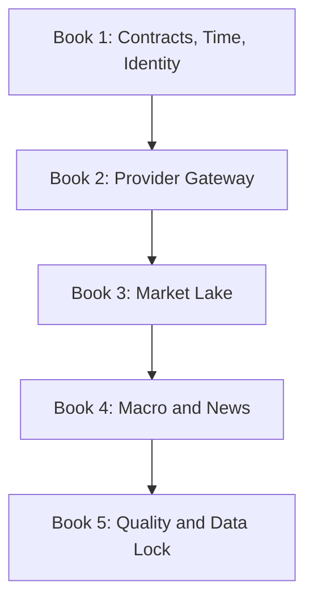
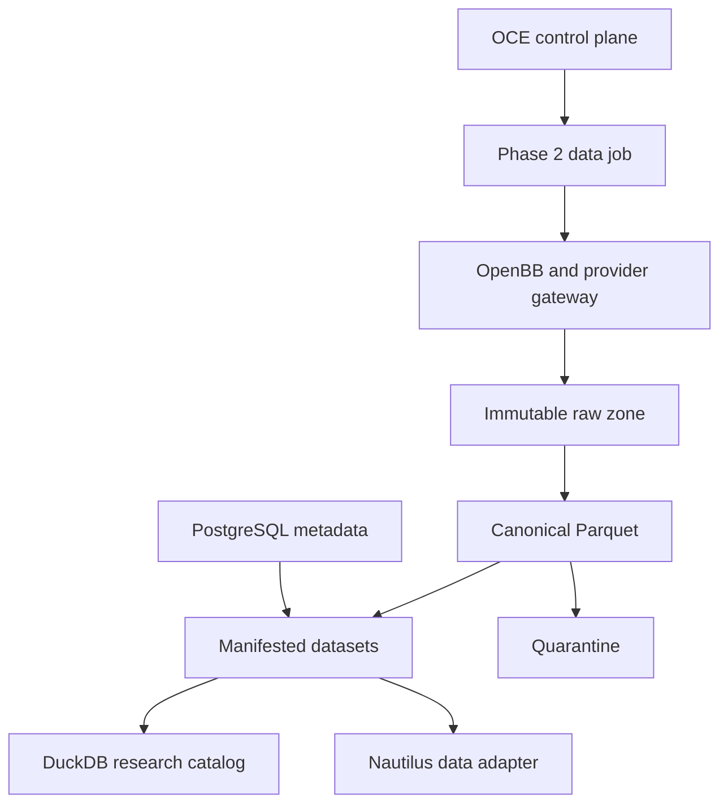

# GLX FORGE Phase 3 — Data Forge

> **Phase:** 3 of 11  
> **Purpose:** Build the point-in-time data substrate required for honest scanning, research, and backtesting  
> **Status:** Planned — implementation requires approved Phase 0, Phase 1, and Phase 2 locks  
> **Parent:** [`GLX_FORGE_MASTER_BLUEPRINT.md`](../../GLX_FORGE_MASTER_BLUEPRINT.md)  
> **Prerequisite:** [`Phase 2 — Runtime Foundry`](../phase-02-runtime-foundry/README.md)  
> **Phase anchor:** **F3 — A backtest result is invalid without a passing `DatasetManifest`.**

---

## 1. Phase Objective

Phase 3 creates the canonical evidence layer beneath every later market observer, scanner, research agent, and backtest:

- provider access is abstracted and versioned;
- every retrieved payload is attributable to a provider request and entitlement;
- raw observations are immutable;
- normalized market, reference, macro, and source records use registered schemas;
- instrument identity survives ticker changes, delistings, mergers, and venue changes;
- every historical query enforces what was knowable at the requested cutoff;
- bulk data lives in versioned Parquet partitions;
- DuckDB provides a rebuildable research catalog;
- PostgreSQL stores operational metadata, lineage, and quality state;
- failed or uncertain data is quarantined;
- only passing manifests and point-in-time universe snapshots may enter a backtest.

Phase 3 does not decide what a stock means, form a thesis, rank a candidate, build a strategy, qualify a backtest, or enable execution.



---

## 2. Reality at Phase Entry

Repository inspection establishes the following planning facts:

| Existing fact | Phase 3 consequence |
|---|---|
| OpenBB is not currently present in LARGER-LAB | Integrate it through a pinned gateway image and adapter; do not assume a vendored fork exists |
| `utils/data_fetcher.py` uses `yfinance` directly | Treat it as an ungoverned experimental source until adapted and validated |
| `fetch_sp500_tickers()` reads the current Wikipedia constituent list | It cannot satisfy historical universe or survivorship requirements |
| Legacy trading scripts load local CSVs and hard-coded download paths | They may be imported only through explicit source adapters and manifests |
| NautilusTrader exposes a `ParquetDataCatalog` | It is a downstream consumer/export target, not the Data Forge system of record |
| Phase 2 defines PostgreSQL, Redis Streams, bounded workers, and an OpenBB gateway runtime | Reuse those contracts; do not create another scheduler, queue, or worker protocol |
| Phase 1 defines `DatasetManifest`, `UniverseSnapshot`, `SourceRecord`, artifact lineage, permissions, and events | Extend these through registered compatible schemas; never redefine them inside a data service |

These are design inputs, not approval that Phase 0–2 execution gates have passed.

---

## 3. Canonical Data Decisions

| Concern | Canonical decision |
|---|---|
| Provider abstraction | OpenBB gateway plus explicit FORGE provider adapters |
| Provider authority | A provider supplies observations; it does not become canonical truth merely by responding |
| Raw capture | Immutable provider-native payload plus request/response metadata and content hash |
| Canonical storage | Versioned, typed Parquet partitions |
| Operational metadata | PostgreSQL |
| Research query engine | DuckDB views/catalog rebuilt from locked metadata and Parquet |
| Distributed work | Phase 2 jobs through Redis Streams |
| Stable identity | FORGE instrument, listing, issuer, venue, and series IDs; ticker is a time-bounded alias |
| Historical eligibility | `available_at <= as_of` plus effective-time and universe-membership rules |
| Corrections | New superseding versions; never in-place historical mutation |
| Adjustments | Raw prices remain unadjusted; adjusted series are derived with a declared action set and policy |
| Universe | Versioned definition plus immutable `UniverseSnapshot` |
| Backtest input | Passing `DatasetManifest` and `UniverseSnapshot` references only |
| Failed quality | Quarantine; never silent fallback |
| Secrets and licenses | Credential references and entitlement metadata only; no secret or prohibited content in artifacts |

---

## 4. Temporal Law

Every record type declares the timestamps it actually supports. These meanings may not be collapsed into a generic `timestamp`:

| Field | Meaning |
|---|---|
| `event_time` | When a trade, quote, bar, or real-world event occurred |
| `effective_at` | When a reference fact or membership began to apply |
| `published_at` | When the source says it published the information |
| `available_at` | Earliest conservative instant the system could lawfully and operationally know it |
| `retrieved_at` | When FORGE obtained the payload |
| `ingested_at` | When FORGE committed the observation |
| `superseded_at` | When a later version replaced the record for new queries |

For a historical cutoff \(T\), a record is eligible only when:

\[
\operatorname{eligible}(r,T)=
(r.\text{available\_at}\le T)
\land \operatorname{effective}(r,T)
\land \operatorname{quality\_passes}(r)
\]

If a source does not provide a trustworthy publication time, `available_at` defaults conservatively to `retrieved_at`; it is never guessed earlier.

---

## 5. Book Sequence

| Book | Name | Primary output | Gate |
|---:|---|---|---|
| 1 | [Data Contracts, Time, and Identity](book-1-contracts-time-identity.md) | Registered temporal and identity contracts | Contaminated time/identity fixtures fail closed |
| 2 | [Provider Gateway and Ingestion](book-2-provider-gateway-ingestion.md) | Pinned OpenBB boundary, provider registry, immutable raw capture | One provider job reconstructs from request through raw object |
| 3 | [Market and Reference Lake](book-3-market-reference-lake.md) | Point-in-time equities/reference lake and DuckDB catalog | Delisted, adjusted, session, and constituent fixtures reproduce |
| 4 | [Macro, News, and Vintage Archive](book-4-macro-news-vintages.md) | Revision-safe macro and source archive | Revised values and late news cannot leak before availability |
| 5 | [Quality, Manifests, and Data Lock](book-5-quality-manifests-data-lock.md) | Quality gates, manifest builder, contamination suite, Data Lock | Same manifest rebuilds the same eligible dataset |

Books execute in order. A later correction may supersede an earlier artifact but may not silently reinterpret it.

---

## 6. Data Plane Architecture



Rules:

1. Agents and application code do not call provider SDKs directly.
2. Raw payloads enter storage before normalization whenever licensing permits retention.
3. A normalized partition references its raw objects and transformer version.
4. DuckDB catalogs are reproducible views, not hidden mutable truth.
5. Nautilus loaders consume manifest-approved exports only.
6. Redis carries work and notifications, not bulk market history.
7. PostgreSQL stores metadata and lineage, not the bulk bar lake.

---

## 7. Initial Coverage Contract

Phase 3 proves one complete, affordable equity-centered vertical slice before broadening:

| Coverage tier | Minimum Phase 3 target | Explicit boundary |
|---|---|---|
| Reference | US equity issuer/listing/symbol history, venues, calendars, corporate actions | Missing delisting history blocks historical-universe claims |
| Universe | One broad US listed-equity definition and at least one historically sourced index universe | Current constituent pages cannot backfill history |
| Daily bars | Raw unadjusted OHLCV for current and delisted members over the approved test window | Provider depth and license must be recorded |
| Intraday bars | A bounded representative universe and window with session labels | Whole-market deep intraday is not promised by a free tier |
| Macro | At least one revised series with multiple vintages and one release calendar | Latest revised values cannot stand in for old vintages |
| News/source | Metadata, timestamps, hashes, and retained content only where rights permit | No assumption that every provider allows full-text storage |
| Options | Contract/reference schema and provider capability entry | Historical options are not declared available without licensed evidence |
| Crypto/FX | Compatible instrument/time contracts | Existing asset-specific adapters remain downstream and separately validated |

Unavailable coverage is represented as a typed capability gap, not synthetic data or an empty success.

---

## 8. Shared Deliverables

Target implementation layout:

```text
forge/data/
├── contracts/
├── providers/
├── ingestion/
├── identity/
├── market/
├── macro/
├── sources/
├── quality/
├── manifests/
└── catalog/

deploy/config/
├── provider-registry.yml
├── data-domains.yml
├── quality-policies.yml
├── retention-policies.yml
└── data-resource-budgets.yml

tests/forge/data/
├── contracts/
├── providers/
├── point_in_time/
├── quality/
├── contamination/
├── reproducibility/
└── e2e/

artifacts/forge/phase-03/
├── provider-registry-lock.json
├── schema-registry-lock.json
├── instrument-master-snapshot.json
├── quality-policy-lock.json
├── golden-dataset-manifest.json
├── golden-universe-snapshot.json
├── data-lock-manifest.json
└── phase-03-validation-report.json
```

Bulk raw, canonical, curated, and quarantine objects live on approved data volumes/object storage and remain outside Git. Exact paths defer to the Reality Lock and Runtime Lock.

---

## 9. Phase Test Matrix

| Test ID | Requirement | Book |
|---|---|---:|
| P3-TIM-001 | Availability cutoff prevents future knowledge | 1 |
| P3-IDN-001 | Ticker changes resolve to stable instruments by time | 1 |
| P3-SCH-001 | Canonical schemas reject ambiguous timestamps and identities | 1 |
| P3-PRV-001 | Only registered, entitled provider capabilities execute | 2 |
| P3-RAW-001 | Provider response reconstructs from immutable raw evidence | 2 |
| P3-RAT-001 | Rate limits, retries, and pagination remain bounded and traceable | 2 |
| P3-MKT-001 | OHLCV schema and timestamp invariants enforce | 3 |
| P3-CA-001 | Split and dividend policies reconcile without rewriting raw prices | 3 |
| P3-UNI-001 | Point-in-time constituents include delisted members correctly | 3 |
| P3-SES-001 | Regular and extended sessions remain separable | 3 |
| P3-MAC-001 | Macro-vintage selection cannot see later revisions | 4 |
| P3-SRC-001 | Publication, availability, and retrieval times remain distinct | 4 |
| P3-LIC-001 | Retention behavior follows source entitlement | 4 |
| P3-DQ-001 | Duplicate, gap, outlier, timezone, and integrity checks enforce | 5 |
| P3-QTN-001 | Failed partitions cannot enter passing manifests | 5 |
| P3-MAN-001 | Manifest materialization is content-reproducible | 5 |
| P3-CNT-001 | Survivorship, revision, adjustment, and timezone contamination is detected | 5 |
| P3-E2E-001 | Provider-to-manifest-to-DuckDB-to-Nautilus lineage reconstructs | 5 |
| P3-AUT-001 | No Phase 3 path creates strategy judgment or execution authority | 5 |

The books define the complete test set; this matrix names the phase-critical gates.

---

## 10. Phase-Wide Invariants

1. OCE remains the sole orchestrator and event/governance spine.
2. Phase 1 artifact, event, permission, and lifecycle contracts remain authoritative.
3. Phase 2 job, worker, secret, network, and runtime contracts remain authoritative.
4. Every external observation identifies provider, request, retrieval, schema, and content hash.
5. Raw observations are immutable.
6. Canonical corrections supersede; they never erase.
7. Provider symbol is never the sole instrument identity.
8. Historical queries require `as_of`.
9. Unknown or ambiguous timestamp semantics fail closed.
10. Current constituents cannot answer historical-universe questions.
11. Latest macro values cannot answer historical-vintage questions.
12. Raw and adjusted prices are distinct products.
13. Session policy is explicit.
14. Missing coverage is visible and typed.
15. Quarantined data is inaccessible to manifest builders.
16. A manifest is invalid unless all referenced quality decisions pass.
17. The same manifest resolves the same ordered logical rows and hashes.
18. Models may classify metadata; deterministic code controls ingestion, time filters, checks, and hashes.
19. Provider keys and prohibited licensed content do not enter manifests, logs, Git, or agent prompts.
20. Phase 3 does not enable paper, shadow, live, broker, order, or capital authority.

---

## 11. Agent Extension Contract

Before changing Data Forge, an agent must load:

1. the master anchors;
2. the approved Phase 0 Reality Lock;
3. the Phase 1 Constitution Lock;
4. the Phase 2 Runtime Lock;
5. this phase index;
6. the book governing the component being changed;
7. the active schema, provider, quality, and Data Lock artifacts.

The agent must state:

```yaml
domain: market|reference|macro|source|catalog|quality|manifest
change_type: schema|provider|ingestion|storage|policy|query|correction
historical_cutoff_semantics: explicit
stable_identity_scope: explicit
provider_and_entitlement_scope: explicit
input_artifacts: []
output_artifact: typed
affected_test_ids: []
supersession_or_migration: explicit
rollback_or_disable_path: explicit
```

The agent must stop rather than infer when:

- timestamp meaning is unknown;
- instrument identity conflicts;
- provider entitlement is unclear;
- historical membership or delisting evidence is missing;
- raw versus adjusted semantics are ambiguous;
- a quality finding is blocking;
- a requested path would bypass a manifest;
- a change would redefine Phase 1 or Phase 2 contracts.

Every Phase 3 change must preserve these negative boundaries:

- no direct provider access from governed consumers;
- no arbitrary file path as canonical input;
- no unqualified `latest` historical query;
- no current constituent list as historical truth;
- no in-place correction or silent repair;
- no model-controlled routing, quality disposition, hashing, or time filtering;
- no research thesis, strategy, order, broker, or capital authority.

This section is the minimum startup anchor. It does not replace the detailed books.

---

## 12. Phase Completion Definition

Phase 3 is complete only when:

- All five books pass their exit gates.
- The provider and extension lock is reproducible from a clean gateway build.
- At least one end-to-end equity vertical slice includes current and delisted instruments.
- Every canonical row resolves to immutable raw evidence or an explicit retention exception.
- Instrument and ticker history resolves correctly at historical cutoffs.
- Corporate actions reconcile under declared raw and adjusted policies.
- Point-in-time universe snapshots reject current-constituent leakage.
- Macro queries reproduce the vintage available at the requested cutoff.
- News/source records preserve publication, availability, and retrieval semantics.
- Duplicate, gap, outlier, timezone, session, and referential checks pass.
- Intentional contamination fails the correct gate.
- Quarantined partitions cannot be manifested.
- A passing `DatasetManifest` rebuilds the same logical rows and content hash twice.
- The DuckDB catalog rebuilds from locked metadata and Parquet.
- A Nautilus-compatible dataset is exported only from a passing manifest.
- Data backup, restore, and supersession preserve old manifest reconstruction.
- No provider secret, prohibited content, strategy judgment, or execution authority leaks into the data plane.
- The Data Lock and Phase 4 handoff are independently validated.

---

## 13. Handoff to Phase 4

Phase 4 — Intelligence Forge receives:

- read-only, point-in-time query contracts;
- registered `SourceRecord` production;
- macro release/vintage and economic-calendar records;
- news and filing metadata with lawful content references;
- stable issuer, instrument, listing, symbol, sector, and industry identities;
- passing `DatasetManifest` and `UniverseSnapshot` builders;
- provider/source reliability metadata;
- quality findings and coverage gaps;
- immutable citations and content hashes;
- OCE data events and job interfaces.

Phase 4 may create `MarketEvent` and `ResearchThesis` artifacts from this evidence. It may not rewrite source timestamps, repair quarantined data silently, infer missing history as fact, or query without an explicit point-in-time policy.
