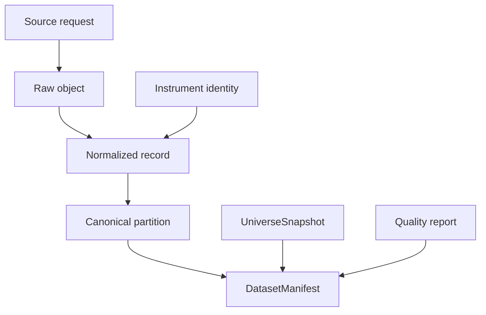
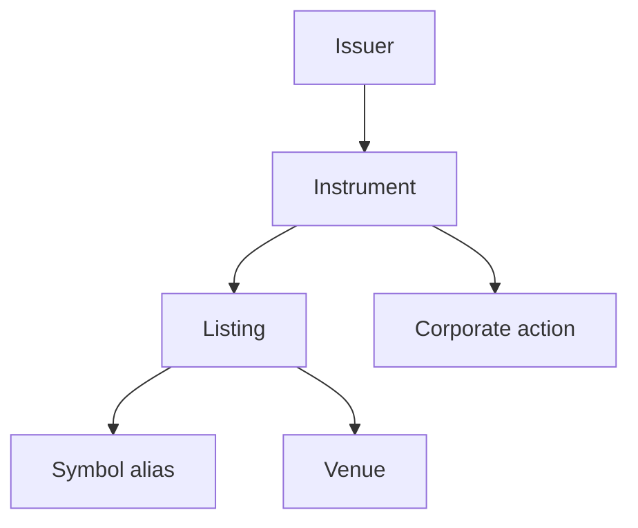
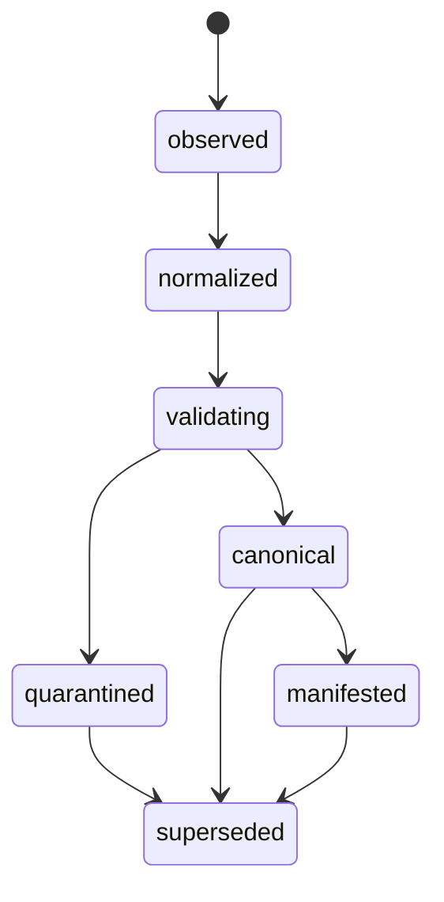

# Phase 3, Book 1 — Data Contracts, Time, and Identity

> **Purpose:** Define the schema, temporal, identity, lineage, and query laws shared by every Data Forge component  
> **Input:** Approved Constitution Lock and Runtime Lock  
> **Output:** Registered Phase 3 contract package and deterministic fixtures  
> **Next:** [Book 2 — Provider Gateway and Ingestion](book-2-provider-gateway-ingestion.md)

---

## 1. Success Statement

Every data record can answer, without prose interpretation:

- what it represents;
- which stable entity it belongs to;
- where it came from;
- when the underlying fact occurred;
- when it became effective;
- when it was published, available, retrieved, and ingested;
- which schema and transformer produced it;
- which historical queries may lawfully include it;
- what superseded it.

Ambiguous identity or time semantics fail before storage becomes canonical.

---

## 2. Applicable Anchors

- **A1:** One Orchestration Spine
- **A2:** Evidence Before Narrative
- **A3:** Point-in-Time Data
- **A6:** Nautilus Is the Canonical Trading Model
- **A10:** Observable and Reconstructable
- **A11:** Repair Before Expansion
- **A12:** Cheap Models Use Tools, Not Memory
- **F1:** If an object has no canonical schema and lineage, it does not exist operationally
- **F2:** Control is always-on; heavy compute is disposable
- **F3:** A backtest result is invalid without a passing `DatasetManifest`

---

## 3. Contract Topology



The Phase 1 `ArtifactEnvelope`, `ArtifactRef`, hashing, lineage, and schema registry remain authoritative. Phase 3 adds compatible typed bodies and data-plane registries through the Phase 1 contract-change process.

---

## 4. Work Packages

### 4.1 Timestamp vocabulary

Register timestamp fields with one meaning each:

| Field | Required for | Rule |
|---|---|---|
| `event_time` | bars, trades, quotes, releases, actions | UTC instant of the represented occurrence |
| `period_start` / `period_end` | aggregated observations | Half-open interval unless schema says otherwise |
| `effective_at` | symbol, listing, membership, reference facts | First instant the fact applies |
| `effective_until` | time-bounded facts | Exclusive end; null means open-ended |
| `published_at` | macro, news, filings, actions | Source-declared publication instant |
| `available_at` | every point-in-time fact | Conservative first knowable instant |
| `retrieved_at` | every external request | FORGE receipt time from a monotonic capture clock |
| `ingested_at` | every committed normalized record | Canonical commit time |
| `superseded_at` | corrected versions | First instant new queries stop selecting the old version |

Requirements:

- serialize as RFC 3339 UTC with explicit offset;
- retain original timezone and source string in raw metadata;
- retain timestamp precision;
- never localize a naive timestamp without a registered provider rule;
- distinguish bar start from bar end;
- declare whether publication dates without times use a conservative market-calendar rule or retrieval time;
- record the clock source and maximum observed skew for ingestion jobs.

### 4.2 Availability derivation

Each data domain registers an `availability_policy_id`.

Examples:

```text
market_bar:
  available_at = period_end + provider_delivery_delay

macro_vintage:
  available_at = max(published_at, provider_visible_at, retrieved_floor)

news_record:
  available_at = published_at only when publisher timestamp is trusted;
  otherwise retrieved_at

universe_membership:
  available_at = source announcement/publication time,
  not merely effective_at
```

The derivation stores:

- inputs;
- selected rule and version;
- conservative fallbacks;
- uncertainty flags;
- resulting `available_at`.

No model may infer an earlier availability time.

### 4.3 Stable identity model

Create typed, non-semantic IDs:

```text
issuer_id
instrument_id
listing_id
venue_id
provider_symbol_id
corporate_action_id
universe_definition_id
macro_series_id
source_identity_id
```

Identity relationships:



Rules:

- an issuer may have multiple instruments;
- an instrument may have multiple listings;
- a listing may have multiple time-bounded symbols;
- ticker text never serves as a global key;
- identifiers from FIGI, CUSIP, ISIN, CIK, OCC, vendor systems, or venues remain typed aliases with source and validity;
- conflicting identifiers create a review state rather than an automatic merge;
- delisted instruments remain resolvable;
- symbol reuse by another issuer is supported;
- mergers, conversions, spin-offs, and successor instruments use explicit relationships.

### 4.4 Bitemporal reference facts

Reference records preserve:

- valid/effective time: when the fact applies in the market;
- system/availability time: when FORGE could know that version.

For a cutoff \(T\), selection requires both:

```text
effective_at <= T < effective_until
available_at <= T
superseded_at is null or T < superseded_at
```

Where the research question separates market-effective time from knowledge time, both cutoffs must be explicit.

### 4.5 Raw object contract

A `RawObjectRecord` contains:

```yaml
raw_object_id: typed-id
provider_id: provider-registry-id
request_id: source-request-id
retrieved_at: RFC3339 UTC
media_type: provider response media type
storage_uri: opaque approved URI
byte_size: integer
content_hash: algorithm:value
compression: optional
encryption_profile: profile-id
retention_policy_id: policy-id
license_decision_id: decision-id
response_status: success|partial|empty|failed
payload_schema_hint: optional
supersedes: optional raw-object-id
```

The record never contains credentials, authorization headers, signed URLs, or prohibited full-text content.

If licensing prohibits raw retention, create a `RawRetentionException` with:

- provider request and response metadata;
- permitted hashes/row counts;
- reason and license decision;
- reproduction limitations;
- expiry/review date.

The exception is visible in every descendant manifest.

### 4.6 Canonical record envelope

Every normalized row or row group carries or inherits:

- canonical schema name/version;
- domain and grain;
- stable entity IDs;
- event/effective/availability semantics;
- provider ID;
- raw object reference;
- transformer code/build version;
- ingestion run ID;
- quality state;
- correction/supersession reference.

Repeated provenance may live in immutable partition metadata when every row shares it.

### 4.7 Canonical domain schemas

Register minimum schemas for:

| Schema | Grain |
|---|---|
| `InstrumentRecord` | One instrument identity version |
| `ListingRecord` | One listing validity interval |
| `SymbolAliasRecord` | One provider/venue symbol validity interval |
| `TradingCalendarRecord` | One calendar version |
| `CorporateActionRecord` | One action version |
| `OHLCVBarRecord` | One instrument, interval, and period |
| `UniverseMembershipRecord` | One universe/instrument validity version |
| `MacroObservationRecord` | One series, observation period, and vintage |
| `EconomicReleaseRecord` | One scheduled/released event version |
| `SourceRecord` | One source item/version under Phase 1 contract |
| `CanonicalPartitionRecord` | One immutable partition object |
| `DataQualityReport` | One policy execution against fixed inputs |

Book 3 and Book 4 complete domain-specific fields.

### 4.8 Point-in-time query contract

All historical readers require:

```yaml
dataset_domain: registered-domain
as_of: RFC3339 UTC
effective_range:
  start: RFC3339 UTC
  end: RFC3339 UTC
universe_snapshot_id: typed-id
session_policy_id: policy-id
adjustment_policy_id: policy-id
quality_policy_id: policy-id
revision_policy_id: policy-id
required_fields: []
sort_contract: []
```

Rules:

- omitted `as_of` is invalid for backtest/research materialization;
- “latest” is allowed only for explicitly current operational views;
- latest queries are labeled non-reproducible until frozen into a manifest;
- readers cannot silently replace unavailable fields or symbols;
- result metadata reports gaps, exclusions, and coverage.

### 4.9 Dataset and universe compatibility

Phase 3 does not replace the Phase 1 `DatasetManifest` or `UniverseSnapshot`. It registers compatible versions with:

`DatasetManifest` additions:

- manifest semantic hash;
- query contract;
- provider registry lock;
- schema registry lock;
- instrument-master snapshot;
- universe snapshot;
- partition references and hashes;
- time, session, adjustment, revision, and quality policies;
- raw-retention exceptions;
- materializer version;
- logical row count and canonical content hash.

`UniverseSnapshot` additions:

- definition version;
- effective and knowledge cutoffs;
- membership evidence;
- delisting treatment;
- stable IDs and contemporaneous symbols;
- exclusions with reason codes;
- source coverage and quality state.

### 4.10 Lifecycle



No state transition deletes the prior object. `superseded` means excluded from new default resolution, not unreconstructable.

### 4.11 Contract-change procedure

Any new field or data type must:

1. identify the existing registered schema;
2. classify the change as compatible or breaking;
3. provide migration/read compatibility;
4. add golden fixtures;
5. register event and permission changes through Phase 1;
6. identify affected manifests;
7. receive independent validation.

Agents may propose schemas. Deterministic validators decide conformance.

---

## 5. Target Implementation Layout

```text
forge/data/contracts/
├── time.py
├── identity.py
├── raw.py
├── market.py
├── reference.py
├── macro.py
├── sources.py
├── quality.py
├── query.py
└── manifests.py

forge/data/identity/
├── resolver.py
├── conflicts.py
└── repository.py

tests/forge/data/contracts/
tests/forge/data/point_in_time/
```

Generated JSON Schema and documentation live under the Phase 1 schema registry layout.

---

## 6. Deliverables

- Timestamp vocabulary and availability-policy registry.
- Stable identity and relationship schemas.
- Bitemporal selection rules.
- Raw object and retention-exception schemas.
- Canonical record envelope.
- Initial domain schemas.
- Point-in-time query contract.
- Compatible `DatasetManifest` and `UniverseSnapshot` schema proposals.
- Lifecycle additions through Phase 1 registries.
- Golden and contaminated fixtures.
- Contract migration and compatibility matrix.

---

## 7. Required Tests

### P3-TIM-001 — Future availability exclusion

A record with `event_time <= as_of` but `available_at > as_of` is excluded.

### P3-TIM-002 — Naive timestamp rejection

Naive timestamps fail unless a registered provider rule resolves and records the original timezone semantics.

### P3-TIM-003 — Bar boundary

Bar start/end meaning, interval closure, precision, and availability delay remain stable through serialization.

### P3-TIM-004 — DST transition

Spring-forward and fall-back fixtures resolve without duplicate UTC instants, missing legitimate sessions, or silent localization.

### P3-TIM-005 — Conservative fallback

Untrusted or missing publication time cannot produce `available_at` earlier than retrieval.

### P3-IDN-001 — Symbol history

One instrument resolves its correct ticker before and after a symbol change.

### P3-IDN-002 — Symbol reuse

The same ticker reused by a different issuer does not merge instrument identity.

### P3-IDN-003 — Delisted persistence

A delisted instrument remains resolvable at historical cutoffs and absent only when the query policy requires it.

### P3-IDN-004 — Identifier conflict

Conflicting provider identifiers enter review and cannot auto-merge canonical entities.

### P3-BIT-001 — Bitemporal selection

Effective-time and availability-time fixtures return the version knowable at the requested cutoff.

### P3-SCH-001 — Schema strictness

Unknown critical fields, ambiguous timestamps, invalid IDs, and mismatched grain fail validation.

### P3-SCH-002 — Compatibility

Compatible schema versions read successfully; breaking versions fail without an explicit migration.

### P3-RAW-000 — Raw contract secrecy

Credential, authorization-header, signed-URL, and prohibited-content fixtures are rejected.

### P3-QRY-001 — Explicit cutoff

Research/backtest readers reject omitted `as_of`, universe, session, adjustment, revision, or quality policy.

### P3-QRY-002 — No silent substitution

Unavailable symbols, fields, or partitions produce typed gaps rather than fabricated, forward-filled, or fallback data.

### P3-LIN-001 — Record lineage

A canonical record reconstructs provider request, raw object, transformer, schema, ingestion run, and supersession chain.

---

## 8. Failure Modes

| Failure | Required response |
|---|---|
| One `timestamp` field is used for all meanings | Reject schema and split semantics |
| Provider ticker becomes instrument ID | Create stable identity and time-bounded alias |
| Publication time is guessed | Use conservative retrieval-based availability |
| Corrected record overwrites history | Restore old object and publish superseding version |
| Latest query enters a backtest | Block until frozen into a manifest |
| Missing field is forward-filled by default | Reject or require an explicit transformation policy |
| Identifier conflict auto-merges issuers | Quarantine mapping for steward review |
| Schema change bypasses Phase 1 | Block deployment and open a contract proposal |

---

## 9. Exit Gate

Book 1 completes when:

- Every Phase 3 timestamp has one registered meaning.
- Bitemporal selection and conservative availability pass.
- Stable identity handles ticker change, reuse, and delisting.
- Raw and canonical contracts validate.
- Point-in-time readers require all material policies.
- `DatasetManifest` and `UniverseSnapshot` additions are compatible and registered.
- Lineage reconstructs end to end.
- Intentional time and identity contamination fails.
- Independent validation approves the contract package.

---

## 10. Handoff

Book 2 receives:

- provider-independent raw object contract;
- provider request identity;
- timestamp and availability policies;
- stable identity resolver interface;
- canonical record envelope;
- schema registry versions;
- retention-exception contract;
- lineage and lifecycle requirements;
- point-in-time query obligations.
