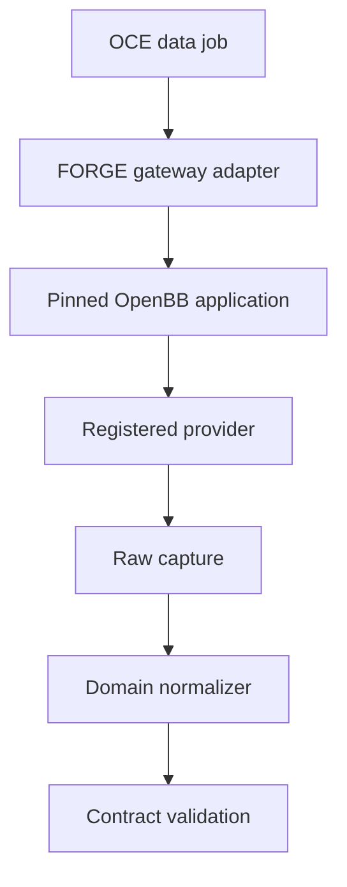
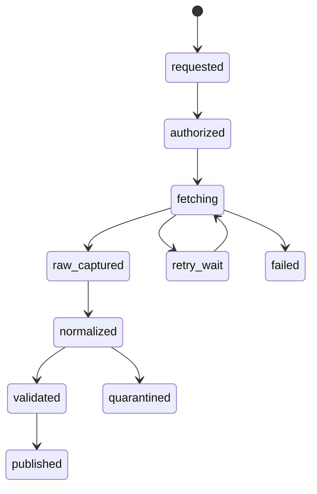

# Phase 3, Book 2 — Provider Gateway and Ingestion

> **Purpose:** Build the controlled boundary between external data providers and immutable FORGE observations  
> **Input:** Book 1 contracts plus Phase 2 jobs, workers, secrets, and runtime identity  
> **Output:** Pinned gateway, provider registry, ingestion state machine, and raw capture  
> **Previous:** [Book 1 — Data Contracts, Time, and Identity](book-1-contracts-time-identity.md)  
> **Next:** [Book 3 — Market and Reference Lake](book-3-market-reference-lake.md)

---

## 1. Success Statement

Every provider call is authorized, capability-checked, rate-bounded, attributable, reproducible as far as the provider permits, and captured as immutable evidence before its normalized output can become canonical.

No agent, scanner, notebook, or backtest reaches a provider SDK or secret directly.

---

## 2. Applicable Anchors

- **A1:** One Orchestration Spine
- **A2:** Evidence Before Narrative
- **A3:** Point-in-Time Data
- **A10:** Observable and Reconstructable
- **A11:** Repair Before Expansion
- **A12:** Cheap Models Use Tools, Not Memory
- **A13:** Local-First Heavy Compute
- **F1:** Canonical schema and lineage
- **F2:** Disposable heavy compute
- **F3:** Passing manifest required

---

## 3. Gateway Boundary

OpenBB is the normalized provider-access gateway. It is not:

- the canonical data lake;
- the final instrument identity authority;
- a guarantee that two providers mean the same field;
- a point-in-time universe source by default;
- the backtest engine;
- the scheduler;
- a secret store;
- a fallback license.



The gateway adapter owns FORGE request/response contracts. Provider-specific payloads stay behind it.

---

## 4. Work Packages

### 4.1 OpenBB application lock

Build a dedicated gateway image with:

- exact OpenBB core/package versions;
- exact provider-extension package versions;
- Python runtime and dependency lock;
- generated OpenBB static assets;
- build command and build hash;
- installed route/model inventory;
- license inventory and review;
- image SBOM and provenance;
- startup/readiness probe that performs a bounded model/route check.

The build must run OpenBB's supported asset-generation step after installing the selected extensions. Do not install every provider extension.

The `ProviderRegistryLock` records:

```yaml
gateway_build_id: build-id
openbb_version: exact-version
python_version: exact-version
extensions:
  - package: extension-package
    version: exact-version
    hashes: []
routes_hash: algorithm:value
models_hash: algorithm:value
license_review_id: decision-id
repository_sha: sha
```

An upgrade creates a new lock and compatibility report.

### 4.2 Provider registry

Each provider capability declares:

| Field group | Required metadata |
|---|---|
| Identity | provider ID, legal/source name, adapter version |
| Capability | domains, asset classes, endpoints, intervals, fields, history depth |
| Semantics | timezone, bar boundaries, adjustments, corrections, null/empty behavior |
| Access | auth type, credential reference, environments, service identity |
| Entitlement | allowed uses, retention, redistribution, display, derived-data rules |
| Limits | per-second/minute/day limits, concurrency, batch size, pagination |
| Reliability | expected latency, delay, uptime, correction behavior, quality tier |
| Cost | free/paid tier, unit budget, overage prohibition |
| Fallback | approved alternatives and whether blending is forbidden |
| Governance | owner, review date, license decision, activation state |

Activation states:

```text
proposed
validated
active_research
suspended
expired
revoked
```

A provider is never activated merely because a key works.

### 4.3 Capability negotiation

Before a job is accepted, deterministic code checks:

- domain and asset class;
- requested symbols/IDs;
- fields and interval;
- historical window;
- adjustment expectation;
- required publication/vintage semantics;
- entitlement and retention;
- environment;
- cost and request budget;
- current provider/extension lock.

Unsupported requests fail with a typed `CapabilityGap`. They do not silently downgrade interval, history, provider, fields, or adjustment policy.

### 4.4 Provider request contract

Canonical request fields:

```yaml
source_request_id: typed-id
job_id: phase-2-job-id
provider_id: registry-id
capability_id: registry-id
domain: registered-domain
query: normalized-query
requested_at: RFC3339 UTC
as_of: RFC3339 UTC
credential_ref: secret-reference
entitlement_id: registry-id
rate_budget_id: budget-id
schema_target: name@version
idempotency_key: deterministic-key
gateway_build_id: build-id
```

The normalized query:

- sorts unordered inputs;
- canonicalizes stable instrument IDs;
- preserves provider-native parameters separately;
- strips secrets;
- hashes semantic content;
- includes pagination/backfill boundaries.

### 4.5 Ingestion lifecycle



Every transition uses Phase 2 job identity and emits through the approved OCE event adapter.

### 4.6 Immutable raw capture

For every response page/chunk:

1. capture receipt time before transformation;
2. remove transport secrets from metadata;
3. compute byte hash;
4. write atomically to the raw zone when permitted;
5. commit `RawObjectRecord` in PostgreSQL;
6. verify persisted bytes/hash;
7. only then allow normalization.

Required request evidence:

- normalized request hash;
- provider-native request shape with secrets removed;
- response status and headers allowlist;
- cursor/page identity;
- provider request/correlation identifier;
- retrieval start/end;
- byte and row estimates;
- rate-limit observations;
- raw object or retention-exception reference.

Empty responses are facts with reason codes, not automatic success.

### 4.7 Deterministic pagination

Pagination state includes:

- cursor/token or page number;
- requested and returned bounds;
- stable sort key where available;
- first/last record identity;
- page hash;
- completion evidence;
- overlap/deduplication policy.

The job cannot report complete until coverage proves:

- all expected pages fetched; or
- provider supplied an explicit terminal cursor; or
- a typed partial result is recorded.

### 4.8 Rate limits, retries, and budgets

Rate handling is deterministic:

- central token/budget policy per provider and credential;
- provider-declared plus observed headers;
- bounded exponential backoff with jitter;
- retry class by status/exception;
- maximum attempts and wall time;
- daily request/cost ceiling;
- circuit breaker;
- no model-driven retry loop.

Rate-limited work retains the same logical request and idempotency key.

### 4.9 Backfill and incremental watermarks

Each stream/domain stores a committed watermark:

- stable identity scope;
- provider capability and lock;
- event/effective range;
- retrieval range;
- last complete boundary;
- known gaps;
- continuation token where stable;
- reconciliation window;
- quality state.

Watermarks advance only after raw capture and required validation. A partial page cannot move a complete watermark past missing data.

### 4.10 Provider fallback and cross-check

Rules:

- fallback is explicit in registry and job request;
- provider changes create separate observations;
- sources are never blended before semantic reconciliation;
- cross-check samples compare records without declaring majority truth automatically;
- conflicts create quality findings;
- a cheaper provider cannot silently replace a licensed point-in-time source;
- fallback response inherits its own entitlement, timestamps, and provenance.

### 4.11 Licensing and retention enforcement

The gateway enforces:

- raw retention allowed/denied;
- retention duration;
- derived data allowances;
- user/application display rights;
- redistribution prohibition;
- deletion/expiry requirements;
- source attribution;
- model/agent prompt exposure policy.

License expiry can block new materialization while preserving permitted historical artifact metadata. Required removal uses a governance-approved tombstone/exception process without falsifying old lineage.

### 4.12 Service and secret boundaries

- gateway alone receives provider credential references it needs;
- worker logs use an allowlist, not raw request dumps;
- API/UI expose provider capability and status, never keys;
- credentials cannot be passed inside jobs or artifacts;
- workers do not mount user home or browser credential stores;
- provider domains follow the Phase 2 egress allowlist;
- direct SDK imports outside gateway/adapters fail a repository policy check.

### 4.13 Event family

Register compatible events through Phase 1:

```text
forge.data.provider.requested
forge.data.provider.rate_limited
forge.data.provider.completed
forge.data.provider.failed
forge.data.raw.captured
forge.data.normalized
forge.data.ingestion.partial
forge.data.ingestion.completed
forge.data.capability.gap_detected
forge.data.entitlement.blocked
```

Every event references the job, request, provider lock, and resulting artifacts.

---

## 5. Target Implementation Layout

```text
forge/data/providers/
├── registry.py
├── capabilities.py
├── entitlements.py
├── gateway.py
├── openbb_adapter.py
├── request.py
├── response.py
└── errors.py

forge/data/ingestion/
├── service.py
├── raw_capture.py
├── pagination.py
├── rate_limit.py
├── watermarks.py
├── reconciliation.py
└── events.py

deploy/docker/openbb-gateway.Dockerfile
deploy/config/provider-registry.yml
tests/forge/data/providers/
```

---

## 6. Deliverables

- Pinned OpenBB gateway image and build lock.
- Minimal approved extension inventory.
- Provider registry schema and initial entries.
- Capability and entitlement checks.
- Canonical provider request/response contracts.
- Immutable raw capture service.
- Raw-retention exception path.
- Deterministic pagination.
- Rate, retry, circuit-breaker, and cost budgets.
- Backfill/incremental watermark repository.
- Explicit fallback/cross-check behavior.
- Provider secret and egress policies.
- Ingestion events, metrics, alerts, and runbooks.
- One synthetic and one real-provider bounded vertical slice.

---

## 7. Required Tests

### P3-OBB-001 — Clean gateway build

The gateway builds from lock, generates required assets, lists expected routes/models, and starts without mutable host state.

### P3-OBB-002 — Extension drift

Added, removed, or changed extension/package versions alter the provider lock and require compatibility validation.

### P3-PRV-001 — Registered capability

Only an active, entitled capability matching domain, fields, interval, history, environment, and budget executes.

### P3-PRV-002 — Unsupported request

Unsupported interval, history, vintage, field, or asset class returns a typed capability gap with no silent downgrade.

### P3-PRV-003 — Direct access denial

Agents, scanners, notebooks in governed paths, and backtests cannot import or call provider clients outside approved adapters.

### P3-ENT-001 — Entitlement enforcement

Retention, display, derived-use, and environment restrictions block prohibited behavior.

### P3-SEC-001 — Provider secret absence

Seeded secrets are absent from raw metadata, logs, events, artifacts, hashes, UI responses, and worker payloads.

### P3-RAW-001 — Atomic raw evidence

A successful response is not normalized until its raw object and metadata commit and hash-verify.

### P3-RAW-002 — Retention exception

A no-retention provider produces a visible exception and reproduction limitation rather than pretending raw evidence exists.

### P3-IDM-001 — Request idempotency

Duplicate delivery of one logical request creates one material raw object version per provider response identity.

### P3-PAG-001 — Complete pagination

Multi-page fixtures prove terminal coverage, ordering, overlap policy, and page hashes.

### P3-PAG-002 — Partial pagination

Lost/expired cursor produces a typed partial run and cannot advance the complete watermark.

### P3-RAT-001 — Bounded rate handling

429/header/exhaustion fixtures obey central budgets, bounded backoff, attempt ceilings, and circuit breaker.

### P3-RTY-001 — Retry classification

Only registered transient failures retry; entitlement, schema, auth, and unsupported errors fail closed.

### P3-WMK-001 — Watermark safety

Restart/replay resumes from the last validated complete boundary without gaps or duplicate canonical effect.

### P3-FBK-001 — Explicit fallback

Fallback produces separate provenance and cannot silently blend or inherit the primary provider's semantics.

### P3-XCK-001 — Provider conflict

Sampled cross-provider disagreement creates a quality finding rather than automatic majority truth.

### P3-EVT-001 — Ingestion reconstruction

OCE events reconstruct request, authorization, fetch pages, raw objects, retries, outcome, and artifacts.

---

## 8. Failure Modes

| Failure | Required response |
|---|---|
| Whole OpenBB repository is copied into FORGE | Replace with pinned package/image boundary unless an ADR approves vendoring |
| Every OpenBB extension is installed | Reduce to approved capability set |
| Provider responds, therefore data is trusted | Run normalization and quality gates |
| Job payload contains API key | Revoke/rotate and replace with secret reference |
| Cursor expiry is marked complete | Mark partial and reconcile from safe boundary |
| Free provider silently substitutes paid source | Block or create explicit new manifest input |
| Provider license forbids raw retention | Store permitted metadata and retention exception |
| Rate loop consumes unlimited requests | Trip deterministic budget/circuit breaker |
| Direct `yfinance` utility enters scanner/backtest | Route through adapter and manifest or quarantine it |

---

## 9. Exit Gate

Book 2 completes when:

- Gateway build and extension lock reproduce.
- Provider capability, entitlement, secret, and budget checks enforce.
- One bounded real-provider request reconstructs through immutable raw evidence.
- Pagination, restart, retry, and watermark tests pass.
- Missing/empty/partial states are truthful.
- Fallback and cross-provider disagreement remain visible.
- No governed consumer accesses provider SDKs directly.
- OpenBB remains a gateway rather than canonical storage or authority.
- Independent validation approves the provider boundary.

---

## 10. Handoff

Book 3 receives:

- pinned gateway and provider registry lock;
- provider request/raw object contracts;
- normalized response boundary;
- stable identity resolver;
- availability derivations;
- entitlements and retention decisions;
- watermarks and raw storage references;
- cross-provider findings;
- ingestion events and job contracts;
- real and synthetic provider fixtures.

---

## 11. External Implementation References

Freeze versions at implementation time; do not treat documentation URLs as dependency locks.

- OpenBB Open Data Platform introduction: <https://docs.openbb.co/odp/python>
- OpenBB architecture overview: <https://docs.openbb.co/odp/python/developer/architecture_overview>
- OpenBB basic usage and build behavior: <https://docs.openbb.co/odp/python/basic_usage>
- OpenBB source repository: <https://github.com/OpenBB-finance/OpenBB>
