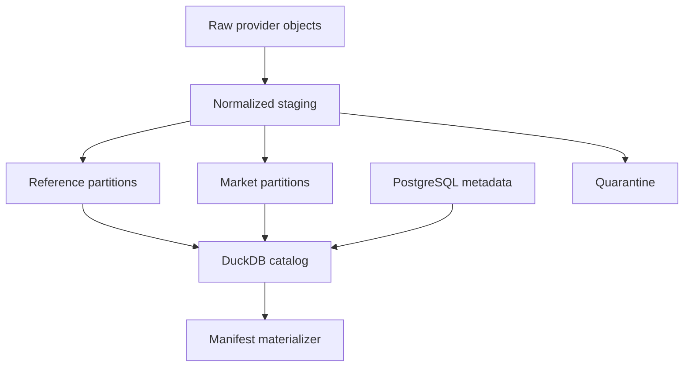

# Phase 3, Book 3 — Market and Reference Lake

> **Purpose:** Build the versioned equity market/reference lake, historical universe model, corporate-action system, and research catalog  
> **Input:** Book 2 raw capture and provider locks plus Book 1 time/identity contracts  
> **Output:** Canonical Parquet partitions, PostgreSQL metadata, DuckDB catalog, and manifest-safe market readers  
> **Previous:** [Book 2 — Provider Gateway and Ingestion](book-2-provider-gateway-ingestion.md)  
> **Next:** [Book 4 — Macro, News, and Vintage Archive](book-4-macro-news-vintages.md)

---

## 1. Success Statement

The system can reconstruct what instruments existed, what symbols they used, which universe they belonged to, what sessions traded, what raw prices were observed, and which corporate actions were knowable at any approved historical cutoff.

Current constituents, current tickers, fully revised reference data, and provider-adjusted bars cannot silently enter historical tests.

---

## 2. Applicable Anchors

- **A2:** Evidence Before Narrative
- **A3:** Point-in-Time Data
- **A5:** Fast Tests Reject; Canonical Tests Qualify
- **A6:** Nautilus Is the Canonical Trading Model
- **A10:** Observable and Reconstructable
- **A11:** Repair Before Expansion
- **A12:** Cheap Models Use Tools, Not Memory
- **A13:** Local-First Heavy Compute
- **F0:** No dependency on unclassified legacy paths
- **F1:** Canonical schema and lineage
- **F2:** Disposable heavy compute
- **F3:** Passing manifest required

---

## 3. Storage Architecture



Storage authority:

| Layer | Purpose | Mutability |
|---|---|---|
| Raw | Provider-native evidence | Append-only |
| Staging | Bounded normalization workspace | Disposable |
| Canonical reference | Typed identity, listing, calendar, action, and membership facts | Immutable versions |
| Canonical market | Typed raw-unadjusted observations | Immutable partitions |
| Curated/materialized | Manifest-specific joins, adjustments, and exports | Immutable by manifest |
| Quarantine | Failed or uncertain objects with findings | Append-only until superseded/released |
| PostgreSQL | Operational metadata, state, locks, lineage | Transactional/versioned |
| DuckDB | Rebuildable views over approved files | Rebuildable |

---

## 4. Work Packages

### 4.1 Lake object and partition contract

Canonical object path keys are semantic and bounded:

```text
<zone>/
  <domain>/
    schema=<name@version>/
      provider=<provider-id>/
        venue=<venue-id-or-na>/
          interval=<interval-or-na>/
            date=<utc-date-or-period>/
              part-<content-id>.parquet
```

Rules:

- paths never contain secrets, user identifiers, or unstable display names;
- `instrument_id` stays in rows rather than producing millions of tiny symbol directories by default;
- partition strategy is domain-specific and measured;
- files use a locked Arrow schema, compression, writer version, and deterministic column order;
- each object has a byte hash and a canonical logical-content hash;
- temporary writes use a separate location and atomic publish;
- compaction creates a superseding object set and preserves prior hashes;
- object listings are not the catalog; PostgreSQL metadata is authoritative for eligibility.

### 4.2 PostgreSQL metadata

Minimum operational entities:

```text
instrument
issuer
listing
identifier_alias
symbol_alias
venue
trading_calendar_version
corporate_action_version
universe_definition
universe_membership_version
ingestion_run
raw_object
canonical_partition
partition_lineage
quality_run
quality_finding
catalog_snapshot
dataset_manifest
universe_snapshot
supersession
```

Bulk OHLCV rows do not belong in PostgreSQL.

Every canonical partition record stores:

- schema/domain/grain;
- event/effective range;
- availability range;
- stable-identity range/count;
- provider and gateway lock;
- raw parent references;
- transformer build;
- row count;
- object and logical hashes;
- quality state;
- supersession state;
- storage URI using an approved opaque scheme.

### 4.3 Equity security master

Model separately:

| Entity | Examples of material fields |
|---|---|
| Issuer | legal name, CIK/LEI aliases, domicile, sector/industry versions |
| Instrument | asset/security type, currency, economic rights, issuer relationship |
| Listing | venue, listing dates, primary flag, status, lot/tick metadata |
| Symbol alias | provider/venue, symbol, effective interval, availability, evidence |
| Identifier alias | FIGI/ISIN/CUSIP/vendor ID, type, validity, source, confidence |
| Relationship | predecessor, successor, merger, spin-off, conversion, share-class link |

Do not collapse ETF, ADR, common stock, preferred stock, right, warrant, fund, index, or option contract into one ambiguous “ticker.”

Sector and industry classifications are versioned facts. A current classification cannot be applied historically without an explicit policy.

### 4.4 Trading venues and calendars

Register:

- venue and MIC aliases;
- trading timezone;
- regular session;
- premarket/postmarket/overnight segments;
- holidays and special closes;
- auction or break periods where required;
- calendar source, version, availability, and exceptions;
- continuous-market policy for crypto/FX.

Session labels:

```text
pre
regular
post
overnight
auction
halted
continuous
unknown
```

`unknown` cannot enter a session-constrained manifest without a declared resolution.

### 4.5 OHLCV bar schema

Minimum `OHLCVBarRecord`:

```yaml
instrument_id: typed-id
listing_id: typed-id
provider_id: registry-id
provider_symbol: source-value
venue_id: typed-id
bar_type: time
interval: registered-interval
period_start: RFC3339 UTC
period_end: RFC3339 UTC
available_at: RFC3339 UTC
open: numeric
high: numeric
low: numeric
close: numeric
volume: numeric
currency: ISO-code
session: registered-session
trade_count: optional integer
vwap: optional numeric
raw_object_id: typed-id
ingestion_run_id: typed-id
quality_flags: []
```

Semantics:

- bar timestamp position is explicit;
- period is half-open unless registered otherwise;
- source timezone and precision are retained in raw metadata;
- prices and volume are raw/unadjusted in the canonical market layer;
- provider-adjusted responses use a distinct schema/product and cannot masquerade as raw;
- zero volume is distinguishable from missing volume;
- trade count and VWAP are absent rather than fabricated;
- quote bars, trade bars, and midpoint bars use separate schemas.

### 4.6 Duplicate and correction identity

The natural observation key is registered per schema, for example:

```text
instrument_id
listing_id
provider_id
bar_type
interval
period_start
```

Two payloads with the same observation key:

- collapse only when canonical content is identical;
- become versions when content differs;
- retain both retrieval and raw evidence;
- select by declared revision/correction policy;
- create a provider-correction finding when unexpected.

### 4.7 Corporate actions

Canonical action types include:

```text
cash_dividend
stock_dividend
split
reverse_split
symbol_change
listing_change
merger
acquisition
spin_off
rights_issue
return_of_capital
delisting
bankruptcy
```

A `CorporateActionRecord` declares:

- instrument/listing IDs;
- action type;
- announcement/publication time;
- ex-date, record date, payable date, effective time as applicable;
- terms and currencies;
- source/provider versions;
- availability time;
- correction state;
- predecessor/successor relationships;
- quality/reconciliation state.

Provider action records are observations. Reconciliation creates a canonical action decision with evidence; it does not delete disagreeing source records.

### 4.8 Raw and adjusted price policy

Canonical storage preserves raw unadjusted prices. Derived policies are explicit:

```text
raw_unadjusted
split_adjusted
split_and_dividend_adjusted
total_return
point_in_time_adjusted
provider_adjusted_observation
```

Every adjusted materialization declares:

- action-set ID and cutoff;
- factor algorithm/version;
- backward/forward direction;
- price and volume treatment;
- dividend reinvestment assumption;
- rounding precision;
- unresolved action handling.

No adjusted series overwrites raw data. A future action cannot influence a point-in-time-adjusted view before its declared availability policy permits it.

### 4.9 Universe definitions

A `UniverseDefinition` is a versioned rule, not a list:

```yaml
universe_definition_id: typed-id
name: broad_us_listed_equity
schema_version: semver
eligible_security_types: []
venues: []
country_or_domicile_rules: []
liquidity_or_price_rules: []
listing_status_rules: []
exclusions: []
source_requirements: []
delisting_policy: include_history
effective_at: RFC3339 UTC
```

Universe types:

- broad listed market;
- exchange/venue;
- index constituent;
- liquidity/tradability screen;
- strategy research universe;
- user-defined watch universe.

Deterministic screens consume point-in-time inputs. Phase 3 may materialize them; candidate ranking belongs to Phase 5.

### 4.10 Universe membership history

Membership records contain:

- universe definition/version;
- stable instrument/listing ID;
- membership effective start/end;
- announcement/publication time;
- availability time;
- inclusion/exclusion reason;
- weight where sourced;
- evidence;
- correction state.

An index snapshot at \(T\) may include only memberships effective under the query and knowable under the chosen policy. Announcement-time and effective-time strategies remain separate.

Current Wikipedia or provider-current lists cannot manufacture historical membership.

### 4.11 Delistings and terminal history

Requirements:

- delisting is a time-bounded listing state and corporate action;
- last-trade/last-quote data remains preserved;
- terminal return policy is explicit;
- bankruptcy, cash acquisition, stock conversion, and unknown disappearance are distinct;
- missing post-delisting prices cannot be forward-filled;
- successor links do not merge instruments;
- broad historical universes include eligible delisted members.

If reliable delisting evidence is unavailable, historical-universe coverage is partial and manifests cannot claim full survivorship safety.

### 4.12 DuckDB research catalog

The catalog is generated from:

- schema registry lock;
- provider registry lock;
- instrument-master snapshot;
- eligible canonical partition metadata;
- approved storage roots;
- view-definition code hash.

Provide read-only views/functions:

```text
instruments_as_of(...)
symbols_as_of(...)
universe_members_as_of(...)
bars_as_of(...)
corporate_actions_as_of(...)
adjusted_bars(...)
coverage_report(...)
```

Rules:

- every historical function requires `as_of`;
- views exclude quarantined and superseded partitions by default;
- selected partition IDs/hashes are returned with query metadata;
- catalog rebuild is deterministic;
- notebooks cannot register arbitrary canonical files;
- local scratch tables are clearly noncanonical.

### 4.13 Nautilus adapter

The adapter:

1. accepts only a passing `DatasetManifest`;
2. resolves stable instruments/listings into canonical Nautilus instruments;
3. converts timestamps and precision without loss;
4. applies only the manifest's session and adjustment policy;
5. exports bars/events with manifest lineage;
6. verifies counts/ranges/hashes;
7. rejects unsupported instrument/action semantics;
8. records Nautilus and adapter versions.

Legacy CSV loaders and hard-coded download paths cannot satisfy this adapter.

### 4.14 Coverage tiers and cost discipline

Initial implementation order:

1. security master, symbols, venues, and calendars;
2. broad US listed-equity history including delistings;
3. daily raw bars and corporate actions;
4. one historical index membership source;
5. bounded intraday slice with pre/regular/post separation;
6. manifest-to-DuckDB-to-Nautilus export;
7. expand only after coverage and cost reports pass.

Historical options data remains a capability gap until contract metadata, quote/trade semantics, symbology, corporate-action handling, and licensed retention are proven.

---

## 5. Target Implementation Layout

```text
forge/data/market/
├── bars.py
├── corrections.py
├── sessions.py
└── adjustments.py

forge/data/identity/
├── instruments.py
├── listings.py
├── symbols.py
├── venues.py
└── relationships.py

forge/data/catalog/
├── metadata.py
├── duckdb.py
├── views/
├── materialize.py
└── nautilus_adapter.py

forge/data/reference/
├── calendars.py
├── corporate_actions.py
├── universes.py
└── delistings.py
```

---

## 6. Deliverables

- Parquet storage and partition contract.
- PostgreSQL market/reference metadata schema.
- Equity security master and identity resolver.
- Venue and versioned trading-calendar registry.
- Raw-unadjusted OHLCV schema and normalizer.
- Provider correction/version handling.
- Corporate-action reconciliation.
- Adjustment-policy engine.
- Universe definitions and point-in-time membership.
- Delisting and terminal-history policy.
- DuckDB catalog and read-only as-of views.
- Manifest-gated Nautilus adapter.
- Coverage, storage, and cost reports.
- Golden current/delisted/symbol-change/action/session fixtures.

---

## 7. Required Tests

### P3-LAK-001 — Atomic partition publish

Interrupted writes cannot expose partial Parquet objects or eligible metadata.

### P3-LAK-002 — Partition hash

Byte and canonical logical-content hashes verify after write, copy, restore, and catalog read.

### P3-LAK-003 — Compaction preservation

Compaction preserves logical rows/hashes, creates supersession links, and leaves old manifests reconstructable.

### P3-REF-001 — Reference integrity

Issuer, instrument, listing, venue, identifier, and symbol relationships satisfy temporal and referential constraints.

### P3-REF-002 — Classification history

A changed sector/industry classification resolves the version available at each cutoff.

### P3-MKT-001 — OHLCV invariants

Schema, interval, timestamp, price ordering, positivity, volume/null, currency, and stable identity rules enforce.

### P3-MKT-002 — Observation duplicate

Identical duplicate observations collapse logically while preserving request evidence.

### P3-MKT-003 — Provider correction

Changed values for the same observation key create versions and never overwrite raw/canonical history.

### P3-MKT-004 — Gap awareness

Gap checks use the correct venue calendar/session and do not flag planned closures as missing bars.

### P3-SES-001 — Extended-hours separation

Premarket, regular, postmarket, overnight, and unknown records remain separately queryable.

### P3-SES-002 — Calendar exception

Holiday, special close, DST, and halt fixtures do not create fabricated bars or false completeness.

### P3-CA-001 — Split reconciliation

Split terms, effective time, raw prices, factors, and volume adjustments reconcile across sampled evidence.

### P3-CA-002 — Dividend reconciliation

Cash dividend currency, ex-date, availability, and total-return treatment match the declared policy.

### P3-CA-003 — No future action leakage

Point-in-time-adjusted materialization cannot use an action before its allowed availability cutoff.

### P3-ADJ-001 — Raw preservation

Building every supported adjusted view leaves raw unadjusted observations and hashes unchanged.

### P3-ADJ-002 — Policy divergence

Different adjustment policies produce distinct manifest inputs and cannot share an ambiguous cache key.

### P3-UNI-001 — Point-in-time constituents

Snapshots before and after additions/removals contain the correct stable members under the declared knowledge policy.

### P3-UNI-002 — Delisted inclusion

A historical broad-universe snapshot contains eligible instruments that later delisted.

### P3-UNI-003 — Current-list contamination

Replacing historical membership with today's constituent list fails the contamination test.

### P3-DLS-001 — Terminal history

Acquisition, bankruptcy, conversion, and unknown disappearance follow distinct declared terminal policies.

### P3-DDB-001 — Catalog rebuild

Two clean catalog builds from one lock expose identical view definitions, eligible partitions, and logical results.

### P3-DDB-002 — Quarantine exclusion

DuckDB default views cannot access quarantined or superseded partitions.

### P3-NTL-001 — Manifest-gated Nautilus export

Passing manifest data converts with matching identity, precision, timestamps, counts, and hashes.

### P3-NTL-002 — Direct legacy denial

Ungoverned CSVs, hard-coded download paths, and unmanifested DataFrames cannot satisfy the canonical Nautilus adapter.

---

## 8. Failure Modes

| Failure | Required response |
|---|---|
| One table uses ticker as primary key | Migrate to stable instrument/listing identity |
| Current S&P 500 list is used historically | Reject universe and require historical membership evidence |
| Adjusted provider bars replace raw | Restore raw product and separate derivation |
| Missing delisted symbols are ignored | Mark coverage partial and block survivorship-safe claim |
| Gap checker ignores market calendars | Recompute against versioned session schedule |
| Tiny files make scans unusable | Measure and compact through superseding objects |
| DuckDB contains hand-edited canonical tables | Rebuild from locked metadata and Parquet |
| Nautilus reads a local CSV directly | Block canonical qualification path |
| Options history is assumed free/available | Record capability gap until provider and entitlement evidence exists |

---

## 9. Exit Gate

Book 3 completes when:

- The equity identity and reference graph passes historical resolution.
- Current and delisted instruments coexist correctly.
- Raw OHLCV, sessions, calendars, corrections, and corporate actions validate.
- Raw and adjusted policies remain distinct and reproducible.
- Point-in-time universe fixtures defeat survivorship contamination.
- Lake writes, hashes, compaction, and restore preserve lineage.
- DuckDB rebuilds from locked sources with quarantine excluded.
- Nautilus export accepts only a passing manifest path.
- Initial coverage and cost reports state limitations honestly.
- Independent validation approves the market/reference lake.

---

## 10. Handoff

Book 4 receives:

- stable issuer/instrument/listing/source identities;
- raw/canonical storage patterns;
- bitemporal selection;
- provider and schema locks;
- calendar and timezone registry;
- DuckDB as-of catalog pattern;
- correction, supersession, and quarantine contracts;
- retention and entitlement policies;
- content and logical hashing;
- quality finding interface.
