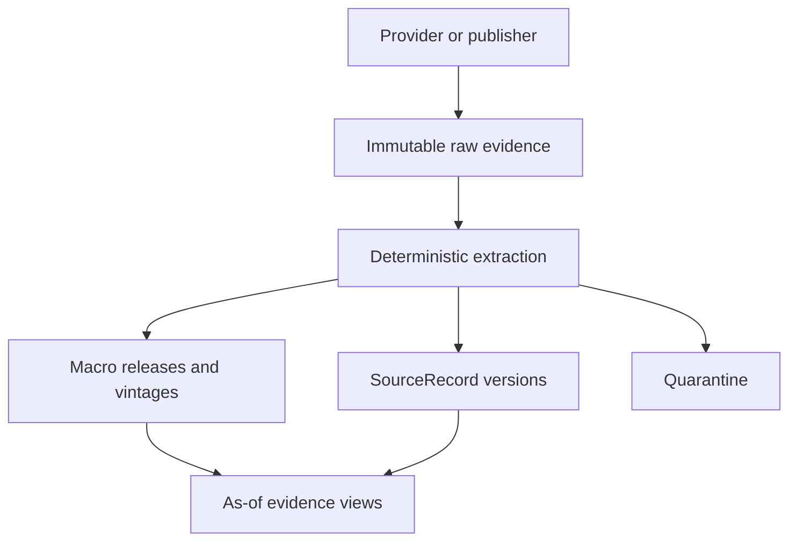

# Phase 3, Book 4 — Macro, News, and Vintage Archive

> **Purpose:** Store macro releases, revisions, news, filings, and source evidence without publication-time or vintage leakage  
> **Input:** Books 1–3 time, identity, provider, raw-capture, lake, and catalog contracts  
> **Output:** Point-in-time macro/source archive and read-only evidence interfaces  
> **Previous:** [Book 3 — Market and Reference Lake](book-3-market-reference-lake.md)  
> **Next:** [Book 5 — Quality, Manifests, and Data Lock](book-5-quality-manifests-data-lock.md)

---

## 1. Success Statement

For any historical cutoff, FORGE can return the macro values, release facts, news metadata, filings, and permitted content that were actually knowable then—without substituting later revisions, corrected headlines, backdated timestamps, or content retrieved after the cutoff.

Phase 4 agents receive evidence records, not an untraceable web-memory layer.

---

## 2. Applicable Anchors

- **A1:** One Orchestration Spine
- **A2:** Evidence Before Narrative
- **A3:** Point-in-Time Data
- **A9:** Separate Research From Approval
- **A10:** Observable and Reconstructable
- **A11:** Repair Before Expansion
- **A12:** Cheap Models Use Tools, Not Memory
- **F1:** Canonical schema and lineage
- **F2:** Disposable heavy compute
- **F3:** Passing manifest required

---

## 3. Temporal Archive Architecture



The archive normalizes evidence and time semantics. Causal interpretation, relevance scoring, sector mapping, thesis construction, and contradiction judgment belong to Phase 4.

---

## 4. Work Packages

### 4.1 Macro identity model

Separate:

| Entity | Meaning |
|---|---|
| `MacroSeries` | Stable concept such as CPI level or payroll employment |
| `MacroObservationPeriod` | Period the value measures |
| `EconomicRelease` | Scheduled/actual publication event |
| `MacroVintage` | Value for one observation period as known after one release/revision |
| `ReleaseExpectation` | Provider/source estimate available before release |
| `ReleaseCalendarVersion` | Scheduled release time/version |

Series identity includes:

- agency/publisher;
- source series ID;
- geography;
- units and scale;
- seasonal adjustment;
- frequency;
- transformation status;
- methodology version/evidence;
- stable FORGE series ID.

Two series with different units, seasonal treatment, transformations, or methodologies do not merge merely because their labels match.

### 4.2 Macro vintage schema

Minimum `MacroObservationRecord`:

```yaml
macro_series_id: typed-id
observation_period: registered-period
value: numeric-or-typed-null
unit: registered-unit
seasonal_adjustment: enum
release_id: typed-id
vintage_id: typed-id
published_at: RFC3339 UTC
available_at: RFC3339 UTC
retrieved_at: RFC3339 UTC
revision_sequence: integer-or-source-value
status: initial|revised|benchmark|corrected
provider_id: registry-id
raw_object_id: typed-id-or-retention-exception
quality_flags: []
```

Null, suppressed, not-applicable, preliminary, and missing are distinct states.

### 4.3 Vintage selection

For observation period \(p\) and historical cutoff \(T\):

\[
v^*(p,T)=
\arg\max_{v}
\left(v.\text{available\_at}\right)
\quad\text{subject to}\quad
v.\text{available\_at}\le T
\]

Additional filters include series definition/version, provider policy, quality state, and supersession rule.

The latest revised value is a current analytical view only. It cannot answer a historical backtest query unless it was available by the cutoff.

### 4.4 Economic release timeline

Preserve separate facts:

- scheduled release time as first observed;
- later schedule changes;
- actual publication/availability;
- observation periods included;
- initial values;
- prior/revised values as published in that release;
- consensus/estimate source and availability;
- surprise calculation inputs;
- embargo/delay;
- provider receipt time.

Surprise values are derived products with explicit formula and input vintage references.

### 4.5 Methodology and benchmark revisions

Benchmark revisions may alter long history. Requirements:

- retain the entire new vintage payload when available;
- link revised observation periods to release and methodology evidence;
- never rewrite earlier vintage files;
- distinguish ordinary revision from methodology break;
- flag incomparable periods;
- let manifests select vintage policy:
  - `as_available`;
  - `first_release`;
  - `latest_at_manifest_creation`;
  - `fixed_vintage`;
- prohibit ambiguous `latest`.

### 4.6 News and source identity

`SourceIdentity` represents publisher/domain/feed with:

- canonical name;
- domains/feed IDs;
- source type;
- timezone/publication behavior;
- reliability metadata fields;
- retention/license policy;
- canonical URL rules;
- review state.

Reliability metadata is evidence for Phase 4; Phase 3 does not produce a subjective trust score.

### 4.7 `SourceRecord` implementation

Implement the Phase 1 artifact with:

```yaml
source_record_id: typed-id
source_identity_id: typed-id
source_type: news|filing|press_release|transcript|research|regulatory|macro
provider_id: registry-id
provider_item_id: optional
canonical_url: optional
title: optional
author: optional
published_at: optional RFC3339 UTC
available_at: RFC3339 UTC
retrieved_at: RFC3339 UTC
effective_at: optional RFC3339 UTC
language: optional
content_hash: algorithm:value
content_storage: full|permitted_excerpt|metadata_only|external_reference
content_ref: optional opaque reference
instrument_refs: source-provided typed references only
raw_object_ref: typed-id-or-retention-exception
supersedes: optional
quality_flags: []
```

Provider-supplied ticker tags remain attributed observations. Phase 4 performs causal exposure mapping.

### 4.8 Publication and availability rules

Rules by case:

| Source condition | `available_at` |
|---|---|
| Trusted machine timestamp plus bounded feed delay | Registered publication/delivery rule |
| Date only | Conservative rule from source policy, otherwise retrieval |
| Missing timezone | Retrieval until a provider rule is approved |
| Backdated/corrected article | Earliest captured version remains; correction becomes new version |
| Filing acceptance timestamp | Official acceptance time when source semantics are validated |
| Embargoed content | Embargo lift or actual allowed access, whichever is later |
| First FORGE retrieval after publication | Never earlier than the trustworthy availability evidence |

Published time and retrieval time remain queryable; neither overwrites the other.

### 4.9 Content retention and citation

Per source/entitlement, store one of:

1. permitted full raw content;
2. permitted excerpt plus hash;
3. metadata, canonical URL/reference, and content hash;
4. provider reference plus retention exception.

Every retained object declares:

- license/entitlement decision;
- allowed downstream surfaces;
- model-prompt allowance;
- retention duration;
- attribution;
- expiry/tombstone behavior.

The archive does not scrape or retain content merely because a URL is public.

### 4.10 Deterministic deduplication

Phase 3 may create duplicate groups using deterministic evidence:

- exact provider item ID;
- normalized canonical URL;
- exact content hash;
- source-declared correction/supersession;
- bounded normalized title/time fingerprint as a candidate only.

Semantic clustering and “same event” judgment belong to Phase 4.

Deduplication never erases:

- provider/source observations;
- distinct publication/availability times;
- corrections;
- licensing differences;
- source-specific instrument tags.

### 4.11 Corrections and deletions

- headline/body changes create a new content version;
- corrected publication timestamps preserve old captured metadata;
- source deletion produces a tombstone observation;
- license-required content removal retains only permitted audit metadata;
- a correction cannot acquire the original version's earlier `available_at`;
- manifests pin the selected source-record versions.

### 4.12 Filings and regulatory sources

Minimum filing metadata:

- issuer and filing IDs;
- form/type;
- accession/source identifier;
- filing/acceptance/publication times;
- reporting period;
- amended-original relationship;
- document references and hashes;
- permitted content storage;
- stable instrument/issuer links;
- raw evidence.

An amended filing never overwrites the original.

### 4.13 Point-in-time evidence API

Read-only operations:

```text
macro_series(...)
macro_vintage_as_of(...)
release_calendar_as_of(...)
release_as_of(...)
source_records_as_of(...)
source_versions(...)
filings_as_of(...)
evidence_coverage(...)
```

Every operation:

- requires `as_of` for historical use;
- returns selected record IDs and hashes;
- reports missing/late/uncertain timestamps;
- reports retention exceptions;
- excludes quarantined records;
- applies stable identity at the requested cutoff;
- never performs thesis or relevance judgment.

### 4.14 Phase 4 evidence bundles

A deterministic `EvidenceBundle` may group requested records by:

- cutoff;
- explicit source query;
- macro series/release;
- issuer/instrument IDs;
- time window;
- language;
- source type;
- quality policy.

It contains records and query provenance, not a narrative summary or market conclusion.

---

## 5. Target Implementation Layout

```text
forge/data/macro/
├── series.py
├── releases.py
├── vintages.py
├── calendars.py
└── queries.py

forge/data/sources/
├── identity.py
├── records.py
├── timestamps.py
├── retention.py
├── deduplication.py
├── filings.py
└── queries.py

tests/forge/data/point_in_time/macro/
tests/forge/data/point_in_time/sources/
```

---

## 6. Deliverables

- Macro series, release, calendar, expectation, and vintage schemas.
- As-available vintage-selection engine.
- Methodology/benchmark-revision handling.
- Source identity registry.
- Phase 1-compatible `SourceRecord` implementation.
- Publication/availability policy registry.
- License-aware content retention.
- Deterministic duplicate/correction groups.
- Filing and amendment archive.
- Read-only point-in-time evidence API.
- Evidence bundle generator.
- Macro/news/filing coverage and limitation report.
- Golden vintage, late-news, correction, deletion, and amendment fixtures.

---

## 7. Required Tests

### P3-MAC-001 — Vintage leakage

A query before a revision returns the earlier vintage, never the latest value.

### P3-MAC-002 — Initial-release view

`first_release` returns the initial value for each period even after later revisions.

### P3-MAC-003 — Benchmark revision

A benchmark payload creates a new vintage/history without overwriting earlier reconstructable releases.

### P3-MAC-004 — Series identity

Different units, seasonal adjustment, geography, frequency, or methodology cannot merge under a shared label.

### P3-MAC-005 — Release chronology

Scheduled, rescheduled, published, provider-visible, and retrieved times remain distinct and ordered under policy.

### P3-MAC-006 — Surprise lineage

Derived surprise values reference the exact actual, prior, revised-prior, estimate, formula, and cutoff inputs.

### P3-SRC-001 — Timestamp distinction

Published, available, retrieved, effective, ingested, and superseded times survive serialization and as-of queries.

### P3-SRC-002 — Late retrieval

An old article first retrieved after the cutoff cannot appear in an earlier historical evidence bundle.

### P3-SRC-003 — Backdated correction

A corrected/backdated article version cannot inherit an earlier availability than captured evidence permits.

### P3-SRC-004 — Exact duplicate preservation

Exact duplicates group deterministically while retaining every provider/source observation and timestamp.

### P3-SRC-005 — Semantic-boundary enforcement

Phase 3 does not collapse merely similar stories or assign causal themes without a Phase 4 artifact.

### P3-LIC-001 — Retention mode

Full, excerpt, metadata-only, and external-reference fixtures store only content allowed by entitlement.

### P3-LIC-002 — Prompt exposure

Content prohibited from model use cannot enter an agent evidence payload.

### P3-LIC-003 — Expiry/tombstone

Retention expiry removes prohibited bytes while preserving permitted lineage and manifest limitations.

### P3-FIL-001 — Filing amendment

An amended filing links to but never overwrites the original filing and availability history.

### P3-FIL-002 — Acceptance cutoff

A filing cannot appear before its validated acceptance/publication availability.

### P3-EVB-001 — Evidence bundle reproducibility

One query contract and cutoff return identical ordered record IDs/hashes across two clean materializations.

### P3-EVB-002 — Quality exclusion

Quarantined macro/source records are absent and reported as coverage gaps.

---

## 8. Failure Modes

| Failure | Required response |
|---|---|
| Latest macro table powers old backtest | Reject and require vintage query |
| Series with different units are merged | Split identities and supersede contaminated output |
| Article publication date is trusted blindly | Apply source policy or conservative retrieval time |
| Corrected article overwrites old content | Restore version chain |
| Public URL is treated as retention permission | Apply entitlement decision |
| Provider ticker tags become causal exposure | Preserve as source tags for Phase 4 review |
| Similar headlines are collapsed as same event | Keep separate or pass duplicate candidates to Phase 4 |
| Filing amendment replaces original | Restore both versions and relationship |

---

## 9. Exit Gate

Book 4 completes when:

- Macro identity and vintage fixtures pass.
- Historical cutoffs cannot see later revisions.
- Release timelines preserve schedule and availability changes.
- Source records preserve distinct publication/retrieval semantics.
- Retention and model-exposure restrictions enforce.
- Corrections, deletions, duplicates, and filing amendments preserve history.
- Evidence bundles reproduce from explicit cutoffs and policies.
- Phase 3 produces evidence only, not causal judgment.
- Independent validation approves the macro/source archive.

---

## 10. Handoff

Book 5 receives:

- canonical market/reference partitions;
- macro vintages and release timelines;
- source records, filings, and retention exceptions;
- provider/schema/instrument locks;
- all availability and revision policies;
- partition/object hashes;
- quality findings and coverage gaps;
- deterministic evidence bundle queries;
- contamination fixtures for future knowledge and forbidden content.
