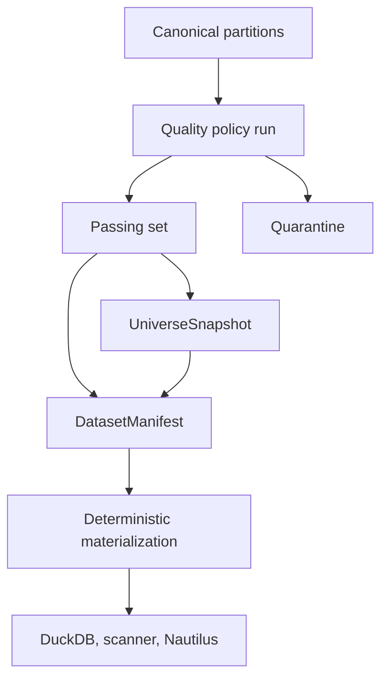
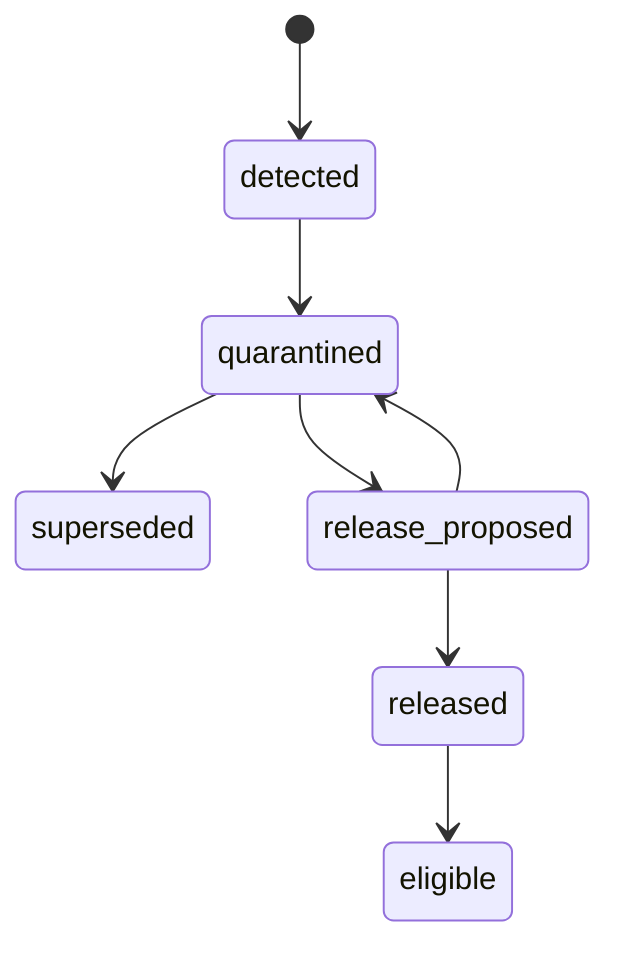

# Phase 3, Book 5 — Quality, Manifests, and Data Lock

> **Purpose:** Prove data fitness, enforce quarantine, generate reproducible manifests, and lock the Phase 4 evidence boundary  
> **Input:** Books 1–4 contracts, provider evidence, canonical partitions, and point-in-time archives  
> **Output:** Passing golden manifests, contamination suite, Data Lock Manifest, and Phase 4 handoff  
> **Previous:** [Book 4 — Macro, News, and Vintage Archive](book-4-macro-news-vintages.md)

---

## 1. Success Statement

A consumer can name one `DatasetManifest` and one `UniverseSnapshot`, rebuild the same eligible logical dataset, prove every row's lineage and historical availability, and observe deliberate contamination being rejected.

No later agent can bypass quality by opening raw files, selecting “latest,” using current constituents, or silently repairing data in memory.

---

## 2. Applicable Anchors

- **A0:** Human Strategic Authority
- **A1:** One Orchestration Spine
- **A2:** Evidence Before Narrative
- **A3:** Point-in-Time Data
- **A5:** Fast Tests Reject; Canonical Tests Qualify
- **A6:** Nautilus Is the Canonical Trading Model
- **A9:** Separate Research From Approval
- **A10:** Observable and Reconstructable
- **A11:** Repair Before Expansion
- **A12:** Cheap Models Use Tools, Not Memory
- **A13:** Local-First Heavy Compute
- **F1:** Canonical schema and lineage
- **F2:** Disposable heavy compute
- **F3:** A backtest result is invalid without a passing `DatasetManifest`

---

## 3. Quality and Manifest Topology



Quality decisions are deterministic and versioned. Models may explain findings or propose a repair, but they cannot change a quality state.

---

## 4. Work Packages

### 4.1 Quality policy registry

Each policy declares:

```yaml
quality_policy_id: typed-id
domain: registered-domain
schema_versions: []
checks: []
severity_mapping: {}
thresholds: {}
sampling_policy: {}
cross_provider_policy: {}
calendar_policy_id: optional
action_policy_id: optional
disposition_rules: {}
code_version: build-id
effective_at: RFC3339 UTC
```

Change control:

- thresholds are data contracts, not notebook constants;
- policy changes create new versions;
- manifests pin one policy version;
- a new policy does not retroactively relabel an old manifest;
- material policy relaxation requires evidence and approval.

### 4.2 Quality dimensions

Minimum dimensions:

| Dimension | Examples |
|---|---|
| Schema | types, required fields, enums, precision |
| Identity | known instrument/listing/provider/source, valid relationships |
| Temporal | timezone, ordering, interval, availability, clock skew |
| Uniqueness | duplicate natural keys, version conflicts |
| Completeness | expected fields, pages, instruments, periods, sessions |
| Continuity | calendar-aware gaps, missing release vintages |
| Validity | OHLC ordering, positive prices, nonnegative volume |
| Consistency | currency/unit/adjustment/session agreement |
| Corporate actions | split/dividend/action-factor reconciliation |
| Cross-source | sampled provider disagreement |
| Revision | unexpected historical mutation |
| Freshness | source/domain-specific delay and staleness |
| Licensing | retention and downstream-use compliance |
| Lineage | raw parent, transformer, schema, lock, hash |
| Reproducibility | stable selection, ordering, and content hash |

### 4.3 Severity and disposition

Severity:

```text
info
warning
blocking
critical
```

Disposition:

| Disposition | Meaning |
|---|---|
| `pass` | Eligible under this policy |
| `pass_with_findings` | Eligible; findings remain visible |
| `quarantine` | Ineligible until superseded or explicitly released |
| `reject` | Structurally invalid; cannot be repaired in place |
| `coverage_gap` | Missing evidence; never interpreted as zero/none |

Critical examples:

- future-available record enters historical result;
- wrong instrument identity;
- current-universe contamination;
- later macro vintage leakage;
- raw/adjusted ambiguity;
- missing lineage/hash;
- prohibited licensed content.

### 4.4 Domain checks

Market/reference:

- natural-key duplicates;
- interval and monotonicity;
- calendar-aware gaps;
- OHLC arithmetic;
- price/volume/outlier checks;
- currency, venue, and session consistency;
- timestamp and DST behavior;
- symbol/listing validity;
- corporate-action-aware discontinuities;
- constituent and delisting history;
- provider correction behavior.

Macro:

- series identity;
- observation period/frequency;
- units and seasonal adjustment;
- release/vintage chronology;
- revision sequence;
- schedule/actual publication;
- null-status semantics;
- methodology breaks.

News/sources:

- source identity;
- canonical URL and item ID;
- publication/availability/retrieval chronology;
- content hash/version;
- correction/tombstone chain;
- entitlement and retention;
- issuer/instrument reference type.

### 4.5 Outlier policy

An outlier is a finding, not automatically an error.

Evaluation order:

1. check split/action evidence;
2. check venue/session/calendar;
3. compare neighboring observations;
4. compare provider-native corrections;
5. run approved cross-provider sample;
6. classify known market event versus likely data error;
7. quarantine only under declared threshold/disposition.

Never winsorize, clip, interpolate, or delete canonical observations silently. Any repaired/derived series is a new transformation product with lineage.

### 4.6 Gap policy

Expected observations derive from:

- instrument listing status;
- venue calendar/version;
- session policy;
- interval;
- halt/suspension evidence;
- provider capability/coverage;
- universe membership where relevant.

Gap states:

```text
expected_missing
market_closed
halted_or_suspended
provider_not_covered
not_yet_listed
already_delisted
unknown
```

Only `expected_missing` and unresolved `unknown` are potential data defects; all remain visible.

### 4.7 Quarantine



Requirements:

- quarantine state is stored in PostgreSQL and attached to object/partition IDs;
- canonical readers exclude it by default;
- direct file paths do not grant eligibility;
- release requires new evidence, policy, reviewer, and event;
- release never edits the original bytes;
- repair publishes a new object/version and supersedes the bad one;
- all descendant manifests are impact-analyzed.

### 4.8 `UniverseSnapshot` builder

Inputs:

- universe definition/version;
- effective cutoff;
- knowledge/as-of cutoff;
- instrument-master snapshot;
- membership partitions;
- delisting policy;
- source/provider lock;
- quality policy.

Outputs:

- stable member IDs;
- contemporaneous listing/symbol aliases;
- inclusion/exclusion reasons;
- membership evidence;
- coverage gaps;
- sorted canonical member hash;
- full artifact lineage.

Building from a current symbol list is not an accepted input for a historical snapshot.

### 4.9 `DatasetManifest` builder

Inputs:

```yaml
query_contract: exact contract
universe_snapshot_id: typed-id
schema_registry_lock: artifact-ref
provider_registry_lock: artifact-ref
instrument_master_snapshot: artifact-ref
partition_candidates: []
quality_policy_id: typed-id
session_policy_id: typed-id
adjustment_policy_id: typed-id
revision_policy_id: typed-id
availability_policy_ids: []
materializer_build_id: build-id
```

Deterministic build:

1. canonicalize the query;
2. resolve the immutable universe snapshot;
3. resolve eligible partition versions at `as_of`;
4. exclude quarantine and incompatible schemas;
5. verify provider, entitlement, and retention state;
6. verify partition/raw lineage and hashes;
7. run or resolve pinned quality reports;
8. apply declared revision, session, and adjustment products;
9. sort by the registered domain order;
10. compute logical row count and canonical content hash;
11. record object hashes and materializer/runtime versions;
12. emit draft manifest;
13. independently validate;
14. mark passing, blocked, superseded, or revoked.

### 4.10 Hashing and reproducibility

Record two forms:

| Hash | Purpose |
|---|---|
| Object hash | Exact stored bytes |
| Canonical logical hash | Ordered semantic rows under schema normalization |

Canonical logical hashing specifies:

- column order;
- row sort keys;
- null encoding;
- numeric precision/rounding;
- timestamp precision;
- string normalization;
- enum encoding;
- excluded transport metadata;
- schema and algorithm version.

The same manifest must reproduce the same logical hash across clean builds. Byte-identical Parquet output is additionally required only under the same frozen writer/runtime lock.

### 4.11 Manifest lifecycle and revocation

States:

```text
draft
validating
passing
blocked
superseded
revoked
```

Rules:

- only `passing` may enter governed scanners/backtests;
- supersession preserves prior reproduction;
- revocation blocks new use but preserves evidence;
- discovering contamination creates an impact report listing dependent backtests, theses, and strategies;
- no result is silently recalculated;
- revalidation produces new artifacts.

### 4.12 Consumer enforcement

Governed consumers accept:

```text
dataset_manifest_id
universe_snapshot_id
```

They do not accept:

- arbitrary file paths;
- raw provider query responses;
- ad hoc DataFrames;
- mutable “latest” views;
- current symbol lists for historical jobs;
- unversioned adjustment flags.

Repository checks flag direct canonical bypasses. Runtime permissions deny unmanifested data jobs.

### 4.13 Contamination suite

Seed fixtures for:

1. current-constituent survivorship;
2. omitted delisted symbol;
3. ticker reuse collision;
4. later macro revision;
5. backdated late-retrieved article;
6. future corporate action in adjusted prices;
7. raw/adjusted mixture;
8. timezone shift;
9. DST duplicate/missing bar;
10. regular/extended-hours mixture;
11. duplicate observation;
12. missing interval against open calendar;
13. provider correction overwrite;
14. outlier near valid split;
15. prohibited licensed content;
16. quarantined partition path bypass;
17. modified Parquet bytes;
18. changed query with reused cache key.

Each fixture declares the exact test that must fail. “A check failed somewhere” is insufficient.

### 4.14 Golden end-to-end dataset

Build a small redistributable or synthetic fixture containing:

- two issuers;
- one ticker change;
- one reused ticker on a different issuer;
- one delisting;
- one index addition/removal;
- regular and extended-hours bars;
- one split and one dividend;
- one provider correction;
- one calendar exception;
- one revised macro observation;
- one late-retrieved article;
- one filing amendment;
- at least one quarantined partition.

Materialize twice from clean metadata/storage roots. Validate:

- identical universe member hash;
- identical logical rows/hash;
- identical policy and lineage references;
- expected quality findings;
- DuckDB query parity;
- Nautilus export parity.

### 4.15 Backup, restore, and correction

Back up:

- PostgreSQL metadata and lineage;
- schema/provider/policy locks;
- manifests and universe snapshots;
- raw/canonical/quarantine object inventories;
- storage object/version metadata;
- catalog definitions;
- validation evidence.

Restore into a clean environment and verify:

- object hashes;
- referential integrity;
- manifest materialization;
- old superseded manifests;
- quarantine boundaries;
- license/retention exceptions.

### 4.16 Observability

Metrics:

- ingestion lag by domain/provider;
- complete/partial/failed requests;
- raw/canonical bytes and object counts;
- rows and instruments by coverage;
- expected gaps;
- blocking findings;
- quarantine age/size;
- provider disagreement;
- correction rate;
- manifest build duration/failures;
- catalog freshness;
- storage and provider cost.

Alerts are bounded and actionable. High-cardinality instrument metrics use sampled/aggregated views.

### 4.17 Data Lock Manifest

The final lock records:

```yaml
phase: 3
repository_sha: sha
constitution_lock_id: artifact-id
runtime_lock_id: artifact-id
schema_registry_lock_id: artifact-id
provider_registry_lock_id: artifact-id
quality_policy_lock_id: artifact-id
instrument_master_snapshot_id: artifact-id
golden_universe_snapshot_id: artifact-id
golden_dataset_manifest_id: artifact-id
storage_inventory_hash: algorithm:value
catalog_definition_hash: algorithm:value
validation_report_id: artifact-id
coverage_report_id: artifact-id
known_gaps: []
approved_phase_4_interfaces: []
prohibited_bypasses: []
```

The lock is reconstructable without provider secrets or prohibited source content.

---

## 5. Target Implementation Layout

```text
forge/data/quality/
├── registry.py
├── engine.py
├── checks/
├── findings.py
├── quarantine.py
└── impact.py

forge/data/manifests/
├── universe.py
├── dataset.py
├── hashing.py
├── materializer.py
├── lifecycle.py
└── validator.py

tests/forge/data/quality/
tests/forge/data/contamination/
tests/forge/data/reproducibility/
tests/forge/data/e2e/
```

---

## 6. Deliverables

- Versioned quality-policy registry.
- Domain quality checks and typed findings.
- Quarantine/release/supersession workflow.
- Point-in-time `UniverseSnapshot` builder.
- Deterministic `DatasetManifest` builder.
- Object and canonical logical hashing.
- Manifest lifecycle and revocation impact analysis.
- Consumer enforcement and bypass checks.
- Full contamination suite.
- Golden end-to-end dataset.
- Backup/restore and correction runbooks.
- Data quality/coverage/cost dashboard contract.
- Independent validation procedure.
- Data Lock Manifest.
- Phase 4 evidence-interface handoff.

---

## 7. Required Tests

### P3-DQ-001 — Core anomaly suite

Duplicate, gap, outlier, timezone, schema, identity, and referential fixtures produce the expected typed findings.

### P3-DQ-002 — Calendar-aware gap

Planned closures do not fail, while a missing expected open-session observation does.

### P3-DQ-003 — Corporate-action-aware outlier

A valid split discontinuity is explained by action evidence; an unexplained equivalent move remains blocking under policy.

### P3-DQ-004 — Coverage honesty

Missing provider history, unsupported interval, and no delisting source become typed coverage gaps rather than passing emptiness.

### P3-DQ-005 — Policy version isolation

Changing a threshold creates a new quality result and cannot mutate prior manifest status.

### P3-QTN-001 — Quarantine exclusion

Quarantined objects are inaccessible to default DuckDB views, manifest builders, scanners, and Nautilus exports.

### P3-QTN-002 — Direct path bypass

Supplying a quarantined file URI cannot grant eligibility.

### P3-QTN-003 — Controlled release

Release requires evidence, reviewer, event, and policy; original bytes/history remain unchanged.

### P3-UNI-004 — Universe hash reproducibility

Two clean builds of one snapshot produce the same ordered stable members and hash.

### P3-MAN-001 — Manifest reproducibility

Two clean materializations produce the same logical rows, count, sort order, and canonical content hash.

### P3-MAN-002 — Object mutation

Changing one stored byte or canonical row invalidates the expected hash and blocks materialization.

### P3-MAN-003 — Policy identity

Session, adjustment, revision, availability, quality, or universe changes produce a distinct manifest identity.

### P3-MAN-004 — Passing-only consumer

Draft, blocked, superseded, revoked, missing, or unknown manifest IDs fail closed.

### P3-MAN-005 — Superseded reconstruction

An old manifest remains reconstructable after new corrected partitions and a new manifest are published.

### P3-CNT-001 — Survivorship contamination

Current constituents substituted for historical membership fail the named universe gate.

### P3-CNT-002 — Revision contamination

Latest macro vintage inserted before availability fails the named temporal gate.

### P3-CNT-003 — Corporate-action contamination

Future action factors or raw/adjusted mixing fail the named adjustment gate.

### P3-CNT-004 — Timezone/session contamination

Shifted timezone, DST duplication, or extended-hours mixing fails the named time/session gate.

### P3-CNT-005 — Source-time contamination

Late-retrieved or corrected source content inserted earlier fails the named availability gate.

### P3-CNT-006 — License contamination

Prohibited content in a retained object or agent bundle fails the named entitlement gate.

### P3-E2E-001 — Provider to consumer

The golden workflow reconstructs provider request, raw evidence, canonical partitions, quality, universe, manifest, DuckDB result, and Nautilus export.

### P3-E2E-002 — Clean double build

Two isolated builds of the golden dataset produce identical logical output and lock references.

### P3-BKP-001 — Data restore

Clean restore verifies metadata, object hashes, quarantine, passing and superseded manifests, and catalog rebuild.

### P3-IMP-001 — Revocation impact

Revoking a contaminated manifest enumerates every dependent artifact without silently deleting or recomputing it.

### P3-OBS-001 — Data observability

Seeded lag, failure, quarantine growth, correction spike, and cost overrun create bounded actionable signals.

### P3-AUT-001 — Authority ceiling

No data job, quality rule, manifest, catalog, or evidence interface creates thesis, strategy, order, broker, or capital authority.

### P3-P12-001 — Prior-lock preservation

Phase 3 loads and respects Phase 1 and Phase 2 registries without redefining their contracts or runtime roles.

---

## 8. Independent Validation Procedure

The validator:

1. loads approved Phase 0–2 locks;
2. verifies clean gateway/provider/schema/policy locks;
3. builds the golden raw and canonical stores;
4. runs all domain quality checks;
5. verifies quarantine boundaries;
6. builds the point-in-time universe snapshot;
7. builds and independently validates the dataset manifest;
8. materializes through DuckDB and Nautilus adapters;
9. repeats from isolated storage and metadata roots;
10. compares logical rows, hashes, identities, policies, and lineage;
11. injects every contamination fixture;
12. confirms each fails its named gate;
13. performs backup/restore;
14. reconstructs a superseded manifest;
15. confirms license/secret/authority boundaries;
16. reviews coverage and cost gaps;
17. verifies Phase 4 receives read-only evidence interfaces;
18. issues approve, reject, or approve-with-noncritical-findings.

The validator cannot author the policy or release quarantined data while certifying it.

---

## 9. Failure Modes

| Failure | Required response |
|---|---|
| Quality warning is hidden from manifest | Rebuild manifest with complete findings |
| Data repaired in a notebook | Publish a versioned transformation or discard scratch output |
| Manifest accepts arbitrary path | Enforce partition metadata and eligibility |
| Same cache key serves changed policy | Correct semantic key and invalidate affected output |
| Contamination test “fails somewhere” | Bind fixture to one expected gate and error |
| Old manifest cannot rebuild after correction | Restore immutable object/version history |
| License expiry is ignored | Block new use and execute governed retention action |
| Model overrides quarantine | Reject authority violation |
| Coverage report claims full market from partial free data | Correct claim and keep typed gaps |
| Phase 4 writes directly into canonical source data | Revoke access and restore read-only boundary |

---

## 10. Exit Gate

Book 5 and Phase 3 complete when:

- All Book 1–5 tests pass.
- Quality policies and findings are versioned and deterministic.
- Quarantine cannot be bypassed by query or direct path.
- Golden universe and dataset builds reproduce twice.
- Every intentional contamination fails its named gate.
- Current and delisted equity history survives the vertical slice.
- Macro and source availability leakage is blocked.
- DuckDB and Nautilus consume only passing manifests.
- Backup/restore preserves passing, quarantined, superseded, and revoked history.
- Provider secrets and prohibited content are absent from locks and artifacts.
- Coverage and cost limitations are explicit.
- OCE and prior locks remain authoritative.
- No research judgment or execution authority enters the data plane.
- The Data Lock Manifest reconstructs.
- Independent validation approves.

---

## 11. Phase 4 Handoff Contract

Phase 4 may:

- read passing market/reference manifests;
- query macro vintages and release timelines as of a cutoff;
- retrieve permitted `SourceRecord` evidence;
- build deterministic evidence bundles;
- reference stable issuer/instrument/sector/industry identities;
- create `MarketEvent` and `ResearchThesis` artifacts;
- attach source reliability observations and contradictions;
- request new data through Phase 2 jobs and Book 2 provider contracts;
- surface coverage gaps to the operator.

Phase 4 may not:

- access provider secrets or SDKs directly;
- open raw/canonical files outside a passing manifest/evidence query;
- change `available_at`, identity, quality, or entitlement state;
- release quarantined data;
- treat source-provided ticker tags as causal truth;
- overwrite macro/source corrections;
- infer missing historical constituents or vintages;
- create strategy or execution authority.

---

## 12. Phase Completion Event

```json
{
  "event_type": "forge.phase.completed",
  "event_version": "1.0.0",
  "phase": 3,
  "data_lock_id": "artifact-id",
  "golden_dataset_manifest_id": "artifact-id",
  "golden_universe_snapshot_id": "artifact-id",
  "repository_sha": "sha",
  "validation_report_id": "artifact-id",
  "decision_record_id": "artifact-id",
  "next_phase": 4
}
```

This event authorizes Phase 4 Intelligence Forge planning and implementation only.
