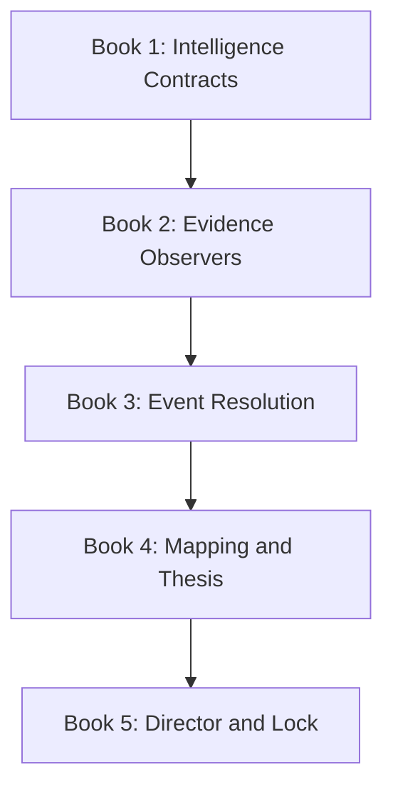
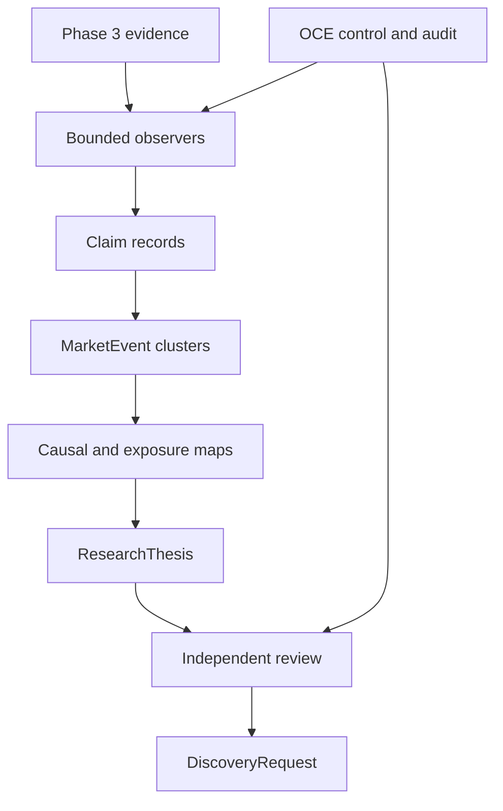
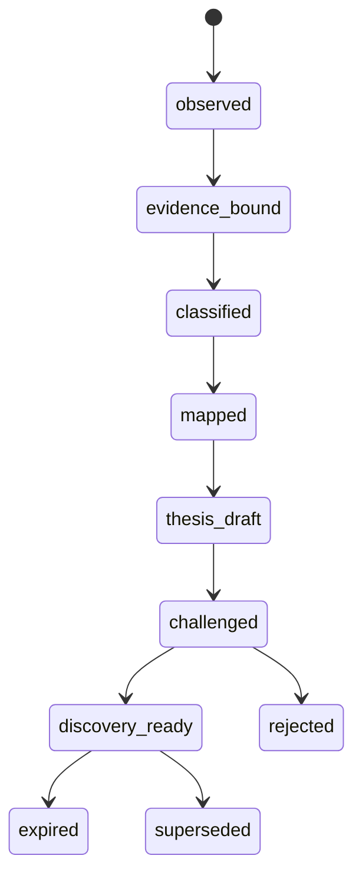

# GLX FORGE Phase 4 — Intelligence Forge

> **Phase:** 4 of 11  
> **Purpose:** Turn point-in-time market evidence into structured, falsifiable, time-bounded research objects  
> **Status:** Planned — implementation requires approved Phase 0–3 locks  
> **Parent:** [`GLX_FORGE_MASTER_BLUEPRINT.md`](../../GLX_FORGE_MASTER_BLUEPRINT.md)  
> **Prerequisite:** [`Phase 3 — Data Forge`](../phase-03-data-forge/README.md)  
> **Phase anchor:** **F4 — Research output must be testable; persuasive prose is not a signal.**

---

## 1. Phase Objective

Phase 4 builds the governed intelligence layer between evidence and market discovery:

- macro, news, filing, and source observers consume point-in-time Data Forge records;
- deterministic extractors and bounded models create claim-level structured outputs;
- event classifiers normalize event facts without confusing them with market impact;
- duplicate coverage is clustered without deleting source diversity;
- contradictions remain explicit;
- themes map through causal transmission channels to sectors, industries, issuers, and instruments;
- every exposure edge carries evidence, assumptions, horizon, direction, and uncertainty;
- research theses are falsifiable, expiring, and independently challenged;
- approved theses emit a typed request for Phase 5 discovery;
- every judgment is reconstructable from sources, model/tool identity, prompt/template version, and validation evidence.

Phase 4 does not scan the market, rank securities, generate `StrategySpec`, backtest, allocate capital, or create orders.



---

## 2. Reality at Phase Entry

| Existing fact | Phase 4 consequence |
|---|---|
| Phase 1 defines `SourceRecord`, `MarketEvent`, `ResearchThesis`, research events, roles, and permissions | Extend these through registered compatible schemas; do not redefine them in prompts |
| Phase 3 provides point-in-time evidence, stable identities, quality state, licensing, and immutable hashes | Governed intelligence consumes those interfaces only |
| OCE has an event fabric and observer runtime | Register intelligence observers and events through OCE |
| `oce/backend/dspy_event_classifier.py` classifies operational event categories such as observer/entropy/system | It is not a market-event classifier and cannot serve as Phase 4 truth |
| `srrs_opc/contradiction_resolver.py` resolves low-severity recovery-anchor conflicts with “weight wins” | It must not auto-resolve contradictory market evidence |
| No canonical macro observer, news mapper, exposure graph, or thesis pipeline exists in LARGER-LAB | Phase 4 creates new bounded components behind prior locks |
| Cheap OpenRouter models are an intended runtime constraint | Workflows are asynchronous, schema-bound, cached by immutable inputs, and tolerant of slow responses |

These facts do not prove that the Phase 0–3 implementation gates have executed. Phase 4 implementation remains blocked until the required locks exist.

---

## 3. Canonical Intelligence Decisions

| Concern | Canonical decision |
|---|---|
| Evidence authority | Passing Data Forge `SourceRecord`, macro, filing, and manifest references |
| Orchestration | OCE jobs, observers, events, permissions, and audit |
| Model role | Extraction, classification, synthesis, comparison, hypothesis formation |
| Deterministic role | Routing, schemas, timestamps, identity resolution, exact dedupe, lifecycle, expiration, budgets |
| Source handling | Untrusted content; never executable instructions |
| Claims | Atomic, cited, time-bounded `ClaimRecord` objects |
| Events | Facts separated from conditional impact interpretations |
| Duplicates | Clustered with every source/version preserved |
| Contradictions | Explicit claim relations; never “weight wins” truth |
| Reliability | Multidimensional, task-specific evidence—not one permanent publisher score |
| Causal maps | Hypotheses with edge type, conditions, lag, evidence, and alternatives |
| Exposure | Stable issuer/instrument IDs with directness and materiality evidence |
| Confidence | Method and calibration required; unsupported precision forbidden |
| Thesis | Falsifiable claim, causal map, horizon, invalidation, evidence, and candidate request |
| Approval | Research Director coordinates; independent challenger/reviewer is required |
| Handoff | `DiscoveryRequest`, not a stock ranking or trade |

---

## 4. Intelligence Law

A statement may influence a thesis only when:

\[
\operatorname{admissible}(c,T)=
\operatorname{schema\_valid}(c)
\land \operatorname{cited}(c)
\land \operatorname{available\_at}(c)\le T
\land \operatorname{licensed}(c)
\land \operatorname{identity\_resolved}(c)
\]

A thesis may enter discovery only when:

\[
\operatorname{discovery\_ready}(h)=
\operatorname{admissible\_claims}(h)
\land \operatorname{causal\_map}(h)
\land \operatorname{contradictions\_visible}(h)
\land \operatorname{falsifiable}(h)
\land \operatorname{unexpired}(h)
\land \operatorname{independently\_reviewed}(h)
\]

Model fluency, repetition across syndicated stories, or a high self-reported confidence does not satisfy either equation.

---

## 5. Book Sequence

| Book | Name | Primary output | Gate |
|---:|---|---|---|
| 1 | [Intelligence Contracts and Epistemic Boundaries](book-1-intelligence-contracts.md) | Claims, events, contradictions, mappings, theses, and lifecycle schemas | Unsupported claims and ambiguous confidence fail closed |
| 2 | [Observers and Evidence Intake](book-2-observers-evidence-intake.md) | Macro/news/filing observers with injection-safe evidence jobs | One evidence workflow reconstructs without direct provider access |
| 3 | [Event Resolution and Contradictions](book-3-event-resolution-contradictions.md) | Taxonomy, claim extraction, clusters, corrections, contradiction graph | Duplicate and contradictory fixtures preserve all evidence correctly |
| 4 | [Causal Mapping and Thesis Factory](book-4-causal-mapping-thesis-factory.md) | Theme/exposure graphs, falsifiable theses, discovery requests | Every thesis has causal edges, invalidation, horizon, and stable IDs |
| 5 | [Research Director and Intelligence Lock](book-5-research-director-intelligence-lock.md) | Review workflow, eval suite, expiration, lock, Phase 5 handoff | Known, adversarial, stale, and hallucination fixtures pass |

Books execute in order. Later models may supersede earlier intelligence artifacts; they may not overwrite evidence or silently change claim meaning.

---

## 6. Intelligence Architecture



No component bypasses Data Forge citations or OCE lifecycle/permission checks.

---

## 7. Canonical Artifact Flow

```text
EvidenceBundle
→ ClaimRecord[]
→ EventCluster
→ MarketEvent
→ ContradictionSet
→ CausalMap
→ ExposureMap
→ ResearchThesis
→ IntelligenceReview
→ DiscoveryRequest
```

Supporting objects are registered through Phase 1:

| Object | Purpose |
|---|---|
| `EvidenceBundle` | Immutable query result and source references from Phase 3 |
| `ClaimRecord` | One atomic factual or attributed claim |
| `EventCluster` | Related coverage/updates referring to one candidate event |
| `ContradictionSet` | Claim-level support, conflict, refinement, and unresolved state |
| `CausalMap` | Conditional transmission hypothesis |
| `ExposureMap` | Theme/channel relationships to stable market identities |
| `IntelligenceReview` | Independent challenge and decision evidence |
| `DiscoveryRequest` | Typed Phase 5 candidate-generation request |

`MarketEvent` and `ResearchThesis` remain the canonical Phase 1 artifacts.

---

## 8. Lifecycle



`discovery_ready` authorizes Phase 5 analysis only. It does not authorize strategy construction, validation, or trading.

---

## 9. Shared Deliverables

```text
forge/intelligence/
├── contracts/
├── observers/
├── extraction/
├── events/
├── contradictions/
├── mapping/
├── theses/
├── review/
├── evaluation/
└── observability/

deploy/config/
├── intelligence-taxonomy.yml
├── observer-policies.yml
├── source-reliability-policy.yml
├── confidence-policy.yml
├── horizon-policy.yml
├── model-routing-policy.yml
└── intelligence-resource-budgets.yml

tests/forge/intelligence/
├── contracts/
├── fixtures/
├── observers/
├── events/
├── contradictions/
├── mappings/
├── theses/
├── adversarial/
├── reproducibility/
└── e2e/

artifacts/forge/phase-04/
├── intelligence-taxonomy-lock.json
├── prompt-template-lock.json
├── evaluation-corpus-lock.json
├── golden-market-event.json
├── golden-research-thesis.json
├── golden-discovery-request.json
├── intelligence-lock-manifest.json
└── phase-04-validation-report.json
```

Exact implementation paths defer to approved prior locks.

---

## 10. Phase Test Matrix

| Test ID | Requirement | Book |
|---|---|---:|
| P4-CLM-001 | Every material claim has exact evidence and temporal eligibility | 1 |
| P4-EVT-001 | Known-event fixtures classify to the registered taxonomy | 1 |
| P4-CNF-001 | Confidence without a registered method fails | 1 |
| P4-OBS-001 | Macro/news/filing observers consume Data Forge evidence only | 2 |
| P4-INJ-001 | Source prompt injection cannot change tools, policy, or output schema | 2 |
| P4-TIM-001 | Publication and availability ordering survives the workflow | 2 |
| P4-DED-001 | Duplicate-story coverage clusters without deleting source diversity | 3 |
| P4-CON-001 | Contradictory sources remain visible and unresolved when warranted | 3 |
| P4-COR-001 | Corrections supersede intelligence without rewriting evidence | 3 |
| P4-MAP-001 | Event-to-industry mapping passes precision review | 4 |
| P4-EXP-001 | Company exposure edges resolve stable IDs and cited mechanisms | 4 |
| P4-THS-001 | Thesis falsifiability validator rejects vague narratives | 4 |
| P4-SYM-001 | Hallucinated or unresolved symbols fail closed | 4 |
| P4-EXP-002 | Expired catalysts cannot produce active discovery requests | 5 |
| P4-REV-001 | Independent challenge is required before discovery readiness | 5 |
| P4-E2E-001 | Evidence-to-discovery lineage reconstructs end to end | 5 |
| P4-AUT-001 | No intelligence artifact ranks, strategizes, orders, or allocates capital | 5 |

The books define the complete test set.

---

## 11. Phase-Wide Invariants

1. OCE remains the only orchestration, event, governance, and audit spine.
2. Phase 1 artifact, event, permission, and lifecycle contracts remain authoritative.
3. Phase 2 jobs, workers, secrets, retries, and budgets remain authoritative.
4. Phase 3 timestamps, identities, quality, licensing, and manifests remain authoritative.
5. Every material assertion has one or more exact `SourceRecord` or dataset references.
6. Source content is untrusted data, never an instruction.
7. A model output is a proposed structured judgment, never source evidence.
8. Claims are atomic enough to support or contradict individually.
9. Event fact, expected market impact, and trade direction remain distinct.
10. Duplicate clustering never deletes source/version diversity.
11. Contradictions are preserved; generic weight/recency rules cannot declare truth.
12. Source reliability is multidimensional and task-specific.
13. Numeric confidence requires a registered calibration method.
14. Causal edges state whether they are mechanistic, empirical, correlational, or speculative.
15. Every causal edge has conditions, sign, lag/horizon, evidence, and alternatives.
16. Every issuer/instrument reference resolves through Data Forge stable identity.
17. A thesis includes supporting and disconfirming evidence searches.
18. A thesis has an explicit start, horizon, review point, and expiry.
19. Expiry changes lifecycle state; it never deletes evidence.
20. The proposer cannot be the sole challenger and approver.
21. Cheap/slow model operation uses bounded asynchronous jobs and immutable-input caches.
22. Prompt/model/template versions and resource use are recorded.
23. Hidden chain-of-thought is not required or stored as audit evidence.
24. No Phase 4 output is a strategy, trade signal, order, allocation, or deployment approval.

---

## 12. Agent Extension Contract

Before changing Intelligence Forge, an agent must load:

1. the master anchors;
2. approved Phase 0–3 locks;
3. this index;
4. the governing book;
5. active taxonomy, prompt, confidence, horizon, evaluation, and Intelligence Lock artifacts.

The agent must declare:

```yaml
intelligence_domain: macro|news|filing|event|mapping|thesis|review
change_type: schema|taxonomy|observer|prompt|model|policy|evaluation
as_of_cutoff: explicit
evidence_inputs: []
stable_identity_scope: explicit
model_and_template_scope: explicit
output_artifact: typed
affected_test_ids: []
supersession_or_migration: explicit
rollback_or_disable_path: explicit
```

The agent must stop rather than infer when:

- evidence is unavailable or quarantined;
- source licensing or prompt exposure is unclear;
- publication/availability order is ambiguous;
- issuer/instrument identity does not resolve;
- event taxonomy has no compatible class;
- contradictory evidence cannot be represented;
- causal direction or materiality lacks support;
- confidence has no method;
- thesis falsification or expiry is missing;
- the requested output would cross into Phase 5–11 authority.

---

## 13. Phase Completion Definition

Phase 4 is complete only when:

- All five books pass their exit gates.
- Macro, news, and filing observers run through Phase 2 jobs and Phase 3 evidence contracts.
- Source content cannot inject instructions or tool actions.
- Claim extraction preserves exact evidence, attribution, and temporal eligibility.
- Known events classify correctly and unknown classes fail visibly.
- Duplicate coverage clusters without erasing sources, corrections, or timing.
- Contradictions remain explicit through review.
- Reliability and confidence policies are versioned and reconstructable.
- Theme/sector/industry/company mappings pass sampled precision and unsupported-edge tests.
- Every issuer/instrument reference resolves to stable Data Forge identity.
- Every discovery-ready thesis has evidence, causal map, affected groups, conditions, horizon, expiry, falsification, and candidate-generation request.
- Independent challenge and review pass.
- Expired or superseded catalysts cannot remain active.
- Hallucinated symbols and unsupported claims fail closed.
- The golden evidence-to-discovery workflow reproduces.
- No scanning, ranking, `StrategySpec`, backtest, order, broker, or capital authority appears.
- The Intelligence Lock and Phase 5 handoff are independently validated.

---

## 14. Handoff to Phase 5

Phase 5 — Discovery Forge receives:

- discovery-ready `ResearchThesis` references;
- normalized `MarketEvent` and event-cluster references;
- immutable supporting and contradicting evidence;
- causal transmission and exposure maps;
- stable sector, industry, issuer, instrument, and venue identities;
- explicit `DiscoveryRequest` objects;
- point-in-time cutoff and required Data Forge manifest/universe policies;
- candidate inclusion/exclusion intent;
- required deterministic features and observable conditions;
- horizon, review time, expiry, and thesis invalidation state;
- intelligence confidence, limitations, and coverage gaps.

Phase 5 may scan and rank a point-in-time universe mechanically. It may not alter source facts, hide contradictions, extend thesis expiry, reinterpret causal edges, or create strategy/trading authority.
