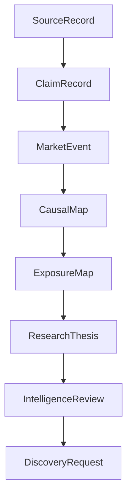

# Phase 4, Book 1 — Intelligence Contracts and Epistemic Boundaries

> **Purpose:** Define the structured language that separates evidence, claims, event facts, interpretations, causal hypotheses, exposures, theses, and approvals  
> **Input:** Phase 1 Constitution plus approved Phase 3 evidence contracts  
> **Output:** Registered Intelligence Forge schemas, taxonomies, lifecycles, and fixtures  
> **Next:** [Book 2 — Observers and Evidence Intake](book-2-observers-evidence-intake.md)

---

## 1. Success Statement

Every intelligence object can be validated without reading persuasive prose. The system can distinguish:

- what a source contains;
- what atomic claim was extracted;
- what event fact is believed to have occurred;
- what interpretation is being proposed;
- what transmission path is hypothesized;
- which entities may be exposed;
- what would falsify the thesis;
- who reviewed it;
- when it expires.

Unsupported claims, unresolved identities, uncalibrated confidence, and missing falsification fail closed.

---

## 2. Applicable Anchors

- **A0:** Human Strategic Authority
- **A1:** One Orchestration Spine
- **A2:** Evidence Before Narrative
- **A3:** Point-in-Time Data
- **A4:** StrategySpec Is Truth
- **A8:** Promotion Is State-Based
- **A9:** Separate Research From Approval
- **A10:** Observable and Reconstructable
- **A11:** Repair Before Expansion
- **A12:** Cheap Models Use Tools, Not Memory
- **F1:** Canonical schema and lineage
- **F3:** Passing data manifest required
- **F4:** Testable research, not persuasive prose

---

## 3. Epistemic Stack



Rules:

- Evidence is not a claim.
- A claim is not an event.
- An event is not its market impact.
- A plausible mechanism is not proven causality.
- Exposure is not a candidate ranking.
- A thesis is not a strategy or signal.
- Review readiness is not trade authority.

---

## 4. Work Packages

### 4.1 Common intelligence envelope

Every Phase 4 artifact uses the Phase 1 `ArtifactEnvelope` and additionally records:

```yaml
as_of: RFC3339 UTC
input_artifact_refs: []
source_record_refs: []
producer:
  actor_id: typed-id
  component_id: typed-id
  code_version: build-id
  model_id: optional exact-id
  model_provider: optional
  prompt_template_id: optional
  tool_versions: []
judgment_method_id: policy-id
confidence_method_id: policy-id
resource_usage_ref: artifact-ref
limitations: []
unknowns: []
```

No prompt, model, or agent output becomes canonical without schema validation and evidence references.

### 4.2 `ClaimRecord`

A claim is one independently supportable or contradictable statement:

```yaml
claim_id: typed-id
claim_type: fact|attributed_statement|estimate|forecast|interpretation
subject_refs: []
predicate: registered-predicate
object_value: typed-value
qualifiers: {}
speaker_or_publisher_ref: optional
event_time: optional
effective_at: optional
available_at: RFC3339 UTC
source_record_ref: artifact-ref
evidence_locator:
  page_or_section: optional
  character_or_table_locator: optional
  permitted_excerpt_hash: optional
extraction_method: deterministic|model|human
extraction_confidence: method-bound
status: proposed|validated|disputed|superseded|rejected
```

Rules:

- compound sentences split into atomic claims where practical;
- attributed speech remains attributed;
- forecasts cannot be serialized as facts;
- absence of a statement is not proof of the opposite;
- paraphrase must preserve material qualifiers;
- evidence locators must survive content-version changes or explicitly break.

### 4.3 Claim predicate registry

Initial predicate families:

```text
announced
reported
revised
forecast
guided
acquired
divested
launched
contracted
cancelled
approved
restricted
investigated
filed
raised_or_cut
increased_or_decreased
exposed_to
depends_on
contradicts
supports
```

Unknown predicates enter `proposed` and cannot be improvised into canonical strings.

### 4.4 `MarketEvent`

Extend the Phase 1 body:

```yaml
market_event_id: typed-id
event_class: taxonomy-id
event_subclass: taxonomy-id
event_status: rumored|announced|confirmed|effective|corrected|cancelled
observed_at: RFC3339 UTC
effective_at: optional RFC3339 UTC
available_at: RFC3339 UTC
source_claim_refs: []
primary_entity_refs: []
affected_domain_refs: []
observed_direction: optional typed fact
impact_scenarios: []
horizon_policy_id: policy-id
expires_at: RFC3339 UTC
contradiction_set_ref: optional
confidence_method_id: policy-id
```

`observed_direction` describes a measured fact such as “policy rate increased.” It does not mean “stocks bearish.”

### 4.5 Event taxonomy

Initial top-level classes:

| Class | Example subclasses |
|---|---|
| `macro_release` | inflation, labor, growth, consumption, housing, manufacturing |
| `central_bank` | rate decision, guidance, balance sheet, liquidity facility |
| `fiscal_policy` | spending, taxation, issuance, subsidy |
| `regulatory_policy` | rule, approval, restriction, investigation, enforcement |
| `geopolitical` | conflict, sanction, election, treaty, trade restriction |
| `commodity_supply` | production, inventory, disruption, capacity |
| `credit_liquidity` | default, downgrade, funding stress, lending conditions |
| `corporate_results` | earnings, revenue, margin, guidance |
| `corporate_action` | merger, acquisition, spin-off, dividend, buyback, issuance |
| `corporate_operations` | product, contract, customer, supplier, outage, recall |
| `corporate_governance` | management, board, ownership, activist |
| `legal_filing` | lawsuit, bankruptcy, regulatory filing, amendment |

Taxonomy versions are explicit. Multi-label classification is allowed; incompatible labels create review.

### 4.6 Fact versus interpretation

An `ImpactScenario` declares:

```yaml
scenario_id: typed-id
affected_factor: registered-factor
expected_sign: positive|negative|mixed|non_directional
conditions: []
transmission_channel_refs: []
expected_lag: duration-range
expected_horizon: duration-range
supporting_claim_refs: []
contradicting_claim_refs: []
confidence_method_id: policy-id
status: proposed|challenged|accepted_for_research|rejected
```

This keeps an event fact stable while interpretations evolve.

### 4.7 `ContradictionSet`

Claim relations:

```text
supports
contradicts
refines
narrows
supersedes
duplicates
independent
not_comparable
```

Each edge records:

- source and target claim IDs;
- relation method;
- exact conflict dimension;
- temporal/version context;
- severity/materiality;
- resolver status;
- reviewer;
- decision evidence.

There is no generic “winner.” Resolution may be:

```text
unresolved
different_time
different_scope
source_corrected
one_disconfirmed
both_partially_valid
not_comparable
human_decision
```

### 4.8 Source reliability evidence

Reliability dimensions:

- proximity to the fact;
- primary/secondary/aggregator status;
- identity/authenticity;
- publication and correction transparency;
- historical accuracy for the same claim type, when measured;
- timeliness;
- methodological disclosure;
- independence from other cited sources;
- licensing/retention completeness;
- extraction quality.

Do not compress these into a permanent universal publisher score. Any aggregate must name:

- task/claim type;
- weights and version;
- empirical basis;
- time window;
- uncertainty;
- missing dimensions.

### 4.9 Confidence policy

Allowed representations:

```text
unknown
low
medium
high
calibrated_probability
```

Numeric confidence requires:

- labeled evaluation set;
- calibration method;
- sample size and class distribution;
- evaluation window;
- calibration error;
- model/template/version scope.

Model self-report alone maps to `unknown` or an ordinal review input—not probability.

Separate:

- extraction confidence;
- classification confidence;
- entity-link confidence;
- event-existence confidence;
- causal-edge confidence;
- thesis confidence.

### 4.10 `CausalMap`

Nodes:

```text
event
macro_factor
transmission_channel
theme
commodity
rate_or_curve
currency
sector
industry
issuer
instrument
observable
```

Edges declare:

```yaml
edge_type: mechanistic|empirical|correlational|speculative
source_node: typed-ref
target_node: typed-ref
sign: positive|negative|mixed|conditional
conditions: []
lag: duration-range
horizon: duration-range
mechanism: bounded-text
supporting_claim_refs: []
contradicting_claim_refs: []
alternative_explanations: []
confidence_method_id: policy-id
```

“Causal” means a structured hypothesis unless evidence justifies a stronger label.

### 4.11 `ExposureMap`

Exposure dimensions:

```text
revenue
customer
supplier
input_cost
commodity
currency
interest_rate
credit
geography
regulation
subsidy
capital_expenditure
technology
competitive
operational
ownership
```

Each exposure edge includes:

- stable issuer/instrument IDs;
- direction and directness;
- evidence and effective period;
- materiality measure or `unknown`;
- hedge/offset evidence;
- conditions;
- horizon;
- confidence method;
- unresolved contradictions.

### 4.12 `ResearchThesis`

Extend the Phase 1 body:

```yaml
research_thesis_id: typed-id
claim: falsifiable bounded statement
as_of: RFC3339 UTC
market_event_refs: []
causal_map_ref: artifact-ref
exposure_map_ref: artifact-ref
supporting_claim_refs: []
contradicting_claim_refs: []
assumptions: []
unknowns: []
affected_groups: []
expected_observables: []
candidate_universe_request: typed-object
expected_lag: duration-range
expected_horizon: duration-range
review_at: RFC3339 UTC
expires_at: RFC3339 UTC
falsification_rules: []
status: lifecycle-state
```

A thesis is invalid when the falsification rule depends only on subjective reassessment.

### 4.13 `DiscoveryRequest`

Phase 5 input:

```yaml
discovery_request_id: typed-id
research_thesis_ref: artifact-ref
as_of: RFC3339 UTC
universe_intent:
  asset_classes: []
  geographies: []
  sectors_or_industries: []
  inclusion_exposure_refs: []
  exclusion_rules: []
required_data_policies: []
required_deterministic_features: []
observable_conditions: []
horizon: duration-range
expires_at: RFC3339 UTC
stop_if_thesis_state: [expired, rejected, superseded]
```

It cannot include a pre-ranked ticker list, entry, exit, target, position size, or order instruction.

### 4.14 Intelligence lifecycle

States:

```text
observed
evidence_bound
classified
mapped
thesis_draft
challenged
discovery_ready
rejected
expired
superseded
```

Every transition declares required artifacts, role, guards, event, and compensation.

### 4.15 Judgment record

Every model/human judgment records:

- exact input artifact hashes;
- bounded input locators;
- output schema;
- model/provider/version or human actor;
- prompt/template version;
- tool versions;
- start/end time;
- token/request/resource use;
- timeout/retry outcome;
- validation errors;
- reviewer status.

Do not store hidden chain-of-thought. Store concise rationale tied to evidence and the structured decision.

---

## 5. Target Implementation Layout

```text
forge/intelligence/contracts/
├── claims.py
├── events.py
├── contradictions.py
├── reliability.py
├── confidence.py
├── causal_maps.py
├── exposure_maps.py
├── theses.py
├── discovery.py
└── judgments.py

forge/intelligence/taxonomy/
├── events.yml
├── predicates.yml
├── factors.yml
├── channels.yml
└── exposures.yml
```

Generated schemas and documentation use the Phase 1 registry.

---

## 6. Deliverables

- Intelligence artifact and supporting-object schemas.
- Claim predicate and event taxonomy registries.
- Fact/interpretation separation.
- Contradiction relation and resolution states.
- Multidimensional reliability policy.
- Confidence and calibration policy.
- Causal and exposure graph contracts.
- Extended `MarketEvent` and `ResearchThesis` schemas.
- `DiscoveryRequest` contract.
- Intelligence lifecycle registry.
- Judgment provenance contract.
- Golden, ambiguous, unsupported, and contaminated fixtures.
- Schema compatibility and migration plan.

---

## 7. Required Tests

### P4-CLM-001 — Exact evidence

Every material claim resolves to a permitted `SourceRecord` version, content hash, locator, and `available_at <= as_of`.

### P4-CLM-002 — Atomicity

Compound claims split or explicitly preserve multiple predicates; one supported clause cannot validate an unsupported clause.

### P4-CLM-003 — Attribution

Forecasts, estimates, allegations, and attributed statements cannot serialize as confirmed facts.

### P4-CLM-004 — Paraphrase fidelity

Material qualifiers, quantities, negation, speaker, and scope survive extraction.

### P4-SCH-001 — Intelligence schema strictness

Unknown critical fields, improvised taxonomy values, missing refs, and invalid lifecycle states fail.

### P4-EVT-001 — Known event taxonomy

Golden macro, corporate, regulatory, geopolitical, and filing fixtures classify to expected registered labels.

### P4-EVT-002 — Unknown event

Unknown or incompatible events enter review/proposal state rather than the nearest convenient class.

### P4-SEP-001 — Fact-impact separation

Changing an impact scenario cannot mutate the underlying event fact or evidence.

### P4-CON-000 — No weight-wins truth

Conflicting market claims cannot be auto-resolved through generic anchor weight, source count, or recency.

### P4-REL-001 — Reliability dimensions

Reliability evidence preserves dimensions and task scope; missing dimensions remain visible.

### P4-REL-002 — Syndication independence

Ten stories derived from one origin count as one evidentiary lineage, not ten independent confirmations.

### P4-CNF-001 — Confidence method

Numeric confidence without registered calibration evidence fails validation.

### P4-CNF-002 — Confidence separation

Extraction, classification, entity, event, causal, and thesis confidence cannot overwrite one another.

### P4-CAU-001 — Causal edge completeness

Every edge has type, sign, conditions, lag/horizon, evidence, alternatives, and confidence method.

### P4-EXP-000 — Exposure completeness

Every exposure uses stable identities, evidence, directness, materiality state, horizon, and contradictions.

### P4-THS-000 — Thesis completeness

Thesis lacks discovery eligibility when claim, causal map, evidence, contradiction search, horizon, expiry, or falsification is missing.

### P4-DSR-001 — Discovery boundary

`DiscoveryRequest` rejects ranking, entry, exit, target, size, order, broker, and capital fields.

### P4-LIN-001 — Judgment lineage

Model/tool/template/input/output/reviewer/resource lineage reconstructs without hidden reasoning.

---

## 8. Failure Modes

| Failure | Required response |
|---|---|
| Summary is stored without claim citations | Reject and re-extract into atomic claims |
| Event direction is treated as stock direction | Split fact from impact scenario |
| Ten syndicated stories inflate confidence | Collapse evidentiary lineage while retaining sources |
| Publisher reputation chooses contradiction winner | Preserve conflict and review claim-level evidence |
| Model emits “87% confidence” without calibration | Reject numeric value |
| Causal map hides alternative explanations | Block mapping/thesis gate |
| Ticker string is accepted without stable identity | Resolve or reject |
| Thesis says “bullish soon” | Reject as unfalsifiable and unbounded |
| Discovery request contains a trade setup | Block authority violation |
| Agent rationale requires stored chain-of-thought | Replace with concise evidence-linked decision rationale |

---

## 9. Exit Gate

Book 1 completes when:

- All supporting intelligence objects have registered schemas.
- Claim evidence, attribution, atomicity, and time tests pass.
- Fact and impact remain separate.
- Taxonomy handles known and unknown fixtures truthfully.
- Contradictions cannot use weight/count/recency as generic truth.
- Reliability and confidence methods are explicit.
- Causal/exposure maps enforce stable IDs and cited edges.
- Thesis and discovery boundaries reject vague or trading outputs.
- Judgment lineage reconstructs.
- Independent validation approves the contracts.

---

## 10. Handoff

Book 2 receives:

- intelligence schemas and taxonomy locks;
- evidence and claim contracts;
- point-in-time/admissibility rules;
- stable identity requirements;
- reliability and confidence policies;
- judgment provenance;
- observer-allowed outputs;
- model/tool/resource boundaries;
- injection and contaminated fixtures.
