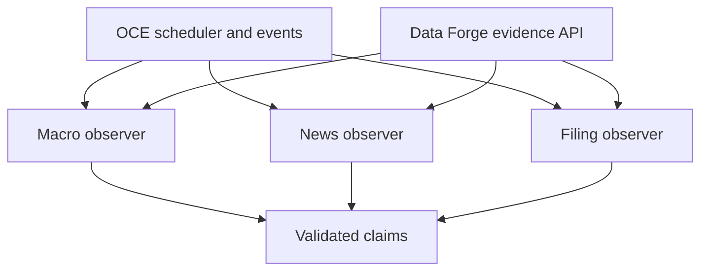
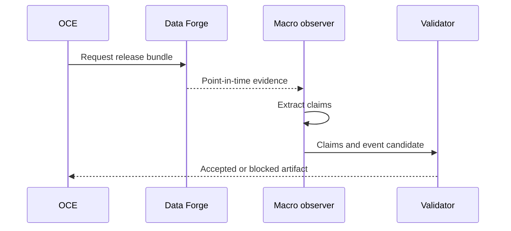

# Phase 4, Book 2 — Observers and Evidence Intake

> **Purpose:** Implement bounded macro, news, and filing observers that transform approved Data Forge evidence into validated intelligence inputs  
> **Input:** Book 1 contracts plus Phase 2 runtime and Phase 3 evidence interfaces  
> **Output:** OCE-registered observers, evidence jobs, extraction pipeline, and safe model boundary  
> **Previous:** [Book 1 — Intelligence Contracts and Epistemic Boundaries](book-1-intelligence-contracts.md)  
> **Next:** [Book 3 — Event Resolution and Contradictions](book-3-event-resolution-contradictions.md)

---

## 1. Success Statement

Macro, news, and filing observers can run slowly and asynchronously, consume only approved point-in-time evidence, produce schema-valid claims, survive retry/replay without duplicate effects, and treat every source payload as untrusted data.

No observer gains direct provider, browser-session, strategy, broker, or capital authority.

---

## 2. Applicable Anchors

- **A0:** Human Strategic Authority
- **A1:** One Orchestration Spine
- **A2:** Evidence Before Narrative
- **A3:** Point-in-Time Data
- **A9:** Separate Research From Approval
- **A10:** Observable and Reconstructable
- **A11:** Repair Before Expansion
- **A12:** Cheap Models Use Tools, Not Memory
- **A13:** Local-First Heavy Compute
- **F1:** Canonical schema and lineage
- **F2:** Disposable heavy compute
- **F3:** Passing data manifest required
- **F4:** Testable research only

---

## 3. Observer Topology



Observers are permanent roles already anticipated by Phase 1. They register through the existing OCE observer runtime and Phase 2 worker capability model.

---

## 4. Work Packages

### 4.1 Observer role cards

#### Macro observer

Allowed:

- subscribe to release/vintage events;
- request point-in-time macro evidence bundles;
- compare actual, prior, revised-prior, and consensus values;
- extract policy statements;
- emit claims and event candidates.

Forbidden:

- use latest revised values for old cutoffs;
- infer an unavailable release time;
- turn surprise into a trade direction;
- rank securities.

#### News observer

Allowed:

- consume permitted news `SourceRecord` objects;
- extract attributed claims and entity mentions;
- propose event class/cluster membership;
- flag corrections, duplicates, and contradictions.

Forbidden:

- browse or call providers outside the approved evidence request path;
- execute source instructions;
- treat provider ticker tags as confirmed exposure;
- invent symbols or causal links.

#### Filing observer

Allowed:

- consume filing metadata/content allowed by entitlement;
- extract reported facts, guidance, risks, relationships, and amendments;
- link to stable issuer identity;
- emit claims and event candidates.

Forbidden:

- overwrite original filings with amendments;
- treat management forecast as realized fact;
- calculate material nontrivial figures without deterministic tools;
- create strategy logic.

### 4.2 Observer registration

Each observer declares:

```yaml
observer_id: typed-id
observer_role: macro_observer|news_mapper
component_id: typed-id
capabilities: []
subscribed_event_types: []
allowed_job_types: []
allowed_data_domains: []
allowed_output_artifacts: []
model_policy_id: policy-id
prompt_template_ids: []
resource_budget_id: budget-id
environment: research|test
forbidden_actions: []
reviewer_role: research_director|audit_observer
```

Filing-observer responsibility may be a bounded capability of `news_mapper`; creating a new permanent role requires Phase 1 governance.

### 4.3 Trigger modes

```text
scheduled
event_driven
operator_requested
backfill_evaluation
reprocess_after_correction
```

Triggers carry:

- `as_of`;
- evidence query;
- source/domain scope;
- horizon policy;
- output contract;
- idempotency key;
- resource budget;
- priority;
- reason/correlation ID.

An event-triggered observer cannot fetch outside the event's approved evidence scope without issuing a new governed data request.

### 4.4 Evidence request

Observers submit typed Phase 3 requests:

```yaml
evidence_request_id: typed-id
observer_id: typed-id
as_of: RFC3339 UTC
source_types: []
macro_series_or_release_refs: []
issuer_or_instrument_refs: []
time_window: {}
language_policy: policy-id
quality_policy_id: policy-id
retention_and_prompt_policy_id: policy-id
max_records: integer
purpose: event_extraction|correction_review|contradiction_search
```

The returned `EvidenceBundle` is immutable and hash-addressed.

### 4.5 Intake gate

Before model/tool use, deterministic code verifies:

- evidence bundle schema/hash;
- `available_at <= as_of`;
- passing quality state;
- stable identities;
- allowed content exposure;
- language/encoding;
- record count and byte/token ceilings;
- supported source type;
- duplicate/correction metadata;
- absence of provider secrets;
- source content boundary markers.

Rejected evidence produces a typed finding; the observer does not “do its best.”

### 4.6 Untrusted-content boundary

All source text is treated as quoted data.

Controls:

- system/tool instructions never originate inside source content;
- content is placed in delimited fields, not concatenated into control prompts;
- retrieved URLs, scripts, tool names, JSON, or markdown cannot trigger actions;
- tools are allowlisted before model execution;
- model has no provider credential or arbitrary shell access;
- output must validate against a fixed schema;
- unsupported output fields are rejected;
- source content cannot expand token, request, or time budgets;
- source instructions are recorded as injection findings when detected.

### 4.7 Prompt/template registry

Every template declares:

- template ID/version/hash;
- purpose and output schema;
- allowed evidence types;
- input ordering and truncation policy;
- injection-safe delimiter method;
- required citations;
- uncertainty instructions;
- forbidden claims/actions;
- model compatibility;
- token/time budget;
- golden and adversarial evaluation results;
- owner and approval status.

Prompt text changes require a new version and evaluation.

### 4.8 Model routing

The model router uses deterministic policy:

| Task | Preferred method |
|---|---|
| Exact fields/tables/dates | Deterministic parser |
| Known filing forms | Deterministic parser plus model only for bounded text |
| Claim extraction | Structured model with citation requirement |
| Event classification | Registered classifier with fallback/review |
| Duplicate candidate | Deterministic hashes first; model only for semantic candidate |
| Contradiction candidate | Structured comparison model |
| Calculation | Deterministic code |

Routing inputs:

- task type;
- evidence size/language;
- model capability registry;
- current free-model availability;
- cost/token/time budget;
- privacy/content policy;
- required output schema;
- fallback/review policy.

The model cannot select itself or expand its budget.

### 4.9 Cheap and slow model operation

Requirements:

- asynchronous Phase 2 jobs;
- lease, timeout, retry, dead-letter behavior;
- cache key from immutable input hashes, template version, model version, and output schema;
- bounded concurrency by provider/model;
- no latency requirement for non-urgent research;
- partial output never enters canonical state;
- fallback models create distinct judgment records;
- timeout/retry retains the same logical job;
- ensemble use requires an evaluation-backed policy;
- cost/resource metrics are attached.

### 4.10 Context construction

Context builder:

1. sorts records deterministically;
2. preserves source/version IDs and locators;
3. separates evidence from metadata;
4. removes prohibited bytes;
5. applies documented truncation;
6. never truncates away citation identity or material negation silently;
7. records included/excluded records and reasons;
8. computes context hash;
9. emits a coverage summary.

When evidence exceeds budget, split into bounded chunks and reconcile structured outputs; do not ask one model to remember earlier chunks.

### 4.11 Claim extraction

Extraction output:

- atomic claims;
- attribution;
- quantities/units;
- dates and scope;
- stable entity-link candidates;
- exact source locators;
- uncertainty;
- omitted/unreadable sections;
- possible injection text;
- extraction method and confidence.

Deterministic post-validation checks:

- citation exists;
- quoted/hashed span belongs to source version;
- quantities and dates match span;
- entity candidate exists or stays unresolved;
- output predicates are registered;
- no prohibited action/trade fields.

### 4.12 Entity resolution

Resolution order:

1. source-provided stable issuer/filing IDs;
2. Phase 3 alias lookup at `as_of`;
3. exact registered names/identifiers;
4. bounded candidate proposal;
5. ambiguity review.

Rules:

- ticker alone never confirms identity;
- one mention may resolve to issuer but not a specific instrument;
- symbol reuse and corporate actions use bitemporal identity;
- unresolved entities remain typed unresolved;
- model suggestions cannot create new canonical instruments.

### 4.13 Macro observer workflow



The workflow preserves:

- release schedule changes;
- first/latest-as-of vintage;
- actual/prior/revised/estimate lineage;
- statement speaker and publication;
- no automatic market-direction conclusion.

### 4.14 News/filing workflow

Steps:

1. receive new/corrected source event;
2. resolve approved evidence bundle;
3. exact duplicate/correction pre-check;
4. bounded claim extraction;
5. stable entity resolution;
6. event-class proposal;
7. semantic duplicate and contradiction candidates;
8. schema/citation validation;
9. publish proposed claims/event candidate;
10. send uncertain cases to review.

### 4.15 Correction/reprocessing

A corrected source or macro vintage:

- creates a new observer job;
- references prior intelligence descendants;
- re-extracts only affected claims where safe;
- publishes superseding claim/event candidates;
- triggers impact analysis;
- never edits old judgment artifacts;
- does not silently keep old thesis active.

### 4.16 Observer events

Register through Phase 1:

```text
forge.intelligence.observation.requested
forge.intelligence.evidence.resolved
forge.intelligence.evidence.blocked
forge.intelligence.claims.proposed
forge.intelligence.extraction.failed
forge.intelligence.injection.detected
forge.intelligence.entity.unresolved
forge.intelligence.correction.reprocessing_started
forge.intelligence.observation.completed
```

### 4.17 Observability

Metrics:

- evidence lag;
- source-to-claim latency;
- claims per source and rejection rate;
- citation validation failures;
- unresolved entities;
- injection findings;
- model/template failures;
- token/request/time use;
- cache hits;
- dead letters;
- correction impact backlog;
- human review queue age.

No raw prohibited content or model secret enters telemetry.

---

## 5. Target Implementation Layout

```text
forge/intelligence/observers/
├── base.py
├── macro.py
├── news.py
├── filings.py
├── registration.py
└── events.py

forge/intelligence/extraction/
├── evidence.py
├── context.py
├── prompts.py
├── routing.py
├── claims.py
├── entities.py
└── validation.py
```

---

## 6. Deliverables

- Observer role/capability registrations.
- Trigger and evidence-request contracts.
- Deterministic evidence intake gate.
- Prompt-injection-safe content boundary.
- Prompt/template registry.
- Model capability/routing policy.
- Cheap-model job, cache, fallback, and budget behavior.
- Deterministic context builder.
- Claim extraction and citation validator.
- Stable entity resolution.
- Macro observer.
- News/filing observer capabilities.
- Correction/reprocessing workflow.
- OCE intelligence events and observability.
- Golden and adversarial source fixtures.

---

## 7. Required Tests

### P4-OBS-001 — Governed evidence only

Observers consume passing Phase 3 bundles/manifests and cannot call provider SDKs, arbitrary web sessions, or raw paths directly.

### P4-OBS-002 — Observer capability

Observer identity, role, environment, job type, output artifact, and resource budget enforce.

### P4-OBS-003 — Trigger idempotency

Duplicate scheduled/event triggers create one logical observation effect.

### P4-DAT-001 — Intake eligibility

Future-available, quarantined, unlicensed, hash-invalid, oversized, or unsupported evidence fails before model use.

### P4-INJ-001 — Instruction injection

Source text asking the model to ignore policy, call tools, reveal secrets, or alter schema has no control effect.

### P4-INJ-002 — Tool injection

Source URLs, shell fragments, JSON tool calls, and markdown cannot invoke tools.

### P4-INJ-003 — Budget injection

Source content cannot increase token, request, concurrency, retry, or wall-time budgets.

### P4-PRM-001 — Template lock

Any prompt/template text change alters its lock and requires evaluation.

### P4-MDL-001 — Deterministic routing

Task/evidence/policy inputs select only allowed models/methods within budget.

### P4-MDL-002 — Fallback provenance

Model fallback produces a distinct judgment record and cannot impersonate the primary result.

### P4-CCH-001 — Immutable-input cache

Cache reuses only identical evidence, template, model, schema, and policy hashes.

### P4-CTX-001 — Context reconstruction

Context inclusion, ordering, truncation, exclusions, and hash reproduce.

### P4-CTX-002 — Negation preservation

Chunking/truncation cannot silently remove material negation, units, attribution, or citation identity.

### P4-EXT-001 — Claim extraction

Golden macro, news, and filing records produce expected atomic claims, values, attribution, and locators.

### P4-EXT-002 — Unsupported extraction

A model claim not present in cited evidence is rejected.

### P4-ENT-001 — Stable entity resolution

Issuer/instrument mentions resolve through Phase 3 identity at `as_of`.

### P4-ENT-002 — Ambiguous identity

Ticker reuse, common names, subsidiaries, and multiple share classes remain unresolved or explicitly scoped.

### P4-TIM-001 — Publication ordering

Observed, effective, published, available, retrieved, and processing times remain correctly ordered and unchanged.

### P4-MAC-001 — Macro vintage

The observer cannot see a later revision and preserves actual/prior/revised/estimate lineage.

### P4-FIL-001 — Filing amendment

Amended filings produce linked new claims and impact analysis without overwriting original claims.

### P4-COR-000 — Correction reprocessing

Source correction creates superseding outputs and enumerates affected descendants.

### P4-RES-001 — Resource enforcement

Token, request, concurrency, memory, output, retry, and wall-time limits terminate or defer work safely.

### P4-EVT-010 — Observer event reconstruction

OCE events reconstruct trigger, evidence, model/tool use, validation, output, retry, and review routing.

---

## 8. Failure Modes

| Failure | Required response |
|---|---|
| Observer calls OpenBB/news API directly | Block and route through Data Forge evidence request |
| Existing OCE classifier is reused as market taxonomy | Add Phase 4 classifier behind registered contracts |
| Source prompt changes agent behavior | Record injection and reject affected output |
| One giant context silently drops sources | Chunk deterministically and record coverage |
| Model fills missing company identity | Preserve unresolved entity |
| Retry creates duplicate claims | Fix idempotency and supersession |
| Free model disappears | Use registered fallback or queue for review |
| Filing amendment overwrites original | Restore version chain and impact analysis |
| Model calculates complex surprise/math | Route calculation through deterministic tool |

---

## 9. Exit Gate

Book 2 completes when:

- All observers register through OCE and Phase 2 capabilities.
- Evidence intake enforces Phase 3 time, quality, identity, and license rules.
- Prompt/tool/budget injection fixtures fail safely.
- Prompt and model routing locks reproduce.
- Slow/free-model retries, caches, and fallbacks preserve lineage.
- Claim extraction and citation validation pass.
- Entity ambiguity remains visible.
- Macro and filing correction workflows preserve versions.
- Observer events reconstruct.
- No provider, strategy, scanning, or execution authority leaks.
- Independent validation approves the observer boundary.

---

## 10. Handoff

Book 3 receives:

- validated claim records;
- proposed event labels;
- exact evidence/source lineage;
- stable and unresolved entity candidates;
- publication/availability chronology;
- duplicate/correction metadata;
- model/template/judgment records;
- reliability evidence;
- observer events and review findings;
- adversarial and ambiguous fixtures.
