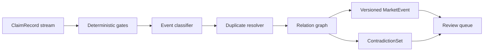
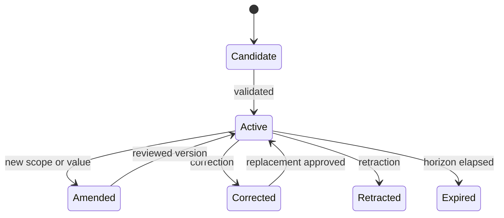

# Phase 4, Book 3 — Event Resolution and Contradictions

> **Purpose:** Convert extracted claims into versioned market events without erasing uncertainty, disagreement, or publication order  
> **Input:** Books 1–2 contracts, claims, evidence bundles, and observer outputs  
> **Output:** Classified `MarketEvent` objects, duplicate clusters, contradiction sets, correction lineage, and calibrated confidence records  
> **Previous:** [Book 2 — Observers and Evidence Intake](book-2-observers-evidence-intake.md)  
> **Next:** [Book 4 — Causal Mapping and Thesis Factory](book-4-causal-mapping-thesis-factory.md)

---

## 1. Success Statement

The same evidence replayed at the same cutoff produces the same event set. Reposts collapse without losing provenance, corrections remain linked to the original, conflicting claims stay visible, and uncertainty cannot be converted into false certainty by source count, recency, or model confidence.

This classifier is a market-intelligence component. It is separate from the existing OCE operational event classifier.

---

## 2. Applicable Anchors

- **A1:** One Orchestration Spine
- **A2:** Evidence Before Narrative
- **A3:** Point-in-Time Data
- **A4:** Stable Identity Everywhere
- **A8:** Idempotent Event Handling
- **A9:** Separate Research From Approval
- **A10:** Observable and Reconstructable
- **A12:** Cheap Models Use Tools, Not Memory
- **F1:** Canonical schema and lineage
- **F3:** Passing data manifest required
- **F4:** Testable research only

---

## 3. Resolution Topology



---

## 4. Work Packages

### 4.1 Classification boundary

Classification operates only on validated claims and cited evidence. The pipeline is:

1. validate schema and temporal admissibility;
2. apply deterministic rules for known release/filing types;
3. request model classification only for unresolved fields;
4. validate the model response against the taxonomy;
5. route ambiguous or novel cases to `unknown` and review.

Required event dimensions:

```yaml
event_class: macro|policy|regulatory|corporate|supply|demand|geopolitical|market_structure|other|unknown
event_subclass: registry-value
status: rumored|announced|confirmed|effective|amended|cancelled|expired|unknown
geography_refs: []
entity_refs: []
instrument_refs: []
event_time: timestamp-or-window
published_at: timestamp
available_at: timestamp
materiality: unknown|low|medium|high
classification_method: deterministic|model|human
taxonomy_version: semver
```

`instrument_refs` must resolve through Phase 3 identity services. A provider tag is only an unresolved mention until it resolves.

### 4.2 Event identity

An event identity key is derived from stable entities, normalized event predicate, event-time window, scope, and taxonomy version. It never depends on headline text alone.

```text
event_identity =
  hash(entity_set, predicate, event_time_window, scope, taxonomy_version)
```

Material changes create a new version. They do not silently mutate the original event.

### 4.3 Duplicate resolution

Resolution occurs in increasing-risk stages:

1. exact payload/hash duplicate;
2. same provider story/version duplicate;
3. syndicated or attributed repost;
4. semantic candidate cluster;
5. reviewed event merge.

An `EventCluster` retains:

- every source and version;
- original and normalized publication timestamps;
- syndication/attribution relationships;
- exact, semantic, and reviewed match reasons;
- canonical event reference;
- excluded near-matches and why;
- cluster algorithm/configuration version.

Semantic similarity may propose a cluster but cannot finalize a high-impact merge by itself.

### 4.4 Publication order

All comparisons use `available_at` for point-in-time admissibility. `published_at`, `event_time`, `retrieved_at`, and correction time remain distinct. Equal timestamps use deterministic stable-ID tie-breaking.

Replays must reproduce what was knowable at the requested cutoff, including an earlier incorrect report before a later correction became available.

### 4.5 Claim relation graph

Claims can be:

```text
supports
contradicts
qualifies
updates
corrects
retracts
duplicates
attributes_to
independent_of
unresolved_against
```

Relations store the method, evidence references, resolver version, timestamp, and reviewer when applicable.

### 4.6 Contradiction resolution

A `ContradictionSet` records disagreements by:

- value;
- event time;
- affected scope;
- entity attribution;
- status;
- causal interpretation;
- forecast versus realized fact.

It produces one of:

```text
resolved_by_primary_record
resolved_by_correction
resolved_by_scope
resolved_by_time
unresolved_material
unresolved_immaterial
```

There is no generic “highest weight wins” rule. The SRRS operational-anchor resolver must not be reused for market evidence.

### 4.7 Source independence

Ten headlines derived from one wire story count as one information lineage, not ten independent confirmations. The source graph tracks:

- originating source when known;
- quoted or cited source;
- syndication chain;
- shared press release or filing;
- independently gathered evidence;
- unknown dependence.

Unknown dependence reduces confidence and may block approval for discovery.

### 4.8 Reliability and confidence

Reliability remains multidimensional:

- primary-record proximity;
- historical correction rate;
- timestamp quality;
- entity-resolution quality;
- independence;
- domain competence;
- claim specificity.

Confidence is attached separately to classification, entity resolution, event identity, and each claim relation. A single blended score is forbidden unless its calibration, population, and loss function are declared.

### 4.9 Correction lifecycle



Downstream artifacts are never rewritten invisibly. A correction emits impact records identifying affected causal maps, theses, reviews, and discovery requests.

### 4.10 Evaluation corpus

Maintain a versioned corpus containing:

- known macro releases and revisions;
- original stories and syndicated copies;
- corrections and retractions;
- rumors later confirmed or denied;
- same-headline/different-event pairs;
- different-headline/same-event pairs;
- deliberate contradictions;
- unknown and out-of-taxonomy cases;
- publication-order edge cases.

Train/evaluation splits must prevent the same event lineage from appearing on both sides.

---

## 5. Target Layout

```text
intelligence/
  classification/
    taxonomy.py
    classifier.py
    deterministic_rules.py
  resolution/
    event_identity.py
    deduplicator.py
    source_graph.py
    contradiction_resolver.py
    corrections.py
  calibration/
    confidence.py
    evaluation_corpus.py
  schemas/
    event_cluster.py
    contradiction_set.py
```

---

## 6. Deliverables

- Versioned market-event taxonomy and migration policy.
- Deterministic-first classifier with `unknown` and review paths.
- Stable event identity and versioning implementation.
- Exact, syndication, and semantic duplicate resolver.
- Source-independence graph.
- Claim relation and contradiction engine.
- Correction/retraction impact propagation.
- Confidence calibration reports and frozen evaluation corpus.
- OCE events, logs, metrics, and replay fixtures.

---

## 7. Required Tests

### P4-CLS-001 — Known Event Classification

Known corpus events meet the per-class precision and recall thresholds declared in the lock manifest.

### P4-CLS-002 — Unknown Event Route

Out-of-taxonomy evidence returns `unknown` and review; it is not forced into the nearest class.

### P4-CLS-003 — Deterministic Rule Priority

A valid deterministic classification cannot be silently replaced by model output.

### P4-CLS-004 — Taxonomy Version Replay

Replay pins the original taxonomy version and reproduces the original classification.

### P4-CLS-005 — Operational Classifier Isolation

Market-event categories never enter the OCE operational event classifier, and operational categories never substitute for market classification.

### P4-DED-001 — Exact Duplicate Collapse

Identical records collapse to one event while retaining all arrival and source references.

### P4-DED-002 — Syndicated Story Collapse

Syndicated copies resolve to one information lineage rather than independent confirmations.

### P4-DED-003 — Semantic Duplicate Review

Semantic similarity proposes but does not autonomously finalize a material merge.

### P4-DED-004 — Near-Match Separation

Similar headlines describing distinct events remain separate.

### P4-DED-005 — Idempotent Reprocessing

Reprocessing the same claims creates no duplicate cluster, relation, or event version.

### P4-DED-006 — Stable Cluster Membership

The same inputs and versions produce identical cluster membership and canonical IDs.

### P4-CON-001 — Value Contradiction

Conflicting numeric claims create a visible contradiction set with citations.

### P4-CON-002 — Scope Contradiction

Apparently conflicting claims with different scopes are qualified rather than falsely resolved.

### P4-CON-003 — Forecast Fact Separation

A forecast and a realized result are never treated as contradictory facts of the same type.

### P4-CON-004 — No Vote Counting

Repost volume cannot resolve a contradiction.

### P4-CON-005 — Material Unresolved Block

An unresolved material contradiction blocks discovery approval.

### P4-CON-006 — Relation Provenance

Every claim relation is reproducible from cited evidence and a pinned resolver version.

### P4-COR-001 — Correction Preserves History

A correction creates linked versions and does not overwrite what was previously knowable.

### P4-COR-002 — Retraction Propagation

A retraction identifies every affected downstream artifact and changes its review state.

### P4-COR-003 — Late Correction Replay

A replay before the correction cutoff sees the original; a replay after it sees both and the correction relation.

### P4-IND-001 — Source Independence

One primary release plus nine reposts is counted as one lineage, with dependence visible.

### P4-CAL-001 — Confidence Calibration

Reported confidence meets declared calibration error thresholds on the held-out event-lineage split.

### P4-EVC-001 — Evaluation Leakage Guard

No event lineage crosses training, tuning, and held-out partitions.

---

## 8. Failure Modes

- **Headline identity:** same headline does not imply same event.
- **Consensus by repetition:** syndication does not create independent evidence.
- **Latest-state overwrite:** corrected knowledge cannot erase prior point-in-time state.
- **Model certainty:** model probability is not evidence reliability.
- **Taxonomy coercion:** novel events must remain unknown.
- **Opaque merge:** every duplicate decision must expose its basis.
- **Resolver reuse:** operational configuration conflict logic is not an epistemic truth engine.

---

## 9. Exit Gate

Book 3 is complete only when:

- classifications are versioned, calibrated, and replayable;
- duplicates collapse without provenance loss;
- source dependence is represented;
- material contradictions cannot disappear into narrative;
- corrections preserve temporal truth and propagate impact;
- all required tests pass in CI and on the frozen corpus.

---

## 10. Handoff to Book 4

Book 4 receives only versioned `MarketEvent`, `EventCluster`, `ContradictionSet`, and evidence references. It may build causal hypotheses, exposure maps, and theses. It may not erase unresolved evidence or reinterpret event history.
