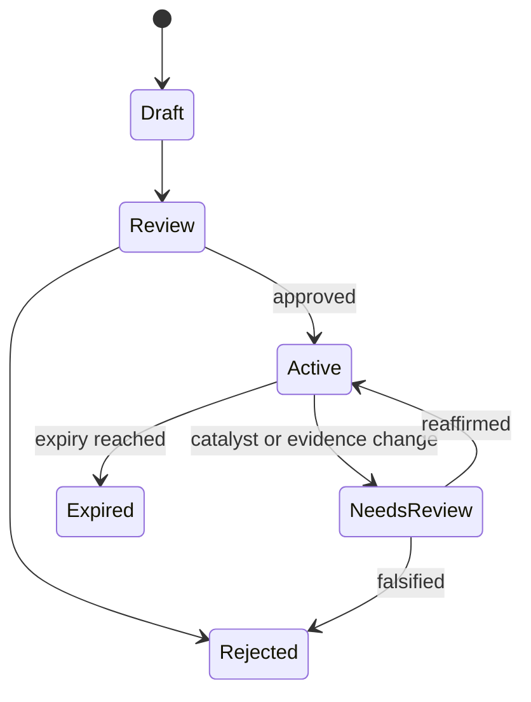

# Phase 4, Book 4 — Causal Mapping and Thesis Factory

> **Purpose:** Turn resolved events into explicit causal hypotheses, issuer exposures, and falsifiable research theses  
> **Input:** Versioned market events, contradiction sets, stable identities, and point-in-time evidence  
> **Output:** `CausalMap`, `ExposureMap`, `ResearchThesis`, and bounded `DiscoveryRequest` artifacts  
> **Previous:** [Book 3 — Event Resolution and Contradictions](book-3-event-resolution-contradictions.md)  
> **Next:** [Book 5 — Research Director and Intelligence Lock](book-5-research-director-intelligence-lock.md)

---

## 1. Success Statement

Every proposed market implication is represented as an inspectable chain from evidence to expected observable effects. Company and instrument mappings use stable identities and cited exposure evidence. Every thesis states what would prove it wrong and when it expires.

The factory creates research objects and candidate-group requests. It does not scan, rank, backtest, size, or trade securities.

---

## 2. Applicable Anchors

- **A0:** Human Strategic Authority
- **A2:** Evidence Before Narrative
- **A3:** Point-in-Time Data
- **A4:** Stable Identity Everywhere
- **A5:** Research Is Not Execution
- **A9:** Separate Research From Approval
- **A10:** Observable and Reconstructable
- **A12:** Cheap Models Use Tools, Not Memory
- **F1:** Canonical schema and lineage
- **F4:** Testable research only

---

## 3. Causal Topology


Skipping a stage is allowed only when the artifact records why that stage is not applicable.

---

## 4. Work Packages

### 4.1 Causal map contract

Each `CausalMap` contains nodes, directed edges, alternatives, and evidence:

```yaml
causal_map_id: typed-id
as_of: RFC3339 UTC
source_event_refs: []
nodes: []
edges:
  - from: node-id
    to: node-id
    relation: mechanistic|empirical|correlational|speculative
    expected_sign: positive|negative|mixed|unknown
    lag_window: {}
    horizon: immediate|short|medium|long
    conditions: []
    evidence_refs: []
    confidence_record_ref: typed-id
alternative_paths: []
invalidating_conditions: []
mapper_version: semver
```

Correlational and speculative edges must be labeled. They cannot be narrated as mechanisms.

### 4.2 Transmission-channel registry

Use a versioned registry rather than free-form channel names:

- rates and discount rate;
- inflation and input cost;
- demand and volume;
- supply and capacity;
- commodity and energy cost;
- foreign exchange;
- regulation and compliance;
- fiscal spending and procurement;
- credit availability;
- labor and wage;
- technology substitution;
- geopolitical access and logistics;
- market structure and liquidity.

New channels require definition, examples, counterexamples, and tests.

### 4.3 Sector and industry mapping

Mappings use Phase 3 point-in-time classifications. The artifact records the classification provider, taxonomy version, effective interval, and stable group ID.

A theme-to-sector link is a hypothesis, not proof that every member has the same exposure.

### 4.4 Company exposure map

The exposure mapper searches approved evidence for:

- revenue and geography;
- customers and end markets;
- suppliers and logistics;
- costs, commodities, energy, and labor;
- currencies, rates, and financing;
- regulation and government programs;
- products, patents, and technology;
- hedges, offsets, and contractual pass-through;
- operational concentration and dependencies.

Each exposure records:

```yaml
exposure_id: typed-id
issuer_id: stable-issuer-id
exposure_type: registry-value
direction: beneficiary|adverse|mixed|neutral|unknown
directness: direct|indirect|second_order|unknown
materiality: material|possibly_material|immaterial|unknown
hedged_or_offset: yes|partial|no|unknown
evidence_refs: []
effective_interval: {}
assumptions: []
unknowns: []
```

Unsupported materiality remains `unknown`. Absence of evidence is not evidence of no exposure.

### 4.5 Issuer and instrument identity

The mapper resolves organizations to stable issuer IDs and then requests valid point-in-time instrument mappings from Phase 3. It cannot invent a ticker, guess an exchange, or map an issuer to an inactive instrument outside its effective interval.

Ambiguous names go to review. Provider symbols remain evidence fields until resolved.

### 4.6 Candidate groups

Phase 4 may define an evidence-backed group such as:

```yaml
candidate_group:
  inclusion_predicate: "issuers with cited direct exposure to channel X"
  exclusion_predicate: "hedged or immaterial exposure"
  geography_or_classification_scope: []
  evidence_cutoff: timestamp
  required_fields: []
```

It may not enumerate and rank the whole market. Phase 5 applies this predicate to the governed universe.

### 4.7 Thesis factory

Every `ResearchThesis` includes:

- a single testable claim;
- source events and evidence;
- causal and exposure map references;
- affected group predicate;
- expected sign, lag, and observable effects;
- assumptions and material unknowns;
- strongest alternative explanation;
- disconfirming evidence already searched;
- falsification conditions;
- start, review, catalyst, and expiration timestamps;
- status and review lineage;
- a bounded discovery request.

Persuasive prose is optional. Structured falsifiability is mandatory.

### 4.8 Thesis archetypes

Templates may specialize fields without weakening the base contract:

```text
macro release surprise
central-bank or fiscal policy
regulatory change
corporate filing or guidance
supply disruption
demand inflection
commodity or currency transmission
technology or competitive shift
geopolitical event
```

Templates never encode a trade direction by default.

### 4.9 Falsification design

Falsification must name observable conditions, data source, comparison window, and evaluation time. Examples:

- claimed exposure is immaterial in primary filings;
- transmission channel is contractually hedged;
- expected operating metric does not move within the lag window;
- event is cancelled or corrected;
- an alternative cause explains the observation better.

“Price went down” alone is not a sufficient falsifier unless the thesis explicitly predicts price over a defined horizon and Phase 5/6 owns that test.

### 4.10 Expiration and catalyst horizon



An expired thesis cannot generate a fresh discovery request without new evidence and review.

### 4.11 Discovery request

The handoff is bounded and declarative:

```yaml
discovery_request_id: typed-id
thesis_id: typed-id
as_of: timestamp
universe_policy_ref: policy-id
candidate_group_predicate: {}
required_point_in_time_fields: []
requested_observables: []
exclusions: []
maximum_result_count: integer
expiration_at: timestamp
prohibited_outputs:
  - strategy_spec
  - order
  - position_size
```

Phase 5 owns market-wide enumeration, feature computation, filters, ranking, and result reproducibility.

---

## 5. Target Layout

```text
intelligence/
  mapping/
    channel_registry.py
    causal_mapper.py
    classification_mapper.py
    exposure_mapper.py
    identity_resolver.py
  thesis/
    factory.py
    templates/
    falsification.py
    expiration.py
    discovery_request.py
  schemas/
    causal_map.py
    exposure_map.py
    research_thesis.py
    discovery_request.py
```

---

## 6. Deliverables

- Versioned transmission-channel registry.
- Causal graph builder with edge typing, alternatives, lag, and horizon.
- Point-in-time sector/industry mapping adapter.
- Evidence-backed company exposure mapper.
- Stable issuer-to-instrument resolver.
- Candidate-group predicate contract.
- Thesis archetypes and falsification engine.
- Catalyst/review/expiration scheduler.
- Bounded `DiscoveryRequest` contract and Phase 5 adapter.
- Mapping and thesis evaluation fixtures.

---

## 7. Required Tests

### P4-MAP-001 — Complete Causal Chain

A known event produces a traceable event-to-observable path with evidence on every material edge.

### P4-MAP-002 — Edge Type Honesty

Correlational and speculative links remain explicitly labeled in storage and presentation.

### P4-MAP-003 — Alternative Path

The mapper records at least one plausible alternative when the evidence corpus contains one.

### P4-MAP-004 — Lag and Horizon

Every material edge declares a lag window and horizon or a cited reason for `unknown`.

### P4-MAP-005 — Point-in-Time Classification

Sector and industry membership resolves using the taxonomy effective at `as_of`.

### P4-MAP-006 — Mapping Precision

On the locked corpus, accepted group mappings meet the manifest’s precision threshold and disclose recall limitations.

### P4-EXP-001 — Cited Exposure

Every material issuer exposure has at least one admissible evidence reference.

### P4-EXP-002 — Expiration Enforcement

An expired thesis cannot issue or refresh a discovery request.

### P4-EXP-003 — Hedge and Offset

Known hedges or pass-throughs appear in the exposure record and affect direction/materiality uncertainty.

### P4-EXP-004 — Unknown Materiality

Missing materiality evidence remains `unknown`; it is not inferred from sector membership.

### P4-EXP-005 — Directness Separation

Direct, indirect, and second-order exposures remain distinguishable.

### P4-SYM-001 — Hallucinated Symbol Rejection

An instrument not resolved through Phase 3 stable identity is rejected.

### P4-SYM-002 — Ambiguous Issuer Review

An ambiguous company name enters review and cannot produce a confirmed instrument mapping.

### P4-SYM-003 — Effective-Interval Enforcement

Inactive, renamed, merged, or delisted instruments resolve correctly for the historical cutoff.

### P4-THS-001 — Falsifiable Thesis

Every approved thesis contains observable falsification conditions, sources, windows, and evaluation time.

### P4-THS-002 — Unsupported Claim Rejection

A material thesis claim without admissible evidence cannot advance to review.

### P4-THS-003 — Disconfirming Search

The thesis records the bounded counterevidence search and its results.

### P4-THS-004 — Assumption Visibility

Assumptions and unknowns survive serialization, review, and presentation.

### P4-THS-005 — Correction Impact

A corrected source event returns the thesis to `needs_review`.

### P4-THS-006 — Template Contract

Every archetype satisfies the base `ResearchThesis` schema and authority rules.

### P4-DSR-010 — Predicate-Only Candidate Group

Phase 4 emits a reproducible inclusion/exclusion predicate rather than a market-wide ranked list.

### P4-DSR-011 — Discovery Scope Bound

The request contains an evidence cutoff, universe policy, maximum results, expiration, and prohibited outputs.

### P4-DSR-012 — No Strategy Leakage

No discovery request contains entry, exit, sizing, portfolio, or order instructions.

---

## 8. Failure Modes

- **Theme basket shortcut:** sector membership is not company exposure.
- **Ticker invention:** names never become symbols without stable identity resolution.
- **Causal storytelling:** plausible prose cannot replace typed edges and evidence.
- **Directional overreach:** an event is not automatically bullish or bearish.
- **Unbounded theme:** candidate predicates require scope, exclusions, and expiry.
- **Stale thesis:** catalysts and corrections require review.
- **Scanner leakage:** Phase 4 cannot rank the market.

---

## 9. Exit Gate

Book 4 is complete only when:

- causal paths expose mechanisms, uncertainty, alternatives, lag, and horizon;
- company exposures are point-in-time, cited, and identity-safe;
- all approved theses are falsifiable and expire;
- hallucinated symbols and unsupported claims fail closed;
- outputs stop at a bounded `DiscoveryRequest`;
- all required tests pass.

---

## 10. Handoff to Book 5

Book 5 receives the full evidence lineage, event state, causal/exposure maps, draft thesis, disconfirming-search record, and discovery request. The Research Director decides whether the package is fit for Phase 5 discovery; it does not decide whether to trade.
