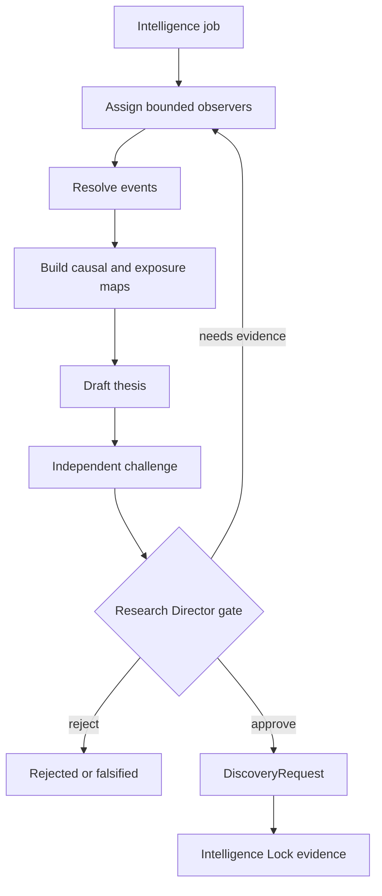

# Phase 4, Book 5 — Research Director and Intelligence Lock

> **Purpose:** Govern the end-to-end intelligence workflow, challenge its conclusions, and prove Phase 4 is safe to hand to Discovery Forge  
> **Input:** Books 1–4 artifacts, tests, evaluation corpus, lineage, and operational evidence  
> **Output:** Reviewed theses, approved discovery requests, correction controls, and an immutable Intelligence Lock Manifest  
> **Previous:** [Book 4 — Causal Mapping and Thesis Factory](book-4-causal-mapping-thesis-factory.md)  
> **Next:** Phase 5 — Discovery Forge

---

## 1. Success Statement

The Research Director can coordinate a complete, replayable intelligence job from evidence cutoff to an approved or rejected discovery request. A separate challenger tests material claims, failures are visible, expiry is enforced, and no workflow can cross into scanning, strategy, portfolio, or execution authority.

---

## 2. Applicable Anchors

- **A0:** Human Strategic Authority
- **A1:** One Orchestration Spine
- **A2:** Evidence Before Narrative
- **A3:** Point-in-Time Data
- **A5:** Research Is Not Execution
- **A6:** Explicit Authority and Capability
- **A8:** Idempotent Event Handling
- **A9:** Separate Research From Approval
- **A10:** Observable and Reconstructable
- **A11:** Repair Before Expansion
- **A13:** Local-First Heavy Compute
- **F4:** Testable research only

---

## 3. Governed Workflow



The proposer cannot be the sole approver of its own material thesis.

---

## 4. Work Packages

### 4.1 Research Director role

Allowed:

- open bounded intelligence jobs;
- assign approved observer tasks through OCE;
- request evidence already exposed by Data Forge;
- require correction, clarification, or additional counterevidence;
- approve a thesis **for discovery**;
- reject, expire, or reopen a thesis;
- issue an approved `DiscoveryRequest`.

Forbidden:

- directly query unapproved providers;
- waive missing lineage or material contradictions;
- scan or rank the market;
- author or approve a `StrategySpec`;
- backtest, size capital, place orders, or change execution controls;
- declare a thesis true because an agent sounds confident.

### 4.2 Intelligence job contract

```yaml
intelligence_job_id: typed-id
requester: actor-id
purpose: registry-value
as_of: RFC3339 UTC
scope: {}
allowed_source_domains: []
observer_assignments: []
resource_budget_id: policy-id
model_policy_id: policy-id
required_outputs: []
review_policy_id: policy-id
expiration_at: timestamp
idempotency_key: string
correlation_id: typed-id
```

Jobs are bounded, resumable, idempotent, and visible in the OCE event fabric.

### 4.3 Independent challenge

The `audit_observer` receives the structured package and performs:

- citation entailment checks;
- primary-source and source-independence checks;
- missing-variable and alternative-cause search;
- counterexample and disconfirming-evidence search;
- temporal leakage review;
- identity and symbol review;
- contradiction completeness review;
- authority-boundary review.

The challenger returns findings, evidence, severity, and disposition—not hidden chain-of-thought.

### 4.4 Review dispositions

```text
approve_for_discovery
needs_evidence
needs_correction
reject_unsupported
reject_falsified
reject_out_of_scope
expired
```

Approval means only that the research package is sufficiently evidenced and testable for Phase 5 to evaluate a universe. It is not investment approval.

### 4.5 Expiration and catalyst reviews

OCE schedules review jobs for:

- catalyst arrival;
- thesis review date;
- source correction/retraction;
- exposure or identity change;
- material contradictory evidence;
- expiry;
- taxonomy/model/prompt changes requiring controlled reevaluation.

If a required review cannot run, the thesis becomes stale and its discovery request is disabled.

### 4.6 Evaluation program

The locked program includes:

- unit and contract tests;
- property and mutation tests;
- frozen known-event replay corpus;
- duplicate/syndication corpus;
- contradiction/correction corpus;
- causal and issuer-mapping gold set;
- hallucinated-symbol and unsupported-claim attacks;
- prompt-injection corpus;
- stale/expired thesis cases;
- deterministic end-to-end golden runs.

Metrics include:

```text
event classification precision, recall, and F1
entity-resolution accuracy
duplicate precision and recall
contradiction detection recall
mapping precision with disclosed coverage
citation coverage and entailment failure rate
unsupported material-claim rate
confidence calibration error
point-in-time replay equality
idempotency and duplicate-effect rate
review reversal rate
job latency, model cost, cache rate, and failure rate
```

Targets are frozen in the lock manifest before the final evaluation run. No aggregate score may hide a critical safety failure.

### 4.7 Golden end-to-end scenario

The canonical run must include:

1. a time-stamped macro, policy, filing, or news event;
2. at least one duplicate or syndicated report;
3. a contradictory or correcting claim;
4. point-in-time replay before and after that change;
5. causal and company-exposure mapping;
6. a challenged falsifiable thesis;
7. expiry/catalyst policy;
8. an approved bounded discovery request;
9. proof that no ranking, strategy, order, or capital action occurred.

### 4.8 Adversarial evaluation

Red-team cases attempt to:

- inject instructions through news, filings, metadata, or quoted text;
- make the model cite nonexistent evidence;
- invent a ticker or issuer relationship;
- exploit repeated reposts as consensus;
- use future corrections in a historical replay;
- bypass expiry;
- put entry/exit/sizing language into the discovery request;
- call providers, strategy engines, or brokers without capability;
- change prompts/models without invalidating the manifest.

All critical boundary attacks fail closed.

### 4.9 Observability and run evidence

Each job exposes:

- state and current stage;
- evidence, prompt, model, tool, taxonomy, and policy versions;
- input/output hashes;
- retries, cache decisions, and budget consumption;
- unresolved contradictions and review findings;
- artifact lineage and downstream impact;
- terminal disposition and actor;
- latency and error metrics.

Logs must not leak licensed payloads, secrets, or unnecessary source text.

### 4.10 Backup, restore, and replay

The lock exercise proves:

- durable artifact backup;
- manifest and registry backup;
- restoration into an isolated test environment;
- hash verification;
- replay of a golden job;
- no dependency on an ephemeral worker or model session.

### 4.11 Intelligence Lock Manifest

```yaml
phase: 4
lock_id: immutable-id
commit_sha: git-sha
created_at: timestamp
schema_versions: {}
taxonomy_versions: {}
prompt_template_hashes: {}
model_policies: {}
tool_registry_version: semver
source_and_quality_policy_refs: []
evaluation_corpus_hashes: {}
test_report_refs: []
metric_thresholds: {}
golden_run_refs: []
security_and_injection_report_ref: artifact-id
backup_restore_report_ref: artifact-id
known_limitations: []
approved_discovery_contract_version: semver
prohibited_authorities: []
approvals: []
```

Any material change to a locked dependency invalidates the lock until the declared affected tests rerun.

### 4.12 Phase 5 handoff

Phase 5 receives:

- approved, unexpired `ResearchThesis`;
- bounded `DiscoveryRequest`;
- causal/exposure summaries with evidence refs;
- stable identity and point-in-time constraints;
- unresolved but accepted immaterial uncertainty;
- exclusion rules and required observables;
- lock and correlation IDs.

Phase 5 returns candidate and ranking evidence to research. It cannot retroactively change the thesis or Phase 4 evidence.

---

## 5. Target Layout

```text
intelligence/
  director/
    workflow.py
    assignments.py
    review_gate.py
    expiration_jobs.py
  challenge/
    audit_observer.py
    counterevidence.py
    citation_checks.py
    boundary_checks.py
  evaluation/
    corpus/
    metrics.py
    golden_runs.py
    adversarial.py
  lock/
    manifest.py
    verify.py
    impact_rules.py
  handoff/
    discovery_adapter.py
```

---

## 6. Deliverables

- OCE-native Research Director workflow.
- Independent audit/challenge observer.
- Typed review findings and dispositions.
- Catalyst, correction, stale, and expiry jobs.
- Versioned evaluation corpus and metric suite.
- Golden and adversarial end-to-end runs.
- Complete observability and cost evidence.
- Backup/restore/replay proof.
- Immutable Intelligence Lock Manifest and verifier.
- Versioned Phase 5 handoff adapter.

---

## 7. Required Tests

### P4-REV-001 — Independent Review

The material thesis proposer cannot be its sole approver.

### P4-REV-002 — Citation Entailment

The challenger rejects a material claim whose citation does not support it.

### P4-REV-003 — Counterevidence Search

The review artifact records a bounded disconfirming search and all material findings.

### P4-REV-004 — Material Contradiction Gate

An unresolved material contradiction prevents `approve_for_discovery`.

### P4-REV-005 — Review Disposition Audit

Every disposition identifies actor, time, evidence version, findings, and policy.

### P4-REV-006 — No Confidence Override

High model confidence cannot waive failed deterministic or evidence gates.

### P4-EXP-010 — Scheduled Expiry

The scheduler marks the thesis expired and disables its discovery request at the declared time.

### P4-EXP-011 — Catalyst Review

A catalyst event moves the thesis to `needs_review` before a refreshed request can issue.

### P4-EXP-012 — Failed Review Stales Thesis

If mandatory reevaluation fails or exceeds its deadline, the thesis fails closed as stale.

### P4-E2E-001 — Golden Intelligence Run

The canonical scenario completes with full lineage, challenge, approval, and bounded handoff.

### P4-E2E-002 — Point-in-Time Twin Replay

Runs before and after a correction reproduce the correct knowledge state and downstream differences.

### P4-E2E-003 — Deterministic Repetition

The same pinned inputs and dependencies reproduce artifact identities and material outputs.

### P4-E2E-004 — Partial Failure Resume

A worker interruption resumes from durable state without duplicate side effects.

### P4-AUT-001 — No Strategy or Execution Authority

Every attempt to scan broadly, define strategy, size capital, or place an order is denied and audited.

### P4-AUT-002 — Provider Bypass Denied

Observers and the Research Director cannot access a provider outside Data Forge evidence interfaces.

### P4-AUT-003 — Discovery Contract Enforcement

The Phase 5 adapter rejects entry, exit, sizing, portfolio, and order fields.

### P4-INJ-010 — Adversarial Corpus

All critical prompt-injection cases fail closed without executing embedded instructions.

### P4-SYM-010 — Symbol Attack Corpus

Fabricated, ambiguous, and historically invalid symbols cannot enter an approved request.

### P4-MET-001 — Threshold Freeze

Metric thresholds are committed before the final evaluation and cannot be changed by that run.

### P4-MET-002 — Critical Failure Visibility

An aggregate score cannot pass when any declared critical test fails.

### P4-MET-003 — Calibration Report

The lock includes population, method, sample size, and error for every published confidence metric.

### P4-OBS-010 — Complete Job Trace

A job is reconstructable from OCE events, versions, hashes, and artifact lineage.

### P4-OBS-011 — Safe Logging

Logs contain no secrets, forbidden licensed payloads, or unnecessary source bodies.

### P4-BKP-001 — Restore and Replay

An isolated restore verifies hashes and successfully replays the golden job.

### P4-LCK-001 — Manifest Completeness

The manifest contains all required dependency, test, metric, approval, limitation, and handoff fields.

### P4-LCK-002 — Material Change Invalidation

A material schema, taxonomy, prompt, model-policy, tool, or source-policy change invalidates the lock.

### P4-HOF-001 — Phase 5 Acceptance

The receiving adapter accepts a valid request and rejects missing cutoff, expiry, identity, scope, or lock references.

### P4-HOF-002 — No Retroactive Mutation

Phase 5 results cannot mutate the originating event, causal map, exposure map, or thesis.

---

## 8. Failure Modes

- **Self-approval:** the author validates its own unsupported interpretation.
- **Approval ambiguity:** “approved” is mistaken for permission to trade.
- **Metric theater:** a blended score masks a critical boundary failure.
- **Stale intelligence:** an expired thesis continues producing candidates.
- **Mutable lock:** prompts or policies change without reevaluation.
- **Invisible correction:** downstream requests remain active after source repair.
- **Session dependence:** the workflow cannot resume without an agent’s memory.
- **Authority creep:** research begins scanning, designing strategies, or trading.

---

## 9. Exit Gate

Book 5 is complete only when:

- the complete workflow is OCE-governed, bounded, resumable, and observable;
- independent challenge is mandatory for material theses;
- expiry, corrections, and contradictions fail closed;
- all critical evaluation and adversarial tests pass;
- backup/restore/replay succeeds;
- the Intelligence Lock Manifest is complete and independently verified;
- Phase 5 accepts the handoff contract;
- no Phase 4 component has scanning, strategy, portfolio, broker, or capital authority.

---

## 10. Handoff to Phase 5

Phase 4 ends at an approved, unexpired, evidence-backed `DiscoveryRequest`. Phase 5 begins with deterministic broad-universe scanning and ranking under that contract.

The boundary is explicit:

```text
Intelligence Forge asks a testable market question.
Discovery Forge searches the governed universe for evidence-bearing candidates.
Neither action authorizes a strategy or a trade.
```
