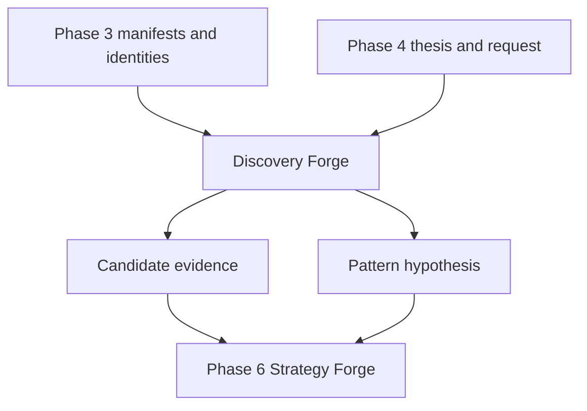
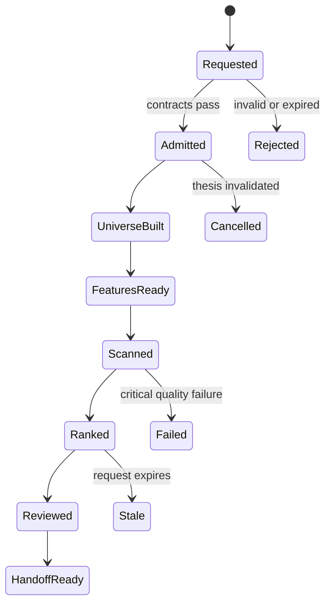

# Phase 5 — Discovery Forge

> **Status:** Build-ready planning package  
> **Prerequisite:** Phase 4 Intelligence Lock and an approved, unexpired `DiscoveryRequest`  
> **Produces:** A deterministic, explainable, point-in-time `CandidateSet` and pattern hypotheses for Phase 6  
> **Anchor:** **F5 — Agents investigate the narrowed field; code scans the broad field.**

---

## 1. Idea

Search broad markets mechanically, then concentrate expensive agent reasoning on qualified candidates.

Discovery Forge converts a bounded Phase 4 research question into a reproducible scan:

```text
DiscoveryRequest
→ point-in-time universe
→ tradability gate
→ deterministic features
→ scanner matches
→ ranked candidates
→ reviewable evidence
→ pattern hypothesis request
```

Phase 5 does not define entries, exits, targets, sizing, portfolio construction, broker instructions, or orders.

---

## 2. Reality at Entry

The workspace already contains:

- Phase 3 point-in-time data, identity, lineage, and manifest contracts;
- Phase 4 thesis, causal/exposure maps, and `DiscoveryRequest`;
- TradingView screening dependencies and an MCP configuration;
- CEREBUS and P90 research logic;
- Nautilus and standalone backtest experiments.

It does **not** yet contain one canonical:

- point-in-time equity universe builder;
- feature registry with availability semantics;
- broad-market scanner pipeline;
- candidate ranking contract;
- reproducibility manifest;
- Discovery Lock.

Legacy scripts are research references. They gain no Phase 5 authority until adapted, tested, and registered.

---

## 3. Canonical Decisions

| Decision | Lock |
|---|---|
| Orchestration | OCE remains the sole orchestration spine |
| Data | Phase 3 evidence/manifests are mandatory |
| Input | Only approved, unexpired `DiscoveryRequest` objects |
| Broad search | Deterministic code, never an LLM browsing symbols |
| Universe | Point-in-time membership and identity |
| Features | Versioned, causal-time-safe, null-aware |
| Ranking | Declared formula, direction, normalization, tie-break |
| Agents | Review only the bounded candidate field |
| Patterns | Hypotheses, not deployable strategies |
| Output | `CandidateSet` plus evidence and scan manifest |
| Handoff | Phase 6 request, never `StrategySpec` authored here |

---

## 4. Admissibility

A scan is admissible only when:

```text
request_valid
AND thesis_discovery_ready
AND request_not_expired
AND data_manifest_passed
AND universe_point_in_time
AND feature_set_pinned
AND ranking_policy_pinned
AND no_lookahead
```

A candidate is explainable only when:

```text
identity_resolved
AND inclusion_reason_present
AND all_material_features_cited
AND missingness_disclosed
AND score_reproducible
AND thesis_trace_present
```

---

## 5. Book Sequence

| Book | Document | Builds | Exit |
|---:|---|---|---|
| 1 | [Discovery Contracts and Universe](book-1-discovery-contracts-universe.md) | Scan contracts, universe snapshots, liquidity/tradability gates | Identical cutoff and policies produce identical eligible instruments |
| 2 | [Deterministic Feature Fabric](book-2-deterministic-feature-fabric.md) | Feature registry, causal-time computation, null/normalization policy | Features reproduce without leakage |
| 3 | [Scanner Fabric](book-3-scanner-fabric.md) | Macro-linked, CEREBUS, structural, volume, and relative-strength scans | Known fixtures match and false positives remain controlled |
| 4 | [Ranking and Pattern Sandbox](book-4-ranking-pattern-sandbox.md) | Ranking contracts, explanations, stability, hypothesis generation | Ranked results reproduce and pattern outputs remain hypotheses |
| 5 | [Discovery Operations and Lock](book-5-discovery-operations-lock.md) | Schedules, dashboard, load tests, review, lock, Phase 6 handoff | Discovery Lock passes and Phase 6 accepts the contract |

Books execute in order. No later book may silently change universe membership, feature values, request scope, or ranking semantics.

---

## 6. Architecture




---

## 7. Core Artifacts

| Artifact | Purpose |
|---|---|
| `ScanRequest` | Validated execution form of a `DiscoveryRequest` |
| `UniversePolicy` | Asset, venue, geography, membership, and eligibility rules |
| `UniverseSnapshot` | Immutable point-in-time instrument population |
| `TradabilitySnapshot` | Liquidity, price, status, and data-coverage decisions |
| `FeatureDefinition` | Formula, inputs, availability, null, and normalization contract |
| `FeatureSnapshot` | Instrument features computed under one manifest |
| `ScannerDefinition` | Deterministic predicate and output schema |
| `ScannerMatch` | One explainable scanner/instrument match |
| `RankingPolicy` | Score components, direction, weights, caps, and tie-breaks |
| `CandidateRecord` | Instrument, feature evidence, score, rank, and thesis trace |
| `CandidateSet` | Immutable ordered scan result |
| `PatternHypothesis` | Testable pattern proposed for Phase 6 evaluation |
| `DiscoveryRunManifest` | Complete reproducibility record |
| `DiscoveryLockManifest` | Phase completion proof |

---

## 8. Lifecycle



Every transition is an OCE event with typed IDs, hashes, versions, actor, and correlation lineage.

---

## 9. Target Layout

```text
discovery/
  contracts/
  universe/
  features/
  scanners/
  ranking/
  patterns/
  scheduling/
  dashboard/
  evaluation/
  lock/
  handoff/
```

Provider adapters remain in Data Forge. Strategy implementations remain in Strategy Forge.

---

## 10. Critical Test Matrix

| Test | Proof | Book |
|---|---|---:|
| P5-UNI-001 | Fixed manifest produces identical universe | 1 |
| P5-PIT-001 | Historical membership contains no future constituents | 1 |
| P5-TRD-001 | Liquidity and tradability edges fail correctly | 1 |
| P5-FTR-001 | Feature fixture reproduces exactly | 2 |
| P5-LKA-001 | Future data cannot enter a feature | 2 |
| P5-SCN-001 | Known CEREBUS fixture is detected | 3 |
| P5-FPR-001 | Locked false-positive regressions remain rejected | 3 |
| P5-RNK-001 | Fixed inputs produce identical ordering | 4 |
| P5-MIS-001 | Missing optional features do not reorder unpredictably | 4 |
| P5-TRC-001 | Event-to-candidate lineage is complete | 4 |
| P5-LOD-001 | Approved universe completes under load budget | 5 |
| P5-E2E-001 | Request-to-candidate golden run reproduces | 5 |
| P5-AUT-001 | Strategy and execution fields fail closed | 5 |
| P5-HOF-001 | Phase 6 accepts the hypothesis handoff | 5 |

---

## 11. Phase Invariants

1. OCE is the only orchestration spine.
2. Every scan begins from a valid `DiscoveryRequest`.
3. Expired, rejected, or superseded theses cannot scan.
4. Broad-market search is deterministic code.
5. Agents receive only bounded candidates and evidence.
6. Universe membership is point-in-time.
7. Instrument identity is stable and effective-dated.
8. Delisted and inactive securities remain available to historical scans when admissible.
9. Survivorship bias is a test failure.
10. Every material input has an availability timestamp.
11. Features use data available at the scan cutoff.
12. Feature formulas and parameters are versioned.
13. Optional missing data remains visible.
14. Missing data is never silently zero-filled.
15. Scanner predicates are typed and reviewable.
16. Rankings use a frozen policy.
17. Tie-breaking is deterministic.
18. Score explanations reconcile to the stored score.
19. Replays pin manifests, calendars, taxonomies, code, and policies.
20. Candidate removals record the failed gate.
21. Pattern mining separates discovery and evaluation samples.
22. A discovered pattern is not a strategy.
23. Phase 5 cannot author entry, exit, target, size, portfolio, broker, or order fields.
24. Phase 5 cannot mutate Phase 4 evidence or thesis meaning.
25. Every Phase 6 handoff cites candidate and feature evidence.
26. Critical data-quality failure blocks ranking.
27. Resource budgets cannot reduce correctness silently.
28. A passing Discovery Lock is required before Phase 6 handoff.

---

## 12. Agent Extension Contract

An agent extending Phase 5 must:

1. read this blueprint and the active book;
2. identify the input/output artifact and authority;
3. reuse Phase 3 data and Phase 4 thesis contracts;
4. register features/scanners rather than hiding logic in prompts;
5. add fixtures before adding a scanner or ranking component;
6. preserve point-in-time semantics and stable identity;
7. declare null, normalization, and tie-break behavior;
8. emit lineage and run evidence;
9. avoid direct provider and broker access;
10. stop at candidate or hypothesis handoff.

The extension must stop when data availability, identity, request scope, or feature meaning is ambiguous.

---

## 13. Completion Definition

Phase 5 is complete only when:

- approved universes reproduce from fixed manifests;
- survivorship and look-ahead tests pass;
- feature values reproduce and disclose missingness;
- macro-linked and CEREBUS scanner fixtures pass;
- false-positive regression sets remain controlled;
- candidate ranking is stable, deterministic, and explainable;
- every candidate traces to a thesis, event, request, universe, and features;
- scheduled and event-driven modes are idempotent;
- scale, recovery, dashboard, backup, and replay tests pass;
- the Discovery Lock is independently verified;
- no `StrategySpec`, entry, exit, target, sizing, portfolio, broker, or order authority appears.

---

## 14. Handoff to Phase 6

Phase 6 receives:

- approved `CandidateSet` and candidate records;
- source `DiscoveryRequest` and `ResearchThesis` references;
- pinned universe, data, feature, scanner, and ranking manifests;
- deterministic feature evidence and explanations;
- known limitations, missingness, exclusions, and false-positive labels;
- optional `PatternHypothesis` objects;
- proposed observables and falsification tests;
- Discovery Lock and golden-run references.

Phase 6 may define a versioned `StrategySpec` and build test implementations. It may not retroactively alter Phase 5 scores, universe membership, or evidence.
