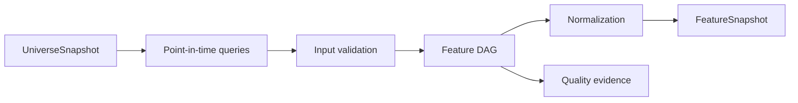

# Phase 5, Book 2 — Deterministic Feature Fabric

> **Purpose:** Compute versioned, null-aware, causal-time-safe features over an immutable universe  
> **Input:** Book 1 universe snapshot and Phase 3 point-in-time data  
> **Output:** `FeatureDefinition`, `FeatureSnapshot`, and feature-quality evidence  
> **Previous:** [Book 1 — Discovery Contracts and Universe](book-1-discovery-contracts-universe.md)  
> **Next:** [Book 3 — Scanner Fabric](book-3-scanner-fabric.md)

---

## 1. Success Statement

Every feature value can be reproduced from pinned inputs and code using only information available at the scan cutoff. Missing, stale, warm-up, and invalid values remain distinguishable.

---

## 2. Applicable Anchors

- **A2:** Evidence Before Narrative
- **A3:** Point-in-Time Data
- **A4:** Stable Identity Everywhere
- **A8:** Idempotent Event Handling
- **A10:** Observable and Reconstructable
- **A13:** Local-First Heavy Compute
- **F1:** Canonical schema and lineage
- **F3:** Passing data manifest required
- **F5:** Code scans broad markets

---

## 3. Feature Topology



---

## 4. Work Packages

### 4.1 Feature definition

```yaml
feature_id: registry-id
version: semver
name: string
description: string
formula_or_callable: artifact-ref
input_fields: []
availability_rule: policy-ref
lookback: duration
minimum_observations: integer
calendar_policy_ref: policy-id
corporate_action_policy_ref: policy-id
null_policy: preserve|exclude_downstream|explicit_fallback
normalization: none|cross_sectional|rolling|group_relative
direction: higher|lower|two_sided|contextual
unit: string
```

Features never hide formulas solely inside prompts.

### 4.2 Feature DAG

Dependencies form an acyclic graph. Each node records input hashes, implementation version, parameters, cutoff, and output hash. Shared computations are cached by content key.

### 4.3 Availability semantics

Bar close values become usable only after close. Fundamental, macro, estimate, and filing fields use `available_at`, not period end. Publication lag and revisions remain explicit.

### 4.4 Core feature families

- liquidity and tradability;
- returns and relative strength;
- realized volatility and range state;
- volume, dollar volume, and volume regime;
- gap and session state;
- trend and market structure;
- CEREBUS range/tier/atomic-unit geometry;
- cross-sectional sector/industry-relative features;
- event/exposure relevance from Phase 4;
- data coverage and freshness.

Phase 5 features describe observations. Entry and exit rules belong to Phase 6.

### 4.5 CEREBUS feature boundary

CEREBUS logic is decomposed into named measurements:

```text
session range
range tier
atomic unit
normalized displacement
structural level distance
touch/close state
time-window state
field or symmetry state
```

Each asset/session configuration is versioned. PDFs, Pine scripts, and experimental Python are references until translated into tested definitions.

### 4.6 Normalization

Cross-sectional normalization declares eligible population, grouping, winsorization, center, scale, minimum count, and null handling. Normalization never sees excluded securities or future observations.

### 4.7 Missingness

Use reasoned null states:

```text
not_available_yet
insufficient_history
not_applicable
provider_missing
stale
invalid_input
computation_error
```

A fallback must be declared in the feature definition and visible downstream.

### 4.8 Snapshot

The immutable snapshot stores long-form or columnar values keyed by stable instrument ID and feature version, plus quality summary, exclusions, input manifest, and computation graph hash.

### 4.9 Performance

Heavy vectorized computation runs locally or on disposable workers through OCE. Partitioning, caching, or sampling may improve speed but may not change results.

---

## 5. Target Layout

```text
discovery/
  features/
    registry.py
    dag.py
    availability.py
    compute.py
    normalization.py
    missingness.py
    families/
    cerebus/
    snapshot.py
```

---

## 6. Deliverables

- Feature-definition schema and registry.
- Dependency DAG and content-addressed cache.
- Availability and calendar semantics.
- Core liquidity, strength, volume, volatility, structure, and relevance features.
- Decomposed CEREBUS measurement library.
- Cross-sectional normalization engine.
- Null-reason taxonomy and quality reports.
- Local/disposable-worker execution adapter.
- Golden feature fixtures.

---

## 7. Required Tests

### P5-FTR-001 — Golden Feature Reproduction

Pinned inputs reproduce exact expected feature values and hashes.

### P5-FTR-002 — Formula Version Isolation

A formula change creates a new version and cannot mutate earlier snapshots.

### P5-FTR-003 — DAG Cycle Rejection

Cyclic feature dependencies fail registration.

### P5-FTR-004 — Minimum Warm-Up

Insufficient observations return the correct null reason.

### P5-FTR-005 — Corporate Action Policy

Adjusted and unadjusted features remain separately versioned and match fixtures.

### P5-LKA-001 — Future Bar Rejection

A bar closing after `as_of` cannot enter any feature.

### P5-LKA-002 — Publication Lag

A filing, macro value, or fundamental field is unavailable before `available_at`.

### P5-LKA-003 — Revision Isolation

A historical replay does not receive later revisions.

### P5-LKA-004 — Centered Window Ban

Centered or forward-looking rolling windows fail static and fixture checks.

### P5-NUL-001 — Null Preservation

Optional missing input does not become zero, false, or median implicitly.

### P5-NUL-002 — Null Reason

Each missing value carries one registered reason.

### P5-NUL-003 — Explicit Fallback

Fallback behavior runs only when declared and appears in lineage.

### P5-NRM-001 — Cross-Section Cutoff

Normalization uses only eligible instruments and values available at the cutoff.

### P5-NRM-002 — Small Group

Groups below minimum count return declared null/fallback behavior.

### P5-NRM-003 — Outlier Policy

Winsorization boundaries reproduce exactly from the pinned population.

### P5-CER-001 — CEREBUS Range Fixture

Session range, tier, and atomic-unit calculations match the approved fixture.

### P5-CER-002 — Session Boundary

DST, overnight, weekend, and holiday session boundaries match the pinned calendar.

### P5-CER-003 — Structural State

Touch and close states remain distinct and reproduce across timeframes.

### P5-RST-001 — Relative Strength Fixture

Asset, sector, and benchmark-relative return features use aligned point-in-time windows.

### P5-VOL-001 — Volume State Fixture

Volume and dollar-volume regime features match known values without future bars.

### P5-CCH-001 — Cache Identity

Only identical inputs, code, parameters, and policies reuse a cached feature.

### P5-PAR-001 — Partition Equality

Single-worker and partitioned computation produce identical ordered outputs.

### P5-ERR-001 — Computation Failure Visibility

A feature error is isolated, classified, and never silently replaced.

---

## 8. Failure Modes

- Indicators computed on future bars.
- Period-end treated as publication time.
- Feature meaning changed without versioning.
- CEREBUS rules copied inconsistently from multiple experiments.
- Missing values silently imputed.
- Normalization population changed between runs.
- Parallel partitions producing unstable results.

---

## 9. Exit Gate

Book 2 is complete only when registered features reproduce exactly, causal-time guards pass, CEREBUS primitives match approved fixtures, nulls remain explicit, and the immutable feature snapshot is ready for scanners.

---

## 10. Handoff

Book 3 receives the scan request, universe snapshot, feature snapshot, quality evidence, and pinned feature registry.
