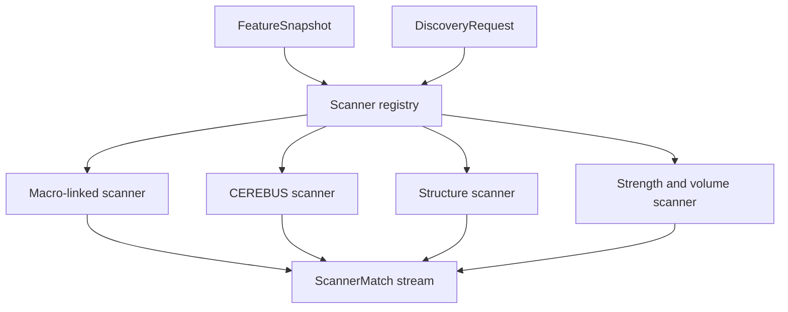

# Phase 5, Book 3 — Scanner Fabric

> **Purpose:** Apply deterministic, registered predicates to broad markets and emit explainable matches  
> **Input:** Scan request, universe snapshot, feature snapshot, and Phase 4 relevance predicates  
> **Output:** `ScannerMatch` records and scanner evaluation evidence  
> **Previous:** [Book 2 — Deterministic Feature Fabric](book-2-deterministic-feature-fabric.md)  
> **Next:** [Book 4 — Ranking and Pattern Sandbox](book-4-ranking-pattern-sandbox.md)

---

## 1. Success Statement

Known patterns and macro-linked exposures are detected mechanically over the complete approved universe. Every match explains which predicates passed, while locked false-positive fixtures remain rejected.

---

## 2. Applicable Anchors

- **A1:** One Orchestration Spine
- **A2:** Evidence Before Narrative
- **A3:** Point-in-Time Data
- **A8:** Idempotent Event Handling
- **A10:** Observable and Reconstructable
- **A13:** Local-First Heavy Compute
- **F4:** Testable research only
- **F5:** Code scans broad markets

---

## 3. Scanner Topology



---

## 4. Work Packages

### 4.1 Scanner definition

```yaml
scanner_id: registry-id
version: semver
purpose: string
required_feature_refs: []
optional_feature_refs: []
predicate_ast: {}
missing_policy: fail|skip_optional|explicit_branch
output_fields: []
supported_asset_classes: []
evaluation_fixture_refs: []
resource_budget_ref: policy-id
```

Scanner predicates compile from a constrained AST or audited code. Natural-language prompts cannot directly decide broad-market membership.

### 4.2 Match record

Each match stores instrument identity, scanner/version, predicate results, feature values/versions, request/thesis/event references, data cutoff, quality flags, and content hash.

### 4.3 Macro-linked discovery

Phase 4 supplies exposure/group predicates. The scanner intersects those with point-in-time issuer/instrument mappings and deterministic observables. It cannot invent a beneficiary list or reinterpret the causal thesis.

### 4.4 CEREBUS scanner

The scanner composes Book 2 primitives for:

- session-range tier and state;
- atomic-unit distances;
- structural touch/close conditions;
- time-window eligibility;
- field, symmetry, displacement, or range-state flags;
- multi-layer alignment when explicitly defined.

These are candidate conditions, not entries or trade signals.

### 4.5 Structure scanner

Reusable factual states may include higher-high/higher-low, lower-high/lower-low, breakout/close, compression/expansion, range position, and multi-timeframe alignment. Swing algorithms, confirmation delay, and repaint behavior are versioned.

### 4.6 Relative-strength and volume scanner

Predicates operate on registered benchmark-relative, sector-relative, volume regime, liquidity, and volatility features. Group comparisons use the Book 2 normalization population.

### 4.7 Composite scans

AND/OR/NOT composition is explicit, bounded, and versioned. Short-circuit evaluation cannot hide missing features or change explanations.

### 4.8 Evaluation

Each scanner has:

- positive golden fixtures;
- hard negative and near-miss fixtures;
- false-positive regression cases;
- boundary tests;
- historical replay cases;
- property/mutation tests proving each predicate matters.

### 4.9 Scale and isolation

Scanners operate in partitions but combine results by stable identity and deterministic sort. A failed optional scanner cannot corrupt successful matches; a failed required scanner blocks publication.

### 4.10 Legacy adapters

TradingView tools may assist live comparison, while existing Pine/Python CEREBUS and Nautilus code may supply fixture logic. Canonical matches must come from registered Phase 5 scanners over Phase 3 data.

---

## 5. Target Layout

```text
discovery/
  scanners/
    schema.py
    registry.py
    compiler.py
    executor.py
    explain.py
    macro_linked.py
    cerebus.py
    structure.py
    relative_strength.py
    volume_state.py
    composite.py
```

---

## 6. Deliverables

- Scanner-definition schema and registry.
- Constrained predicate compiler.
- Explainable match records.
- Macro-linked instrument scanner.
- CEREBUS structural scanner.
- Market-structure scanner.
- Relative-strength and volume-state scanners.
- Composite scanner engine.
- Positive, negative, mutation, and false-positive fixture suite.
- Partitioned local-worker execution.

---

## 7. Required Tests

### P5-SCN-001 — Known CEREBUS Detection

The locked positive fixture produces the expected CEREBUS match.

### P5-SCN-002 — CEREBUS Near Miss

A structurally similar fixture missing one required state does not match.

### P5-SCN-003 — Macro Exposure Match

Only instruments satisfying the Phase 4 exposure predicate and required observables match.

### P5-SCN-004 — Structural Pattern Match

Approved swing/structure fixtures reproduce under the pinned algorithm.

### P5-SCN-005 — Strength and Volume Match

Relative-strength and volume-state fixtures produce exact predicate outcomes.

### P5-SCN-006 — Composite Truth Table

AND, OR, NOT, nesting, and missing branches match the declared truth table.

### P5-SCN-007 — Explanation Completeness

Every match contains every material predicate, value, threshold, version, and outcome.

### P5-FPR-001 — False-Positive Regression

Every locked hard-negative fixture remains rejected.

### P5-FPR-002 — Boundary Regression

Values immediately below, equal to, and above thresholds resolve exactly.

### P5-FPR-003 — Repaint Guard

A swing or structural state cannot use confirmation unavailable at the scan cutoff.

### P5-MUT-001 — Predicate Mutation

Mutating each required predicate causes at least one fixture failure.

### P5-MAC-001 — Thesis Trace

Macro-linked matches retain event, thesis, causal/exposure, and discovery-request references.

### P5-MAC-002 — No Causal Rewrite

The scanner rejects a requested exposure direction inconsistent with the Phase 4 map.

### P5-REG-001 — Unregistered Scanner Rejection

Unregistered code or prompt-defined predicates cannot run broadly.

### P5-REG-002 — Version Isolation

A scanner change creates a new version and leaves earlier matches reproducible.

### P5-NUL-010 — Required Feature Missing

A missing required feature follows the declared fail behavior.

### P5-NUL-011 — Optional Feature Missing

Optional missingness remains visible and follows its explicit branch.

### P5-PAR-010 — Partition Match Equality

Partition count and worker order do not alter the match set or hashes.

### P5-IDM-001 — Idempotent Scanner Replay

Repeated execution creates no duplicate match effects.

### P5-ISO-001 — Optional Scanner Isolation

An optional scanner failure does not modify valid outputs from other scanners.

### P5-ISO-002 — Required Scanner Block

A required scanner failure blocks candidate ranking.

### P5-LEG-001 — Legacy Comparison

Approved legacy fixtures and canonical scanners agree on defined measurements, with divergences documented.

---

## 8. Failure Modes

- LLM selects symbols from memory.
- Scanner predicate exists only in prose.
- Repainting structure used historically.
- Macro theme treated as proof of issuer exposure.
- A positive fixture exists without hard negatives.
- Composite logic hides missing features.
- TradingView output becomes canonical without reproducibility.

---

## 9. Exit Gate

Book 3 is complete only when registered scanners detect known fixtures, reject hard negatives, explain every outcome, replay idempotently at scale, and emit an immutable match stream ready for ranking.

---

## 10. Handoff

Book 4 receives all matches and non-matches required for explanation, feature/quality evidence, request scope, and the frozen scanner registry.
