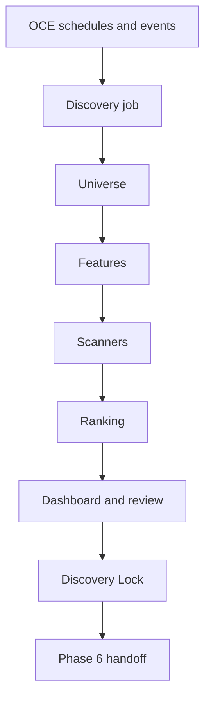

# Phase 5, Book 5 — Discovery Operations and Lock

> **Purpose:** Operate, observe, challenge, and lock the discovery pipeline before Strategy Forge handoff  
> **Input:** Books 1–4 artifacts and evaluation evidence  
> **Output:** Scheduled discovery service, dashboard, golden runs, `DiscoveryLockManifest`, and Phase 6 handoff  
> **Previous:** [Book 4 — Ranking and Pattern Sandbox](book-4-ranking-pattern-sandbox.md)  
> **Next:** Phase 6 — Strategy Forge

---

## 1. Success Statement

Nightly, premarket, intraday, and event-driven scans execute through OCE within declared budgets, resume safely, publish truthful dashboards, and reproduce from a complete manifest. Independent review proves the pipeline narrows the market without creating strategy or execution authority.

---

## 2. Applicable Anchors

- **A0:** Human Strategic Authority
- **A1:** One Orchestration Spine
- **A3:** Point-in-Time Data
- **A5:** Research Is Not Execution
- **A6:** Explicit Authority and Capability
- **A8:** Idempotent Event Handling
- **A9:** Separate Research From Approval
- **A10:** Observable and Reconstructable
- **A11:** Repair Before Expansion
- **A13:** Local-First Heavy Compute
- **F5:** Code scans broad markets

---

## 3. Operational Topology



---

## 4. Work Packages

### 4.1 Schedule modes

```text
nightly
premarket
intraday
event_driven
operator_requested
historical_replay
```

Each schedule declares calendar, timezone, cutoff rule, request selection, freshness SLA, resource budget, concurrency, retry policy, and late-data behavior.

### 4.2 Job state

Jobs are durable and resumable:

```text
admitted
universe_building
features_computing
scanning
ranking
reviewing
published
stale
cancelled
failed
```

Retries reuse idempotency keys and completed content-addressed artifacts.

### 4.3 Event-driven invalidation

A thesis rejection/expiry, source correction, failed data manifest, identity change, or material feature repair cancels or stales affected runs and candidate sets. Impact is lineage-driven.

### 4.4 Dashboard

The scanner result dashboard shows:

- request, thesis, event, and cutoff;
- universe size and exclusions;
- data/feature coverage and freshness;
- scanner matches and failures;
- ranked candidates and score decomposition;
- missingness and quality flags;
- comparison with prior run;
- expiry and stale state;
- manifest and replay references.

It never labels a candidate “buy,” “sell,” or “approved trade.”

### 4.5 Independent review

The audit observer checks survivorship, availability times, feature lineage, scanner fixtures, ranking reconciliation, missingness, thesis trace, prompt/agent boundaries, and prohibited fields.

### 4.6 Scale and soak

Tests use the largest approved initial universe and realistic feature/scanner load. Evidence records runtime, memory, storage, cache rate, provider/data demand, queue depth, retries, failures, and cost.

Degradation may defer optional scanners or reduce frequency only according to policy; it cannot sample the universe or change ranking silently.

### 4.7 Golden run

The canonical scenario includes:

1. an approved Phase 4 macro-linked request;
2. a historical point-in-time universe containing a delisted name;
3. required and optional missing data;
4. CEREBUS and relative-strength/volume features;
5. positive and hard-negative scanner fixtures;
6. stable ranking and explanations;
7. bounded agent review;
8. optional pattern hypothesis;
9. Phase 6 handoff;
10. proof that no strategy or trade action occurred.

### 4.8 Backup and replay

Back up manifests, registries, policies, snapshots, fixtures, experiment records, and lock evidence. Restore into isolation, verify hashes, and replay the golden run without relying on agent memory or an ephemeral worker.

### 4.9 Discovery Lock Manifest

```yaml
phase: 5
lock_id: immutable-id
commit_sha: git-sha
created_at: timestamp
contract_versions: {}
universe_policy_versions: {}
data_manifest_refs: []
feature_registry_hash: content-hash
scanner_registry_hash: content-hash
ranking_policy_hashes: []
calendar_versions: {}
evaluation_corpus_hashes: {}
test_report_refs: []
load_and_soak_report_ref: artifact-ref
golden_run_refs: []
backup_restore_report_ref: artifact-ref
known_limitations: []
approved_phase6_contract_version: semver
prohibited_authorities: []
approvals: []
```

Material changes invalidate the lock and trigger the declared affected tests.

### 4.10 Phase 6 handoff

The handoff may request that Strategy Forge formalize and test a hypothesis. Phase 5 supplies observations, conditions, candidate evidence, horizons, and falsifiers—not implementation logic presented as canonical strategy code.

---

## 5. Target Layout

```text
discovery/
  scheduling/
    schedules.py
    jobs.py
    invalidation.py
  dashboard/
    api.py
    views.py
  evaluation/
    golden_run.py
    load.py
    soak.py
    adversarial.py
  lock/
    manifest.py
    verify.py
  handoff/
    strategy_forge_request.py
```

---

## 6. Deliverables

- OCE-native scheduled and event-driven discovery jobs.
- Durable state, retry, resume, and invalidation.
- Scanner result dashboard.
- Independent audit workflow.
- Load, stress, and soak reports.
- Golden and adversarial end-to-end evaluation.
- Backup/restore/replay proof.
- Immutable Discovery Lock and verifier.
- Versioned Phase 6 handoff adapter.

---

## 7. Required Tests

### P5-SCH-001 — Nightly Schedule

The nightly scan uses the declared calendar cutoff and runs once per idempotency window.

### P5-SCH-002 — Premarket Schedule

Premarket execution uses only data available by its configured cutoff.

### P5-SCH-003 — Intraday Schedule

Intraday scans respect bar-close and session availability.

### P5-SCH-004 — Event-Driven Scope

An event-driven job scans only requests affected by the triggering lineage.

### P5-IDM-010 — Retry Idempotency

Retry and resume create no duplicate artifacts or effects.

### P5-INV-001 — Thesis Expiry Invalidation

Expiry immediately stales active candidate sets and blocks handoff.

### P5-INV-002 — Correction Impact

A material Phase 4 correction identifies and invalidates every affected run.

### P5-INV-003 — Feature Repair Impact

A repaired material feature invalidates dependent rankings and lock evidence.

### P5-DAS-001 — Dashboard Fidelity

Displayed universe, features, scores, ranks, missingness, and state match stored artifacts.

### P5-DAS-002 — No Trade Language

The dashboard exposes candidates and evidence without buy/sell or execution approval labels.

### P5-DAS-003 — Stale Visibility

Expired, invalidated, or failed results cannot appear current.

### P5-LOD-001 — Approved Universe Load

The largest initial approved universe completes within declared resource and time budgets.

### P5-LOD-002 — No Silent Sampling

Resource pressure cannot silently shrink the universe or omit required scanners.

### P5-SOK-001 — Repeated-Run Soak

Repeated scheduled runs remain within memory, storage, queue, and error thresholds.

### P5-REC-001 — Worker Failure Resume

Failure during feature, scan, or rank stages resumes from durable verified artifacts.

### P5-E2E-001 — Golden Discovery Run

The canonical Phase 4-request-to-Phase 6-handoff scenario reproduces completely.

### P5-E2E-002 — Historical Replay

A locked historical scan reproduces universe, features, matches, scores, and ranks.

### P5-E2E-003 — Cross-Worker Equality

Local and disposable-worker runs produce equivalent material outputs.

### P5-AUT-001 — No Strategy or Execution

Attempts to create entries, exits, targets, sizing, portfolios, broker calls, or orders are denied and audited.

### P5-AUT-002 — Broad Agent Search Denied

An agent cannot replace deterministic broad-universe scanning.

### P5-AUT-003 — Provider Bypass Denied

Discovery components cannot fetch outside Phase 3 interfaces.

### P5-AUD-001 — Independent Review

The builder of a material ranking policy cannot be its sole lock approver.

### P5-AUD-002 — Survivorship Challenge

The audit corpus detects a survivor-only universe.

### P5-AUD-003 — Look-Ahead Challenge

The audit corpus detects future bars, revisions, memberships, and publications.

### P5-BKP-001 — Restore and Replay

An isolated restore verifies hashes and replays the golden run.

### P5-LCK-001 — Manifest Completeness

The lock contains all dependency, policy, registry, test, limitation, and approval fields.

### P5-LCK-002 — Material Change Invalidation

A material universe, feature, scanner, ranking, calendar, data, or code change invalidates the lock.

### P5-HOF-001 — Phase 6 Acceptance

The Strategy Forge adapter accepts a complete candidate/hypothesis package.

### P5-HOF-002 — Invalid Handoff Rejection

Missing lineage, expiry, falsification, manifest, identity, or lock references fail closed.

### P5-HOF-003 — No Retroactive Mutation

Phase 6 cannot alter the originating candidate score, rank, feature, scanner match, or universe snapshot.

---

## 8. Failure Modes

- Duplicate scheduled scans.
- Intraday scan using an open bar as closed.
- Old candidate set displayed as current.
- Load pressure silently samples symbols.
- Agent substitutes for deterministic scanning.
- Dashboard adds trade language.
- Phase 6 receives an undocumented “strategy” from pattern mining.
- Lock cannot replay outside the original worker.

---

## 9. Exit Gate

Book 5 is complete only when all operating modes are idempotent and causal-time-safe, dashboards are faithful, load/soak/recovery pass, invalidation propagates, backup/replay succeeds, the Discovery Lock verifies independently, and Phase 6 accepts the bounded hypothesis contract.

---

## 10. Handoff to Phase 6

Phase 5 ends with an explainable candidate set and optional falsifiable pattern hypotheses. Phase 6 begins when Strategy Forge converts an approved hypothesis into one versioned `StrategySpec`.

```text
Discovery finds and ranks evidence-bearing candidates.
Strategy Forge defines what would be traded and how it must be tested.
Neither step authorizes live capital.
```
