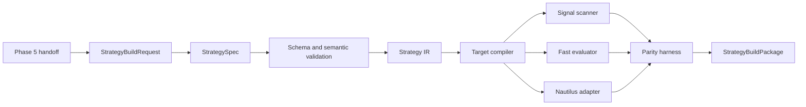
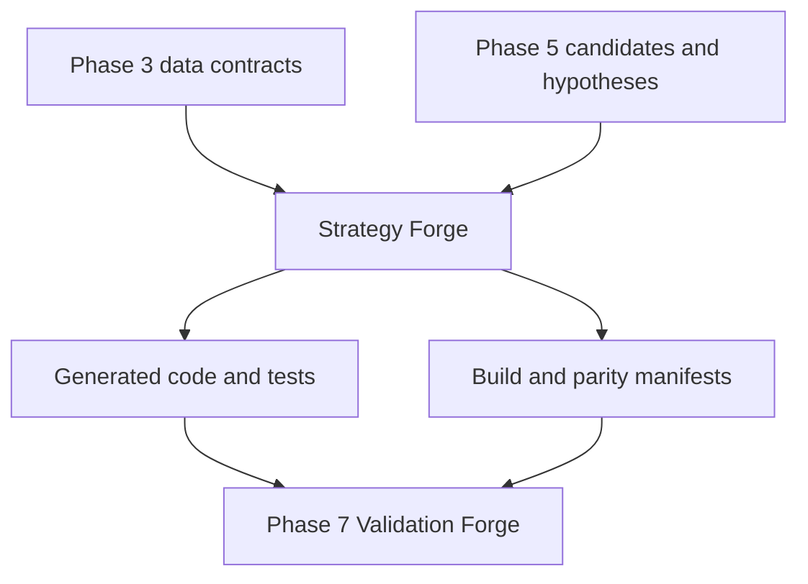
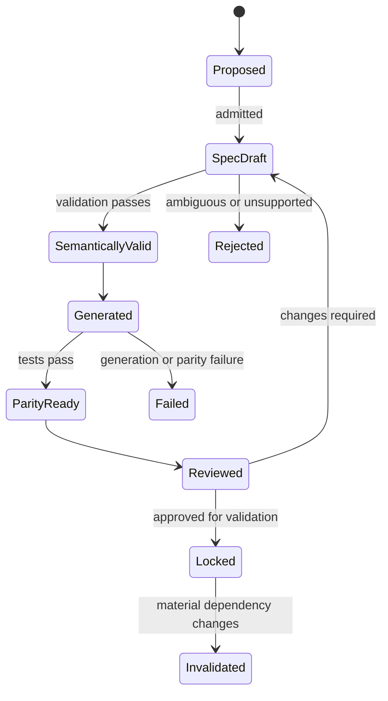

# Phase 6 — Strategy Forge

> **Status:** Build-ready planning package  
> **Prerequisite:** Phase 5 Discovery Lock plus an approved `CandidateSet` or `PatternHypothesis` handoff  
> **Produces:** One versioned `StrategySpec`, generated implementations, parity evidence, and a Phase 7 validation request  
> **Anchor:** **F6 — No hand-copied trading rule may silently diverge across environments.**

---

## 1. Idea

Generate consistent scanner, fast-test, Nautilus, paper-compatible, and live-compatible implementations from a single versioned strategy definition.

```text
Candidate evidence or PatternHypothesis
→ StrategyBuildRequest
→ StrategySpec
→ semantic IR
→ generated implementations
→ golden fixtures
→ cross-target parity
→ StrategyBuildPackage
→ Phase 7 Validation Forge
```

Phase 6 defines and builds strategy behavior. It does not claim profitability, approve paper/live deployment, allocate capital, call a broker, or route an order.

---

## 2. Reality at Entry

The workspace already contains:

- numerous CEREBUS/P90 strategy experiments;
- standalone pandas backtest loops;
- partial Nautilus `Strategy` classes;
- direct strategy code with embedded entries, stops, targets, and sizing;
- multiple hard-coded Windows paths;
- fixed UTC-offset conversions presented as Eastern time;
- conflicting tier/session/threshold values across files;
- small synthetic tests and result files;
- a full Nautilus Trader source checkout.

These assets are valuable references and fixture candidates. They are not a canonical strategy definition. Some “Nautilus” runners do not use Nautilus semantics, and some experimental classes can submit orders directly.

Phase 6 replaces copied logic with generated artifacts rooted in one specification and one semantic intermediate representation.

---

## 3. Canonical Decisions

| Decision | Lock |
|---|---|
| Orchestration | OCE remains the sole build spine |
| Source of truth | Versioned `StrategySpec` |
| Semantics | Typed, deterministic strategy intermediate representation |
| Strategy families | Registered, composable, and versioned |
| CEREBUS logic | Named primitives with approved fixtures |
| Parameters | Typed domains with no hidden defaults |
| Time | IANA timezone, calendar, session, DST, and bar-finality policies |
| Targets | Scanner evaluator, fast evaluator, and Nautilus adapter generated from one IR |
| Custom target edits | Forbidden; regenerate from spec |
| Signals | Canonical semantic events, not target-specific booleans |
| Orders | Phase 6 emits test-only `TradeIntent`; Phase 9 owns `OrderIntent` |
| Validation | Phase 7 determines qualification and robustness |
| Deployment | Phases 8–11 only |

---

## 4. Build Admissibility

A build may begin only when:

```text
phase5_handoff_valid
AND discovery_lock_valid
AND hypothesis_falsifiable
AND input_lineage_complete
AND strategy_family_registered
AND parameter_space_declared
AND data_and_clock_contracts_resolved
```

A generated package is parity-ready only when:

```text
spec_valid
AND ir_hash_pinned
AND every_required_target_generated
AND target_imports_pass
AND static_analysis_passes
AND golden_fixtures_pass
AND cross_target_event_traces_equal
AND mutation_suite_passes
```

Parity-ready does not mean profitable or deployment-ready.

---

## 5. Book Sequence

| Book | Document | Builds | Exit |
|---:|---|---|---|
| 1 | [Strategy Contracts and Semantic Core](book-1-strategy-contracts-semantic-core.md) | Build request, `StrategySpec`, family registry, DSL, IR | One unambiguous semantic source of truth |
| 2 | [CEREBUS Building Blocks and Rule Semantics](book-2-cerebus-building-blocks.md) | Sessions, structure, entries, invalidation, targets, scaling, precedence | Rules match approved edge-case fixtures |
| 3 | [Compiler and Target Generation](book-3-compiler-target-generation.md) | Compiler, scanner evaluator, fast evaluator, Nautilus adapter, parity traces | Generated targets agree on golden tapes |
| 4 | [Verification, Documentation, and Review](book-4-verification-documentation-review.md) | Static analysis, generated tests/docs, mutation tests, review workflow | Unsafe, ambiguous, and uncovered rules fail |
| 5 | [Strategy Build Operations and Lock](book-5-strategy-build-operations-lock.md) | OCE build pipeline, reproducible package, Strategy Lock, Phase 7 handoff | Locked build independently rebuilds and verifies |

Books execute in order. Later books may reject or version a spec; they may not patch target implementations to bypass the spec.

---

## 6. Architecture





---

## 7. Core Artifacts

| Artifact | Purpose |
|---|---|
| `StrategyBuildRequest` | Bounded Phase 5-to-6 request |
| `StrategyFamilyDefinition` | Family capabilities, required sections, and allowed primitives |
| `StrategySpec` | Canonical strategy behavior and parameter contract |
| `StrategyIR` | Normalized, typed semantic representation |
| `ParameterSpace` | Types, units, bounds, dependencies, and search permissions |
| `SessionContract` | Calendar, timezone, windows, reset, and DST semantics |
| `StateMachineDefinition` | Named state, transitions, guards, and reset behavior |
| `SignalEvent` | Canonical target-independent setup/entry/exit event |
| `TradeIntent` | Test-only desired action without venue or broker authority |
| `GoldenMarketTape` | Deterministic ordered inputs and expected semantic events |
| `GeneratedTargetArtifact` | Code/config for one approved target |
| `ParityReport` | Event/state equivalence across targets |
| `StrategyBuildManifest` | Spec-to-commit/code/test lineage |
| `StrategyBuildPackage` | Immutable Phase 7 input |
| `StrategyLockManifest` | Phase completion proof |

---

## 8. Semantic Flow



---

## 9. StrategySpec Minimum Surface

Every spec declares:

- identity, version, family, purpose, and Phase 5 lineage;
- supported asset/instrument/data types;
- data fields, bar/event finality, and feature versions;
- timezone, calendar, sessions, cutoffs, resets, and DST;
- parameters, units, bounds, dependencies, and frozen values;
- state variables and deterministic transition rules;
- setup and eligibility predicates;
- entry intent, order abstraction, and activation timing;
- invalidation and protective conditions;
- target and exit conditions;
- multiple-entry, scaling, netting, and concurrency behavior;
- precedence for simultaneous or ambiguous events;
- warm-up, stale-data, missing-data, and shutdown behavior;
- expected semantic events and required fixtures;
- prohibited capabilities and validation hypotheses.

An omitted material behavior is an invalid spec, not an implementation choice.

---

## 10. Target Layout

```text
strategy_forge/
  contracts/
  registry/
  spec/
  ir/
  primitives/
  compiler/
  targets/
  fixtures/
  verification/
  documentation/
  review/
  build/
  lock/
  handoff/
```

Existing strategy experiments remain in their current project paths until deliberately imported as references or fixtures.

---

## 11. Critical Test Matrix

| Test | Proof | Book |
|---|---|---:|
| P6-SPC-001 | Valid canonical spec passes | 1 |
| P6-INV-001 | Missing or contradictory behavior fails | 1 |
| P6-PRM-001 | Parameter domains are typed and closed | 1 |
| P6-CER-001 | CEREBUS primitive matches approved fixture | 2 |
| P6-ENT-001 | Entry semantics match at all boundaries | 2 |
| P6-EXT-001 | Exit/invalidation precedence is deterministic | 2 |
| P6-DST-001 | DST and calendar sessions reproduce | 2 |
| P6-GEN-001 | Spec-to-code golden output reproduces | 3 |
| P6-PAR-001 | Scanner, fast, and Nautilus events agree | 3 |
| P6-IMP-001 | Generated targets import and initialize | 3 |
| P6-STA-001 | Prohibited constructs are rejected | 4 |
| P6-MUT-001 | Rule mutations fail tests | 4 |
| P6-E2E-001 | Hypothesis-to-build golden run reproduces | 5 |
| P6-HOF-001 | Phase 7 accepts the build package | 5 |
| P6-AUT-001 | Paper/live/broker authority is absent | 5 |

---

## 12. Phase Invariants

1. OCE is the sole strategy-build orchestrator.
2. Every strategy starts from a valid Phase 5 handoff.
3. `StrategySpec` is the only strategy source of truth.
4. Every target is generated from the same normalized IR.
5. Generated targets are not hand-edited.
6. Material behavior cannot hide in comments, prompts, or adapters.
7. Every parameter has type, unit, domain, default policy, and ownership.
8. No target supplies an undeclared default.
9. All clock logic uses declared calendars and IANA timezones.
10. Fixed UTC offsets cannot stand in for DST-aware local sessions.
11. Bar-open and bar-close semantics remain distinct.
12. Intra-bar ambiguity has an explicit policy.
13. Entry, invalidation, target, time exit, and reset precedence is deterministic.
14. Long and short symmetry is declared, not assumed.
15. Scaling and pyramiding have bounded state transitions.
16. CEREBUS primitives have one registered meaning per version.
17. Phase 5 feature definitions are referenced, not reimplemented silently.
18. Every semantic event has a stable identity and trace.
19. Scanner, fast, and Nautilus targets must agree on golden tapes.
20. Static analysis forbids future access, hidden I/O, secrets, dynamic code, and direct broker routing.
21. Mutation tests prove material rules are covered.
22. Generated documentation derives from the same spec.
23. Build artifacts link to spec hash, generator version, and commit.
24. Strategy performance claims are outside Phase 6 approval.
25. Phase 6 cannot approve paper, shadow, or live operation.
26. Phase 6 cannot allocate real capital.
27. Phase 9—not Phase 6—owns venue-neutral `OrderIntent`.
28. A passing Strategy Lock is required for Phase 7.

---

## 13. Agent Extension Contract

An agent extending Strategy Forge must:

1. read this blueprint and the active book;
2. identify the Phase 5 evidence and requested hypothesis;
3. modify the spec/schema/primitive/compiler—not generated targets;
4. add or update golden fixtures first;
5. declare every parameter and time rule;
6. preserve Phase 5 data/feature semantics;
7. generate every required target;
8. run parity, static, mutation, import, and documentation checks;
9. record semantic diffs and build lineage;
10. stop at Phase 7 handoff.

The agent must pause when source research conflicts, a rule is subjective, an execution edge case is unspecified, or two legacy implementations disagree without an approved resolution.

---

## 14. Completion Definition

Phase 6 is complete only when:

- `StrategySpec`, family registry, DSL, and IR are versioned;
- all CEREBUS primitives and rule boundaries pass approved fixtures;
- generated scanner, fast, and Nautilus targets import and initialize;
- their canonical signal/state/trade-intent traces agree on every golden tape;
- invalid specs and prohibited constructs fail closed;
- generated tests, docs, and semantic diffs reconcile to the spec;
- mutation tests demonstrate material-rule coverage;
- a clean checkout can reproduce the build package;
- the Strategy Lock is independently verified;
- Phase 7 accepts the package;
- no profitability qualification, paper/live approval, broker routing, order placement, or capital allocation occurs.

---

## 15. Handoff to Phase 7

Phase 7 receives:

- locked `StrategySpec` and normalized `StrategyIR`;
- source candidate/hypothesis and all Phase 5 lineage;
- declared parameter space and frozen baseline parameters;
- generated scanner, fast, and Nautilus target artifacts;
- golden market tapes and expected semantic traces;
- unit, property, mutation, static-analysis, import, and parity reports;
- data, clock, session, fill-ambiguity, and cost-model assumptions;
- known limitations and unresolved noncritical questions;
- build manifest, commit linkage, and Strategy Lock;
- a bounded `ValidationRequest`.

Phase 7 may test robustness, profitability, leakage, execution assumptions, and parameter sensitivity. It may not repair a failing strategy by silently editing generated code.
