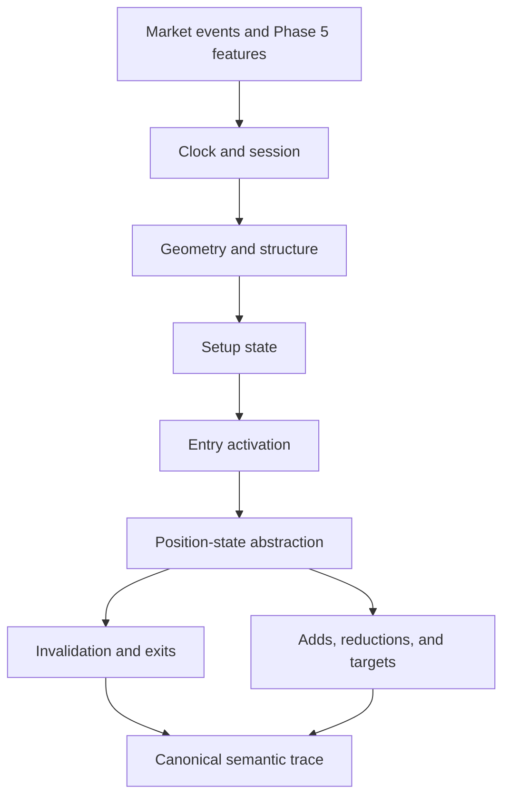

# Phase 6, Book 2 — CEREBUS Building Blocks and Rule Semantics

> **Purpose:** Define reusable market, clock, state, entry, invalidation, target, and scaling primitives with exact edge behavior  
> **Input:** Book 1 validated StrategySpec/IR and Phase 5 feature contracts  
> **Output:** Registered primitive library, rule semantics, and golden event tapes  
> **Previous:** [Book 1 — Strategy Contracts and Semantic Core](book-1-strategy-contracts-semantic-core.md)  
> **Next:** [Book 3 — Compiler and Target Generation](book-3-compiler-target-generation.md)

---

## 1. Success Statement

CEREBUS and general strategy rules have one versioned meaning across assets and runtimes. Sessions honor DST and calendars, price geometry uses instrument-aware units, and simultaneous entry/stop/target/reset events resolve through a declared deterministic policy.

---

## 2. Applicable Anchors

- **A2:** Evidence Before Narrative
- **A3:** Point-in-Time Data
- **A4:** Stable Identity Everywhere
- **A5:** Research Is Not Execution
- **A8:** Idempotent Event Handling
- **A10:** Observable and Reconstructable
- **F3:** Passing data manifest required
- **F5:** Code scans broad markets
- **F6:** One spec, no silent divergence

---

## 3. Primitive Topology



---

## 4. Work Packages

### 4.1 Market-event model

The canonical tape contains ordered:

```text
bar_open
bar_update when explicitly supported
bar_close
quote or trade when explicitly supported
session_open and session_close
calendar event
feature_available
strategy timer
```

Strategies declare which events they consume. A completed-bar strategy cannot behave as if it saw intrabar sequencing.

### 4.2 Clock and session contract

```yaml
timezone: America/New_York
calendar_ref: registry-ref
session_windows:
  - name: asian_range
    start_local: "19:00"
    end_local: "03:00"
    anchor_day: end_date|start_date
bar_finality: close_only
early_close_policy: explicit
nonexistent_local_time_policy: reject|shift_forward
ambiguous_local_time_policy: first|second|reject
reset_rules: []
```

“EST” cannot mean a permanent UTC-5 offset when the intended clock is New York local time.

### 4.3 Instrument geometry

All levels use instrument metadata:

- tick size and price precision;
- pip/point definition;
- contract multiplier;
- quote/base currency;
- rounding direction;
- minimum quantity/lot only for compatibility checks;
- corporate-action adjustment policy where relevant.

No universal `* 10000` conversion is allowed.

### 4.4 Range and tier primitives

Registered primitives include:

```text
session_open/high/low/close
session_range
net_displacement
range_midpoint
tier_classification
atomic_unit
normalized_extension
retracement_level
opposite_extension
range_completion
```

Tier thresholds and atomic units are asset/configuration data with effective versions. Old and recent-volatility tiers cannot be mixed silently.

### 4.5 Structural primitives

- higher high, higher low, lower high, lower low;
- swing confirmation with left/right delay;
- touch, pierce, close-through, hold, reclaim, and reject;
- breakout and retest;
- compression/expansion;
- midpoint and field state;
- multi-timeframe alignment;
- occurrence counts and ordered sequences.

Repainting and confirmation timing are declared.

### 4.6 Setup and eligibility

Eligibility determines whether a setup may exist; setup identifies a factual state; entry activation generates intent. These must remain separate so scanners and backtests compare the same setup/activation events.

### 4.7 Entry semantics

An entry rule declares:

- side;
- trigger event and predicate;
- activation price/level;
- market/limit/stop abstraction;
- whether touch or close activates;
- earliest and latest activation time;
- expiry/cancel conditions;
- price rounding;
- duplicate suppression;
- allowed concurrent entries;
- test quantity fraction.

### 4.8 Invalidation and protective semantics

Invalidation is a strategy-state condition; a protective stop is a simulated action condition. They may share a level but remain distinct. Rules declare touch versus close, direction, buffer, activation, movement, cancellation, and precedence.

### 4.9 Targets and exits

Target rules declare:

- price expression;
- touch/close requirement;
- fraction reduced;
- order among multiple targets;
- break-even or stop changes;
- runner state;
- time exit;
- session/day exit;
- thesis/setup invalidation exit;
- remaining-quantity behavior.

Percent extension sign conventions are explicit.

### 4.10 Scaling and pyramiding

The spec declares maximum entries, allowed direction, entry sequence, per-leg fraction of an abstract strategy unit, leg-specific invalidation/target, add conditions, cooldown, and aggregate exit behavior.

Fractions must sum within declared bounds. Real capital sizing belongs to later portfolio/execution controls.

### 4.11 Same-bar ambiguity

When OHLC data shows both entry and stop/target touched without known path, the spec chooses:

```text
reject_bar
conservative_adverse_first
optimistic_favorable_first_for_diagnostic_only
lower_timeframe_required
engine_native_with_declared_model
```

The baseline qualification path cannot use optimistic ambiguity.

### 4.12 Event precedence

Example default order:

```text
data_quality_failure
global or strategy shutdown
session reset
invalidation/protective action
time exit
target/reduction
add/scale
new entry
setup transition
```

Each spec pins or explicitly overrides this list. Targets cannot “win” over a simultaneous stop by target-specific accident.

### 4.13 CEREBUS library

Initial modules:

```text
session_range_and_tiers
p90_activation
base80_rekey
cascade_sequence
forty_five_minute_add
deep_state
symmetry_trap
structural_rekey
range_distribution
market_structure_pullback
```

Each module begins as unqualified unless its source rules, parameters, and golden fixtures are approved. Prior reported win rates are research claims for Phase 7, not build acceptance.

### 4.14 Golden market tapes

Each tape contains instrument metadata, timezone/calendar version, ordered market events, expected state transitions, signals, trade intents, invalidations, targets, resets, and prohibited events. Include positive, negative, boundary, DST, missing-data, and ambiguous-bar cases.

---

## 5. Target Layout

```text
strategy_forge/
  primitives/
    clock.py
    instruments.py
    ranges.py
    geometry.py
    structure.py
    conditions.py
    entries.py
    invalidation.py
    targets.py
    scaling.py
    precedence.py
    cerebus/
  fixtures/
    market_tapes/
    expected_traces/
```

---

## 6. Deliverables

- Canonical market-event tape model.
- DST-aware session/calendar primitives.
- Instrument-aware unit and rounding library.
- Range, tier, atomic-unit, extension, and structure primitives.
- Entry, invalidation, target, exit, scaling, and precedence semantics.
- CEREBUS module registry with versioned parameters.
- Same-bar ambiguity policies.
- Positive, negative, boundary, DST, and ambiguous golden tapes.
- Legacy-implementation discrepancy ledger.

---

## 7. Required Tests

### P6-CLK-001 — IANA Session Conversion

Local session windows map to correct UTC instants under the pinned timezone database.

### P6-DST-001 — Spring DST Boundary

Nonexistent local times follow the declared policy and session duration is correct.

### P6-DST-002 — Fall DST Boundary

Ambiguous local times follow the declared first/second/reject policy.

### P6-CAL-001 — Holiday and Early Close

Closed and shortened sessions follow the pinned venue calendar.

### P6-CAL-002 — Overnight Anchor

An overnight range attaches to the declared start or end trading date consistently.

### P6-UNT-001 — Instrument Pip and Tick

FX, JPY, equity, index, commodity, and crypto fixtures use correct units and rounding.

### P6-UNT-002 — No Universal Pip Constant

Static checks reject hard-coded universal pip conversion.

### P6-RNG-001 — Session Range Fixture

Open, high, low, close, midpoint, displacement, and range match the golden tape.

### P6-CER-001 — CEREBUS Tier Fixture

Tier and atomic-unit results match the approved asset/configuration version.

### P6-CER-002 — Tier Boundary

Values below, equal to, and above every tier threshold resolve exactly.

### P6-CER-003 — P90 Activation

Time-dependent body/structure activation matches positive and negative fixtures.

### P6-CER-004 — Rekey Geometry

Retracement, invalidation, and opposite-extension levels match approved fixtures.

### P6-CER-005 — Cascade Sequence

Occurrence count, direction, time window, and maximum cascade state resolve exactly.

### P6-CER-006 — Timed Add

The 45-minute/add-extension combination activates only when every declared condition passes.

### P6-STR-001 — Swing Confirmation

Structure becomes available only after the declared right-side confirmation delay.

### P6-STR-002 — Touch Versus Close

Touch, pierce, and close-through produce distinct expected events.

### P6-STR-003 — Multi-Timeframe Availability

Higher-timeframe state cannot appear before its bar closes.

### P6-ENT-001 — Entry Boundary

Entry-window start, end, level, and threshold edges match the spec.

### P6-ENT-002 — Pending Entry Expiry

An unfilled abstract limit/stop intent cancels at the declared event.

### P6-ENT-003 — Duplicate Entry Suppression

Repeated equivalent triggers cannot exceed allowed entries.

### P6-INV-010 — Invalidation Semantics

State invalidation and protective action remain distinguishable in the trace.

### P6-TGT-001 — Multi-Target Fractions

Target fills reduce the correct abstract quantity without exceeding one strategy unit.

### P6-TGT-002 — Break-Even Transition

A stop/invalidator moves only after the declared target event.

### P6-TGT-003 — Hard Time Exit

Remaining state exits and resets at the exact declared instant.

### P6-SCL-001 — Pyramiding Bound

No tape can exceed maximum leg count or strategy-unit fraction.

### P6-SCL-002 — Leg-Specific Rules

Each scaled leg applies its own declared level, target, and invalidation.

### P6-AMB-001 — Same-Bar Adverse First

An ambiguous entry/stop/target tape follows the conservative baseline policy.

### P6-AMB-002 — Lower-Timeframe Requirement

A strategy requiring path resolution rejects coarse ambiguous bars.

### P6-EXT-001 — Exit Precedence

Simultaneous stop, target, time-exit, and new-entry conditions resolve in the declared order.

### P6-RST-001 — Session Reset

All session-scoped range, setup, pending, and position abstractions reset exactly once.

### P6-MIS-001 — Missing or Stale Input

Missing/stale required inputs block events according to the spec.

### P6-LEG-001 — Legacy Discrepancy

Conflicting legacy session, tier, or target logic is recorded and cannot enter the registry unresolved.

---

## 8. Failure Modes

- Permanent UTC-5 used for New York sessions.
- One pip formula used for every asset.
- Touch and close conditions conflated.
- Higher-timeframe swing appears before confirmation.
- Stop and target both hit, with each engine choosing differently.
- Multiple targets reduce more than total strategy units.
- Day reset leaves pending or position state behind.
- Legacy reported performance is treated as rule proof.

---

## 9. Exit Gate

Book 2 is complete only when every registered primitive has exact clock, unit, state, and edge semantics; CEREBUS modules match approved fixtures; ambiguity and precedence are explicit; and golden tapes are ready for target generation.

---

## 10. Handoff

Book 3 receives the validated IR, registered primitive implementations, complete golden market tapes, expected semantic traces, target capability requirements, and unresolved unsupported cases that must fail generation.
