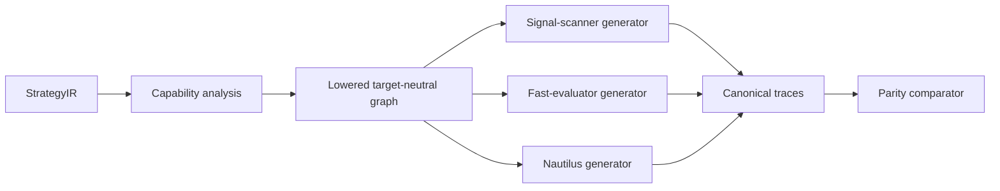

# Phase 6, Book 3 — Compiler and Target Generation

> **Purpose:** Compile one normalized strategy IR into consistent signal-scanner, fast-evaluator, and Nautilus target artifacts  
> **Input:** Book 2 validated IR, primitive registry, and golden market tapes  
> **Output:** Generated targets, canonical traces, and cross-target parity report  
> **Previous:** [Book 2 — CEREBUS Building Blocks and Rule Semantics](book-2-cerebus-building-blocks.md)  
> **Next:** [Book 4 — Verification, Documentation, and Review](book-4-verification-documentation-review.md)

---

## 1. Success Statement

All required targets are generated from the same IR, consume the same canonical event tape, and emit equivalent setup, signal, state, trade-intent, invalidation, target, and reset traces. Unsupported semantics stop generation instead of producing an approximation.

---

## 2. Applicable Anchors

- **A1:** One Orchestration Spine
- **A3:** Point-in-Time Data
- **A4:** Stable Identity Everywhere
- **A5:** Research Is Not Execution
- **A8:** Idempotent Event Handling
- **A10:** Observable and Reconstructable
- **A11:** Repair Before Expansion
- **A13:** Local-First Heavy Compute
- **F6:** One spec, no silent divergence

---

## 3. Compiler Topology



---

## 4. Work Packages

### 4.1 Compilation stages

1. load and hash the locked IR;
2. resolve target capability matrices;
3. reject unsupported nodes;
4. lower expressions/state to a target-neutral execution graph;
5. generate target source/config/tests;
6. format and statically inspect;
7. import/initialize in isolation;
8. execute golden tapes;
9. normalize traces;
10. compare semantic parity.

No target can inject a rule that is absent from IR.

### 4.2 Capability registry

Each target declares support for:

- event types and bar modes;
- state and timer behavior;
- abstract market/limit/stop activation;
- multi-leg/scaling semantics;
- partial reductions;
- session/calendar features;
- price/quantity precision;
- same-bar path models;
- custom feature references;
- diagnostics and trace hooks.

A target lacking a required capability fails generation. It cannot degrade silently.

### 4.3 Target-neutral execution graph

The lowered graph contains typed nodes for data reads, expressions, guards, timers, transitions, event emissions, intent lifecycle, reductions, resets, and diagnostics. Stable node IDs survive all target generation.

### 4.4 Signal-scanner target

This target evaluates historical/live-available facts and emits:

```text
eligibility
setup_entered
setup_updated
setup_invalidated
entry_activated
target_observed
exit_observed
reset
```

It is suitable for signal parity and candidate monitoring. It does not submit orders.

### 4.5 Fast-evaluator target

The vectorized or event-loop research target prioritizes fast rejection while preserving semantic event order. Any acceleration must prove equality on golden and randomized tapes.

It produces trade-state traces for Phase 7 but makes no profitability claim in Phase 6.

### 4.6 Nautilus target

The generated Nautilus artifact includes:

- frozen config derived from spec;
- subscriptions and declared event callbacks;
- strategy state and timers;
- signal and abstract trade-intent emissions;
- optional backtest-only order adapter behind a test capability;
- trace hooks keyed to IR node IDs;
- no credentials, account choice, venue routing, or live config.

Production execution routing remains disabled.

### 4.7 Generated source boundary

Generated files contain a header with:

```text
DO NOT EDIT
strategy_spec_id
strategy_ir_hash
generator_version
target_name/version
build_id
```

Changes occur through spec, primitive, template, or generator updates followed by regeneration.

### 4.8 Target adapters

Adapters translate target APIs, not strategy meaning. For example, converting a canonical completed-bar event to Nautilus `on_bar` is valid; choosing a different entry threshold in the adapter is not.

### 4.9 Canonical trace

```yaml
trace_event_id: deterministic-id
sequence: integer
event_time: timestamp
available_at: timestamp
instrument_id: stable-id
ir_node_id: stable-id
event_type: registry-value
state_before_hash: content-hash
state_after_hash: content-hash
payload: {}
source_market_event_ref: typed-id
```

Diagnostic-only engine events are separated from semantic events.

### 4.10 Parity comparator

Parity levels:

```text
exact: identities, sequence, values, and state hashes equal
tolerance: declared numeric tolerance only
equivalent: target-specific diagnostic differences with equal semantics
fail: any missing, extra, reordered, or materially different semantic event
```

Tolerance is unit-aware and cannot excuse changed thresholds or event time.

### 4.11 Event-tape adapters

All targets consume the same logical tape. Target-specific file loaders are outside the parity comparison unless the test explicitly validates ingestion parity.

### 4.12 Deterministic generation

Templates, dependencies, formatter versions, locale, line endings, and ordering are pinned. The same spec/IR/compiler environment produces byte-identical artifacts where target toolchains permit, otherwise content-equivalent normalized output.

### 4.13 Build outputs

```text
generated/<strategy_id>/<spec_version>/
  signal_scanner/
  fast_evaluator/
  nautilus/
  tests/
  docs/
  manifests/
```

Generated output lives outside hand-maintained primitive/compiler code.

---

## 5. Target Layout

```text
strategy_forge/
  compiler/
    capabilities.py
    lower.py
    build_graph.py
    generate.py
  targets/
    signal_scanner/
    fast_evaluator/
    nautilus/
  parity/
    trace.py
    normalize.py
    compare.py
    reports.py
```

---

## 6. Deliverables

- Multi-stage IR compiler.
- Target capability registry and fail-closed analysis.
- Target-neutral lowered execution graph.
- Signal-scanner generator.
- Fast-evaluator generator.
- Nautilus strategy/config/test generator.
- Generated-file integrity markers.
- Canonical semantic-trace instrumentation.
- Unit-aware parity comparator.
- Deterministic build/output layout.
- Golden and randomized parity runner.

---

## 7. Required Tests

### P6-CMP-001 — Valid IR Compilation

A golden IR lowers into a deterministic execution graph.

### P6-CMP-002 — Unsupported Node Rejection

A target lacking a required semantic capability fails before source generation.

### P6-CMP-003 — No Target Rule Injection

Generated target logic maps only to registered IR nodes and approved adapter scaffolding.

### P6-CAP-001 — Capability Matrix Completeness

Every required IR feature has an explicit supported/unsupported result for each target.

### P6-GEN-001 — Spec-to-Code Golden

A locked spec/compiler combination reproduces the approved generated outputs.

### P6-GEN-002 — Deterministic Regeneration

Repeated clean generation produces identical normalized artifacts and hashes.

### P6-GEN-003 — Do-Not-Edit Marker

Every generated source contains correct spec, IR, generator, target, and build identity.

### P6-GEN-004 — Manual Edit Detection

A changed generated file fails integrity verification.

### P6-SIG-001 — Signal-Scanner Events

The scanner target emits the complete expected setup and activation trace.

### P6-FST-001 — Fast-Evaluator Events

The fast target emits the expected state and trade-intent trace.

### P6-FST-002 — Acceleration Equality

Vectorized/partitioned and reference event-loop modes produce equivalent traces.

### P6-NAU-001 — Nautilus Semantic Events

The Nautilus target emits the expected canonical trace on the same tape.

### P6-NAU-002 — No Live Routing

Generated Nautilus artifacts cannot initialize a live venue, account, credential, or broker route.

### P6-IMP-001 — Generated Import

Every generated Python target imports in a clean supported environment.

### P6-IMP-002 — Target Initialization

Each target validates config, registers inputs, and initializes without hidden local paths.

### P6-IMP-003 — Missing Dependency Failure

An unavailable pinned dependency fails with a typed build error.

### P6-PAR-001 — Scanner/Fast/Nautilus Parity

All three targets emit equal material events and states on golden tapes.

### P6-PAR-002 — Entry Parity

Entry activation identity, time, side, level, and quantity fraction agree.

### P6-PAR-003 — Invalidation Parity

Invalidation/protective traces and resulting state agree.

### P6-PAR-004 — Target and Exit Parity

Partial targets, stop changes, time exits, and final resets agree.

### P6-PAR-005 — Session Parity

Session boundaries and DST tapes agree across targets.

### P6-PAR-006 — Ambiguous-Bar Parity

All targets apply the same path-ambiguity policy.

### P6-PAR-007 — No Missing Semantic Event

Extra or missing material events fail parity even when final PnL-like output is equal.

### P6-TOL-001 — Numeric Tolerance Bound

Only declared unit-aware rounding differences pass tolerance.

### P6-TOL-002 — Time Tolerance Ban

Signal or state-transition timestamp changes cannot pass numeric tolerance.

### P6-TRC-001 — Stable Trace Identity

The same input and IR produce the same semantic event IDs and order.

### P6-TRC-002 — IR Node Traceability

Every semantic output maps to one or more source IR nodes.

### P6-PTH-001 — Portable Paths

Generated artifacts contain no user-specific absolute path.

### P6-SEC-001 — No Secret Material

Generated output and manifests contain no credential or secret.

---

## 8. Failure Modes

- Generator approximates an unsupported rule.
- Fast engine vectorization changes event ordering.
- Nautilus adapter adds a convenient default.
- Final return agrees while trades/signals differ.
- Tolerance hides a timing or threshold mismatch.
- Generated files are patched manually.
- Test target imports live broker configuration.
- Output embeds a developer’s Windows path.

---

## 9. Exit Gate

Book 3 is complete only when all required targets generate deterministically, import and initialize in isolation, emit traceable semantic events, and agree on every golden tape without live execution capability.

---

## 10. Handoff

Book 4 receives the locked spec/IR, generated artifacts, compiler/capability versions, golden and randomized tapes, full traces, initial parity report, and every generation warning or unsupported case.
