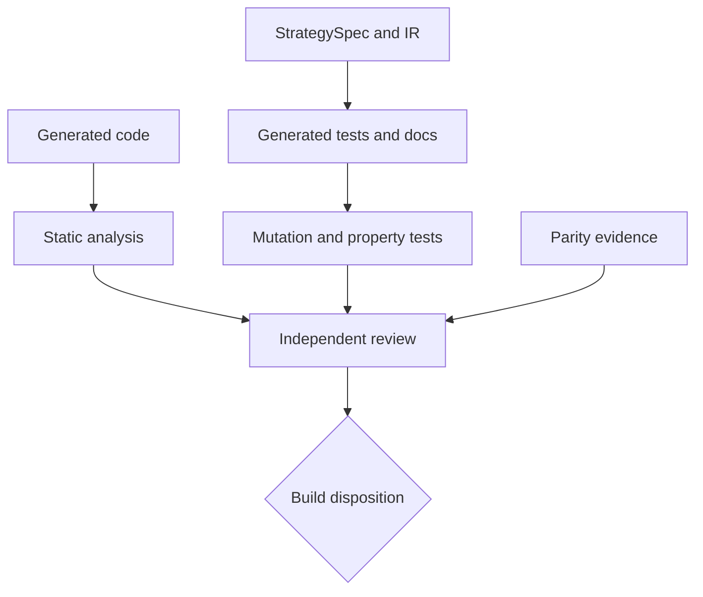

# Phase 6, Book 4 — Verification, Documentation, and Review

> **Purpose:** Prove that strategy rules are covered, generated code is safe and inspectable, and human-readable documentation matches machine semantics  
> **Input:** Book 3 spec, IR, generated targets, fixtures, traces, and parity evidence  
> **Output:** Verification suite, generated strategy manual, semantic diff, and independent build review  
> **Previous:** [Book 3 — Compiler and Target Generation](book-3-compiler-target-generation.md)  
> **Next:** [Book 5 — Strategy Build Operations and Lock](book-5-strategy-build-operations-lock.md)

---

## 1. Success Statement

Unsafe constructs, incomplete fixtures, dead rules, undocumented behavior, target drift, and unauthorized generated edits are detected automatically. A reviewer can reconstruct every strategy decision from the spec, documentation, tests, IR nodes, and traces.

---

## 2. Applicable Anchors

- **A0:** Human Strategic Authority
- **A2:** Evidence Before Narrative
- **A5:** Research Is Not Execution
- **A6:** Explicit Authority and Capability
- **A9:** Separate Research From Approval
- **A10:** Observable and Reconstructable
- **A11:** Repair Before Expansion
- **F4:** Testable research only
- **F6:** One spec, no silent divergence

---

## 3. Verification Topology



---

## 4. Work Packages

### 4.1 Generated test plan

The spec/IR generates:

- schema and parameter tests;
- expression and state-transition tests;
- time/session/calendar tests;
- entry/invalidation/target boundary tests;
- scaling and reset tests;
- target import/config tests;
- golden trace assertions;
- prohibited-capability assertions.

Handwritten adversarial fixtures supplement—not replace—the generated suite.

### 4.2 Fixture completeness

Every material predicate requires:

```text
positive case
negative case
lower boundary
exact boundary
upper boundary
missing/stale case when applicable
state-before/state-after case
long/short case or explicit asymmetry
```

Every transition and precedence branch must be reachable in at least one fixture or explicitly declared impossible with proof.

### 4.3 Static analysis

Reject:

- future indexing and negative shifts with future meaning;
- centered rolling windows;
- `eval`, `exec`, dynamic imports, reflection, and runtime code generation;
- undeclared file, environment, network, subprocess, or database access;
- broker/venue/account/credential initialization;
- direct live order submission;
- global mutable strategy state;
- naive datetimes and hard-coded timezone offsets;
- random behavior without a declared seeded model;
- absolute user paths;
- embedded secrets;
- floating equality where tick-aware comparison is required;
- undeclared target-specific constants.

### 4.4 Mutation testing

Mutations include:

- flip comparison;
- move threshold;
- change AND/OR;
- remove predicate;
- shift bar reference;
- alter session boundary;
- change touch to close;
- reorder precedence;
- remove reset;
- alter side/sign;
- change target fraction;
- increase pyramiding bound.

A surviving material mutation blocks lock.

### 4.5 Property testing

Properties include:

- state invariants;
- strategy-unit conservation;
- bounded entries;
- no event before required information;
- price levels round to instrument tick;
- reset idempotency;
- deterministic replay;
- long/short symmetry when declared;
- no target after terminal exit unless a new lifecycle begins.

### 4.6 Generated documentation

The strategy manual derives from the spec and includes:

- purpose and evidence lineage;
- supported scope;
- complete parameter table with units/domains;
- data and feature requirements;
- session/calendar diagram;
- state diagram;
- setup, entry, invalidation, targets, and exits;
- precedence and same-bar policy;
- scaling behavior;
- examples from golden tapes;
- limitations and unsupported conditions;
- generated target identities;
- Phase 7 validation hypotheses.

Performance figures are absent unless cited as unvalidated research claims.

### 4.7 Semantic diff

Between versions, the report identifies changes to parameters, expressions, state, time, data, features, entry, invalidation, targets, scaling, precedence, target capabilities, fixtures, and expected events.

Formatting-only differences are separated from semantic changes.

### 4.8 Review workflow

Roles:

- strategy proposer;
- spec/compiler builder;
- domain reviewer;
- code/verification reviewer;
- approval authority for **validation handoff**.

The proposer or generator agent cannot be the sole approver.

### 4.9 Review questions

- Does the spec reflect the approved hypothesis rather than a stronger claim?
- Is every rule testable?
- Are source conflicts resolved explicitly?
- Do units, clock, and asset assumptions hold?
- Are exits and simultaneous events deterministic?
- Did generated targets pass semantic—not merely result—parity?
- Are any target-specific decisions hidden?
- Does the package stop before validation or deployment authority?

### 4.10 Dispositions

```text
approve_for_build_lock
needs_spec_clarification
needs_fixture
needs_compiler_repair
reject_unsupported
reject_out_of_scope
invalidate_prior_build
```

The review artifact records findings and evidence, not hidden chain-of-thought.

---

## 5. Target Layout

```text
strategy_forge/
  verification/
    test_plan.py
    fixture_coverage.py
    static_analysis.py
    mutation.py
    properties.py
    integrity.py
  documentation/
    manual.py
    diagrams.py
    examples.py
    semantic_diff.py
  review/
    workflow.py
    findings.py
    disposition.py
```

---

## 6. Deliverables

- Spec/IR-driven test-plan generator.
- Fixture completeness and branch-coverage checker.
- Strategy-specific static-analysis rules.
- Mutation and property-test harnesses.
- Generated strategy manual and diagrams.
- Machine-readable semantic version diff.
- Generated-file integrity verifier.
- Independent domain/code review workflow.
- Typed findings and review dispositions.
- Locked adversarial spec/code corpus.

---

## 7. Required Tests

### P6-TST-001 — Generated Test Completeness

Every material IR node maps to at least one generated assertion.

### P6-TST-002 — Boundary Matrix

Each threshold/window/level has lower, exact, and upper boundary fixtures.

### P6-TST-003 — State Branch Coverage

Every reachable transition and precedence branch executes in the fixture corpus.

### P6-TST-004 — Long/Short Coverage

Declared symmetric behavior is tested in both directions.

### P6-STA-001 — Future Access Rejection

Future shifts, centered windows, and unavailable fields fail static checks.

### P6-STA-002 — Dynamic Code Rejection

Dynamic execution, imports, and reflection fail.

### P6-STA-003 — Hidden I/O Rejection

Undeclared file, network, database, environment, and subprocess access fail.

### P6-STA-004 — Broker and Order Rejection

Live adapters, credentials, accounts, routes, and direct order submission fail.

### P6-STA-005 — Time Safety

Naive datetime and fixed-offset local-session code fail.

### P6-STA-006 — Target Constant Rejection

A material constant absent from the IR fails.

### P6-STA-007 — Absolute Path Rejection

User-specific absolute paths fail.

### P6-STA-008 — Secret Scan

Generated artifacts contain no secret or credential material.

### P6-MUT-001 — Predicate Mutation

Comparison, boolean, threshold, and predicate-removal mutations are killed.

### P6-MUT-002 — Temporal Mutation

Bar offset, session boundary, finality, and timer mutations are killed.

### P6-MUT-003 — State Mutation

Transition, reset, precedence, and terminal-state mutations are killed.

### P6-MUT-004 — Price Geometry Mutation

Sign, side, level, unit, and rounding mutations are killed.

### P6-MUT-005 — Scaling Mutation

Leg count, fractions, and add-condition mutations are killed.

### P6-PRP-001 — Strategy Unit Conservation

Entry/reduction/exit traces never create or remove undeclared abstract quantity.

### P6-PRP-002 — Entry Bound

No generated tape exceeds the configured concurrency or pyramiding limit.

### P6-PRP-003 — Temporal Causality

No event precedes its last required input.

### P6-PRP-004 — Reset Idempotency

Repeated reset events leave the same clean state without duplicate output.

### P6-PRP-005 — Terminal Event Property

No target or reduction occurs after terminal exit in the same lifecycle.

### P6-DOC-001 — Documentation Reconciliation

Every documented parameter and rule matches the spec/IR.

### P6-DOC-002 — Complete Rule Surface

The manual contains setup, entry, invalidation, targets, scaling, precedence, reset, and missing-data behavior.

### P6-DOC-003 — No Qualified Performance Claim

Documentation cannot present unvalidated win rate or return as qualified fact.

### P6-DIF-001 — Semantic Diff Detection

Every material spec/IR change appears in the version diff.

### P6-DIF-002 — Formatting Difference Isolation

Nonsemantic formatting changes do not create a false semantic diff.

### P6-INT-001 — Generated Integrity

Every target hash matches the build manifest.

### P6-REV-001 — Independent Review

The proposer/generator cannot be the sole validation-handoff approver.

### P6-REV-002 — Source Conflict Gate

Unresolved conflicting source rules block approval.

### P6-REV-003 — Finding Traceability

Every review finding cites the spec, IR, fixture, trace, or source evidence.

### P6-REV-004 — Scope Gate

Review rejects validation, paper, live, broker, or capital authority embedded in the package.

---

## 8. Failure Modes

- Tests assert final PnL but not event semantics.
- Only positive examples exist.
- Mutations survive because rules are untested.
- Generated docs drift from code.
- Win-rate claims imply Phase 7 already passed.
- Reviewer approves its own generated package.
- Manual patch bypasses spec change.
- Static analysis overlooks target-specific constants.

---

## 9. Exit Gate

Book 4 is complete only when every material rule has positive, negative, boundary, and mutation evidence; generated code passes static and property checks; docs and semantic diffs reconcile; and an independent reviewer approves the package for Strategy Lock—not for profitability or deployment.

---

## 10. Handoff

Book 5 receives the reviewed spec/IR, generated artifacts, complete verification and parity reports, manual, semantic diff, review disposition, dependency manifests, and all known limitations.
