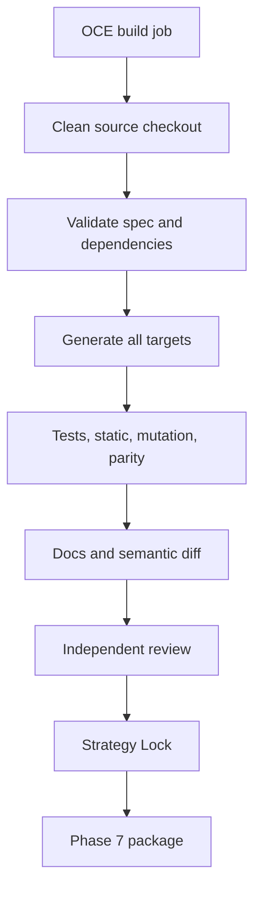

# Phase 6, Book 5 — Strategy Build Operations and Lock

> **Purpose:** Operate a reproducible, auditable strategy-build pipeline and lock a package for Validation Forge  
> **Input:** Books 1–4 reviewed specification, generated targets, tests, documentation, and parity evidence  
> **Output:** `StrategyBuildPackage`, `StrategyLockManifest`, and bounded Phase 7 `ValidationRequest`  
> **Previous:** [Book 4 — Verification, Documentation, and Review](book-4-verification-documentation-review.md)  
> **Next:** Phase 7 — Validation Forge

---

## 1. Success Statement

OCE can rebuild a strategy from a clean checkout, reproduce generated artifacts and semantic traces, link every byte to a spec/compiler/commit, recover after interruption, and hand Phase 7 a complete package with no paper, live, broker, or capital authority.

---

## 2. Applicable Anchors

- **A0:** Human Strategic Authority
- **A1:** One Orchestration Spine
- **A5:** Research Is Not Execution
- **A6:** Explicit Authority and Capability
- **A8:** Idempotent Event Handling
- **A9:** Separate Research From Approval
- **A10:** Observable and Reconstructable
- **A11:** Repair Before Expansion
- **A13:** Local-First Heavy Compute
- **F6:** One spec, no silent divergence

---

## 3. Build Topology



---

## 4. Work Packages

### 4.1 Build job

```yaml
strategy_build_job_id: typed-id
strategy_build_request_ref: artifact-ref
strategy_spec_ref: artifact-ref
source_commit_sha: git-sha
compiler_environment_ref: artifact-ref
requested_targets: []
fixture_set_refs: []
resource_budget_ref: policy-id
review_policy_ref: policy-id
idempotency_key: string
correlation_id: typed-id
```

Jobs are durable, resumable, isolated, and content-addressed.

### 4.2 Build environment

Pin:

- operating-system/container image;
- Python/Rust/toolchain versions as applicable;
- dependency locks;
- timezone database and market calendars;
- compiler/templates/formatters;
- locale, encoding, and line endings;
- relevant environment variables without secrets.

Builds do not depend on a user Downloads folder or developer desktop.

### 4.3 Pipeline stages

```text
admitted
source_resolved
spec_validated
ir_normalized
targets_generated
imports_verified
fixtures_passed
static_passed
mutation_passed
parity_passed
docs_generated
reviewed
locked
handed_off
```

Failure is terminal for the current build ID. A repair creates a new attempt linked to the prior failure.

### 4.4 Artifact and commit linkage

The manifest links:

```text
Phase 5 lineage
StrategySpec and IR hashes
family/primitive/compiler/template versions
source commit
generated artifact hashes
fixture and expected-trace hashes
test/static/mutation/parity reports
documentation and semantic diff
review record
dependency/environment lock
```

Uncommitted generated artifacts cannot enter the final lock.

### 4.5 Reproducible build

A clean isolated worker checks out the source commit, restores declared dependencies, rebuilds without network where possible, and compares normalized outputs and semantic traces. Any difference is classified and resolved before lock.

### 4.6 Recovery

Completed content-addressed stages may be reused after worker failure. Reuse requires matching inputs and environment. A retry cannot skip a failed gate or change spec/parameters under the same build ID.

### 4.7 StrategyBuildPackage

```yaml
strategy_build_package_id: content-id
strategy_spec_ref: artifact-ref
strategy_ir_ref: artifact-ref
source_phase5_refs: []
generated_target_refs: {}
parameter_space_ref: artifact-ref
golden_tape_refs: []
expected_trace_refs: []
verification_report_refs: []
parity_report_ref: artifact-ref
strategy_manual_ref: artifact-ref
semantic_diff_ref: artifact-ref
build_manifest_ref: artifact-ref
known_limitations: []
status: parity_ready_for_validation
```

### 4.8 ValidationRequest

Phase 6 asks Phase 7 to test declared claims:

```yaml
validation_request_id: typed-id
strategy_build_package_ref: artifact-ref
baseline_parameter_ref: artifact-ref
allowed_parameter_space_ref: artifact-ref
required_data_domains: []
declared_hypotheses: []
falsification_criteria: []
required_validation_stages: []
benchmark_and_null_model_intent: []
minimum_reproducibility_requirements: {}
prohibited_actions:
  - paper_deployment
  - live_deployment
  - broker_routing
  - capital_allocation
```

It does not prescribe favorable thresholds after results are observed.

### 4.9 Backup and restore

Back up specs, registries, source/commit references, compiler environment, generated artifacts, fixtures, reports, documentation, and lock evidence. Restore and rebuild in an isolated environment.

### 4.10 Strategy Lock Manifest

```yaml
phase: 6
lock_id: immutable-id
commit_sha: git-sha
created_at: timestamp
strategy_spec_id: content-id
strategy_ir_hash: content-hash
family_and_primitive_versions: {}
compiler_and_template_versions: {}
dependency_lock_hash: content-hash
timezone_and_calendar_versions: {}
generated_artifact_hashes: {}
fixture_and_trace_hashes: {}
test_report_refs: []
static_analysis_report_ref: artifact-ref
mutation_report_ref: artifact-ref
parity_report_ref: artifact-ref
review_ref: artifact-ref
reproducible_build_ref: artifact-ref
backup_restore_report_ref: artifact-ref
known_limitations: []
approved_validation_contract_version: semver
prohibited_authorities: []
approvals: []
```

Material changes invalidate the Strategy Lock and every downstream validation tied to it.

### 4.11 Phase 7 handoff

Phase 7 runs fast rejection, canonical Nautilus tests, holdout/walk-forward evaluation, costs, resampling, sensitivity, regime/asset checks, benchmarks, and independent quantitative review.

If a strategy fails, Phase 7 returns a structured failure. Repair happens by changing the spec/primitive/compiler in a new Phase 6 version—not by patching a Phase 7 target.

---

## 5. Target Layout

```text
strategy_forge/
  build/
    jobs.py
    environment.py
    pipeline.py
    manifest.py
    reproducibility.py
    recovery.py
  lock/
    strategy_lock.py
    verify.py
    invalidation.py
  handoff/
    build_package.py
    validation_request.py
```

---

## 6. Deliverables

- OCE-native strategy-build jobs and state machine.
- Hermetic build environment contract.
- Artifact/commit/dependency linkage.
- Retry/resume and typed failure records.
- Clean-checkout reproducible build.
- Immutable `StrategyBuildPackage`.
- Bounded `ValidationRequest`.
- Backup/restore/rebuild proof.
- `StrategyLockManifest` and independent verifier.
- Phase 7 acceptance adapter.

---

## 7. Required Tests

### P6-BLD-001 — Idempotent Build Job

The same inputs and idempotency key create one logical build and artifact set.

### P6-BLD-002 — Clean Checkout Build

A fresh checkout at the pinned commit produces the expected normalized artifacts.

### P6-BLD-003 — Environment Pin

Toolchain, dependencies, tzdata, calendars, locale, and formatter versions appear in the manifest.

### P6-BLD-004 — No Local Path Dependency

The build succeeds without developer Desktop, Downloads, or undeclared external paths.

### P6-BLD-005 — Offline Build Boundary

After declared dependencies/data are staged, generation and verification require no unapproved network access.

### P6-REC-001 — Worker Failure Resume

An interrupted build resumes verified stages without duplicate side effects.

### P6-REC-002 — Failed Gate Cannot Skip

Retry cannot bypass a failed validation, import, static, mutation, parity, or review gate.

### P6-REC-003 — Changed Input New Build

A changed spec, dependency, fixture, compiler, or environment produces a new build identity.

### P6-LIN-001 — Complete Artifact Lineage

Every generated byte traces to spec, IR, compiler/template, dependency environment, source commit, and build.

### P6-CMT-001 — Commit Link

The final package references an existing commit containing its canonical source and manifests.

### P6-CMT-002 — Dirty Artifact Rejection

Uncommitted or manually altered generated output cannot lock.

### P6-PKG-001 — Package Completeness

The build package contains every required spec, IR, target, fixture, report, document, limitation, and lineage reference.

### P6-PKG-002 — Package Content Identity

Package identity changes whenever a material referenced artifact changes.

### P6-VAL-001 — Validation Request Bound

The request declares baseline, allowed parameter space, hypotheses, falsifiers, stages, and reproducibility requirements.

### P6-VAL-002 — Frozen Thresholds

Qualification intents and falsification criteria are frozen before Phase 7 results.

### P6-VAL-003 — No Deployment Request

Paper, shadow, live, broker, order, and capital actions are prohibited.

### P6-E2E-001 — Golden Strategy Build

A Phase 5 hypothesis produces a locked, parity-ready StrategyBuildPackage and accepted Phase 7 request.

### P6-E2E-002 — CEREBUS Golden Build

An approved CEREBUS spec generates all targets and matching semantic traces.

### P6-E2E-003 — Invalid Spec End-to-End

An intentionally ambiguous spec fails before generation and produces a typed audit record.

### P6-E2E-004 — Manual Drift End-to-End

A modified generated target fails integrity/parity and cannot lock.

### P6-AUT-001 — No Paper or Live Authority

Attempts to initialize paper/live mode, broker routing, credentials, accounts, or real capital are denied and audited.

### P6-AUT-002 — No Profitability Qualification

Phase 6 cannot mark a strategy profitable, robust, validated, or deployable.

### P6-AUT-003 — No Direct OrderIntent

Phase 9 `OrderIntent` creation is unavailable; only test-only `TradeIntent` is permitted.

### P6-BKP-001 — Restore and Rebuild

An isolated restore verifies hashes and reproduces the golden strategy build.

### P6-LCK-001 — Manifest Completeness

The Strategy Lock contains all dependency, artifact, test, review, reproducibility, limitation, and authority fields.

### P6-LCK-002 — Material Change Invalidation

A material spec, IR, family, primitive, compiler, template, dependency, calendar, fixture, or generated-artifact change invalidates the lock.

### P6-LCK-003 — Independent Lock Verification

A separate verifier reconstructs hashes, gates, approvals, and prohibited capabilities.

### P6-HOF-001 — Phase 7 Acceptance

Validation Forge accepts a complete locked package and bounded request.

### P6-HOF-002 — Missing Evidence Rejection

Missing spec, IR, target, fixture, parity, commit, lock, or lineage evidence fails handoff.

### P6-HOF-003 — No Target Mutation

Phase 7 cannot mutate generated targets under the original Strategy Lock.

### P6-HOF-004 — Structured Failure Return

A Phase 7 rejection returns failure evidence tied to the exact package and creates no silent repair.

---

## 8. Failure Modes

- Build depends on one developer machine.
- Retry skips the mutation or parity gate.
- Generated source is uncommitted.
- Phase 7 criteria are chosen after results.
- A package is labeled profitable before validation.
- Backtest adapter gains live credentials.
- Failed target is patched outside the spec.
- Lock cannot be rebuilt from source and manifests.

---

## 9. Exit Gate

Book 5 is complete only when a clean checkout reproducibly generates and verifies every target, all artifacts link to a committed spec/compiler environment, recovery and backup work, the Strategy Lock verifies independently, and Phase 7 accepts the bounded validation package with no deployment or execution authority.

---

## 10. Handoff to Phase 7

Phase 6 ends with a parity-ready strategy build. Phase 7 begins by trying to disprove its profitability, robustness, execution realism, and generality.

```text
Strategy Forge proves the rule is defined and implemented consistently.
Validation Forge determines whether that rule survives honest testing.
Neither phase authorizes live capital.
```
